# Chapter 0 - Hardware Needs To Get Smart, Now.

---

*While traditional hardware processes rely on systems engineering to master physical constraints and technical tradeoffs, that discipline often sits at a distance from the industry’s deeper “why”: what users truly need and want, and how those expectations shift once products ship and competitors respond. In hardware, the product manager’s pivotal role is to harness emerging digital capabilities to keep finding - and refining - that emotional and practical sweet spot in the target audience’s hearts and minds, not just at launch, but continuously over time. With this shift, product leaders needto acquire additional capabilities, and indeed a new mind set.* 

---

## The Software Success Story

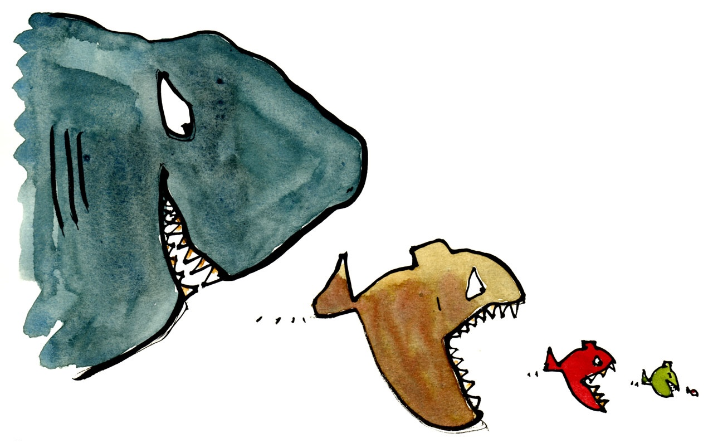

**Figure 0.1 — Software eats the world.** *Illustration by Frits Ahlefeldt, released under a CC0 Public Domain license, via PublicDomainPictures.net*

It is 2001. A multinational customer is based in Hong Kong, with its R&D center in Tel Aviv and manufacturing in a part of Shenzhen developing so fast that my local guide could not find his way, even though he had lived in Hong Kong - just 50 km away - for ten years by that time.

Software was the means by which industrial design and mechanical engineering, my core services at the time, could be delivered across continents and across borders. Enclosure 3D forms were created and captured using software, which also enabled the transfer of CAD models and drawings. Voice over IP - another software product - drove the cost of voice communication close to zero, making frequent consultations with remote engineering and manufacturing teams suddenly practical.

None of this was possible prior to that magical period. I dare say that much of China’s rise as the world’s factory would have looked very different without the software layers that made distributed design, documentation, and coordination scalable.

But wait. Fast forward to 2011. In a seminal [*Wall Street Journal* essay](https://www.wsj.com/articles/SB10001424053111903480904576512250915629460), Marc Andreessen Andreessen coined the blunt expression: “Software is eating the world.” What I had experienced in person – software making global hardware work at all – was now playing out at industry scale. The tools that once lived backstage, quietly accelerating design transfer and lowering coordination costs, were moving into the spotlight. Software has become the customer-facing layer people interacted with daily, the part they upgraded, subscribed to, complained about, praised, and ultimately stayed loyal to. And as that interface hardened into habit, it began capturing an ever larger share of the relationship and the margin.

It was *product managers* who helped transform software from an engineering-driven discipline into a user-centered one. Their role crystallized as a bridge between technical teams and market needs, setting new priorities and cutting through suffocating bureaucracy. The agile revolution – still unfolding – normalized customer obsession and rapid iteration, a cadence that hardware teams now need to learn to synchronize with.

Meanwhile, as software continues to transform manufacturing processes and supply chains at an ever-increasing pace, the challenge for physical products remains: How to get up to the speed and agility of software development, so that physical attributes and digital features are successfully married into products that truly click with their target audience?

---

## The Systems Engineering Paradigm

**Figure 0.2 — Hermeus Quarterhorse: Is this product management?**

The aerospace industry exemplifies systems engineering at its apex. Consider Hermeus's hypersonic aircraft development or Boeing's century of aviation excellence (tarnished by the safety and quality failures that have plagued the company since 2018).

Systems engineers orchestrate extraordinary technical complexity – integrating propulsion, avionics, materials science, and thermodynamics into machines that defy gravity at Mach 4. Their discipline transforms theoretical physics into possibility through rigorous stage-gate processes, comprehensive testing protocols, and exacting specifications.

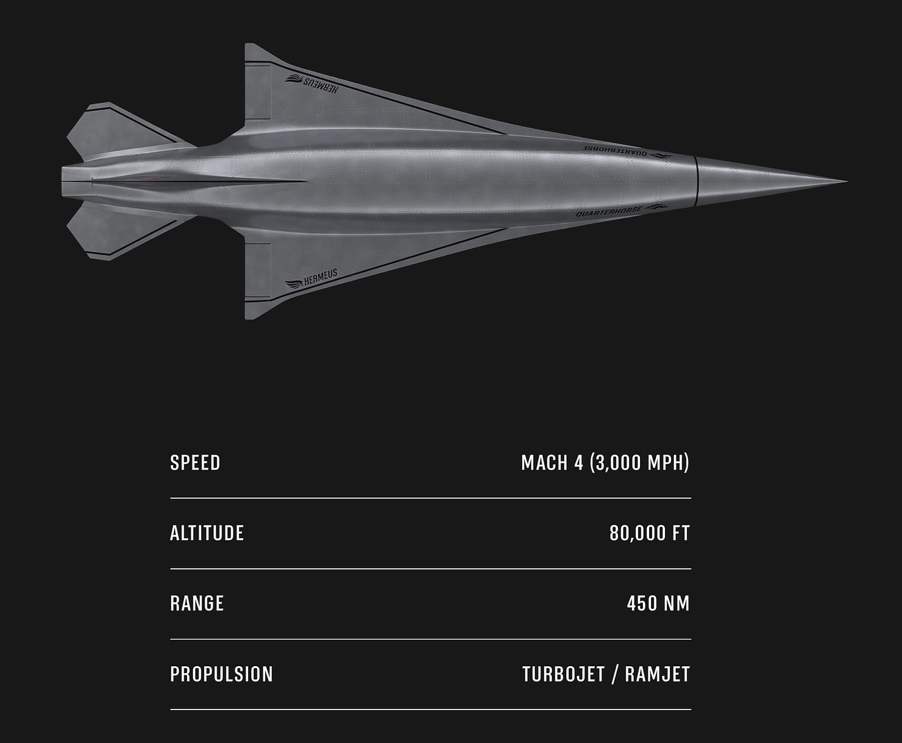

**Figure 0.3 — Hermeus Quarterhorse: Ambitious goals**

This approach succeeds brilliantly at its core mission: ensuring technical function and safety. The requirement pyramid – from safety through function to usability – gets methodically addressed. Test beds validate components. Wind tunnels verify aerodynamics. Thermal chambers confirm material resilience. Every parameter is measured, verified, documented.

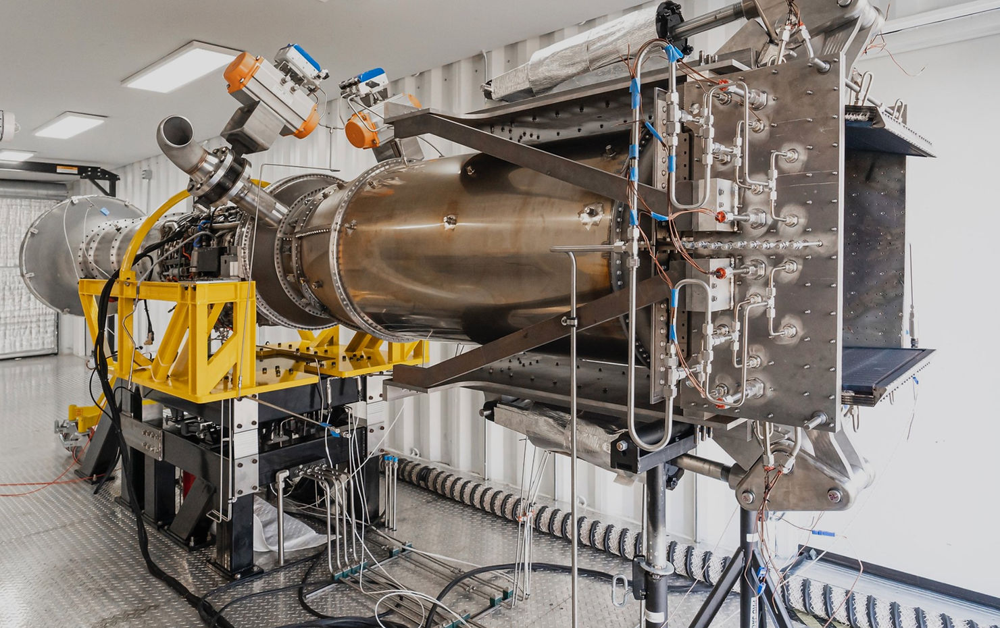

**Figure 0.4 — RAMJET is tricky: Assembly floor**

The first steps of validation are prototypes and proof of concept experiments, gradually testing system components and their integration. No users are to be seen, but test beds, wind tunnels, thermal and mechanical tests - everything needed to ensure this technological marvel takes off to the sky and returns in one piece.

**Figure 0.5 — Hermeus Quarterhorse test flight.** https://youtu.be/M35y-sZz1r8?si=1ZqVzxGet3wlh6cf

The validation here is risk mitigation at the system-engineering level. This is pertinent to any hardware product facing real world mechanical challenges, even before full scale build and operation by humans.

To be fair, there are very good reasons for the waterfall development process physical products undergo. A building's columns cannot be erected before foundations are set, and embedded software cannot be run unless hardware is designed and built. Each stage carries capital investments and involves risk. The waterfall imperative derives from physics, not preference.

---

## When Technical Excellence Isn't Enough

Remember Sony's Reader? 
Sony Reader who? would be the reasonable reply. 

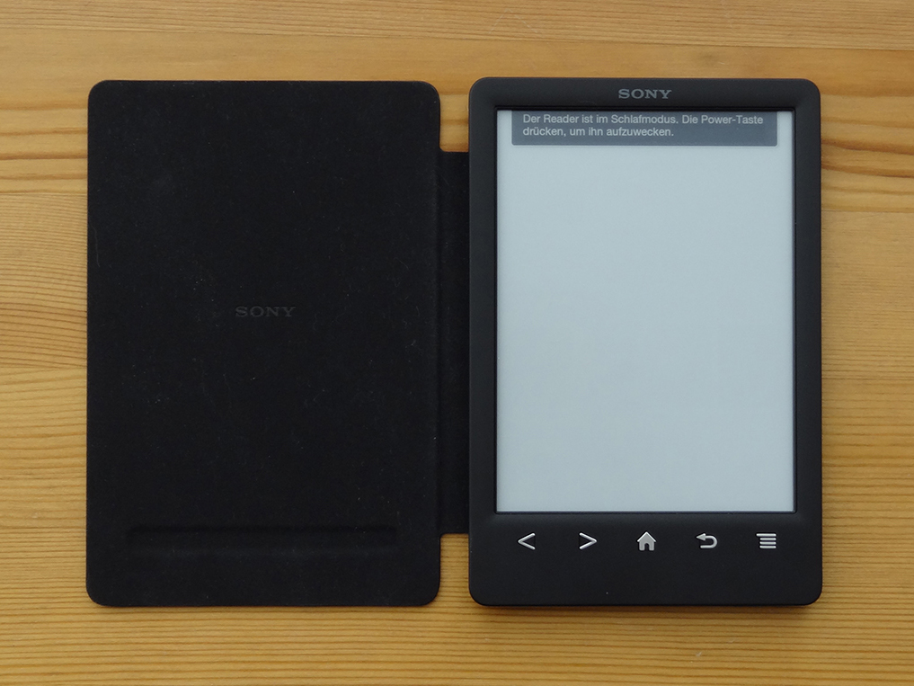

**Figure 0.6 — Sony Reader.** *Image by ALLESebook.de, CC BY 3.0, https://commons.wikimedia.org/w/index.php?curid=28280529*

It was Sony who pioneered  E-Ink, the technology that makes e-readers viable. E Ink Corporation's "liquidless paper" display appeared first in Sony's PRS-500, which launched a full year before the Kindle. By most accounts, Sony's hardware was sleek and elegantly designed. They built an excellent reading device. 

Amazon came almost two years later into the race. It built, however, a reading *ecosystem*, leaning on its strong position in book publishing, and its ability to harness existing relationships with publishing houses, offering a global distribution channel.

The difference becomes even clearer when one traces the full journey from discovery to acquisition to reading. With Sony's Reader, you browsed books on your computer, purchased through Sony Connect, downloaded files, connected via USB, and only then transferred content to your device. With Kindle, you discovered a book and pressed one button. Whispernet delivered it wirelessly in under a minute.

That one-button purchase wasn't just convenient — it was legally protected. Amazon had patented 1-Click ordering in 1999 and enforced it ruthlessly. When Barnes & Noble tried to replicate the experience with their Nook, they couldn't. Apple licensed the technology rather than fight. Amazon's competitors were forced to add friction to their checkout process while Amazon's remained seamless. In the impulse-driven world of book buying, that friction was fatal.

The Kindle product team understood something Sony's engineers missed: readers don't buy e-readers; they buy access to books. The hardware was merely an entry point into a continuously improving relationship — WhisperSync keeping your place across devices, over-the-air updates adding features, X-Ray and Word Wise emerging from studying how people actually read.

While Sony perfected a device, Amazon perfected the experience of acquiring, reading, and engaging with books. The physical product became a platform for continuous value delivery rather than the end of a transaction.

---

## System Engineering's Blind Spot: The Dynamic Customer

Systems engineering excels at answering "**how**" – how to achieve specifications, how to ensure reliability, how to manage complexity. It often struggles, however, with the "**why**" – why customers choose one product over another, why usage patterns evolve, why yesterday's breakthrough becomes tomorrow's commodity.

The SE discipline assumes requirements remain static from conception to launch. But modern customers don't just want products that work; they expect products that evolve. They compare their car's interface to their smartphone's. They wonder why their thermostat can't learn like their Netflix recommendations. They abandon products that feel frozen while their digital life constantly improves.

These two examples sit at opposite extremes: aerospace, a slow-moving, physics-defying industry decades in the making, and consumer electronics, where the pace approaches warp speed. Between them lies an industry that has made real strides toward software's hectic tempo: automotive.

Consider the automotive industry's transformation:

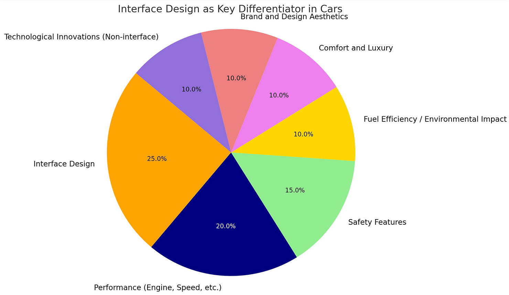

**Figure 0.7 — Interface design as a differentiator in the automotive industry**

Traditional automotive engineering prioritized:
- Brand and design aesthetics
- Fuel efficiency and sustainability
- Hard-wired features and mechanical excellence

Yet these are now commoditized, expected as bare minimum. ***User interface*** has become the primary differentiator, demanding software design and product management practices to build these features successfully.

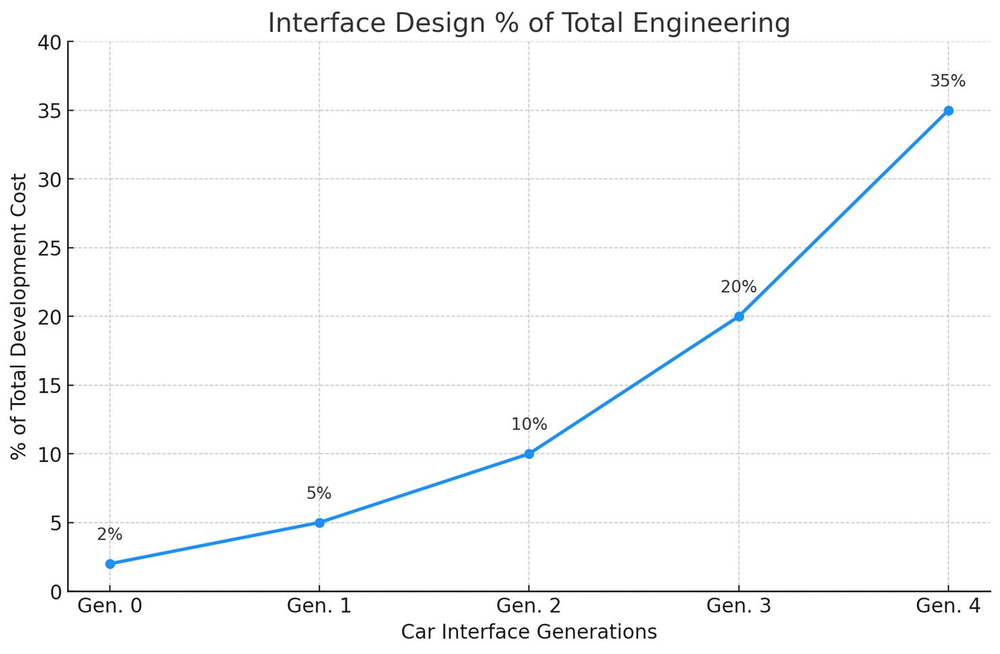

**Figure 0.8 — Relative cost of interface design in the automotive industry**

The relative effort and cost of interface design increases as its importance grows, emerging as the most differentiating competitive factor. Is it coincidence that companies like Dyson, Apple, and Samsung contemplated entering the automotive market? In a world where physical features are the base norm, it only makes sense.

---

## What's The New Role for Product Managers

As digitization – and software – take center stage in the automotive industry, so does the scope of product department gradually shift from bodywork and interiors to interface design, to answer for the shifting needs in this highly dynamic field. 

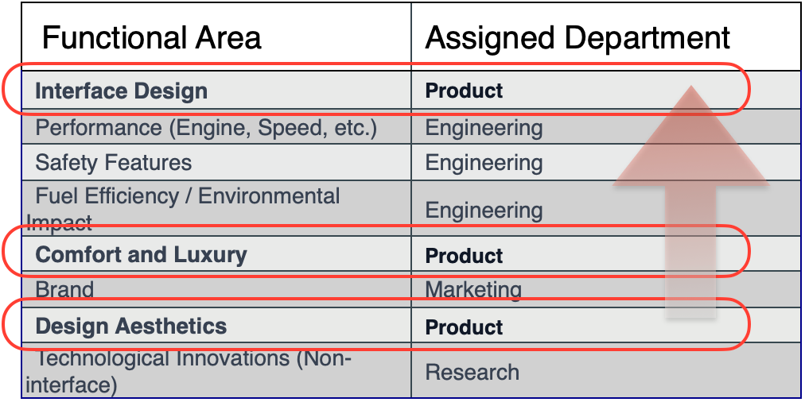

**Figure 0.9 — Digitization drives software product management style**

It is now about ***what*** can you do with your car, and you can do so many more nowadays: from multi media (different streams to different passengers, if you like), to navigation, to restaurant and hotel booking, to changing driving mode, to locking and unlocking. Whatever was before confined to levers and physical buttons, can now be abstracted into dynamic shapes and user experiences. That is the magic of software: The car is but a platform for all these features, and the audience does want them.

Software brought user obsession, attention to user outcomes, comfort with ambiguity, and the assumption that the launch is the beginning rather than the end. Further, it transformed connected software capabilities from technical features into strategic advantages – mechanisms for learning, adapting, and continuously delivering value.

As software processes enter the physical product world, the hardware product managers borrow roles from pure software product managers, leaving only a few hardware specific ones:

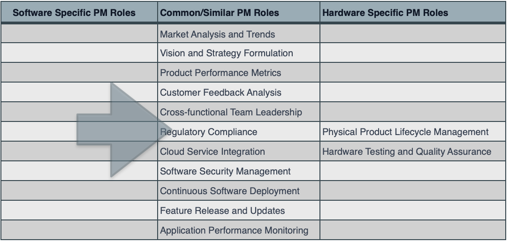

**Figure 0.10 — Product management role shift**

---

## The New Synthesis: Systems Engineering + Product Management

The future of hardware isn't choosing between systems engineering and product management – it's synthesizing both. Product managers in hardware present unique value by bridging domains:

**Longer feedback loops require better upfront validation.** Unlike software's rapid iteration cycles, hardware development demands getting it right earlier in the process. This constraint forces deeper customer understanding and more rigorous validation methodologies - but now informed by user needs, not just technical requirements.

**Physical constraints create defensible differentiation opportunities.** While software features can be quickly copied, hardware integration - the marriage of atoms and bits - creates natural barriers that take competitors years to replicate.

**Post-launch value creation through software layers.** Smart products can improve over time through firmware updates, new features, and service integrations - transforming the traditional value decay curve into an appreciation trajectory.

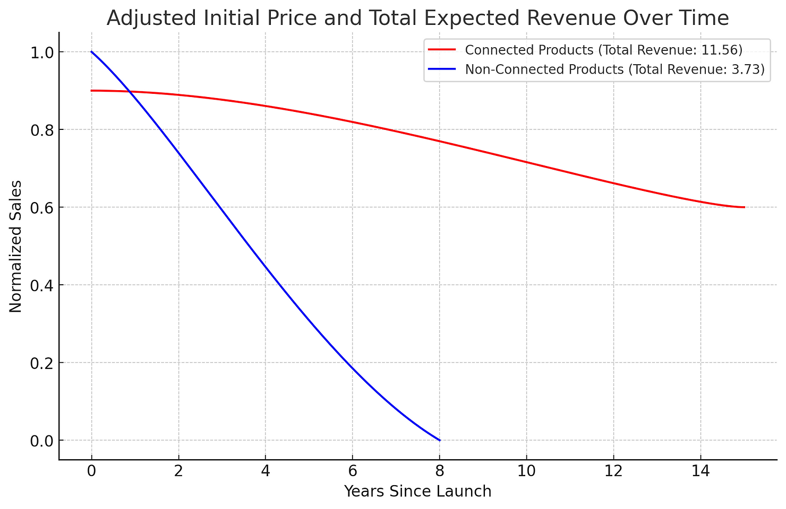

**Figure 0.11 — Can physical products be sold as a service?**

Indeed, when products are - at least partially - connected and digitized, there is a lot that can be done **after** launch to improve usability, strengthen customer satisfaction, and reinforce brand loyalty.

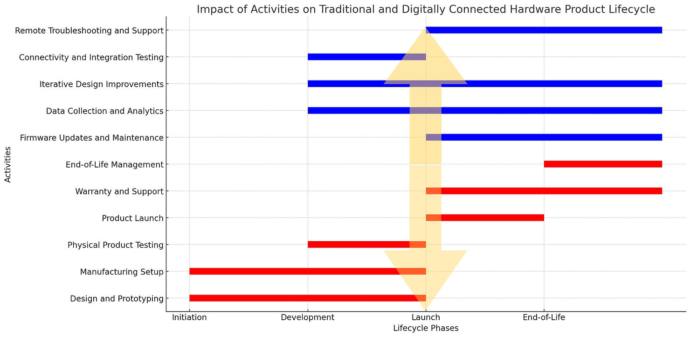

**Figure 0.12 — PM activities migrate post launch**

The activities surviving launch reveal the transformation:
- Remote troubleshooting and support
- Iterative design improvement (firmware updates and maintenance)
- Data collection and analysis
- End of life management (hardware specific)
- Warranty and support

While many aspects of continuous development and integration are technical, this practice calls for involvement of product managers who collect and integrate user inputs into actionable roadmaps. The hardware product manager orchestrates not just development, but evolution.

---

## How This Paradigm Shift Affects You?

This transformation creates unprecedented opportunities for product leaders of all ranks and career stages.

***For founders and executives:*** How to adopt business models, go-to-market strategies, and value propositions from the fast evolving world of software into smart hardware products. Leaders who understand the strategic shift and harness these insights are bound to build better teams that build better products that create and capture greater value. 

***For practicing product managers:*** How to manage the different pace and constraints across the hardware-software divide. How to make room for feature stemming from the software world into the thus far rigid development processes in the hardware industry.

***For Engineering Managers:*** How to bake in agility and responsiveness into age-old processes, to maintain technical excellence while allowing for faster and higher product-market fit.

***For Students and Faculty:*** Establish the conceptual foundation for understanding how digital transformation reshapes physical product strategy – a framework applicable across multiple industries.

------

## Why Now?

The timing couldn't be better. As hardware companies recognize their need for product management expertise, those with the right combination of technical understanding and customer obsession will find themselves in positions to lead entire organizational transformations.

As connected IoT devices grow from 15 billion in 2020 to a projected 75 billion by 2030 (IoT Analytics), every hardware category faces pressure to become 'smart.'

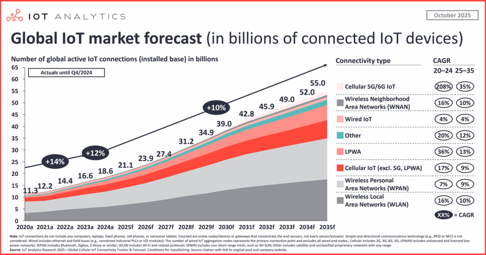

**Figure 0.13 — Global IoT market forecast: connected IoT devices.** *Data and image from State of IoT 2025: https://iot-analytics.com/number-connected-iot-devices/*

Product management for hardware is no longer an option – it's an imperative. The companies that recognize this shift and adapt their organizations accordingly will define the next generation of smart, connected, constantly improving products. Those that don't will watch their carefully engineered products become commodities, outmaneuvered by competitors who understand that in the age of smart tangibles, technical excellence is just the entry fee. The real competition happens in understanding and serving the dynamic, ever-evolving customer.

The evidence comes from across industries. ***Bolt Data Connect*** is a cloud-based IoT asset monitoring and service automation platform. In a recent press release, they state one of their customers,  [Quench USA](https://www.bolt-data.com/customer-success/quench-usa-inc) have experienced a 2,058% ROI against the investment made from implementing their platform.

This is a story with a happy end – a relatively simple capability added on, improving results. But what if your biggest competitor isn't the company you're tracking today, but a software company that decides to enter your market with a connected version of your product? Remember Netflix disrupting Blockbuster not by making better DVDs, but by making DVDs irrelevant?...

In the following chapters, you'll learn why traditional hardware products are prone to failure, and how critical topics from software product management play an increasingly important role in today's evolving landscape, as the hardware industry matures to borrow insights from the dynamic world of software products, adopting practical frameworks and strategies. We will explore some of these.

------

## Looking Ahead

In the chapters ahead, you'll discover:

- **Chapter 1: Why is Hardware THAT Hard?**
  We’ll unpack why hardware development is inherently monolithic - why you can’t simply “push an update” when something breaks, and how combining atoms with bits creates compounding complexity that pure software rarely faces. You’ll also see how stark the odds can be: hardware ventures succeed at roughly 3% on average, compared with about 30% for software.

- **Chapter 2: Hardware Startup Validation Traps**
  Through cautionary tales like Better Place's billion-dollar collapse, you'll learn the five validation traps unique to hardware ventures and why the lean startup playbook needs fundamental adaptation for physical products.

- **Chapter 3: When Gadgets Become Features**
  The smartphone has systematically absorbed entire product categories - from cameras to GPS devices. You'll understand when specialized hardware survives this convergence and when it doesn't, using cases like Cyclebe to illustrate the framework.

- **Chapter 4: Evolving Competition**
  The competitive landscape has shifted dramatically. We'll examine how companies like iRobot lost their moat to commoditization, why Tesla faces margin pressure from off-shore competitors, and what new strategies can create defensibility when manufacturing excellence alone no longer suffices.

By the end of Arc I, you'll have a clear map of the modern hardware battlefield - its unique challenges, accelerating threats, and the emerging opportunities that product management discipline can unlock. These foundational insights will prepare you for Arc II, where we explore the digital capabilities that transform static products into smart, evolving platforms.

