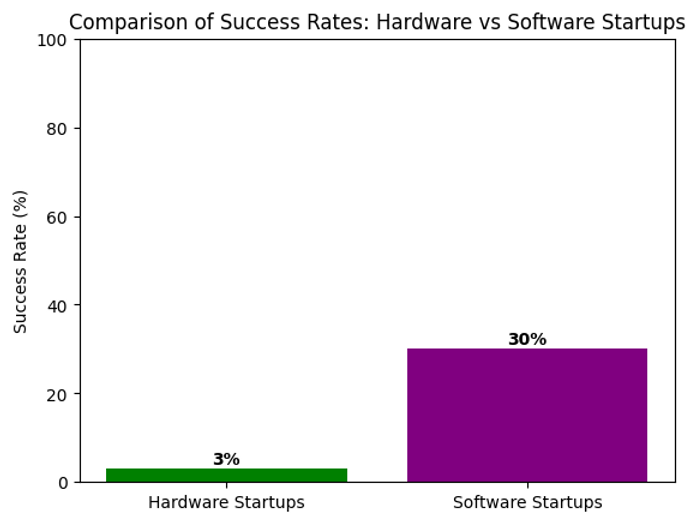
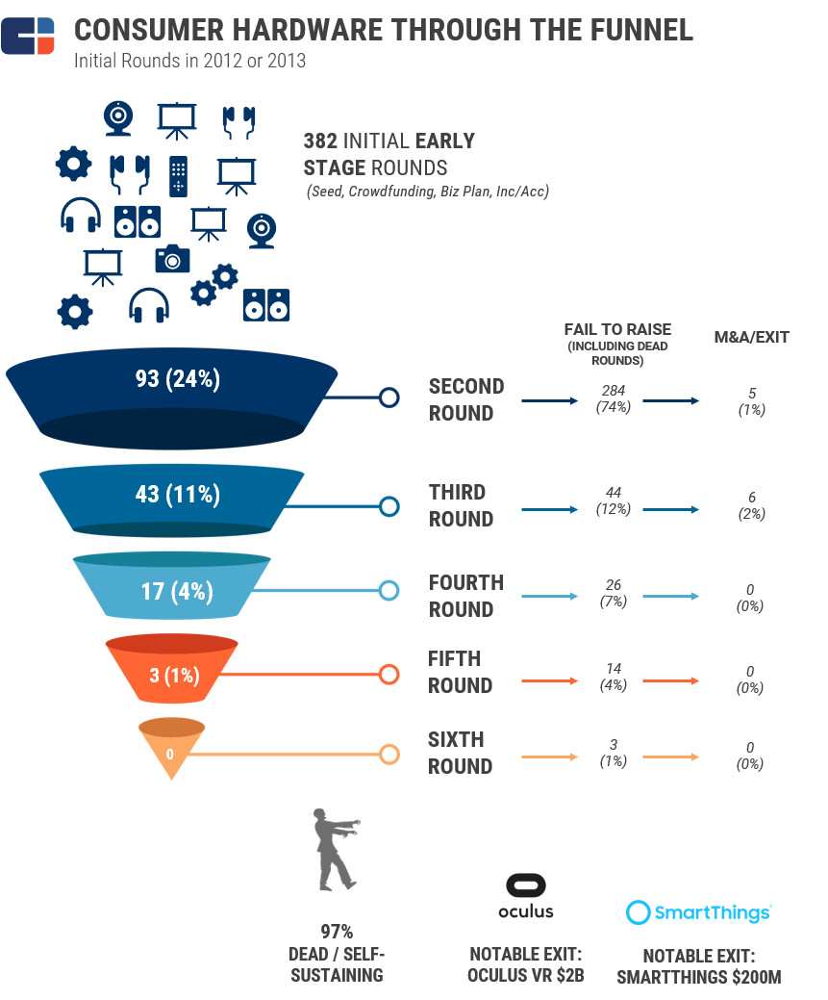
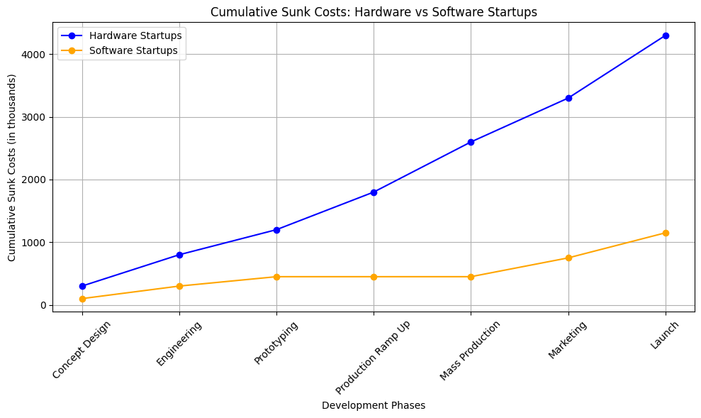
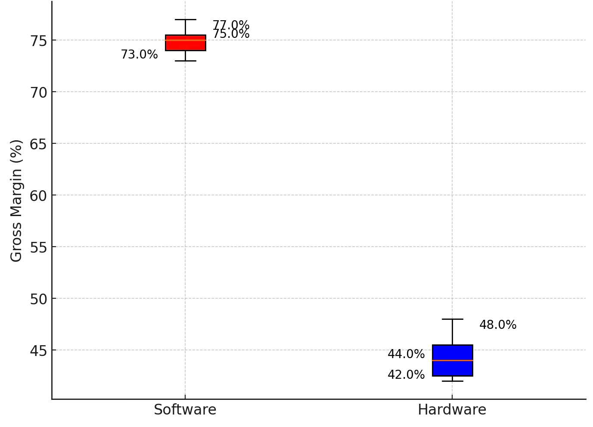
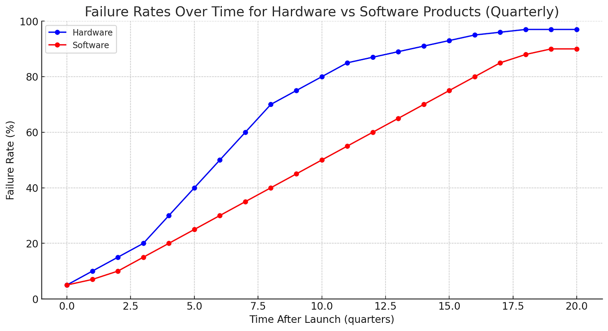
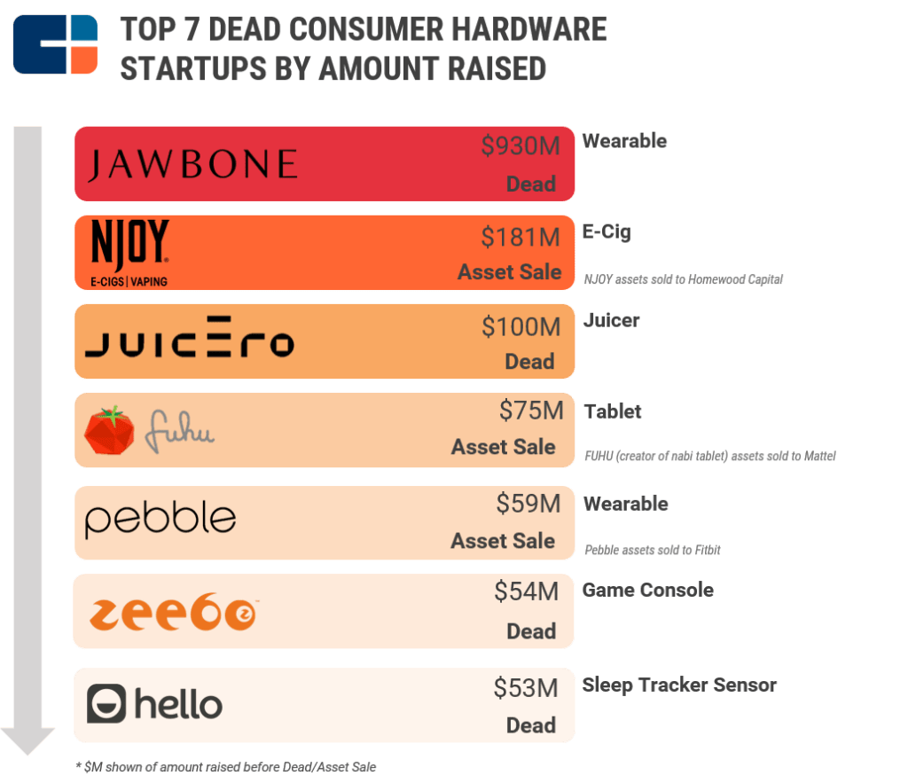
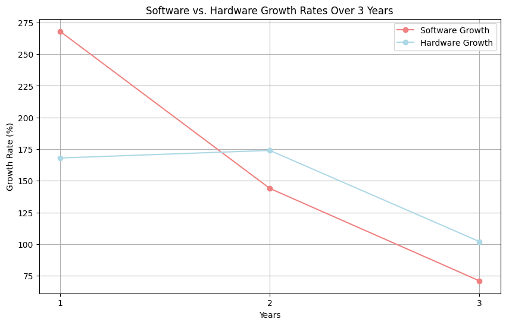
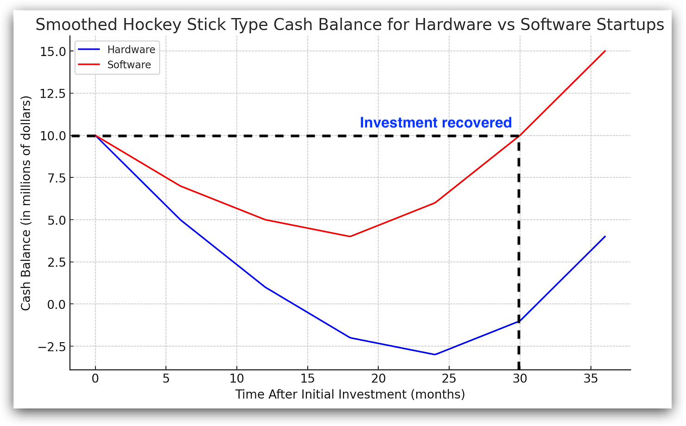
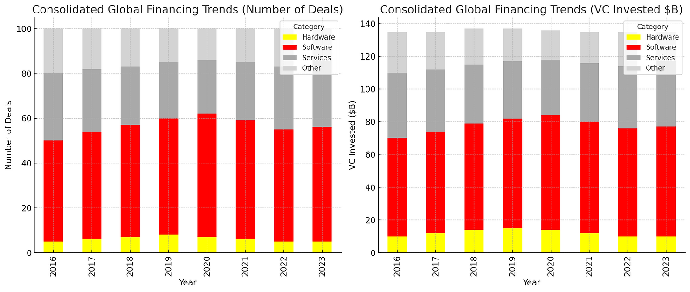
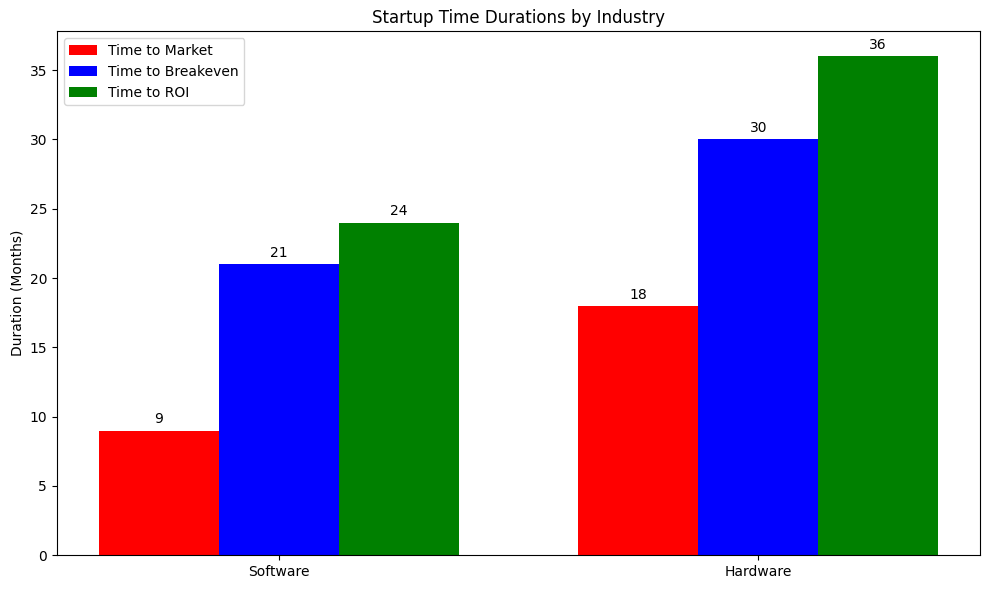

# Chapter 1 - Why is Hardware THAT hard?

*While software developers can push updates to fix bugs and add features within hours, hardware teams find themselves trapped in an unforgiving predicament: every design decision becomes permanently embedded in steel, silicon, and plastic, with no "undo" button. A single misjudgment in component selection, thermal management, or supply chain planning doesn't just delay launches – it can kill products entirely, bankrupt startups, and put years of innovation to scrap – before customers ever see the final result. This creates a venture-killing contradiction: the very industries that most need rapid iteration and customer feedback are bound by development processes that turn every technical bet into an existential gamble, where being wrong once often means being out of business forever.*

------

  
  
  

**Figure 1.1 — Evolution of automotive cockpit and exterior design (1908–2020).**
*(a) Ford Model T — (b) Tesla Model Y — (c) Tesla interior)*

---

#### A Short intro

Much has changed in the automotive world in the 115 years spanning the introduction of the Ford Model T, the first mass-produced car, and the start of production for Tesla's Model Y, a battery-powered electric car that is connected to the internet via satellite, yet nearly all contemporary drivers could drive a Model T, and any early 20th-century driver could probably learn to drive a modern car within just a few hours.

… Cut to the basic challenges of creating physical products (cars included), then scaling them up, generating profit in the process. These have not changed. Building hardware products is an extremely hard endeavor.

In the first part of this series, we’ll show how bad the situation is.

Hardware manufacturers, thankfully, have learned a thing or two in their quest to reduce risk and improve the prospects of hardware products, especially in the domain of **development processes**: Advanced design methods, easy and realistic prototyping, flattened supply chains, improved inventory management, and streamlined production planning have combined to shorten time to market, improve validation, and reduce overall costs.

Challenges, however, remain. Globalization and the resource arbitrage it brings mean that successful products will be copied - posing a new element of risk traditional methods can’t prevent. 

Patents alone are no longer valid protection: While registration is accessible, **litigation** is a major (and risky) expense, increasingly eroding this crucial barrier against commodification.

The good news is that the advent of integration of digital capabilities into physical products opens for reshaping product and customer lifecycles, and improve on the business models that such products support. 

Moreover, it opens for a range of new services that manufacturers can offer to their users, extending product lifetime, by increasing customer loyalty.

Finally, the new value created has the potential to be much harder to copy.

Now let us get back to the initial predicament of hardware manufacturers: Why is it so hard to reach even initial success?

---

### OK, So Why is Hardware THAT hard?

_Hardware startups face unique challenges, particularly in terms of timing and cost of failure. While software companies can test market adoption with MVPs, hardware ventures must invest heavily in production and distribution, making failure more costly. Despite these risks, hardware is essential for our physical world, and digital technologies can improve the fortunes of hardware startups._

---

Let us first establish the problem.

According to [<u>CB Insights</u>](https://www.cbinsights.com/research/report/hardware-startups-failure-success/), the average venture success rate for hardware is only 3%, compared to 30% for software, with "success" defined as the survival beyond ten years.

This begs the question: What factors contribute to the difference in success rates between hardware to software ventures, and what insights can we draw to improve the likelihood of success for the hardware venture we are involved in as product managers?

  

  ***Figure 1.2 — Comparison of failure rates of Hardware Vs. Software startups***

---

Another quite devastating illustration from the same source shows the survival funnel for consumer hardware startups, and let me tell you: The news ain’t good:

  ***Figure 1.3 — Consumer hardware startup success funnel***

---

Let's review some of the reasons:

#### Sunk Costs

A sunk cost is an expense already incurred which cannot be recovered. When designing a hardware product for mass production, a significant portion of the development expenses fall into this category. Most of these costs cannot be repurposed for new products in the event of failure and are likely to be completely lost.

Take, for example, a domestic trash bin manufactured by Dolav, produced via HDPE reaction injection molding. The injection mold required for producing the main body consisted of two steel blocks weighing 80 tons in total. In addition to the main mold, several others were needed for the lid, wheels, and various auxiliary parts, weighing several tons each.

  

    
    
    
  

<strong><em>Figure 1.4 — Dolav: Residential Waste Bin</em></strong>

 <em>(a) Rear view - (b) Lower view - (c) Injection mold</em>

------

It took two 18-wheeler trucks to transport the 80 mertic ton mold from the sea port to the injection molding facility, and other trucks were needed to deliver the smaller molds to other factories, with other injection machiens, where the smaller parts were to be injected.

The cumulative development cost ammounted to millions of Euros, a significant economic risk. A commercial or technical failure could have resulted in additional losses of several million euros due to tied-up production resources (raw materials, labor costs, injection molding machines).

Moreover, such a failure would have turned the the production tooling, ie the molds, into massive scrap metal, left to rust quietly in some warehouse, or sold by the weight for recycling.

Of course, sunk costs are rife in the software industry as well. However, the magnitude of the problem seems smaller:

  ***Figure 1.5 — Comparative sunk costs for software and hardware products***

 	

<!--A great explanation here: https://beneinstein.com/will-your-hardware-startup-make-money-677a8e6c665b-->

---

#### Lower profit margins

Compared to software companies, hardware ventures bear additional costs for production facilities, factory space, and logistics (PPE), as well as the need to finance raw materials and inventory spread across the supply chain.

These additional costs result in relatively lower profit margins. In a gross profit analysis comparing ventures from both software and hardware sectors, we examined ventures within one standard deviation from the industry average, covering 68% of companies under a normal distribution.

According to this analysis, software companies achieve gross profitability ranging from 75% to 85%, while for hardware companies, the average gross profitability is lower, ranging from 42% to 44%, with significant variation across industry sectors.

**Figure 1.6 — Profit ranges for software and hardware products (compiled)**

#### Data Sources & Methodology:

-   NYU Stern Industry Analysis (January 2025) - 6,062 companies across industries downloaded from https://pages.stern.nyu.edu/~adamodar/New_Home_Page/datafile/margin.html

-   Software sector: System & Application (72.4%), Entertainment (65.4%), Internet (60.8%)

-   Hardware sector: Computers/Peripherals (38.7%), Electronics General (25.2%), Equipment (30.1%)

-   Individual company data from FY 2024 financial reports

-   Sample represents companies within 1 standard deviation of industry mean

-   Code available at: https://colab.research.google.com/drive/1259htZld5APCdHNzsr0aD8uZ7gdJOKcS?usp=sharing

---

#### Higher and earlier project failure

Hardware ventures face a higher risk of long-term failure compared to software startups, with the gap becoming more pronounced around the heavy investments required at the industrialization phase.

**Figure 1.7 — Failure rates for software and hardware products**

Here are several eye-popping examples of software venture failures from a [<u>CBInsights</u>](https://www.cbinsights.com/research/report/hardware-startups-failure-success/) study conducted in 2017:

**Figure 1.8 — Epic hardware startup failures**

These examples illustrate the substantial amounts required for industrialization, marketing and distribution, all while building the supply chain and inventory necessary for hardware products - and the sheer risks hardware entrepreneurs must undertake to scale.

---

#### Slower growth

Supply chains and distribution channels characteristic of tangible products also impose slower growth and intensive cash consumption (working capital).

These entail constraints such as shipping duration and costs, inventory management, and last-mile delivery challenges — all of which are thankfully absent from the business model of most software products.

One of the main outcomes of these constraints is slower growth for hardware ventures, especially in comparison to software.

**Figure 1.9 — Growth for software and hardware products**

Source: [<u>Equidam</u>](https://www.equidam.com/average-growth-rate-for-startups/) and author's processing

---

#### Longer ROI period

If you also visualize a startup's success by sketching the famous hockey stick graph of its cash balance over time, you can compare the average curve for hardware and software products and see that it takes much longer to achieve a return on investment.

**Figure 1.10 — Cash balance for software and hardware products**

Note: This refers to a return on investment from organic sources, meaning from the company’s revenues and profits, rather than from an exit event where new investment or debt replace early equity.

---

#### Where capital flows to

The above might be interpreted as suggesting that hardware products should be avoided at all costs... but that’s not my intention. It’s true that the factors mentioned earlier weigh heavily on the initiation, industrialization, and distribution of hardware products.

Undoubtedly, increasing competition and regulatory burdens make it even harder to successfully launch hardware products.

Other trends in recent decades, however, have had a strongly positive impact on hardware product development, and by implication, on new ventures in the field. These include improved design and prototyping processes, supply chains simplification, and, not least, the rapid growth of the global market, which has brought billions into the global economy and into production and consumption cycles.

It’s reasonable to think that these positive trends have contributed to the proliferation and success of physical products: The significant rise in purchasing power among a growing number of people needing clothing, housing, transportation, essential products, and entertainment represents a powerful positive force (yes, I am ignoring environmental externalities here).

The point is that these same trends that enabled the growth of recent decades also made information technology even more successful compared to hardware. Countless software products have been launched with reduced risk and plummeting development costs, resulting in lower damage in the event of failure.

One reason for this is that, unlike hardware, software products are developed as layers built upon the foundations established by industry leaders, who themselves continue to advance.

Phenomena like cloud-based infrastructure as a service (SaaS, PaaS, IaaS) further reduce costs and accelerate the creation of new software products.

Indeed, it’s interesting to examine venture capital flows in recent years.

**Figure 1.11 — VC allocation by sectors.** Source: KPMG

As software continues "eating the world," a consistent ratio between investments in software and hardware can be observed, allowing us to infer the availability of capital for the hardware sector (and perhaps the availability of investors capable of committing to the marathon required).

---

#### Slow ramp-up, longer time-to-revenue

The production, transportation, and installation of the molds in the previous example took approximately a calendar year, a timeline almost unheard of in the software industry, but sadly by no means an exception in the hardware industries. A new car, for example, can easily take [<u>up to six years</u>](https://www.caranddriver.com/news/a15350381/how-a-car-is-made-every-step-from-invention-to-launch/) from conception to manufacturing.

General and administrative expenses, including development and maintenance costs, are, of course, common in the software industry as well. However, the time required to launch and begin generating revenue from the product—and consequently, the waiting period until the breakeven point and return on investment—tends to be significantly longer for hardware companies. This increases the financial burden on investors.

**Figure 1.12 — Time-to-market for hardware and software products**

Several studies highlight significant differences between software and hardware ventures, to the detriment of the latter:

<table data-hook="table-component"><colgroup><col><col><col><col></colgroup><tbody><tr><td data-hook="table-plugin-cell">
<strong>Metric</strong>
</td><td data-hook="table-plugin-cell">
<strong>Software</strong>
</td><td data-hook="table-plugin-cell">
<strong>Hardware</strong>
</td><td data-hook="table-plugin-cell">
<strong>Multiplier</strong>
</td></tr><tr><td data-hook="table-plugin-cell">
Time to market
</td><td data-hook="table-plugin-cell">
9
</td><td data-hook="table-plugin-cell">
18
</td><td data-hook="table-plugin-cell">
2.0
</td></tr><tr><td data-hook="table-plugin-cell">
Time to breakeven
</td><td data-hook="table-plugin-cell">
21
</td><td data-hook="table-plugin-cell">
30
</td><td data-hook="table-plugin-cell">
1.43
</td></tr><tr><td data-hook="table-plugin-cell">
Time to ROI
</td><td data-hook="table-plugin-cell">
24
</td><td data-hook="table-plugin-cell">
71
</td><td data-hook="table-plugin-cell">
2.93
</td></tr></tbody></table>

We will later revisit the impact of prolonged waiting periods on investor considerations in hardware ventures.

---

#### Interim Conclusion (1)

Don't. Do. Hardware!... Or maybe, this was a bit too harsh...

In the upcoming posts, I will discuss trends that help alleviate some of the pains associated with establishing hardware ventures.

In particular, we will examine the effects of the convergence between hardware and software in the form of smart or connected products.

Additionally, I will explore several product management practices that can (and must) be implemented as part of hardware product development.  

---

**References & Sources**
All references for this chapter — with live links and archived snapshots — are available at the companion site.

[View Chapter 1 References →](https://yoelf22.github.io/manuscript/references/ch01.html)

