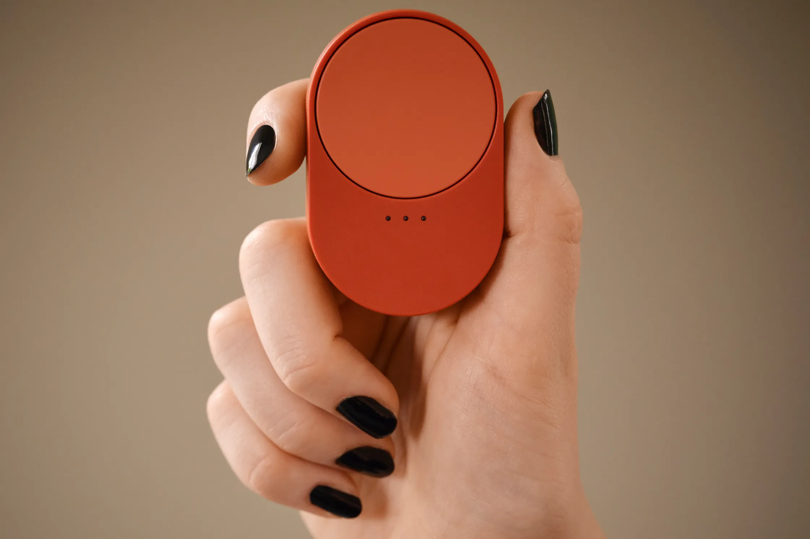

# Chapter 10 — The Sensing and Actuation Revolution

**When Products Learn to Feel — and Reach Back**

*Arc II layer model: This chapter bridges the **Physical Product** and **Digital and Connectivity** layers — sensors and actuators are physical hardware that generate and act on digital data streams, providing the raw capabilities that intelligence will process.*

## Opening: From Blind Objects to Aware — and Active — Products

- Bridge from Chapter 9: firmware updates give the product a way to evolve. But evolution requires perception — the product must know what is happening around it and, increasingly, be able to respond physically
- The evolution from user-operated to self-sensing products — and from passive sensing to remote actuation
- Why environmental awareness changes everything — and why the ability to act on what is sensed changes even more
- The sensor economy: data as the new product differentiator. The actuation economy: physical response as the new service layer
- **Thesis: Sensing turns a product into an observer; actuation turns it into an operator. The combination — sense, decide, act — is the foundation on which intelligent products are built. But each step up in capability raises the stakes: from data quality to response reliability to liability for autonomous action.**

---

## The Sensor Spectrum: Types and Capabilities

### Environmental Sensors
- **Temperature & Humidity:** Climate control, comfort optimization, cold chain monitoring
- **Light & Proximity:** Adaptive interfaces, energy management, occupancy-triggered responses
- **Air Quality & Chemical:** Health monitoring, safety alerts, regulatory compliance (VOC, CO₂, particulates)
- **Sound & Vibration:** Noise cancellation, mechanical diagnostics, structural health monitoring
- **Flow & Consumption:** Water meters, gas meters, electricity meters — the foundation of utility-scale sensing. IoT in energy is projected to grow from $38B to $286B by 2033 (Astute Analytica); 71% of US electricity customers already have smart meters. Sensors deployed in energy infrastructure are expected to live 10–20 years while staying patchable, secure, and compatible
- **Soil & Agriculture:** The [Matter 1.5](https://csa-iot.org/all-solutions/matter/) standard (2025) brought soil sensors into the smart home interoperability ecosystem (Chapter 8), opening agricultural monitoring to mainstream adoption
- **Case study — Bosch sensor-as-a-service:** Bosch is transitioning from component supplier to data-and-insights provider. Its BME sensor series (air quality, vibration, humidity/temperature, occupancy) now integrates with Bosch's software and analytics environments. Customers pay for continuous, validated data streams via cloud APIs — calibration, firmware, and lifecycle management abstracted away. The sensor hardware becomes a low-margin entry point for recurring revenue
- **Scale example — Latin America smart metering:** 48.5 million new smart electricity meters deploying by 2030 (Berg Insight), driven by energy theft reduction and billing accuracy. Brazil and Mexico account for 65%+ of 20–30M annual installations. Hardware requirements: multiple communication options, flexible data schemas, firmware signing, tamper resistance. At this scale, the sensor is infrastructure

### Motion & Position Sensors
- **Accelerometers & Gyroscopes:** Orientation, movement detection, fall detection, activity classification
- **GPS & Indoor positioning:** Location-aware functionality across outdoor and indoor environments
- **Magnetometers:** Navigation and directional awareness
- **Asset tracking market:** Projected to double from $8.7B to $19B by 2032 (ResearchAndMarkets). The shift is from "where is my thing" to "what should I do about it" — pulling toward multi-sensor trackers (location + temperature + shock + tampering + usage) with edge inference. The tracking device itself is commoditizing; value migrates to multi-sensor intelligence and managed service layers
- **Case study — DMATEK (now Attenti) electronic monitoring:** Years before GPS trackers became commodity hardware, I worked on electronic monitoring devices at DMATEK that had to solve every layer of the sensing problem simultaneously. The product line — worn as ankle bracelets for law enforcement and as wrist-worn devices for patient wandering prevention — combined wide-area location via GPS with local-area positioning through early proprietary mesh wireless networks, long before standards like Zigbee or Thread existed. Fall detection relied on accelerometer data processed on-device, and device integrity was enforced through electronic anti-tampering mechanisms that could distinguish a deliberate removal attempt from normal wear. Each sensing modality served a different stakeholder need: GPS satisfied parole officers and facility managers tracking zone compliance; the mesh network provided indoor coverage where GPS signals couldn't reach; fall detection addressed duty-of-care obligations; and tamper detection ensured the entire system's credibility. What made this an early lesson in sensor fusion is that no single sensor was sufficient — location without tamper detection was untrustworthy, and tamper detection without location was unactionable. The product had to fuse all four data streams into a coherent, real-time picture before any alert could be issued. This was multi-sensor intelligence applied to human monitoring, years before the term "IoT" entered the vocabulary

***Figure 10.1 — HomeFree patient wandering monitoring bracelets by DMATEK (now Attenti). These watch-style wearables combined GPS, proprietary mesh wireless positioning, fall detection, and electronic anti-tampering in a single device — an early example of multi-sensor fusion for human monitoring***

### Biometric & Human Sensors
- **Heart rate & SpO₂:** Health and fitness monitoring, early warning systems
- **Fingerprint & facial recognition:** Security and personalization
- **Voice & gesture:** Natural interaction interfaces
- **Continuous glucose monitors (CGMs):** Silicon Labs' [Series 3](https://www.silabs.com/wireless/series-3-wireless-platform) platform targets CGMs alongside smart meters and electronic shelf labels — edge AI on low-power wireless silicon, with ROI justified not by novelty but by measurable lifetime value (dynamic tariffing, subscription health services)
- **Multi-factor biometric access — Durin MagicKey:** Combines [UWB](https://standards.ieee.org/ieee/802.15.4z/10230/) (automotive-grade secure ranging), facial recognition, and voice biometrics for home entry — stacking three sensing modalities into a single access control loop. Raises the bar for all access vendors on spoofing resistance, recovery flows, and biometric data governance
- **Worker safety wearables:** Construction sites use wearables tracking fatigue, proximity to hazards, and physiological stress. Oil and gas operations add environmental exposure monitoring. These devices must survive years of abuse, patchy connectivity, and complicated field support — "don't design only for clean environments" is the operating principle

### Machine Vision & Depth
- **Cameras & computer vision:** Object recognition, scene understanding, quality inspection
- **LiDAR & ToF sensors:** 3D mapping, obstacle detection, spatial awareness
- **Radar & mmWave:** 60 GHz mmWave radar (TI AWR/IWR series, Infineon BGT60) enables through-wall presence detection, gesture recognition, vital sign monitoring (respiration, heartbeat), and fall detection — without cameras or wearables. Unlike PIR sensors that detect movement only, mmWave distinguishes stationary presence (a person sitting still or sleeping) from an empty room. Privacy-preserving by design: no images captured, no biometrics stored, just electromagnetic reflections processed locally. CES 2026 showcased mmWave embedded in ceiling panels, smart speakers, and bathroom fixtures for elder care and occupancy-based HVAC optimization. The sensor category that matters most for ambient intelligence may be the one that captures no images at all
- **Thermal imaging:** Heat detection, energy analysis, predictive maintenance
- **Edge AI vision is now production hardware:** Dozens of vendors ship ruggedized, certified edge AI compute boxes — multi-camera vision systems for traffic analytics, retail, medical imaging, and quality inspection. The shift from developer prototypes to deployable production units signals that edge vision is becoming repeatable and standardized. Two trends accelerate this: chip vendors are moving from selling components to owning vertical sensing platforms (whoever controls the retail or industrial IoT platform influences which device form factors become standard), and edge AI vendors now bundle "operational trust" — model protection, IP isolation, industrial I/O, [TPM 2.0](https://trustedcomputinggroup.org/resource/tpm-library-specification/) — into the product story. Protecting the intelligence that interprets sensor data is becoming as important as protecting the data itself. Modular form factors (COM-HPC) decouple compute from mechanical design, enabling compute module refreshes while the chassis stays stable over long product lifecycles

---

## Sensor Fusion: When 1+1 = 10

- Combining multiple sensor inputs for richer understanding than any single sensor provides
- The value of fusion: resolving ambiguity (is the building empty or is the motion sensor blind?), improving accuracy (GPS + accelerometer + map constraints), and enabling new capabilities (multi-biosignal health inference)
- Machine learning transforms sensor fusion from hand-crafted rules to learned correlations — the system discovers patterns no engineer anticipated

### Silicon Platforms for On-Device Fusion
- **The NPU integration race:** Every major MCU vendor now ships or has announced microcontrollers with dedicated neural processing units. This is not incremental improvement — it redefines what a "microcontroller" can do. Two paradigm-setting platforms illustrate the shift:
  - **[Google Coral NPU](https://developers.google.com/coral):** The first fully [open-source](https://github.com/google-coral/coralnpu), RISC-V-based NPU IP — custom silicon, optimized runtime, compiler, and tooling with no license fees. Runs on coin cells. Shifts edge AI from "tiny models on general-purpose chips" to "dedicated AI accelerators at milliwatt power." The sensor no longer just captures raw data; it interprets it locally
  - **[STMicroelectronics STM32V8](https://newsroom.st.com/media-center/press-item.html/p4733.html):** Industry's first 18nm AI-ready MCU, delivering application-processor-level performance in an MCU footprint and power envelope. Selected by SpaceX for Starlink — validation that MCU-class silicon can handle demanding AI workloads in production at scale
- **The emerging de facto standard:** Arm's [Ethos NPU family](https://www.arm.com/products/silicon-ip-cpu/ethos/ethos-u55) (U55/U85) is appearing across multiple vendors — Infineon, Nordic, Synaptics, Renesas — as a common inference engine for on-device sensor fusion. Nordic's [nRF54L](https://www.nordicsemi.com/Products/Technologies/Edge-AI/Axon-NPU) pairs an NPU with Bluetooth LE and Thread on a single coin-cell-powered chip, making battery-powered sensors with meaningful ML inference a commercial reality. The chip choice determines where the line is drawn between on-device and cloud workloads — and that line is moving rapidly toward the device
- **The market trajectory:** Edge AI projected to grow from $16.5B (2024) to $83.9B by 2032 (~22.5% CAGR, DataM Intelligence). Fewer than 1% of IoT devices today have true edge AI components (IoT Analytics), but the silicon shipping now will determine which products can run on-device intelligence for the next decade

### Ambient Intelligence
- The convergence of sensing, fusion, and local inference enables products that perceive context and adapt without explicit user commands. Smart speakers, home hubs, and wearables are being repositioned as ambient intelligence layers — not as individual devices but as distributed perception systems. Deeper [Matter](https://csa-iot.org/all-solutions/matter/) support and upgraded local processing reduce cloud dependency, improving latency and resilience
- The pattern: sensing + fusion + local inference = ambient awareness. This is the capability Chapter 11 examines in depth through the ML vs. GenAI lens

---

## Real-World Sensing Applications

### Smart Homes
- Occupancy detection and automatic adjustment; security monitoring and intrusion detection; energy optimization through usage patterns
- The connectivity infrastructure enabling smart homes — multi-protocol hubs, Matter interoperability standards, and the gap between spec compliance and real-world reliability — is examined in Chapter 8
- **Software-defined buildings — [Schneider Electric EcoStruxure Foresight Operation](https://www.se.com/ww/en/about-us/newsroom/news/press-releases/schneider-electric%E2%80%99s-ecostruxure-foresight-operation-ushers-in-a-new-era-for-the-built-environment-691afab27594b4250a019d43/):** Unified AI platform combining HVAC, lighting, energy management, occupancy analytics, and maintenance workflows. Buildings move from fragmented subsystems to continuous optimization loops. Value depends not on individual sensor components but on seamless integration into AI-driven orchestration layers

### Healthcare Devices
- Continuous health monitoring and early warning systems; medication adherence and lifestyle tracking; remote patient monitoring and telehealth
- CGMs paired with insulin pumps close a life-critical sense–decide–act loop (detailed in actuation section below)
- **Security for unmodifiable devices:** Many medical sensing devices cannot run security agents or be easily patched. Agentless asset discovery platforms are making previously opaque device fleets visible to governance and risk processes — security findings flow directly into remediation workflows. The ability to see and manage devices that cannot manage themselves is becoming a procurement requirement for hospital and clinical sensing deployments

### Industrial IoT
- Predictive maintenance through vibration and temperature monitoring; quality control and process optimization; worker safety and environmental compliance
- **Physical AI + Zero Trust OT:** Industrial automation leaders are converging on AI applied to physical systems combined with Zero Trust security for operational technology (per [ISA/IEC 62443](https://www.isa.org/standards-and-publications/isa-standards/isa-iec-62443-series-of-standards)). Products are evaluated not just on sensing accuracy but on identity, access, logging, update practices, and integration contracts. "Works on my machine" is being replaced by "fits into my operational model." Security posture is now a product attribute for sensing devices
- **Harsh environments — construction, mining, energy:** Construction sites use tagged equipment, structural monitors, and worker wearables. Oil and gas operations rely on remote monitoring for shutdown/repair decisions. Smart sensors connect via LoRaWAN or [NB-IoT](https://www.3gpp.org/news-events/3gpp-news/nb-iot-complete) from locations where WiFi does not exist. 2026 IIoT architectures prioritize edge computing over cloud-only models — industrial environments demand ultra-low latency and devices that survive years of abuse
- **Utility-scale sensing — Telefonica/Cadiz water meters:** 4,000+ NB-IoT water meters for Aguas de Cadiz. NB-IoT chosen for signal penetration in basements and meter rooms and 12+ year battery life. Hourly consumption data vs. bi-monthly manual reads — enabling leak detection, billing accuracy, and consumption pattern analysis for vulnerable groups. The sensor architecture (NB-IoT + long-life battery + hourly telemetry) determines the entire service model

### Automotive
- Advanced driver assistance and autonomous capabilities; vehicle health monitoring and predictive maintenance; passenger comfort and safety optimization
- Automotive proximity sensing — keyless entry, presence detection — now leverages hardened secure ranging (Bluetooth 6.2 Channel Sounding, Chapter 8) to protect against relay attacks, a widely documented vulnerability in automotive sensing

---

## Closing the Loop: Remote Actuation

- Sensing without actuation is monitoring — a dashboard. Sensing *with* actuation is control — a system. The difference is between watching a problem unfold and intervening before it does
- A product that can only report is a passive observer. A product that can also *act* — open a valve, lock a door, cut power, adjust a setting — closes the control loop and becomes an operator in its own right
- Remote actuation transforms the product from an information source into an agent: it senses a condition, decides (or relays the decision), and executes a physical response — all without a human hand on the device

### The Sense–Decide–Act Loop
- Every actuated system follows the same pattern: **sense** (measure the environment), **decide** (evaluate against rules, thresholds, or ML models), **act** (trigger a physical response)
- The "decide" step can live at different levels: on the device itself (edge), at a local hub, or in the cloud — with latency, reliability, and autonomy implications that Chapter 11 examines
- When the decision is local and the actuation is immediate, the product can respond in milliseconds. When the decision routes through a cloud, every network hop adds latency — acceptable for a thermostat, unacceptable for a safety shutoff
- **"Agentic IoT" — IoT Tech Expo 2025:** Industry vocabulary is shifting from "monitoring" and "dashboards" to "orchestration" and "closed-loop operations." Agentic IoT: systems that do not just report but coordinate assets, workflows, and outcomes. Key questions: Who is allowed to act? Under what policy? With what approvals? What happens when the agent is wrong? Liability boundaries become critical when software triggers physical actions
- **The silicon enabling the loop:** Mobile processors now deliver 80–100 TOPS of dedicated AI compute. [MediaTek's Dimensity 9500](https://www.mediatek.com/products/smartphones/mediatek-dimensity-9500) is the first to reach 100 TOPS using Compute-in-Memory — a fundamentally different architecture that cuts always-on AI power consumption by more than half. These are not cloud capabilities brought to the edge — they are native edge capabilities that make the sense–decide–act loop viable on the device itself
- **Warning:** "If your product cannot close any loops, it risks becoming just another sensor feeding someone else's platform" — a direct threat to sensor-only product strategies

### Types of Remote Actuation
- **Electromechanical:** Motors, solenoid valves, relays, locks, latches — binary or variable physical action triggered by an electrical signal
- **Thermal:** Heating elements, cooling fans, Peltier modules — adjusting temperature in response to sensor readings
- **Fluid control:** Pumps, valves, sprinklers — regulating flow of water, gas, or chemicals
- **Electrical switching:** Smart plugs, breakers, dimmers — controlling power delivery to connected loads
- **Dispensing:** Medication pumps, fertilizer dosers, feed dispensers — metered delivery of a substance based on sensed conditions

### Remote Actuation in Practice
- **Smart irrigation:** Soil moisture sensors trigger valve actuators zone by zone — the system waters where and when needed, not on a fixed schedule. The sense–decide–act loop runs continuously, adapting to rainfall, evaporation, and crop stage
- **Smart locks:** Presence sensors (BLE, [UWB](https://standards.ieee.org/ieee/802.15.4z/10230/), facial recognition) trigger lock mechanisms — the door opens for recognized occupants, logs access for others. Actuation is binary but the consequences are security-critical
- **Industrial safety:** Vibration or temperature sensors detecting anomalies trigger equipment shutdown or pressure relief — the actuation must be faster than any human response. Fail-safe defaults (actuator state on power loss) are a critical design choice
- **Medical devices:** Continuous glucose monitors paired with insulin pumps — sensing blood glucose, deciding dosage, actuating delivery. The control loop operates on the patient's body, making accuracy and reliability life-critical
- **HVAC and energy:** Occupancy sensors, temperature readings, and grid pricing signals drive damper positions, compressor staging, and load shedding — actuation that optimizes comfort, cost, and carbon simultaneously
- **Fleet and logistics:** Remote engine immobilization for stolen vehicles, container climate control for perishable cargo, automated gate and barrier control at distribution hubs

***Figure 10.2 — IKEA's Matter-based rotary dial remote — a physical actuation interface for controlling smart bulbs, plugs, and blinds across ecosystems***

***Figure 10.3 — Matter standard logo — the open interoperability protocol backed by Apple, Google, Amazon, Samsung, IKEA, and 550+ CSA members***

- **Mass-market actuation — IKEA's Matter reboot:** In 2025, IKEA launched 21 [Matter](https://csa-iot.org/all-solutions/matter/)-based smart home products simultaneously — dimmable bulbs, smart plugs, rotary dial remotes, occupancy sensors, and motorized controls — all cheaper than their predecessors and built on an open interoperability standard. With over a billion annual store visits and the trust of mainstream households that would never touch Zigbee hubs or DIY home automation, IKEA is the first mass-market manufacturer to ship a coordinated family of actuators on an open standard at global scale. For a decade, the smart home was split between two extremes: premium ecosystems (Philips Hue — beautiful but siloed) and low-cost vendors (cheap but poorly integrated and short-lived). Neither brought actuation into the mainstream. IKEA's play is to make interoperable actuation affordable and accessible — moving the smart home from fragmented early-adopter territory toward a baseline expectation. The execution challenges are real (see Chapter 8's IKEA Matter cautionary tale), but the strategic significance is clear: when the world's largest furniture retailer commits to Matter-based actuation at scale, the category is no longer niche
- **Actuation expands the attack surface to the physical world:** When a product can be commanded remotely — opening valves, adjusting pressure, unlocking doors — a compromised connection becomes a safety incident, not just a data breach. Recent attacks on water treatment SCADA systems and industrial OT protocols demonstrate that this is not a theoretical risk: attackers are already manipulating physical actuators in critical infrastructure (Chapter 19). Products with remote actuation must treat security architecture as load-bearing structure, not as a compliance checkbox
- **Smart water — Telefonica/Cadiz:** Beyond sensing hourly consumption, the NB-IoT water meter network enables leak detection and unauthorized consumption control as automated responses to sensor data — actuation at utility scale, not just monitoring
- **Digital twins crossing from read to write:** Digital twins (Microsoft Azure, AWS IoT TwinMaker, Siemens Insights Hub, [NVIDIA Omniverse](https://www.nvidia.com/en-us/omniverse/)) have evolved from simulation tools to real-time operational representations combining telemetry, wear models, environmental inputs, and service history. Twins now forecast failures, simulate interventions, and schedule maintenance — and increasingly gain "controlled write access," issuing policy-bound actions and closed-loop adjustments to physical systems. The twin evolves from observer to operator

### The Strategic Shift: From Observer to Operator
- Products with sensing alone are information providers — they compete on data quality, dashboard design, and alert accuracy
- Products with sensing *and* actuation are control systems — they compete on reliability, response time, and the breadth of conditions they can handle autonomously
- The business model implications are significant: a sensor-only product sells monitoring; a sensor-plus-actuator product sells management, automation, or outcome guarantees. The latter commands higher margins and deeper customer lock-in
- **Digital twins as monetizable decision systems:** Vendors price for uptime guarantees and performance-based outcomes — raw telemetry transformed into commitments. The twin is the vehicle; the sensor/actuator hardware is the plumbing
- But actuation carries higher stakes: a false reading on a dashboard is an inconvenience; a false actuation — an unwanted door unlock, a premature equipment shutdown, an incorrect medication dose — is a liability. Product teams adding actuation must design for fail-safe defaults, override mechanisms, audit trails, and clear accountability for autonomous decisions (setup for Chapters 19–21)

---

## The Data Challenge: From Sensing to Intelligence

- Processing sensor data at the edge vs. cloud — a decision shaped by bandwidth, latency, power, privacy, and cost
- Privacy implications of continuous environmental monitoring
- Balancing accuracy with battery life and cost

### Connectivity Shapes the Sensing Architecture
- The connectivity protocol — LPWAN, cellular, Wi-Fi, satellite, or batteryless backscatter — determines which sensing architectures are viable, which business models are possible, and which markets are accessible. Chapter 8 examines these trade-offs in detail: protocol selection, ecosystem dynamics, satellite convergence, 3GPP Release 19 Ambient IoT (batteryless sensing at packaging-item granularity), and the governance frameworks shaping how sensor data crosses organizational boundaries

### Embedded Resilience
- Connected sensing/actuation products are increasingly pushed to behave like infrastructure: resilient, autonomous, predictable
- **"Survive and continue" engineering:** What gets cached locally when the network drops? What UI does the device present when it cannot reach its hub? What "safe state" do actuators default to? These are not edge cases — they are the conditions that define user trust
- Resilience is now treated like UX — failure modes are what users remember. Explicitly appearing in procurement RFPs: offline mode, local-first controls, bounded latency guarantees
- **Warning:** "A product that fails mysteriously becomes a replacement project" — sensing/actuation systems that depend entirely on cloud connectivity face existential risk when the network hiccups
- **Bad data is now visible:** When sensor streams feed ML models (Chapter 11), poor data discipline becomes immediately apparent in model outputs. For sense–decide–act architectures, data quality at the sensing layer determines decision quality at the actuation layer

---

## Strategic Implications for Product Developers

- Choosing the right sensor mix for your product goals — and understanding that the sensing architecture (which sensors, which protocols, which silicon) constrains every downstream capability
- Cost vs. capability trade-offs in sensor selection
- Planning for sensor obsolescence and technology evolution — silicon platforms ([Infineon PSoC Edge](https://www.infineon.com/promo/next-generation-mcu) with [PSA Certified](https://www.psacertified.org/) Level 4 security, [Silicon Labs Series 3](https://www.silabs.com/wireless/series-3-wireless-platform), [STM32V8](https://newsroom.st.com/media-center/press-item.html/p4733.html)) that bundle connectivity, intelligence, and security into one BOM line item protect your investment for years
- **LEGO's Smart Brick** embeds wireless mesh networking, sensors, and compute into standard bricks — choosing embedded mesh over phone-dependent BLE/WiFi enables latency-free local interaction and opens an entirely new product category (interactive physical play). The connectivity choice *is* the product architecture
- **Fleet governance as procurement gate:** Enterprise and public-sector deployments now require staged rollouts, rollback guarantees, cryptographic update provenance, and auditable change histories before approving sensing deployments. Hard-earned lessons from outages, security incidents, and unpatchable devices. OTA is judged not on its existence but on how safely and predictably it operates at scale over years. Governance separates deployable systems from demo-grade prototypes
- **Regulatory compliance as market gate:** The [US Cyber Trust Mark](https://www.nist.gov/itl/applied-cybersecurity/nist-cybersecurity-iot-program/consumer-iot-cybersecurity) launched as a consumer-facing label tied to NIST-aligned security requirements. [ISO/IEC 27404:2025](https://www.iso.org/standard/80138.html) defines a framework for IoT cybersecurity labeling. Products without secure-by-default architectures (signed updates, no hardcoded passwords, per [ETSI EN 303 645](https://www.etsi.org/technologies/consumer-iot-security)) face procurement barriers and market exclusion — especially in enterprise and public-sector sensing deployments where security posture is evaluated before functionality
- **EU regulation is already enforced, not future:** The [EU Radio Equipment Directive (RED)](https://single-market-economy.ec.europa.eu/sectors/electrical-and-electronic-engineering-industries-eei/radio-equipment-directive-red_en) cybersecurity requirements became mandatory in August 2025 — any internet-connected radio device sold in the EU must now meet baseline security standards covering network protection, personal data safeguards, and fraud prevention. Separately, the [EU Cyber Resilience Act (CRA)](https://digital-strategy.ec.europa.eu/en/policies/cyber-resilience-act) requires manufacturers to provide security updates throughout the product's expected lifetime and mandates a Software Bill of Materials (SBOM) for every connected product. Non-compliance carries fines up to 2.5% of global turnover. The SBOM requirement is particularly significant for sensing products with complex software stacks: every library, every dependency, every firmware component must be documented, tracked, and patchable. For hardware product teams, regulatory compliance is no longer a launch gate — it is a continuous obligation that shapes architecture decisions from day one
- **Global regulation is country-specific:** Cullen International reports that EU, China, India, Brazil, and Middle East/Africa authorities now issue specific authorization regimes covering cross-border connectivity, SIM registration, lawful interception, and data localization. The protocol and carrier you choose for your sensing architecture determines which countries you can legally operate in. This is a market-scope decision masquerading as a technical one
- **Reusable security patterns:** The EU funded eight Horizon 2020 projects (SecureIoT, SEMIoTICS, ENACT, IoTCrawler, and others) building reusable IoT security frameworks. Sensing device architectures that align with these patterns will make certification smoother across EU markets; those that do not face escalating compliance burden with every new regulation
- **Platform economics:** The pattern across Bosch (sensor-as-a-service), Silicon Labs (ROI via dynamic tariffing), MediaTek (vertical retail platform), and AT&T (managed home service) is consistent — sensing hardware commoditizes; value accrues to whoever owns the intelligence, the platform, or the customer relationship. Product teams must decide where they want to compete: component, platform, or service

---

## Closing: The Sensing and Actuation Advantage

- Why sensor-blind products become extinct — and why sense-only products plateau
- The progression: blind object → sensing observer → actuated operator → autonomous agent
- Building environmental intelligence *and* physical response into product strategy
- The future of ambient computing and invisible interfaces — products that perceive, decide, and act without being asked
- Sensing and actuation provide the raw capabilities. The next chapter examines what makes them intelligent: matching the right kind of AI to the right class of problem, deployed in the right location (Chapter 11)

---

**References & Sources**
All references for this chapter — with live links and archived snapshots — are available at the companion site.

[View Chapter 10 References →](https://yoelf22.github.io/manuscript/references/ch10.html)

