# Chapter 11 — Intelligence at the Edge

**What Problems Can AI Actually Solve for Physical Products?**

*Arc II layer model: This chapter focuses on the **Cloud Support** layer — AI and ML transform raw sensor data into value-added services, whether processing runs at the edge or in the cloud.*

## Opening: Why Intelligence?

- Bridge from Chapter 10: sensors flood the product with data — but without intelligence, data is noise
- The question is not "should we add AI?" but "what problems can only be solved with intelligence that rules and filters cannot handle?"
- Not all intelligence is the same. Two fundamentally different toolkits are available: **machine learning (ML)** — pattern recognition, anomaly detection, prediction from structured data — and **generative AI (GenAI)** — language understanding, content generation, conversational interaction. Each solves different classes of problems
- Not all deployment is the same. Intelligence can run on the device (edge), on a local hub, or in the cloud — and connectivity constraints (Chapter 8) determine which is feasible
- **Thesis: The value of AI in physical products depends on matching the right *kind* of intelligence to the right *class* of problem, deployed in the right *location* given the product's connectivity and power constraints.**

---

## The Need: When Rules Break Down

- Command-and-control systems built on business rules and threshold-based alerts
- The water tap analogy: simple systems, simple rules — but as networks scale, rule-based control collapses under noise, ambiguity, and volume
- Four domains of C2: Sensing, Actuation, Operation/Oversight, Architecture/Deployment
- Acute pain points: C2 overload (false positives drowning operators, burned-in CRT displays no one watches), endpoint maintenance (physical recall costs — Toyota Prius $2B, field engineer on a 30ft pole at $5,000 per visit), autonomy demands (warehouses, railways, public highways)
- The threshold question: when does a problem require intelligence rather than better rules?
  - **Business-rule heuristics** excel when the world is well-structured and discrete — but are brittle in noisy environments
  - **Bayesian filtering** steps in when the system is known but noisy — but assumes known dynamics
  - **ML** is needed when patterns exist but are too complex, nonlinear, or high-dimensional for hand-crafted rules
  - **GenAI** is needed when the input or output is unstructured — language, images, open-ended reasoning

---

## What Machine Learning Solves

- ML is pattern recognition, anomaly detection, classification, prediction from structured data streams
- ML excels where: data is noisy but patterns exist, rules are brittle, the environment changes but slowly, labeled history is available

### ML for Monitoring: Signal from Noise
- **Device access:** PIN matching (rule) vs. Face ID (ML) — probabilistic facial recognition tolerating variation while rejecting impostors
- **Geolocation:** Kalman filtering (Bayesian) vs. ML-based location inference fusing WiFi, Bluetooth, cell tower, compass, motion patterns, and map constraints
- **Predictive maintenance:** Threshold-based alerts vs. multi-sensor pattern learning from historical failure data — distinguishing real precursors from normal operating variability
- **Health monitoring:** Temperature smoothing vs. multi-biosignal fusion (HRV, SpO₂, sleep quality, activity context) personalized per wearer

### ML for Control: Unattended Automation
- Letting ML-assisted systems automatically control equipment is more complex — the "hands-free" promise can backfire
- But low-risk, reversible decisions offer immediate payoff:
- **Smart thermostat:** PID control (fixed setpoints) vs. learned occupancy patterns, home thermal response, anticipatory scheduling
- **Smart irrigation:** Fixed schedules vs. data-fused, site-specific adaptive watering combining soil moisture, weather forecasts, crop stage, and historical patterns

---

## What Generative AI Promises

- GenAI is language understanding, content generation, conversational interaction, reasoning over unstructured inputs
- GenAI excels where: the input is unstructured (voice, text, images), the output is synthesized (reports, instructions, responses), the interaction is conversational
- But GenAI in hardware is early and failure-prone

### The Cautionary Tales
- **Samsung "fake moonshots":** ML/GenAI image enhancement crossed from processing into fabrication — the output looked better than reality, eroding trust
- **Rabbit R1:** A dedicated GenAI hardware device that couldn't justify its existence vs. a phone app — the hardware added nothing the software couldn't do
- **Humane AI Pin:** A $700 screenless wearable by ex-Apple designers that sold approximately 10,000 units — just 10% of target — with returns outpacing new sales by August 2024. HP acquired Humane's assets for $116M in February 2025, a fraction of the rumored $1B valuation. All device functionality permanently ceased on February 28, 2025 when Humane's servers shut down — every AI Pin became e-waste overnight. The failure was compound: inadequate compute, cloud dependency for basic functions, poor latency, and a form factor that solved no problem a phone couldn't handle better. The server shutdown is a cautionary tale for any product whose intelligence lives entirely in the cloud — when the service dies, the hardware dies with it
- **The lesson:** GenAI that merely replaces a phone function will lose to the phone. GenAI in physical products must solve problems the phone *cannot*

### The Emerging Success: GenAI Embedded in Existing Form Factors
- **Meta Ray-Ban smart glasses:** The counterpoint to the cautionary tales. EssilorLuxottica sold over 7 million Meta Ray-Ban AI glasses in 2025 — more than tripling the 2 million units sold in 2023–2024 combined. Meta captured ~73% of the smart glasses market. The key difference: Meta embedded GenAI capabilities (real-time translation, visual identification, conversational AI) into an existing, desirable product category — Ray-Ban sunglasses — rather than asking users to adopt an entirely new device. The AI enhances a product people already want to wear, instead of demanding they carry a new gadget that must justify its own existence. Analysts expect smart glasses sales to quadruple in 2026
- **The contrast is instructive:** Humane invented a new form factor ($700 screenless pin) and sold 10,000 units. Rabbit invented a new form factor ($199 handheld) and collapsed financially. Meta augmented an existing form factor ($300 sunglasses) and sold 7 million units. GenAI hardware succeeds when it augments an established behavior, not when it invents a new one. For product managers: the fastest path to GenAI adoption in physical products is embedding intelligence into objects people already use — not creating new objects that exist solely to deliver AI

### Where GenAI Can Add Value in Physical Products
- Natural language interfaces for complex industrial equipment (voice commands in noisy environments where screens are impractical)
- Automated maintenance reporting and diagnostic explanation from sensor data
- Adaptive user interfaces that respond to spoken intent rather than menu navigation
- Context-aware guided troubleshooting (a machine that explains its own failure)
- Fleet-level insight generation: summarizing patterns across thousands of devices into actionable narratives for operators

---

## Where Intelligence Lives: The Deployment Matrix

- The architectural question from Chapter 8, examined in full
- Two axes: **kind of AI** (ML vs. GenAI) × **deployment location** (edge vs. hub/cloud)

### ML at the Edge
- Pattern recognition on constrained devices: anomaly detection, sensor fusion, classification
- Enabled by: TinyML frameworks (TensorFlow Lite Micro, Edge Impulse) and NPUs now integrated into mainstream silicon. The edge AI hardware landscape has stratified into three performance tiers, each serving different product categories:
  - **MCU-class** (milliwatts, up to 600 GOPS): [STMicroelectronics STM32N6](https://blog.st.com/stm32n6/) — the first mass-production MCU with an integrated NPU — is the paradigm example. Multiple vendors (Infineon, Nordic, Renesas) now offer similar NPU-equipped MCUs using Arm's Ethos family. Model optimization via 4-bit quantization and structured pruning. Targets: always-on keyword detection, anomaly sensing, sensor fusion on coin-cell power
  - **Gateway-class** (watts, 4–40 TOPS): Dedicated AI accelerators like [Google Coral](https://developers.google.com/coral) and Hailo chips enable real-time vision, multi-stream audio, and on-device GenAI on platforms costing $100–200. Targets: smart cameras, local hubs, retail analytics, multi-sensor aggregation
  - **Compute-class** (tens of watts, 100+ TOPS → 2,000+ TFLOPS): [NVIDIA Jetson Thor](https://developer.nvidia.com/blog/introducing-nvidia-jetson-thor-the-ultimate-platform-for-physical-ai/) at 2,070 TFLOPS FP4 defines the high end for robotics and autonomous systems. Targets: humanoid robots, autonomous vehicles, industrial digital twins
- The MCU market has entered an "NPU integration race" — every major silicon vendor now ships or has announced MCUs with dedicated neural accelerators. The choice of performance tier constrains every downstream intelligence capability
- **Market scale:** The TinyML market reached ~$1.2B in 2025, projected to grow to $5.7–10.8B by 2029–2030 (24–38% CAGR). The broader edge AI market is projected at $25–36B in 2025, reaching $103–386B by 2030–2034 depending on scope — growth rates outpacing cloud AI in percentage terms. Fewer than 1% of IoT devices today have true edge AI components (IoT Analytics), but the silicon shipping now will determine which products can run on-device intelligence for the next decade
- Constrained by: memory, power, model size — but sufficient for many monitoring and control tasks
- Examples: smartwatch health inference, predictive maintenance on industrial sensors, Face ID, smart thermostat local learning

### ML at the Hub
- Fleet-level analytics: cross-device correlation, model retraining from aggregated data, centralized dashboards
- Enabled by: local gateways, industrial edge servers, cloud platforms
- When hub ML wins: the insight requires data from multiple devices, or model training needs more compute than any single device provides
- Examples: smart home occupancy optimization across rooms, industrial fleet health scoring, population-baseline learning for wearables

### GenAI at the Edge
- The frontier: on-device language models, local voice assistants, offline conversational interaction
- Enabled by: larger NPUs, model distillation, emerging silicon (Qualcomm, Apple, MediaTek)
- Constrained by: model size vs. device memory, inference latency, power budget
- Current state: early — most GenAI still requires cloud connectivity. But the trajectory is toward local inference for privacy, latency, and offline reliability

### GenAI at the Hub
- The current dominant model: device captures input (voice, image), hub/cloud generates response
- Enabled by: reliable connectivity (WiFi, cellular), cloud GPU infrastructure
- Limitations: latency, connectivity dependency, privacy exposure, recurring compute cost
- Examples: voice assistants (Alexa, Google Home), cloud-based diagnostic chatbots, remote expert systems

### The Matrix as Strategic Decision Framework
- Connectivity protocol (Chapter 8) determines which quadrants are accessible: LPWAN → ML at edge only; WiFi/cellular → all quadrants possible; satellite → limited to edge ML with occasional hub sync
- The silicon platform choice determines compute headroom for intelligence
- Product managers must match problem class → AI type → deployment location. Mismatches produce the failures described above

---

## Case Study: LLM Invoice Processing — From PoC to Production

*A first-person account of deploying GenAI in a logistics operation — and discovering why the deployment matrix is not academic theory but operational survival.*

I led a project to integrate AI into a logistics company's document processing workflow. The problem was deceptively simple: warehouse workers receive shipments with paper invoices and packing lists. These documents need to be scanned, their data extracted, and the information fed into the company's ERP system — supplier names, part numbers, quantities, prices. Thousands of documents per month, arriving from dozens of suppliers in inconsistent formats, some handwritten, some printed, some barely legible.

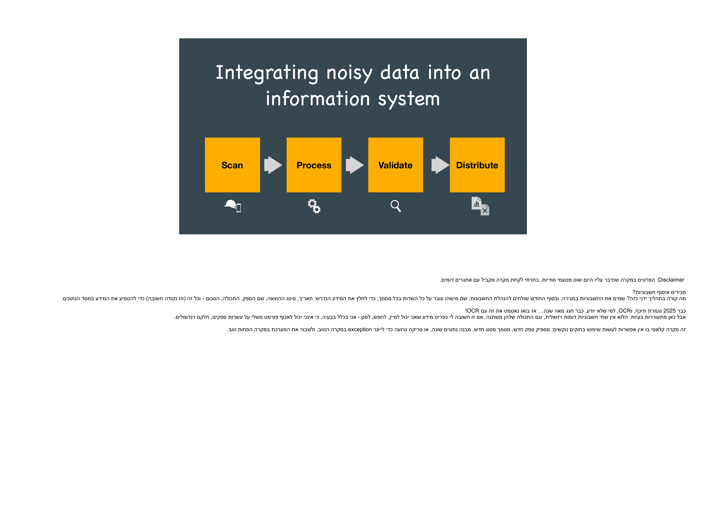

*Figure 11.1 — The intended pipeline: scan physical documents, process them with AI, validate the extracted data, and distribute to downstream systems. Each stage introduced failure modes we did not anticipate.*

### Why AI? First, Ask If You Even Need It

Before reaching for an LLM, we asked: can simpler tools solve this? The answer was instructive:

- **Business-rule heuristics** (if-then-else) work when invoice formats are standardized — but our suppliers used dozens of different layouts, languages, and conventions
- **SQL queries** can validate extracted data against known schemas — but they cannot extract the data in the first place
- **RegEx** can find patterns like dates and part numbers — but not when the OCR output is garbled
- **Classical OCR** can digitize printed text — but chokes on poor scans, handwriting, and mixed layouts

The classic approach fails when: the data is not uniform or "clean," there are too many edge cases to hand-code, and enforcing consistent policies across diverse inputs is impractical. This is the threshold where AI becomes necessary — not because it is fashionable, but because simpler tools cannot bridge the gap between noisy physical-world inputs and structured digital outputs.

### The Naive PoC: GenAI at the Hub

We chose Claude on AWS Bedrock as the LLM backbone — a GenAI-at-the-hub architecture. The naive experiment was straightforward: upload scanned document images, ask the LLM in natural language to extract structured data (supplier, part numbers, quantities, prices), and check accuracy manually.

The results were encouraging *and* alarming:

### The Data Is Noisy — On Both Ends

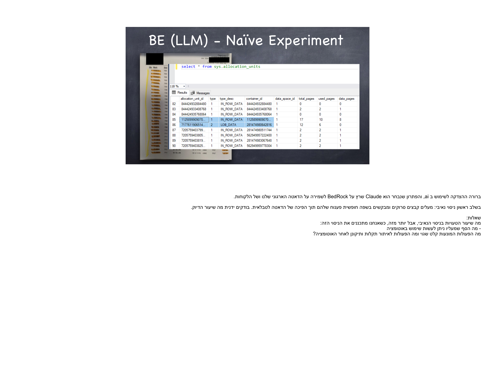

*Figure 11.2 — Front-end reality: poor scan quality, image compression artifacts, and model hallucinations. Characters that look similar become interchangeable — D↔Q, 0↔O↔CI, B↔8↔3 — and the LLM confidently returns the wrong values.*

**Front-end problems (the scan):**
- Mobile phone scans in warehouse conditions: motion blur, poor lighting, folded pages, thumbs obscuring data
- Image compression (WhatsApp-grade quality when workers forward documents) destroys fine detail
- The LLM hallucinated values when the scan was too degraded to read — producing "clean" but wrong data

**Back-end problems (the extraction):**
- Model hallucinations: invoices registered under "Israel Israeli" instead of the actual business name — the LLM filled in plausible-looking garbage when it could not read the field
- Corrupted errors propagating silently: the extracted data looked reasonable but was wrong in ways that would pollute the existing database, break inventory counts, or trigger incorrect payments

### PoC Conclusion: HITL Is Not Optional

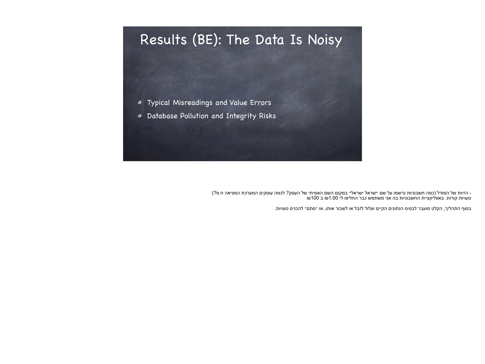

*Figure 11.3 — The PoC "succeeded" in the narrow sense — the LLM could extract data from scans. But the error rate made fully automated processing unacceptable. Human-in-the-Loop (HITL) validation was mandatory for data quality and consistency.*

The PoC revealed a critical gap: the distance between "works in a demo" and "works in production" is not a refinement — it is an architecture change. The PoC needed a pipeline, a validation layer, and a human review step. Without these, the "successful" PoC would have been a database pollution engine.

### Problem #1: Offline Scanning — Connectivity Kills the Workflow

The warehouse environment exposed a connectivity constraint that the lab PoC never encountered. Workers scanning documents at the loading dock had spotty cellular coverage. A cloud-dependent GenAI architecture meant:

- Scans could not be processed until the worker returned to a connectivity zone
- The worker could not verify whether the scan succeeded or needed a re-take
- Confirmation wait times exceeded the operational SLA — the truck driver has other deliveries and cannot wait for a system that might not respond

This is the connectivity constraint from Chapter 8 in action: a GenAI-at-the-hub architecture fails when the edge device (a phone in a warehouse) cannot reliably reach the hub.

### Problem #2: HITL Breaks the SLA

Introducing human validation solved the accuracy problem but created an operational one. A system that requires human review for every document cannot process in real time. HITL creates an inherent queue, and queues create latency:

- If the promise is batch processing (mainframe-era model), no problem — results are processed overnight at 0:01 AM and workers get their corrections in the morning
- But if a shipment needs immediate confirmation, the warehouse worker is stuck waiting for a human validator who might be at lunch, or in a different time zone, or handling a queue of other documents
- And the human validator — a skilled operator — becomes a bottleneck whose cost scales linearly with throughput, destroying the unit economics that justified using AI in the first place

### Solution #1: Pre-Processing at the Edge (ML at the Edge)

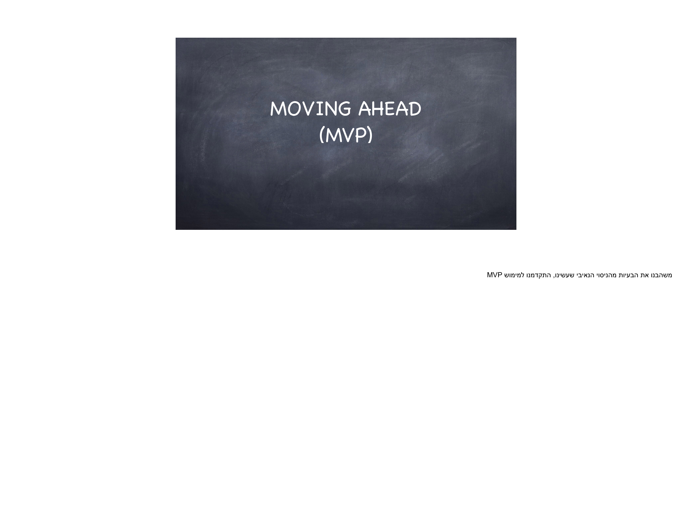

*Figure 11.4 — The revised architecture: on-device OCR runs locally on the phone (no connectivity required), validates that readable text was extracted, and only then uploads for cloud-based LLM processing. The edge handles pre-processing; the hub handles interpretation.*

The first architectural breakthrough was moving pre-processing to the edge — the worker's phone:

- **Apple Vision.framework** (iOS) and **Android ML Kit** provide on-device OCR that runs without network connectivity
- The phone captures the image, runs local OCR, and immediately tells the worker whether the scan produced readable text — if not, re-scan now, while you are still standing in front of the document
- Synchronization happens asynchronously: the phone queues validated scan+text pairs and uploads when connectivity is available
- Error correction runs in batch mode after work hours — the worker's flow is never blocked

This is the deployment matrix in practice: **ML at the edge** (on-device OCR for immediate scan validation) combined with **GenAI at the hub** (cloud LLM for semantic data extraction). Neither alone solves the problem. The edge handles what it can (is this scan readable?), the hub handles what requires more intelligence (what does this invoice actually say?), and the architecture respects the connectivity constraint.

### Solution #2: Post-Processing to Minimize HITL (Domain Knowledge as Validation)

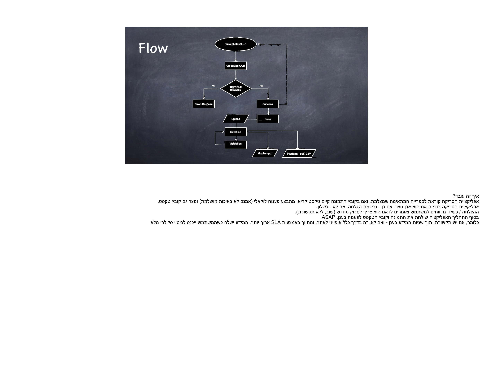

*Figure 11.5 — The post-processing engine: LLM-extracted data is validated against known schemas (BOM lists, supplier databases, expected value ranges) using RegEx and SQL queries. The goal: reach >95% validated data automatically, reducing the human review queue to genuine exceptions.*

The second breakthrough was recognizing that generic LLM output could be validated automatically using domain-specific knowledge the system already possessed:

- The ERP contained a Bill of Materials (BOM) with every valid part number and expected quantities
- For each production run, expected supplier names, price ranges, and item descriptions were known in advance
- RegEx patterns could catch format violations (invalid date formats, impossible quantities, non-numeric price fields)
- SQL queries could cross-reference extracted entities against existing database records

By building a post-processing validation engine that combined LLM extraction with deterministic rule-based validation, we reduced the HITL burden dramatically. The human reviewer only saw documents that the automated pipeline could not validate — genuine edge cases rather than every document.

### MVP Results and Lessons Learned

The MVP deployed with:
- Native iOS/Android apps with on-device scan quality pre-processing
- Post-processing v1 with partial success — the system was noisier than expected, with many items added to shipments with partial or mismatched documentation
- HITL as manual fallback rather than automated queue management — slower, but safe
- Soft launch to select customers to delay scale while the pipeline matured

**Lessons for AI in physical products:**

1. **PoC "success" is misleading.** The PoC proved the LLM could extract data — but the gap to production required an entirely different architecture. PoC success is a necessary but insufficient condition for deployment
2. **LLMs do not come without a price.** Cloud inference costs, hallucination rates, and the operational overhead of validation layers are real costs that the PoC does not reveal
3. **Operational processes must adapt to LLM scenarios.** Existing warehouse workflows assumed deterministic, binary outcomes (scan succeeded or failed). LLM outputs are probabilistic — "probably correct" requires a different operational model than "correct or error"
4. **Batch processing is safer than in-line.** When LLM errors can pollute production databases, decoupling extraction from insertion — with a validation buffer in between — is not a compromise but a requirement
5. **There are opportunities in edge AI and small language models (SLMs).** On-device OCR was the project's most robust component. As SLMs improve, more of the semantic extraction may move to the edge — reducing cloud dependency, latency, and cost

The project validated the deployment matrix framework: ML at the edge for immediate, deterministic tasks (scan quality, OCR); GenAI at the hub for semantic interpretation (data extraction); deterministic rules for post-processing validation; and human intelligence for the residual exceptions that neither ML nor GenAI can handle reliably. Each layer of intelligence was deployed where it could operate within its constraints — and the system worked only because no single layer was asked to do everything.

---

## The Swarm Problem: When Hub-Centric Architectures Hit the Wall

- The deployment matrix above treats each device individually. But real IoT deployments are constellations — hundreds, thousands, or millions of endpoints reporting to a shared control hub. At scale, hub-centric intelligence faces three compounding bottlenecks:

### The Bandwidth Wall
- A single vibration sensor streaming raw data at 10 kHz is manageable. Ten thousand sensors doing the same saturate the uplink — and the problem is multiplicative, not additive, because sensors often report in synchronized bursts (shift changes, environmental events, scheduled polling cycles)
- Smart electricity meters illustrate the scale: Latin America alone is deploying 48.5 million new meters (Chapter 8). If each meter streams raw consumption data to a central hub for ML-based anomaly detection, the aggregated traffic dwarfs the network's capacity. The alternative: run anomaly detection locally and transmit only exceptions
- **The design principle:** Raw data should travel the shortest possible distance. Every byte that can be reduced to a decision at the edge is a byte the network never has to carry

### The Compute Wall
- Hub-side inference scales linearly with the number of endpoints — but hub hardware does not scale linearly with budget. A local gateway rated for 50 devices chokes on 500. A cloud backend rated for 10,000 devices requires a pricing tier that changes the unit economics of every device in the fleet
- The problem is acute for GenAI workloads: a single voice interaction may consume 10–100× the compute of an ML classification. Multiply that by thousands of simultaneous device queries and the cloud inference bill becomes the dominant line item in the P&L — or the system simply queues and latency degrades to the point of uselessness
- **Fleet OTA updates** (Chapter 9) compound the compute wall: pushing a model update to a million devices simultaneously requires not just bandwidth but coordinated rollout logic, rollback capacity, and validation — all hub-side compute that competes with real-time inference

### The Latency Wall
- Centralized control introduces round-trip latency: device → network → hub → inference → network → device. For monitoring dashboards, hundreds of milliseconds are acceptable. For closed-loop control — a robotic arm adjusting grip, an autonomous vehicle braking, an irrigation valve responding to a sudden rainfall — the round trip is too slow
- Swarm coordination amplifies the problem: when devices must react to each other (mesh networks, collaborative robots, distributed sensor arrays), routing every decision through a central hub creates a serial bottleneck. Peer-to-peer edge intelligence — devices sharing local inferences directly — eliminates the hub from the critical path
- **The military analogy:** Command hierarchies that require every tactical decision to route through headquarters lose to distributed forces with local decision authority. The same applies to IoT swarms

### The Architecture Response: Tiered Intelligence
- The answer is not "edge or hub" but a tiered architecture where intelligence is distributed across levels:
  - **Device edge:** Each endpoint runs lightweight ML for local decisions — anomaly detection, threshold classification, sensor fusion. Only exceptions and summaries propagate upward
  - **Local hub / gateway:** Aggregates data from a cluster of devices. Runs fleet-level correlation, model retraining, and GenAI workloads that individual devices cannot support. Reduces cloud dependency
  - **Cloud / central:** Handles cross-site analytics, global model training, long-term storage, and the heaviest GenAI inference. Receives pre-filtered, pre-classified data — not raw streams
- Each tier reduces the load on the tier above it. The device edge is the first and most critical filter. Products that push intelligence to the edge are not just saving bandwidth — they are making the entire architecture viable at scale
- **Strategic implication:** The silicon you choose for the device (Chapter 10: Infineon PSoC Edge, Silicon Labs Series 3) determines how much filtering and inference the edge tier can absorb — and therefore how large a constellation the hub can manage. Under-specifying edge compute does not just degrade the device; it degrades the fleet

---

## The Cost and Risk of Intelligence

- **BOM cost:** NPUs, memory, power budget for on-device inference
- **Recurring cost:** Cloud inference, model updates, data pipelines — but costs are falling fast
- **The cost deflation curve:** LLM inference costs are falling at roughly 10× per year for equivalent performance — what a16z terms "LLMflation." GPT-3-class quality cost $20 per million tokens in late 2022; by 2025, equivalent performance costs $0.06 per million tokens — a 300× reduction in under three years. DeepSeek R1 debuted at $0.55/$2.19 per million tokens, undercutting incumbents by ~90%. For edge deployment, the same inference that costs $0.50 in the cloud runs at ~$0.05 on-device — a 90% reduction enabled by NPU-equipped silicon drawing milliwatts. The implication for product planning: the AI capability that is cost-prohibitive today may be commodity-priced by the time the product ships. BOM and cloud cost analyses conducted at the start of a hardware development cycle may be obsolete by launch — plan for the cost curve, not the current price point
- **Accuracy risk:** False positives in safety-critical applications; hallucinations in GenAI
- **Maintainability:** Model drift, retraining cycles, version management across fleets (OTA updates from Chapter 9)
- **Regulatory timeline — the EU AI Act is here:** The [EU AI Act](https://digital-strategy.ec.europa.eu/en/policies/regulatory-framework-ai) entered into force August 2024. Prohibited AI practices and AI literacy obligations took effect February 2025. Full application of high-risk AI requirements hits August 2026. For AI embedded in regulated physical products — machinery, toys, radio equipment, vehicles, medical devices — the extended deadline is August 2027. Requirements include risk management systems, data governance, technical documentation, transparency, human oversight, and conformity assessment. The November 2025 "Digital Omnibus on AI" allows controlled live trials before full certification but does not soften the compliance deadline. Product teams building AI-enabled hardware today must architect for these requirements now — not after launch
- **The ethical dimension:** When a product makes autonomous decisions, who is accountable? (setup for Chapters 19–21)

---

## Closing: Intelligence as Infrastructure

- AI is not a feature to be "added" — it is an infrastructure layer that determines what the product can perceive, decide, and do
- The right question is not "should we add AI?" but "what problems does our product face that only intelligence can solve, and where in the architecture should that intelligence live?"
- This chapter completes the infrastructure stack: interfaces (Ch 5) → status communication (Ch 6) → power and energy (Ch 7) → connectivity (Ch 8) → firmware updates (Ch 9) → sensing (Ch 10) → intelligence (Ch 11). Together they define the product's capacity to evolve

---

## Draft Content Below — Editorial Note

> **Status:** The prose sections below are an earlier draft that maps to the polished outline above. Content has been substantially incorporated into the outline's structure: Monitoring examples → "What ML Solves"; Control examples → "ML for Control"; GenAI stubs → "What GenAI Promises / Cautionary Tales." This draft material is retained for reference during final chapter assembly — sections marked `<TBD>` or `<To be continued>` require new prose, and the remaining draft text should be reviewed for any details not yet captured in the outline above before being retired.

*Draft mapping: Monitoring examples → "What ML Solves"; Control examples → "ML for Control"; GenAI stubs → "What GenAI Promises / Cautionary Tales".*

### Chapter 21 - Smarting Up with AI

#### Simple Days of Yore

Why would we even want our devices to incorporate AI? Is it truly adding value, or is it just the latest *cri du jour* – a fashionable technology that manufacturers feel compelled to slap on the brochure so they can look 'cutting-edge'?

Let's start with **the need**.

We previously discussed analog hardware, a reminder of a simpler, more innocent world. Take a simple water tap. You turn it, water flows (if the pipe is full), you turn it back, water stops flowing. Immediate utility, immediate feedback.

**Figure 11.6 — Water faucet.** *Photo by Alireza Irajinia on Unsplash.* https://unsplash.com/photos/jGdTiWw77Hw

This simplicity is now only a fond memory in an optimization-crazed world, where manufacturers and customers alike try to squeeze every drop of utility from strained resources:

What if the faucet leaks? What if the pipe was originally dry when we opened it, only to find the faucet now spilling? What if the spout connects to a conduit, leaving us unsure whether water flows at all? And what if the water is too hot, too cold, or – heaven forbid – frozen solid, bursting the pipe?

We wouldn’t know, would we? That is why we need sensors and actuators: a command-and-control system. Perhaps unnecessary for a single tap, but indispensable when managing an entire network.

#### Opportunities for Smarting Up

Beyond single devices, the real challenge lies in orchestrating vast constellations of sensors, actuators, and connected assets. As systems scale, the demand grows for **smarter command-and-control (C2) solutions** that can collect information, take action, coordinate across networks, and operate reliably in diverse contexts. These needs span across four broad domains:

------

##### I. Sensing and Data Collection

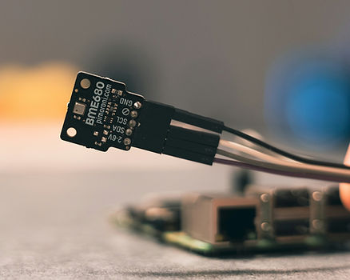

**Figure 11.7 — Close-up of electronic sensor.** Photo by Denis N., retrieved from [Unsplash](https://unsplash.com/photos/a-close-up-of-a-piece-of-electronic-equipment-zjCc0l9l1cI).

Devices focused on observing, measuring, and reporting.

Sensor networks – cameras, microphones, thermometers, barometers, hygrometers, voltmeters, ammeters, etc.

Asset tracking – location and status sensors embedded in goods or vehicles, or else mounted on humans.

Key value: Turning the physical world into data streams.

 

------

##### II. Actuation 

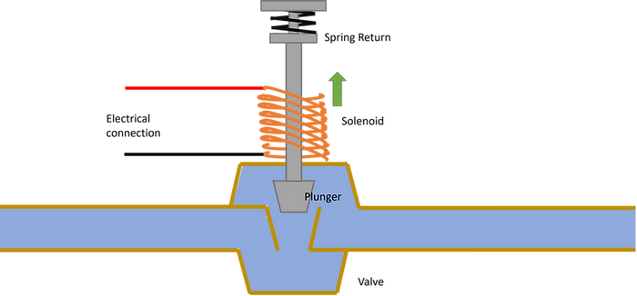

**Figure 11.8 — Open solenoid valve diagram.** Joey Corbett, CC BY-SA 3.0, via [Wikimedia Commons](https://commons.wikimedia.org/wiki/File:Solenoid_Valve_Open.png).

Devices that take action in the physical world.

Actuator networks – motors, relays, valves, robotic arms, etc.

Key value: Closing the loop between sensing and doing.

 

------

##### III. Operation and Oversight Models

**Figure 11.9 — Data stream monitoring.** Photo by [Chris Liverani](https://unsplash.com/@chrisliverani?utm_content=creditCopyText&utm_medium=referral&utm_source=unsplash) on [Unsplash](https://unsplash.com/photos/turned-on-flat-screen-monitor-dBI_My696Rk?utm_content=creditCopyText&utm_medium=referral&utm_source=unsplash)

How systems manage workload, intervention, and resilience.

Unattended / automatic solutions – continuous operation with varying degree or no manual supervision.

Event-driven monitoring and escalation control systems – filter noise, handle routine cases, and escalate only anomalies.

Remote management – command, configure, and update from afar (e.g., OTA updates, diagnostics).

Key value: Efficiency, reliability, and minimizing human burden.

 

------

##### IV. Architecture and Deployment Contexts

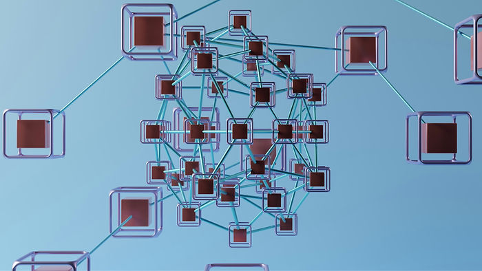

**Figure 11.10 — Complex networks.** Photo by [GuerrillaBuzz](https://unsplash.com/@guerrillabuzz?utm_content=creditCopyText&utm_medium=referral&utm_source=unsplash) on [Unsplash](https://unsplash.com/photos/diagram-7hA2wqBcSF8?utm_content=creditCopyText&utm_medium=referral&utm_source=unsplash)

Control systems managing complex device topologies and diverse operating contexts.

Organizing sensing and actuation through distributed networks tied to a central processing, balancing local autonomy with centralized coordination.

Enabling smart functionality in dynamic environments such as vehicles, wearables, and field-deployed devices.

Key value: Making distributed systems coherent, dependable, and effective across both fixed and mobile contexts.

 

------

#### Acute Pain

##### The Overload of Command & Control

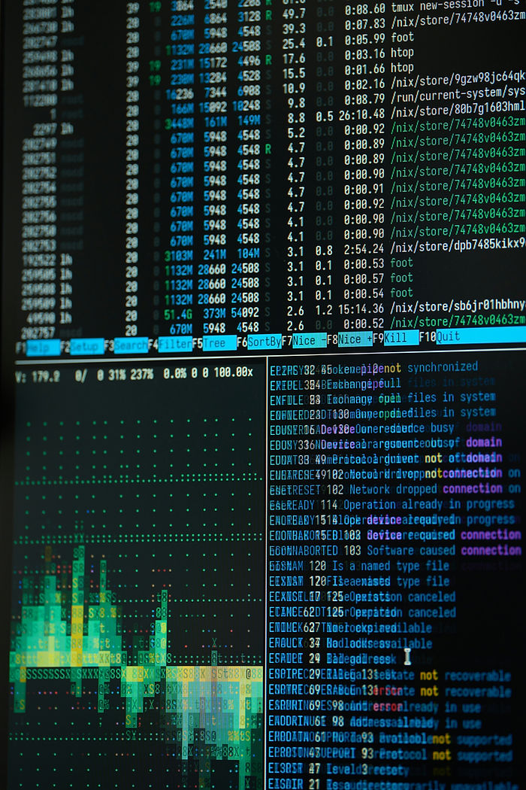

**Figure 11.11 — Control center data overload**

The need for coordination and control of complex systems is not new. With expansion of digital technology and data communication, and the rise of sprawling device networks, it has become far more acute.

As device networks grow and data volumes surge, traditional C2 centers and their operators are overwhelmed by false positives while remaining blind to false negatives. The very rationale for building and staffing C2 begins to collapse, both economically and operationally.

I witnessed an always-on CRT display monitoring a complex network with a flood of events – admittedly, mostly spurious ones – some details were etched into the phosphorous layer, as no one, ever, bothered to clear those events. It has become a useless piece of equipment. That network, let me tell you, was NOT monitored.

------

##### Endpoint maintenance

**Figure 11.12 — Firmware update.** Photo by [ANOOF C](https://unsplash.com/@anoofc?utm_content=creditCopyText&utm_medium=referral&utm_source=unsplash) on [Unsplash](https://unsplash.com/photos/code-written-on-a-screen-likely-programming-related-3v1CT8JoKOE?utm_content=creditCopyText&utm_medium=referral&utm_source=unsplash)

Meanwhile, maintenance of software embedded device  becomes a major operational headache. Cases like Toyota Prius ABS firmware bug (2010–2011) affected 400,000 cars worldwide, and [cost US$2billion ](https://www.rte.ie/news/business/2010/0204/127189-toyota-business/)part of the exorbitant cost stems from the need to physically recall the faulty cars to the service centers for firmware update.

In aother event I witnessed, sending a field engineer to Minnesota, having them climb a 30 ft pole to upgrade a firmware bugfix, was a $5,000 a pop – loosing money on this site installation.

 

------

##### Autonomy

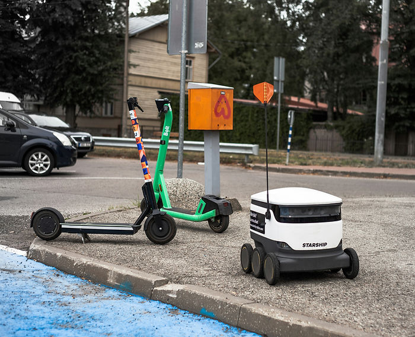

**Figure 11.13 — A roving robot.** Image by Silver Ringvee, Unsplash

Another compelling use case is the potential in autonomous systems operating in the messy, random, real world – whether it is in semi controlled environemnts, such as warehouse and railway tracks, or in the wild, aka on public highways, with humans erring next to robots.

---

 

##### Ai To The Rescue

Once we understand the need, it is obvious why the idea of sentient systems that would step in to help operate complex systes in harsh conditions (data noisy, or operational complexity). 

It has two escalating phases to it:

------

##### a. Monitoring - Discerning Signal From Noise

In this category, the value ML (Machine Learning, as it was once called, before the Ai hype) brings is helping human users of a system sift through the barrage of information streams, discerning the signal from the noise.

This is not completely new. **Business-Rule Heuristics** formalized as if–then–else are at the core of enterprise computing. **Bayesian Filtering** (probabilistic estimation over time) are common in systems such as navigation, robotics, and signal processing, where hidden states must be inferred from noisy, continuous data streams.

Crucially, the gap ML/Ai solves lies past an uncertainty threshold is crossed:

1. **Business rules** excel when the world is well-structured and discrete: if–then–else logic applies crisp cutoffs (compliance, eligibility, transaction approval). They are transparent and easy to audit. Clear as they might be, though, they are 'brittle' in noisy environments. **Business rule Heuristics fail when reality is noisy, ambiguous, or adversarially exploited.** In contrast, ML/Ai is fault tolerant by design 

   

###### **Example: Device Access – Code Matching vs. Visual Identification**

**Figure 11.14 — Biometric face recognition.** AI-generated image created using Wix media tools

- **Rule**: *“If entered PIN = stored PIN, then unlock phone.”*
- **Limit**: PINs can be guessed, shoulder-surfed, or brute-forced. The rule is rigid and binary: correct or incorrect, with no awareness of spoofing.
- **Failure**: Security is fragile – a stolen phone with the right PIN becomes fully compromised.
- **AI Edge**: Apple’s **Face ID** replaces rule-based access with **probabilistic facial recognition**. The system fuses depth sensors, infrared imaging, and adaptive ML models. It tolerates natural variations (beard growth, glasses, lighting) while rejecting impostors, continuously learning the owner’s appearance over time.

 

1. **Bayesian filtering** steps in when the system is known but noisy: it refines estimates over time by fusing models with imperfect measurements (navigation, robotics, sensor fusion). It models well-understood underlying dynamics, and analyzes incoming data flows to determine signals nad patterns from noisy fluctuations.

 

**Example: Geolocation Tracking (Navigation & Mobility)**

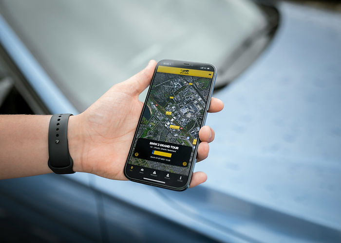

**Figure 11.15 — Geo location tracking.** Photo by [Maxim Hopman](https://unsplash.com/@nampoh?utm_content=creditCopyText&utm_medium=referral&utm_source=unsplash) on [Unsplash](https://unsplash.com/photos/person-holding-black-samsung-android-smartphone--16na5rDDRk?utm_content=creditCopyText&utm_medium=referral&utm_source=unsplash)

- **Rule (Bayesian filtering based)**: *Fuse GPS data with inertial sensors (accelerometer, gyroscope) using a Kalman filter to smooth noise to estimate position.*
- **Limit**: While this works well enough in open environments with predictable errors, it is prone to GPS multi-path errors rife in urban canyons, drop offs indoors, or in tunnels, or spoofing. The filter assumes the dynamics are known (e.g., steady walking or driving speed) and keeps updating – but without reliable inputs, it drifts, producing a “clean” but increasingly wrong estimate.
- **Failure**: The navigation system shows the user moving smoothly… through buildings, across rivers, or hundreds of meters off-route. Filtering smoothes out noisy signals, but does not improve accuracy.
- **AI Edge**: ML-based location inference goes beyond. It leverages **contextual signals**: Wi-Fi access points, Bluetooth beacons, cell tower handoffs, compass readings, map constraints (roads, buildings), and even motion patterns learned from population data. By fusing these heterogeneous inputs, the AI models can detect and correct anomalies (e.g., GPS jumping across the street) and maintain accurate positioning in places where physics-based baesian filtering alone fails.

 

###### **Example: Predictive Maintenance – Hardware Anomaly Detection**

**Figure 11.16 — Predictive maintenance is better.** Photo by [Salvatore Tonnara](https://unsplash.com/@salvatoretonnara?utm_content=creditCopyText&utm_medium=referral&utm_source=unsplash) on [Unsplash](https://unsplash.com/photos/a-man-working-on-an-engine-in-a-garage-r199doRc-4g?utm_content=creditCopyText&utm_medium=referral&utm_source=unsplash)

- **Rule (Bayesian filtering based)**: *Fuse vibration, temperature sensor data over time with a Kalman filter to smooth noise and estimate the machine’s health state.*
- **Limit**: Bayesian filters can denoise signals and estimate trends, but they assume the underlying dynamics are known and relatively stable. In reality, machines vibrate or heat up for many benign reasons – load changes, temporary imbalance, external forces – which are not true precursors to failure, and may produce false positives.
- **Failure**: Operators receive “clean” vibration estimates, but still face false alarms or missed early warnings. They either overreact (costly downtime) or underreact (missed failures).
- **AI Edge**: ML-based predictive maintenance moves beyond smoothing. It ingests multi-sensor streams (vibration patterns, acoustics, motor current, temperature) and **learns correlations from historical failure data**. Over time, the model distinguishes meaningful precursors from normal operating variability. This enables early, probabilistic alerts – predicting faults well before rigid thresholds or Bayesian filters would have flagged them.

------

##### Example: Smartwatch Health Monitoring**

- **Rule (Bayesian filtering equivalent)**: *Fuse body temperature readings with accelerometer data to filter noise and produce a stable estimate of “true” temperature.*

- **Limit**: This filtering helps distinguish between a real fever and momentary fluctuations (like motion artifacts), but it still assumes fever is the primary signal of illness. Many conditions do not present with elevated temperature, or the fever appears late. A Bayesian filter produces a clean, reliable temperature estimate — but misses the bigger picture of multi-signal health dynamics.

- **Failure**: Users get a “smoothed” but narrow view of their condition. The watch reassures them when no fever is detected, even though other signs (oxygen drop, HRV changes) indicate trouble. Or it falsely alarms when temperature rises from exercise, not illness.

- **AI Edge**: ML-enabled data fusion leverages multiple biosignals — HRV, SpO₂, skin temperature trends, sleep quality, and activity context. Instead of assuming fixed dynamics, the model **learns complex, nonlinear patterns across populations** and **personalizes baselines for each wearer**. By weighing signals probabilistically, it detects subtle deviations indicating infection or stress earlier and more reliably than temperature-based filtering ever could.

  

------

####  b. Control – Autonomy and Unattended Automation

Letting AI-assisted systems automatically control equipment is more complex. Unlike the previous mode – monitoring, where humans interpret and act – the “hands-free” promise can easily backfire.

From the unthinking rigidity of automated factory lines, satirized by Charlie Chaplin in Modern Times (1936), to today’s algorithmic “hallucinations” born of statistical misinterpretation or blind trust in flawed sensors, autonomy introduces new kinds of failure alongside efficiency.

There are, however, low-hanging opportunities where the potential risks are minimal and the gains tangible.

**Example: Smart Thermostat**

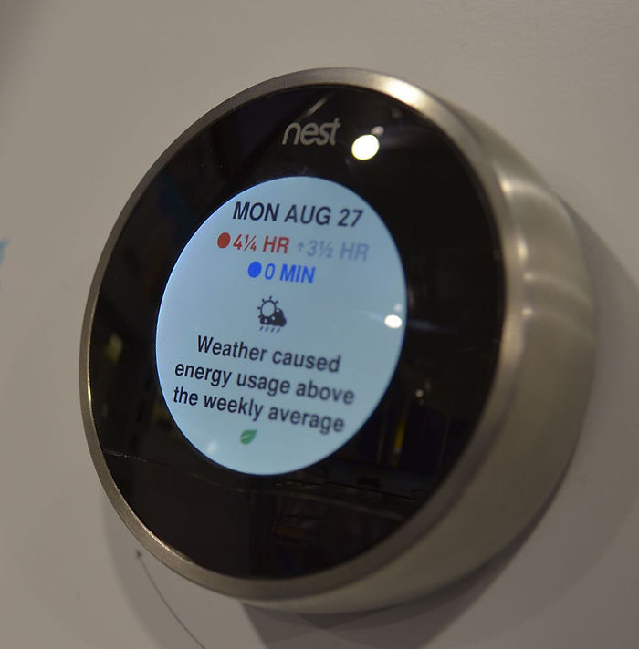

**Figure 11.17 — Nest Learning Thermostat displaying temperature setting.** Image by Raysonho @ Open Grid Scheduler / Grid Engine, CC0 1.0, via [Wikimedia Commons](https://commons.wikimedia.org/wiki/File:Nest_Learning_Thermostat_(cropped).JPG).

- **Rule (PID / Bayesian-Based Control Equivalent):** Maintain target temperature by adjusting HVAC output based on measured deviation, using smoothing filters (like Kalman/Bayesian) to stabilize noisy sensor data
- **Limit:** Produces steady thermal control but assumes predictable conditions and fixed schedules. Ignores occupancy, weather shifts, and personal comfort dynamics.
- **Failure:** Wastes energy by heating or cooling empty rooms and reacts too late to changes. Offers comfort stability but not situational intelligence.
- **AI Edge:** Learning Thermostats apply ML to learn user habits, occupancy patterns, and home thermal response. It anticipates needs, optimizes setpoints proactively, and continuously adapts through cloud-fed predictive models – turning static control into dynamic, context-aware comfort management.

 

------

##### **Example: Smart Irrigation**

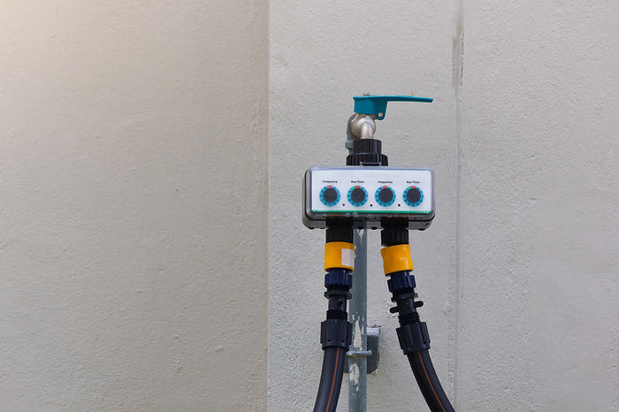

**Figure 11.18 — Smart irrigation sprinkler controller.** Photo: Shutterstock

- **Method**: Farmers irrigate according to fixed rules (e.g. “*every day at 6 AM for 30 minutes*”). They may also rely on local wisdom or past experience.
- **Limit**: 
  - Ignores soil moisture dynamics, salinity, root-zone variability
  - Doesn’t adjust for real-time weather, rainfall, or plant growth stage
  - Leads to overwatering (waste) or underwatering (stress)
  - Inefficient electricity usage and labor overhead
- **Gap**: The rigid, one-size-fits-all irrigation plan cannot adapt to site-specific soil & crop conditions. Without real-time feedback, resource use is suboptimal and crop performance suffers.
- **AI Edge**: Advanced smart irrigation platforms combine **data fusion** (merging soil moisture, temperature, salinity, rainfall, pressure, and flow data with weather forecasts) with **pattern recognition** to detect evolving crop and soil conditions. Through **continuous autonomous monitoring**, the system dynamically adapts irrigation schedules, optimizing water and energy use while ensuring healthier plant growth and more sustainable farming practices.

---

**References & Sources**
All references for this chapter — with live links and archived snapshots — are available at the companion site.

[View Chapter 11 References →](https://yoelf22.github.io/manuscript/references/ch11.html)

