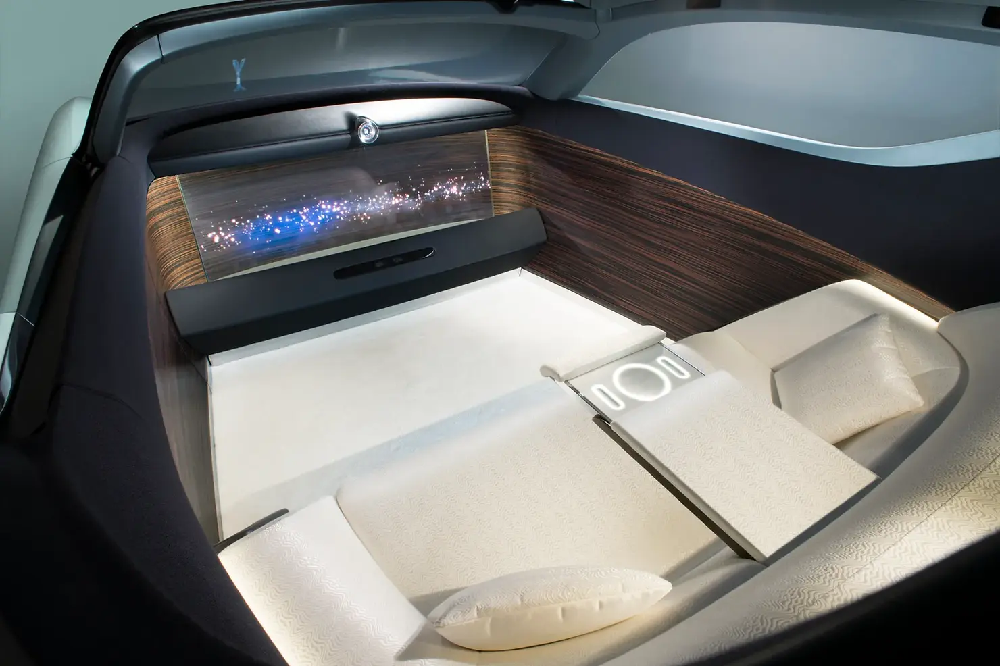
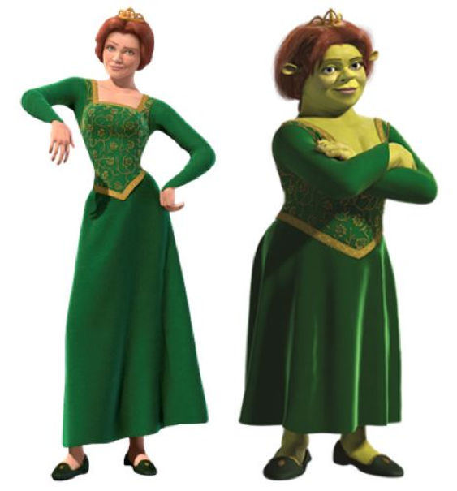
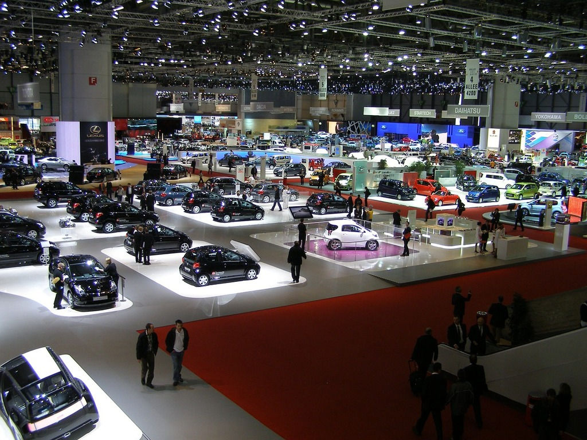
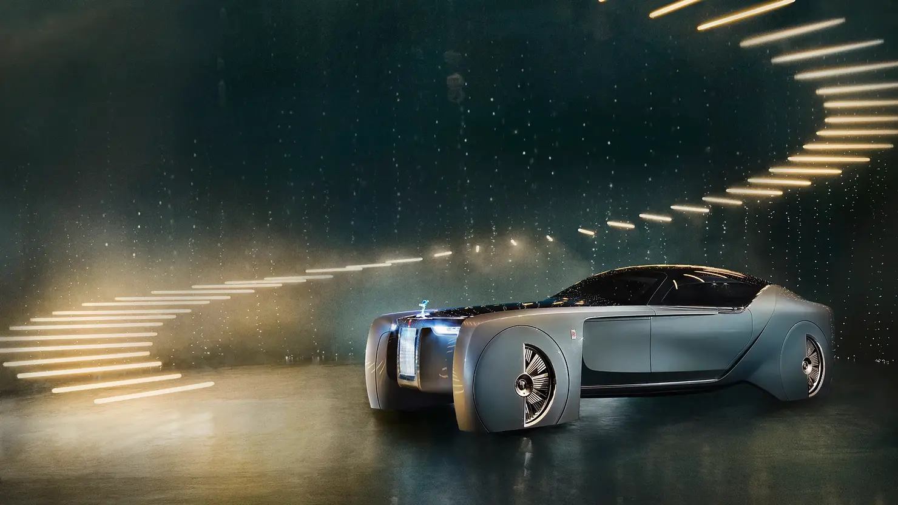
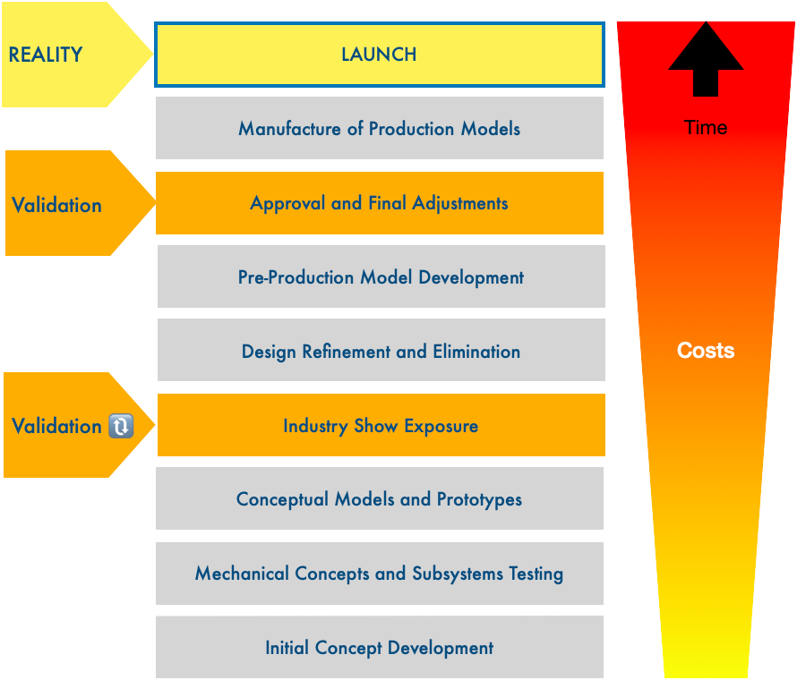
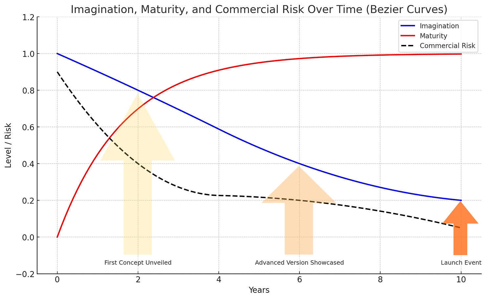
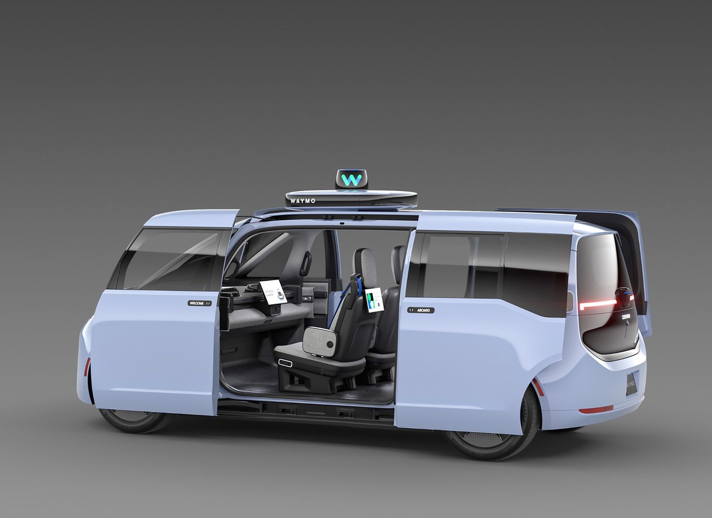

### Chapter 12

###  - Taming Concepts

The Fiona Effect: As products progress towards production, the balance between imagination and maturity shifts.

---

#### The "Fiona effect" in (physical) product validation

_Concept cars evolve from fantastical to realistic during the validation process. Manufacturers use these evolving designs to test market acceptance and refine features, balancing imagination with practicality and risk. Autonomous vehicle concepts illustrates this process, with technology and user needs shaping the final product._

**Figure 12.1 — Rolls Royce 103EX concept driverless car - revolutionary interiors**

---

#### Shrek: The Movie

Remember Princess Fiona, the female protagonist, who were cursed by a witch, and while she continued to be a beautiful lady during the days, transformed into an ogre by night?

**Figure 12.2 — Fiona charm removed: Be careful what you wish for**

The bitter sweet ending of this film removes the curse of her, but the end result is that she finds peace as the ogre bride of Shrek. Tears and joy!

Now how this "Fiona Effect" translates into the product world?....

---

#### Motor shows and the fantasy concept car

Beside being major industry events, auto-motor shows are a rite of passage for usually young, male, motor-heads and would-be product designers, who wander the isles of these consumer heavens with awe widened eyes, drooling on fantasies they would probably never put their hands on.

**Figure 12.3 — Motor show**

The technology industry has similar expos, meticulously orchestrated to spur demand, not only for the current fiscal year, but for the upcoming generations of products as well.

This is where manufacturers test acceptance for their wildest ideas and for their progressively maturing concepts. In the case of auto-motor shows, of the ultimate consumer product - the car.

The farther away the future a concept model describes, the bolder it is:

**Figure 12.4 — The Rolls no one will presumably ever drive**

---

#### Validated ideation and the development cycle

Consider the development cycle of a passenger car. While the time it takes shrank since the 1980's from 8.6 to "just" [<u>6.7 years</u>](https://www.cargroup.org/automotive-product-development-cycles-and-the-need-for-balance-with-the-regulatory-environment/) ", costs continue to be excruciatingly high. [<u>Development budgets</u>](https://www.autoblog.com/2010/07/27/why-does-it-cost-so-much-for-automakers-to-develop-new-models/) vary from $1billion and $6 billion US, depending on whether it's built on an all-new platform with new engine and transmission systems, or not.

It is easy to see how high the stakes at hand are. I have referred extensively to the cost of failures in the [<u>second chapter</u>](https://www.theroadtlv.com/post/product-management-for-the-physical-world-part-ii) of this series to discuss these ramifications.

The trouble is manufacturers cannot know before hand what would the world look like 7-8 years in the future, and to what extent would decisions made early in the design process prove successful at launch, billions of dollars sunk into the process.

That is why you see all these eye popping concept cars and flying soccers, so to speak, in industry shows. Part of the design is indeed meant to attract media and enthusiasts attention, but another part is dedicated to testing the acceptance of feature sets - progressively approaching reality (and some would say dithering) as the launch date comes near, and the final bets are placed.

**Figure 12.5 — From ideation to launch - intermediate validation**

---

#### Fantasy and Reality during the Validation cycle

Going to these shows, one can see that as concept cars progress towards production, the balance between imagination and maturity shifts, while the commercial risk level decreases.

**Figure 12.6 — Imagination, maturity, and risk on the validation cycle**

Initially, concept cars are embodiments of pure creativity and futuristic thinking, showcasing bold designs, innovative technologies, and radical ideas.

However, as a concept car moves closer to production, practical considerations such as safety standards, manufacturing feasibility, cost-effectiveness, and market demand shape its evolution. This process may lead to the dilution of the original concept's most ambitious elements to meet these real-world constraints, resulting in a production model that retains the essence of the concept but in a more refined and practical form.

---

#### The Driverless car: A case at hand

**Figure 12.7 — Rolls Royce 103EX: Will this version of the future ever materialize?**

I will not dive too deep into the autonomous vehicle debate in this post. Suffice to say that the technology is a few years ahead, and naysayers would argue that it shall always remain that way.

It is neither clear what underlying technologies would enable this radical change of the passenger car, from a driven vehicle to an autonomous cocoon.

Would these technologies include Lidar? Hyper spectral cameras? High density mapping? Continuous connectivity? Would a bypass option be mandatory?

The concept above entertains the possibility of complete, permanent, hands off travel experience, with your chauffeur poignantly missing (maybe they're on the roof stand, whipping the horses, and we're back at the 19th century.

Will the next two version of this luxury car manufacturer be that autonomous? I seriously doubt it. After all to most Rolls Royce customers, the driver is a mandatory feature, and anyway, who'd open and close the doors for you?

What we do learn from this design exercise, for this is what concept cars are, is how different elements combine to embody a certain vision. The vision will necessarily change over time. A more realistic understanding of the possible use cases for autonomous vehicles will emerge as manufacturers and regulators make necessary concessions, and marketers identify segments where this concept serves best.

**Figure 12.8 — Waymo - Zeeker: Look Ma, no hands!**

What a drab, or rather, a sobering vision...

True: No driver in this Waymo / Zeeker Rider-first autonomous vehicle platform. But forget of the country roving luxury car for now...

---

#### Lessons learned

*The autonomous vehicle is a hard nut to crack: A combination of user needs, economic realities, regulatory constraints, technology hurdles will allow for initial business cases to test, and if they succeed, the envelope will gradually push the envelope.*	

---

**References & Sources**
All references for this chapter — with live links and archived snapshots — are available at the companion site.

[View Chapter 12 References →](https://yoelf22.github.io/manuscript/references/ch12.html)

