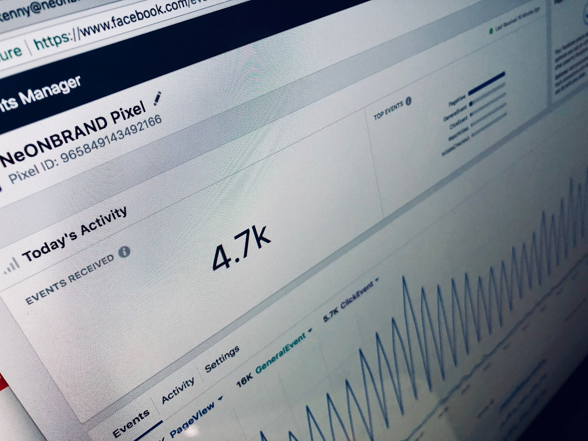
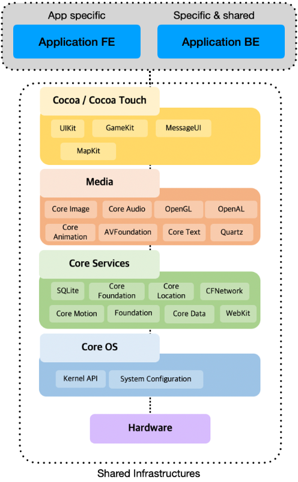
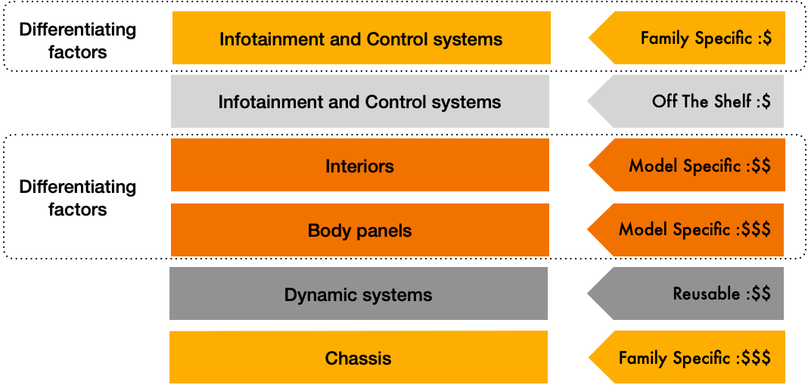
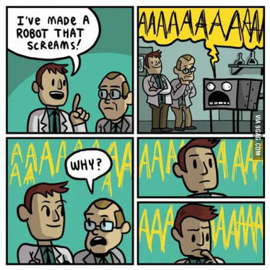
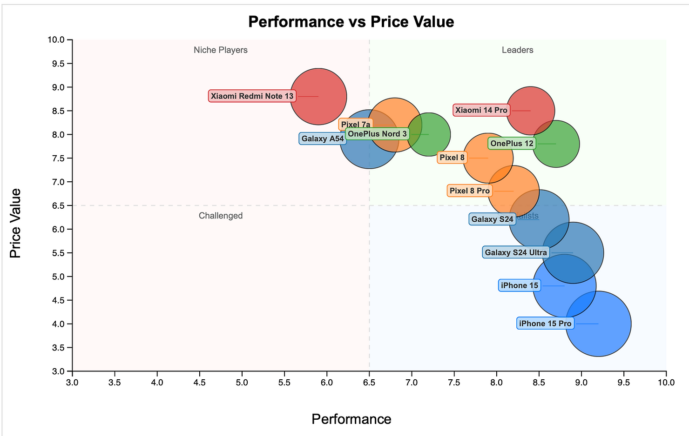
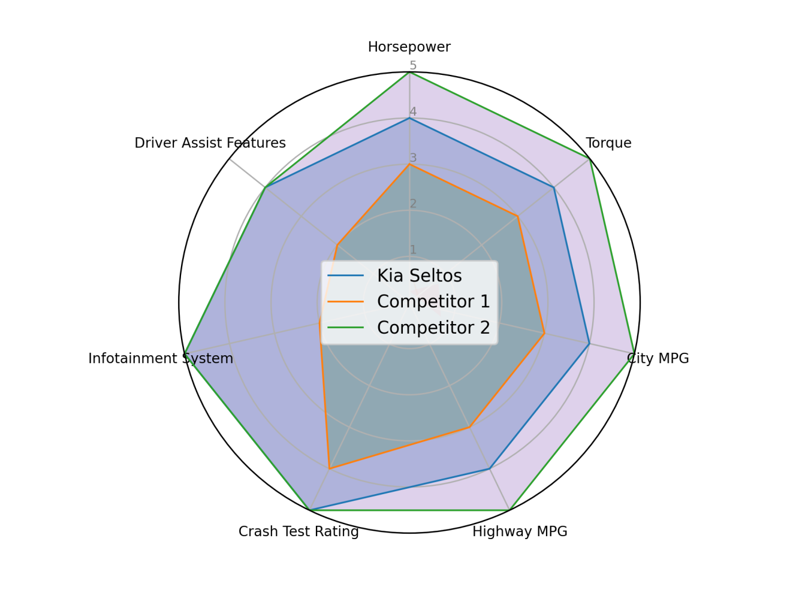

### Chapter 13 - Beyond Mockups: The Art and Science of Hardware Validation

_Physical product validation is crucial due to the high costs and inflexibility of hardware development. Market need and positioning analysis are essential, followed by feature validation through mockups, prototypes, and user testing. This process helps identify and prioritize features, ensuring the product meets user needs and aligns with market demands._

**Figure 13.1 — Analytic dashboard showing events of interest**

---

#### Physical product validation MVP Challenge

An MVP, or a Minimally Viable Product, is a development stage used to create a new product with enough features to attract early adopter customers and validate an idea early in the development cycle.

While software products are easily amenable to this strategy, in part for their modularity and the vast underlying infrastructure in place.

Consider a mobile application, or a web app. Most of what's going on are infrastructures that cater to ALL apps, and are reused innumerable times.

**Figure 13.2 — Software development - Standing on the shoulders of giants**

Note how shared web infrastructures, cloud included, are built to serve billions of users (beside your own app users).

It is fair to say app developers stand on the shoulders of giants, and as a result, the pace and scale of innovation they can bring is without match, notably because the infrastructure is built to support multiple tech-stacks and business cases, so that, should you pivot, you are not to loose a lot of the things that make your product tick.

---

**That is not the case with physical products.**

The challenge with meaningful MVP creation in hardware products is that, from a functional point of view, they are often <u>integrated monoliths</u>.

By this, I refer to the need to recreate almost every part of critical functional layers, with limited potential for component reuse.

Consider the main subsystems for a typical passenger car. These subsystems are characterized by different availability and development costs.

Notice that with the exemption of infotainment and control systems, the most differentiating factors are also the most expensive parts of any car development.

**Figure 13.3 — Car Subsystems: Specificity, Cost, Value**

The lead time and cost of recreation of manufacturing infrastructures and replenish critical inventories for these systems are much too prohibitive, and in fact are equivalent to the launch of a new model altogether.

Passenger cars are at the extreme of this continuum, but in general, physical product face similar rigidity in their development process, meaning that unless they operate within an extremely cash rich environment, physical product innovators have one bullet in their proverbial pistol.

This makes the challenge of early validation even more acute:

-   How can you experiment?

-   Can you bring your product in the hands of users, before all costs are sunk?

---

#### Problem Validation

> _"Fall in love with the problem, not the solution" (Uri Levine)_

This quotation addresses one of the most common fallacies within early stage product companies: Talented and motivated teams could and frequently would fall into the building stage fast. This is a symptom of a problem known as "a solution in search of a problem".

**Figure 13.4 — A screaming robot. Sure you don't need one?** Source: *Green, K. (2013, January 9).* *On Fire* *[Comic strip]. Gunshow.* https://gunshowcomic.com/513

But whereas pivoting software products might still be possible (at cost), steering massive manufacturing infrastructures efforts oftentimes proves impossible. Usually there is not enough time, and not enough money to change course.

Validation, therefore, is key to success. But how does one do that?

---

#### Market need and Positioning

First comes a sound understanding of market dynamics (size, trends, and gaps), the competitive landscape, and customer needs.

From there, analyzing competitors’ features, language, and messaging allows us to build **positioning maps** – visualizing the “lines of battle” along which brands compete for space in customers’ minds. These dimensions form the axes for plotting different brands.

With established categories, this can be enriched with perception surveys: first asking a broad sample of customers which factors matter most to them (a qualitative research), then prioritizing these and having respondents rate brands along the selected attributes (a quantitative research). 

The aim is to capture perceptions – how customers *experience* and *rank* these qualities – rather than technical specifications, since positioning maps reflect the market’s mental landscape, not the manufacturer’s.

---

Consider as an example the following (hypothetical) perceptual map for the smartphone market, which is centered in this case around "feature - like" qualities: the available **range** of models, and the perceived **level of technology** integrated into the brand's product.

**Figure 13.5 — Feature based perceptual map for smartphones** - [Interactive feature](https://yoelf22.github.io/positioning-map/perceptual_mapping_dashboard.html)

Were you a product manager for Pixel 7a in this example, you should be worried about the perception of your brand within the surveilled audience. There is a gap between the group of leaders and the rest - and your product is lagging.

If I were a product manager with Pixel 8Pro, I'd be thinking really hard how to build up performance and camera quality, to move further up the leaderboard.

Such perceptual maps help us understand our place (for existing brands), or where do we want to be, when planning new products. They show us what are the needs important to users and customers within the market segments we're after, therefore enabling us to design features tailored to better cater to them.

---

#### Feature scoping by competitive analysis

Consider the following competitive feature review by [<u>Insight Quantum</u>](https://www.linkedin.com/pulse/mastering-market-step-by-step-guide-crafting-comprehensive-wgfbc/), listing key features and their relative scores

| Car Model    | Horsepower (out of 5) | Torque (out of 5) | City MPG (out of 5) | Highway MPG (out of 5) | Crash Test Rating (out of 5) | Infotainment System (out of 5) | Driver Assist Features (out of 5) |
| ------------ | --------------------- | ----------------- | ------------------- | ---------------------- | ---------------------------- | ------------------------------ | --------------------------------- |
| Kia Seltos   | 4                     | 4                 | 4                   | 4                      | 5                            | 5                              | 4                                 |
| Competitor 1 | 3                     | 3                 | 3                   | 3                      | 4                            | 2                              | 2                                 |
| Competitor 2 | 5                     | 5                 | 5                   | 5                      | 5                            | 5                              | 4                                 |

Table 1: Competitive feature review (Insight Quantum)

The table can be translated into a spider graph:  

**Figure 13.6 — Kia Seltos competitive analysis spider graph.** Source: Insight Quantum

When **building** a product, in contrast to **marketing** it, such competitive analysis is used to identify the areas where we want to shine, so that we can create our positioning statement and value proposition: In this example, a humorous one could be: "Crash safely with the music blasting on" – positioning Kia Seltos as the safest car with the best infotainment system.

---

#### Feature validation

The crucial part of the validation process are the insights we gained:

-   First we identify and prioritize the features according to our positioning

    -   These feature may be contradictory (such as performance vs. fuel efficiency)
-   We then stack the differentiating features on top of the conventional, foundational ones
-   Now we find a way to present these features to users, and have them experience them to the best of our ability.

    -   For instance, when we market automobiles, we can only inform consumers of our model's average fuel consumption, one tested in controlled environment to an industry agreed benchmark. This is only an indicative measure of economy, as no two drivers, trips, or load are the same, and the same goes for the actual fuel consumption consumers will experience eventually.

    -   In another context, when marketing future versions of complex products, we use **mockups** for the look and feel, well before starting production, and thus gage the audience's response prior to the large investments we are about to plough into the project.

CAF (Construcciones y Auxiliar de Ferrocarriles) is a spanish company which manufactures railway vehicles and equipment and buses.

Catering to the public transportation sector, their process includes bidding for open or close tenders, in which they present mockups showing their vision for the design and usability of the railroad car - ticking the boxes for the particular demands of the tender at hand.

**Figure 13.7 — CAF mockup for a railroad car - NS sprinter**

In this mockup for the [<u>NS sprinter</u>](https://www.facebook.com/reizigersov/posts/1079652722052431) series, for Dutch operator Nederlandse Spoorwegen, CAF shows the bodywork, as well as interiors, including electric sockets for passengers' devices, separate trash bins and toilets.

They have focus groups (including target users and customer representatives) experience this solution first hand, gage their responses, and draw necessary conclusions translated into design modifications

It is no small feat, either. Building a similar mockup can take nearly a year and cost up to a million euros. But once the green light is given, the manufacturer can confidently proceed with their multi-billion-euro project, which includes:

- Investments in manufacturing equipment

- Tooling

- Logistics (inventory provisioning for components and raw materials)

  ---

  

#### Limitations of user feedback

Of course, not every feature can be validated through mockups or public trials. To most users, the technicalities of drivetrains, energy consumption, or HVAC systems are little more than “tech babble.” Testing these in public would be nearly impossible, since most trial-and-error takes place in labs or on the factory floor, far from user experience.

Instead, these aspects are validated through proof-of-concepts carried out by the vendor under the oversight of the tender issuer, and are later bolstered through **technical specifications and performance guarantees** contractually committed, often as part of multi-decade operation agreements.

Together, these approaches highlight the dual nature of validation: user-facing features of look and feel are tested and refined through direct experience, while technical features are validated through experimentation, industry standards, and contractual commitments. Both dimensions are essential to building trust in complex products.

---

#### Validation as a Journey

Validation is never complete until users themselves perceive the value. Structured proxy methods – surveys, mockups, contractual guarantees – do provide a limited upfront confidence. Ultimately, the market decides in a moment: when a customer first touches, sees, or tries the product. The next chapters explore these decisive arenas of experiential validation, from the theater of public demos and unboxing to the disruptive force of killer features.