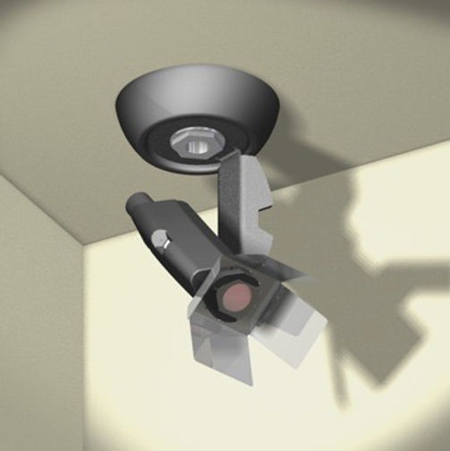
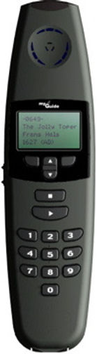
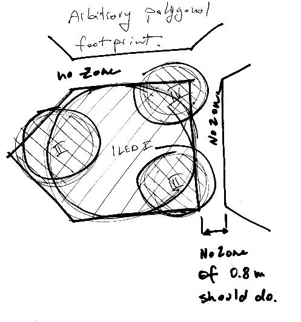
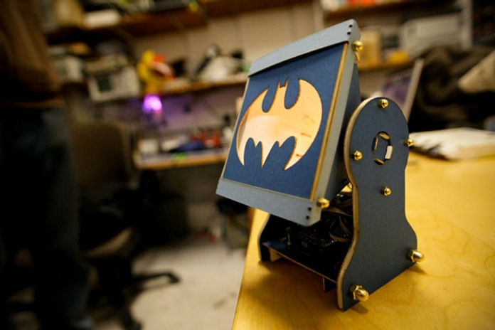
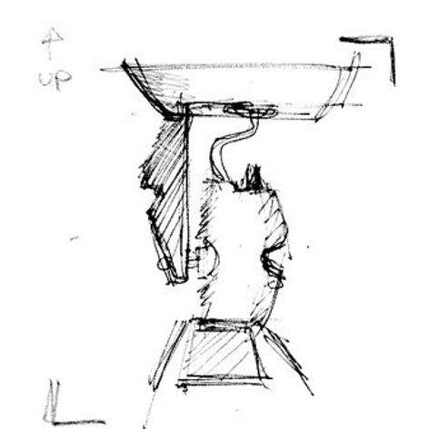

### Chapter 15 - Lean hardware

**Figure 15.1 — The Unsung Hero of Modern Museum Experiences: Espro's IR-Beacon**

Ever found yourself wandering through Moma, a sleek audioguide pressed to your ear, telling you about the artwork you're standing in front of? Did you wonder how it knew exactly which masterpiece had caught your attention? Let me introduce you to the humble ceiling-mounted infrared beacon – possibly the most important museum innovation you've never noticed.

---

## When Punching Numbers Became Passé

For those who've visited internationally acclaimed museums over the past quarter-century, you're likely familiar with the ritual: approach artwork, locate small numbered placard, punch digits into handheld device, listen to cultured voice explain why that blob of paint is worth more than your house. It's a time-honored tradition, like gift shop sticker shock or accidentally setting off alarms by leaning too close to the Picassos.

**Figure 15.2 — Espro Audioguide**

But museum curators, ever the visionaries, began dreaming of a more seamless experience – one where visitors could flow through exhibits like enlightenment-seeking salmon, absorbing cultural knowledge without the indignity of number-punching. The future, they declared, was hands-free.

---

## Enter Espro Systems

When Espro Systems (later acquired by Acoustiguide) set out to revolutionize their audioguide technology, they split the challenge in two: Redesigning the handheld device (handled in collaboration between Cortex design, Tiko Design and Aran R&D) – and creating the ceiling-mounted IR beacons that would silently trigger the right audio at the right moment – a task that fell to me.

---

## The Brief: Invisible Magic

My assignment was deceptively simple: create a device that would collect power and coded signals from ceiling wiring, then beam infrared codes downward to activate passing audioguides. The beacon needed to precisely control which areas would trigger which information, all while remaining as inconspicuous as a security guard at a royal wedding.

**Figure 15.3 — Original sketches for the briefing**

---

### Stage Lights for Invisible Shows

**Figure 15.4 — A classic stage spotlight**

Since infrared light behaves like visible light (just with worse taste in wavelengths), I turned to the world of theater for inspiration. The humble stage spotlight offered everything we needed:

- **Focal adjustment** to control beam spread (because nothing ruins a museum experience like hearing about the wrong ancient pottery)

- **Directional flaps** for defining beam boundaries (keeping the Monet commentary from bleeding into the Manet section, a faux pas of the highest order)

- **Rotation and tilt mechanisms** for precise aiming (critical for ensuring visitors hear about the dinosaur they're standing under, not the one that would eat them three exhibits away)

- **Stencil holders** for creating irregular coverage shapes (think Batman's signal light, but for triggering audio about Renaissance sculptures instead of summoning caped vigilantes)

  

  **Figure 15.5 — Batman stencil casts batman shaped light**

  ---

  

### The Hidden User Experience

The true "users" of this spotlight system weren't museum visitors, who ideally would never notice its existence, but the installation technicians – those unsung heroes in work clothes who would mount these devices, connect the wiring, and painstakingly adjust beam patterns while standing precariously on ladders.

Once installed, these beacons would blend into the ceiling architecture like introverts at a networking event – present but unnoticed, silently doing their job for years while taking none of the credit.

**Figure 15.6 — Sketch drawing of the beacon**

---

### Lessons from the Invisible Infrastructure - Lean Hardware Product Management

What can we learn from this seemingly simple device that helped transform museum experiences worldwide? And why this project turened to be an exercise in lean hardware product management?

#### 1\. Scenario Before Solution

Before diving into design, we established clear usage scenarios. Where would visitors walk? How would they interact with exhibits? What information needed to be triggered where? These spatial and behavioral patterns determined every aspect of the physical design.

#### 2\. Form Follows Function (But They're Still Dating)

Once requirements were clear, the merger of form and function happened naturally. The spotlight archetype wasn't chosen for aesthetic reasons – it was the perfect existing solution to the physics problem at hand.

#### 3\. Design for Real Life

Beyond just manufacturing concerns, we had to consider the full lifecycle – installation, adjustment, maintenance, and eventual replacement. A beautiful design that can't be installed correctly is like a priceless painting hung facing the wall.

#### 4\. The Bill Always Comes Due

Finally came production reality: tooling, assembly processes, and the sobering revelation of manufacturing costs. As with any hardware product, the distance between prototype and mass production is measured in compromises and currency.

#### 5\. Lean Hardware means...

In this case, the whole process from idea to manufacturing took 5 weeks, while the use of fast tooling for small production batch kept schedule and costs at bay. And here is the lesson: Quick experimentation at reasonable costs allow for better product market fit, so elusive in the hardware industry.

#### Hardware: It's Systems All the Way Down

What this project reinforced was that hardware product management is often more systems engineering than anything else. While the software world can deploy updates with the click of a button (and fix the inevitable bugs with another click tomorrow), hardware demands getting it right the first time.

The humble ceiling beacon required considering everything from electrical standards across different countries to the patience threshold of installation technicians to the walking pace of museum visitors. It needed to work flawlessly for years without attention, bring joy to users who would never know it existed, and do it all on a budget tight enough to make a museum accountant smile.

Next time you're in a museum, enjoying the seamless experience of information appearing in your ears just when you need it, glance up at the ceiling. That inconspicuous little device you probably won't even notice? That's my silent spotlight, still stealing the show after all these years.