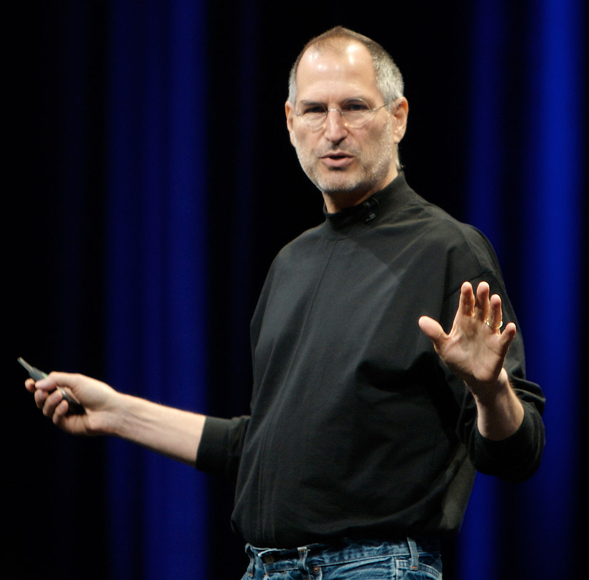
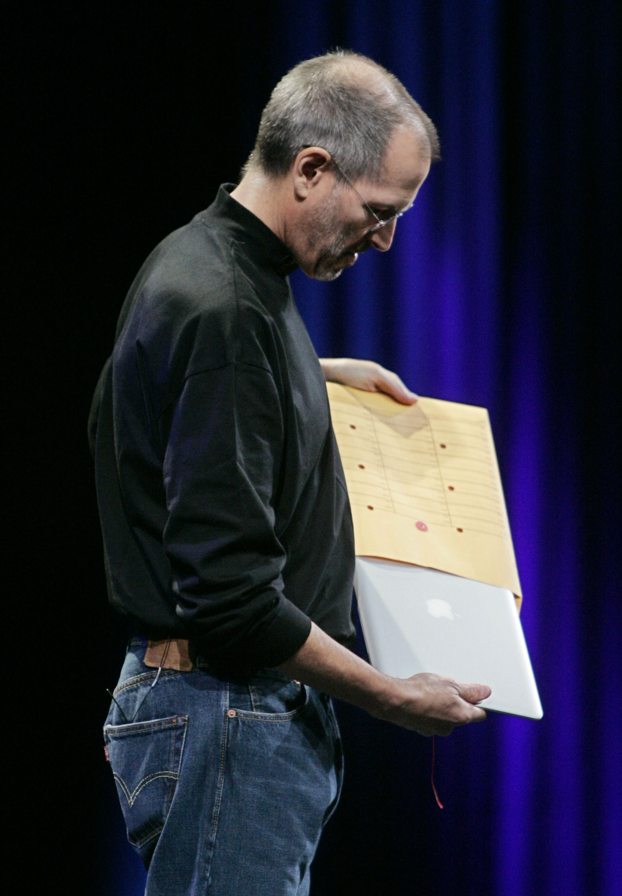
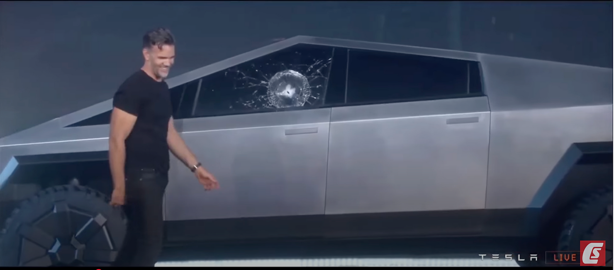

### Chapter 16 - First Impressions

***"You never get a second chance to make a first impression"***

​	*(Was it Will Rogers or even Oscar Wilde that coined this eternal truth?)*

**Figure 16.1 — Launch event with presenter and cheering audience.** Generated with FLUX.1 Krea Dev. Retrieved from ../images/fig16-01-launch-event-presenter.webp

---

#### Public Reveals

Key for demand generation are the launch events we have become accustomed to over the past decades. These are the theater of innovation – the promise of a shinier, better future, embodied in the coveted purchase of the latest gadget that claims to make us smarter, stronger, richer...

(Or, as Veblen argued, in *The Theory of the Leisure Class* (1899), at least appear so. Conspicuous consumption, in his view, functions as a marker of social status. Unsurprisingly, virtue signaling through conspicuous consumption is well and alive 135 years later.

#### Trade Shows as Stages of Progress

Modern day launch events are precedented by the lavish events held by the car and aviation industries. Detroit Auto Show and Frankfurt Motor Show (now rebranded IAA) are still very much a thing, although Auto Shangai seems to still the show, so to speak, happening in one of the most vibrant markets - both for purchasing power and innovation.

These weren’t just commercial expos but **cultural milestones**, shaping the public’s imagination of technology and progress.

**Figure 16.2 — Geneva International Motor Show.** hpgruesen. (2016, January 11). *Geneva International Motor Show [Photograph]*. Pixabay. https://cdn.pixabay.com/photo/2016/01/11/13/13/geneva-1133601_1280.jpg

---

This is where the industry unveils new models and prototypes, gaging the crowds and professional sentiment and acceptance years – in the following example decades – before an actual first vehicle rolls of the production line.

*Figure 16.3 — Rolls-Royce 103EX concept car.*

Reproduced from Rolls-Royce Motor Cars Pasadena (2022), Dealer Inspire. https://di-uploads-pod23.dealerinspire.com/rollsroycemotorcarspasadena/uploads/2022/05/Rolls-Royce-103ex.jpg.

---

#### Apple and the Theater of Innovation

Steve Jobs, for his showmanship, transformed the product launch into a ritual, fusing drama, exuding charisma and Reality distortion field. True, technology and design played great roles, too, but Jobs mesmerising role is matched by a rare breed of business leaders.

**Figure 16.4 — Steve Jobs at WWDC 2007.** Creative Commons Attribution-ShareAlike 2.0 (CC BY-SA 2.0)

Beyond specs and availability, such launch events create shared cultural moments, a resonance that bonds developers, distributors, customers, media, and fans into a community of anticipation and belonging. At times, even of heated debate and controversy.

Apple events, notorious for their tight-lipped secrecy before launch, came to rival blockbuster film premieres, attracting tens of millions of simultaneous viewers – a load carried by a burgeoning breed of content delivery networks (CDNs) by Akamai. The suspense, carefully built over weeks and months, broke at the moment of broadcast, unleashing global attention and triggering immediate surges in demand – a true tour de force in modern media management.

These events are not designed merely to inform; they shape perception and set the emotional stage for adoption at the individual level, with subsequent queues amassing in front of the new shrines of digital consumption – Apple Stores.

---

#### MacBook Air and the Art of Showmanship: Driving the Point Home

One of the most electrifying launch events Steve Jobs ever led was the unveiling of the MacBook Air. It was one of those rare pitches that didn’t just impress — it sent me, and countless others, straight to the store.

**Figure 16.5 — Steve Jobs unveiling the MacBook Air.** (AP Photo/Paul Sakuma, via Alamy, https://www.alamy.com/image540086783). **Publication rights pending**

By then I had already spent a decade hauling around heavy business laptops, my shoulders bearing the cost of piecemeal portability. Then came this moment: Jobs received a plain manila envelope on stage, and from it slid a MacBook so thin and conspicuousely light – I was bought in right away.

The effect was mesmerizing. In a single gesture, Jobs demonstrated, in the purest “show, don’t tell” tradition, the defining feature of this laptop. That *killer feature* (which I explore in depth next), instantly resonated with weight-weary professionals. It turned the MacBook Air into a demand magnet, drawing men and women to Apple Stores in droves.

Other considerations – Apple’s bold choice to rely on wireless connectivity while omitting the DVD drive and the RJ45 jack – were important, but secondary. Those moves had their merits, yet they were not the spark that drove demand.

Indeed, during Apple’s fiscal 2008 second quarter (ending March 29, 2008), the company shipped 2,289,000 Macintosh computers, marking 51 percent unit growth and 54 percent revenue growth over the year-ago quarter — gains widely attributed to the MacBook Air ([MacDailyNews, 2008](https://macdailynews.com/2008/05/01/apple_last_quarters_mac_sales_were_driven_primarily_by_sales_of_macbook_air/)).

This moment captures the very essence of what a launch event can achieve.

---

#### A Note on Risk

Live demos occasionally falter – a reminder of their high stakes. Tesla’s Cybertruck “Armor Glass” window shattering live in 2019 is just a recent, though famous example.

*Figure 16.6 — Tesla Cybertruck launch event: "Unbreakable" window shatters during live demo.*

Reproduced from CNBC Television (2019, November 22), *Oops! Tesla Cybertruck's unbreakable windows break during demo* [Video]. YouTube. https://www.youtube.com/watch?v=dwfaCpWe0zY

---

#### Unboxing

Launch events aside, the real journey often begins with the much-hyped unboxing – a ritual celebrated endlessly on YouTube. And yet, in practice, it is fleeting: consumers perform it once, then toss the packaging or stash it away. Still, this first encounter carries disproportionate weight.

Unboxing is not just about packaging; it is the orchestrated journey of first impressions – when users touch the product, feel its weight, and form an instinctive judgment of quality and value. In software, we call this onboarding, or the Aha! moment. 

In hardware, unboxing compresses that same dynamic into a tactile, sensory instant where the brand promise must materialize.

**Figure 16.7 — Product packaging design.** Lynx Designers. (2020, December). *Lynx blog image [Photograph]*. Lynx Designers. https://lynxdesigners.com/blog/wp-content/uploads/2020/12/Lynx-Blog-2.jpg

---

#### Apple Powerbook Unboxing Experience

Unsurprisingly, no one has mastered the art of unboxing more than Apple. Behold the following unboxing video from Everyday Tech. If you are attentive to textures and physical nuances, you will be thrilled by the attention to the tiniest details designed to make you feel you are opening a treasure chest.

**Figure 16.8 — MacBook Air unboxing video thumbnail.** Everyday Tech. (2025, August 7). *2025 MacBook Air M4 - unboxing, setup and first look!* [Video]. YouTube. https://www.youtube.com/watch?v=MIAjIkknlfc

Not unlike a Japanese tea ceremony, it is designed to augment a daily experience, exuding sheer intentionality. Every layer is choreographed: the gentle sigh of air as the lid lifts, the precisely angled pull tabs, the glowing machine waiting at the center as if on an altar. You are not simply opening a cardboard container – you are being inducted into a ritual.

This ritual achieves several things at once. First, it confirms the value of what you just paid for. The sturdiness of the box, the satin feel of the paper stock, the absence of clutter: all remind you this is not a commodity purchase but an initiation into a brand. 

Then comes anticipation. Each reveal – device and accessories – keeps you leaning forward, rewarding curiosity with suspense.

Apple also designs the moment for ease. There is nothing awkward, no plastic to wrestle with, no cords tangled. The first touch is frictionless, the very opposite of the shrink-wrap and twist-tie nightmare of older electronics. And then, almost magically, the machine already has power: lift the lid, and you are welcomed into the Apple world with no delay.

Importantly, this packaging –though intricate and exquisite – differs from that of luxury goods like high-end watches. The MacBook is not framed as a jewel to be admired, but as a precision tool for professionals. The unboxing assures them they now possess the finest instrument available, one that will enable them to perform at their best and, ultimately, to become the best version of themselves.

Finally, there is the sense of theater beyond the individual. Apple knows you might film this moment, share it, turn it into content – hence the video above. The packaging is not only for you – it is a stage set for the internet. A million micro-advertisements generated by people experiencing the same ceremony, each reinforcing the myth of Apple as the custodian of modern luxury.