### Chapter 17 - Killer Features

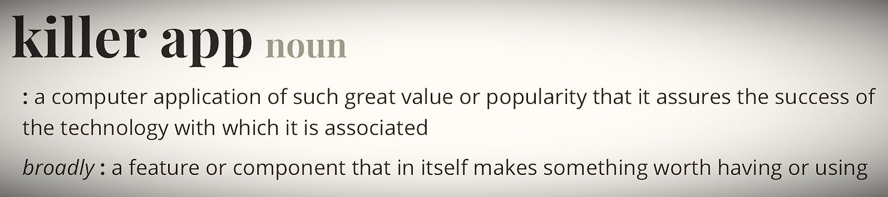

**Figure 17.1 — Merriam-Webster online dictionary entry for "killer app".** Retrieved from [https://www.merriam-webster.com/dictionary/killer%20app](https://www.merriam-webster.com/dictionary/killer app)

---

#### Market Magnets

What is a **killer feature**, anyway? We keep hearing this term, in its pure software version –*Killer App.*

The expression’s origin is unattributable, but it surfaced in the early 1980s when technology circles spoke of VisiCalc, the spreadsheet program that became the single sufficient reason for businesses to buy the Apple II. It wasn’t “just software”; it was the first serious business application that made a long stride toward democratizing computer use.

For the first time, small businesses — from mom-and-pop shops to midsize enterprises — had a reason to invest in an entire computer platform. The Apple II was no longer a hobbyist’s toy or an educational aid; VisiCalc transformed it into a business machine.

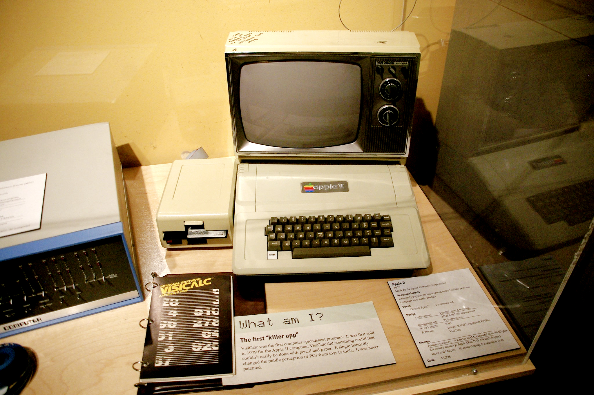

**Figure 17.2 — Apple II running VisiCalc, widely regarded as the first "killer app".** Photo by Jean-Edouard Rozey, [CC BY-SA 2.0](https://creativecommons.org/licenses/by-sa/2.0/). Retrieved from https://www.flickr.com/photos/jean-ed/1661870646/

This pattern would repeat throughout computing history. Photoshop became the anchor for the Macintosh in creative industries. Microsoft Office, with Excel dethroning VisiCalc, secured Windows as the corporate standard. Each time, a single capability proved magnetic enough to drive platform adoption en masse.

---

#### Redrawing Competition Lines

In hardware, killer features — whenever they appear (and they are rare!) — exert this same pull, but with a substantial twist. Hardware’s much longer and more expensive development cycles, component interdependence, and fiercely defended IP cause competition to struggle for quite some time before it can recuperate from such a blow — either through a workaround or by launching a killer feature of their own.

By definition, killer features redraw the lines on the field, in what Clayton M. Christensen coined as **Disruptive Innovation** (1995). They shift the very dimensions of value along which competitors align and position themselves – if they only could.

---

#### A Brief History of Disruption

It is worth revisiting the moments when killer features reset the rules of competition. Each example below shows how a single capability – often at the intersection of physical design and digital intelligence – pulled markets in a new disruptive direction and left rivals scrambling to respond.

---

#### Sony Walkman (1979)

The realization: *music is now portable, personal, and private.* It wasn’t the audio fidelity — it was slipping a cassette into your pocket and listening on the move. This shift redefined leisure culture itself.

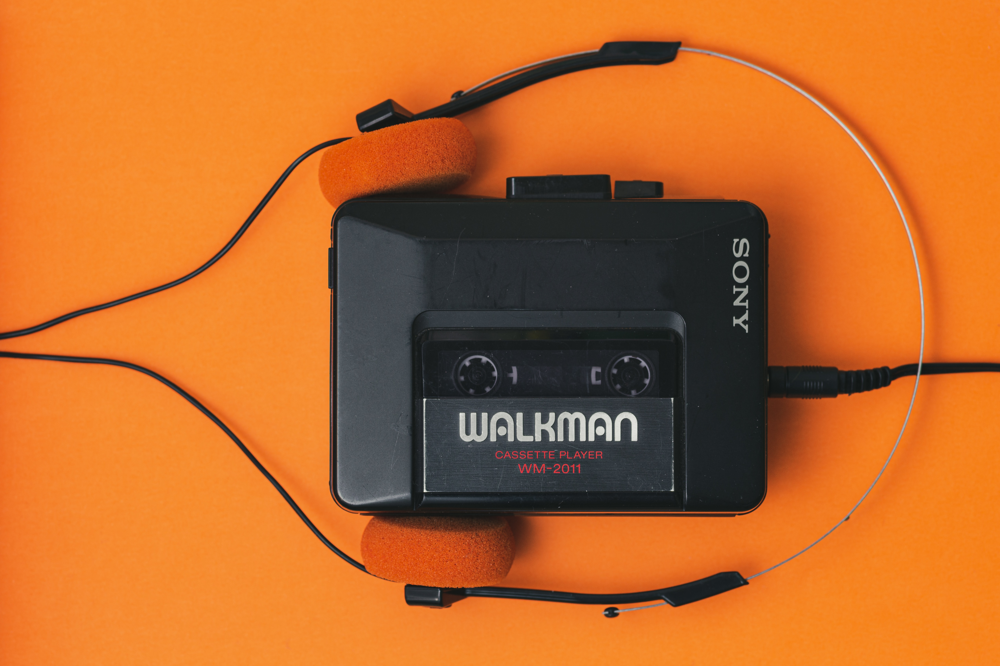

**Figure 17.3 — Sony Walkman with headphones, symbol of the portable music revolution.** Photo by Florian Schmetz on Unsplash. Retrieved from https://unsplash.com/photos/a-cassette-player-with-headphones-attached-to-it-Rks6FTfX5OU

> When the Walkman first launched in Japan in July 1979, Sony’s marketing team realized that conventional advertising wouldn’t be enough to explain such a radical product – small, lightweight, and designed for private listening. To overcome skepticism, they hired young people to stroll through Tokyo’s Ginza district wearing Walkmans and offering strangers the chance to listen.
>
> 

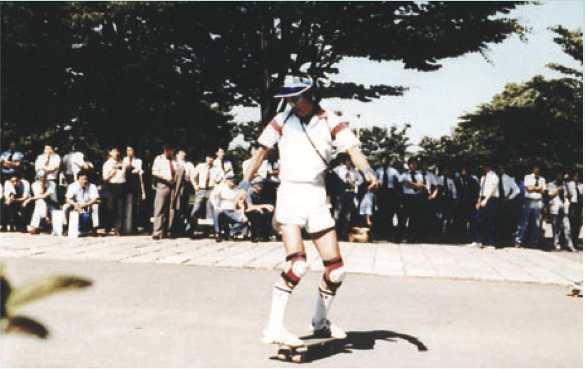

**Figure 17.4 — Sony Walkman promotion event in Japan, 1979.** Young demonstrators showcased the device in public spaces to spark curiosity and encourage trial. From *The History of the Institute of Electrical Engineers of Japan, Vol. 40, No. 5*, p. 318. Retrieved from http://www2.iee.or.jp/ver2/honbu/30-foundation/data02/ishi-03/ishi-0405.pdf

> This hands-on introduction bypassed the need for abstract messaging. Passersby could experience the product’s essence immediately: portable, personal music. The campaign was as much demonstration as promotion, and it proved decisive in turning curiosity into demand. Within two months, Sony had sold more than 30,000 units, far exceeding expectations.

[Extract from Sony Corporation. (n.d.). Sony history: The Walkman. [Sony.net](http://sony.net/). Archived from the original on June 26, 2010. Retrieved September 10, 2025, from [web.archive.org](https://web.archive.org/)]

---

The true takeaway from the Walkman’s launch is how profoundly disruptive its killer feature was: **music made portable as well as personalized**. For the first time, listening to a self-curated music selection was no longer tethered to a living room stereo, a car radio, or the heavy cassette decks from companies like Panasonic, Sharp, or JVC (it took the industry four year to catch up, in which the brand "Walkman" became a household name, and a generic term. 

Suddenly, one could place the unit on their belt, and listen in private to their own selection of music – while . Another innovation was Sony’s lightweight headphones 

(and the humble 3.5mm stereo jack went with it, to: As a side note, Sony had already introduced it in 1958 for its transistor radios, but it was the Walkman that popularized it globally – turning a small hardware detail into a lasting industry standard.)

Yet this very leap made the Walkman difficult for consumers to grasp. The concept was so novel that even marketers and retailers struggled to articulate its commercial potential. Market education quickly became essential, and the only effective approach was to **show, not tell**. Sony deployed live street demonstrations, staged press events, and seeded celebrity photo shoots that conveyed coolness and aspiration. On the retail side, cautious allotment was needed to reassure store owners that they would not be left holding unsellable stock of such an untested product.

In other words, the Walkman’s revolutionary nature demanded an ecosystem of education. The marketing effort was not an embellishment but a structural requirement – a bridge between a world that had never imagined private, mobile listening and a future where it would become second nature.

---

#### Apple Macintosh Reshapes Computing (1984)

At its launch in 1984, the Macintosh’s disruptive feature was its graphical user interface – icons, windows, and a mouse that made computing visual and intuitive rather than text-based.

Initially pioneered at **Xerox PARC** (Palo Alto Research Center), Steve Jobs and members of the Apple Lisa and Macintosh teams, were initiated to the concept of Graphical User Interface  (GUI) running a Xerox Alto computer – **bitmapped screen, overlapping windows, icons, and the mouse** – the building blocks of what would become the graphical user interface. ([Computer History Museum](https://computerhistory.org/blog/the-xerox-alto/), [Smithsonian](https://www.smithsonianmag.com/innovation/how-xerox-invented-modern-computers-180960168/)).

Jobs later described the experience as an epiphany:

> “I thought it was the best thing I’d ever seen in my life. Within 10 minutes, it was obvious to me that all computers would work like this someday.”

(*Steve Jobs, quoted in Walter Isaacson’s biography, 2011*).

Reviewers immediately recognized this as the breakthrough. The New York Times noted the Macintosh display was “refreshingly crisp and clear,” setting it apart from the command-line machines of the era (Sandberg-Diment, 1984). BYTE magazine admitted the machine had hardware limitations but concluded: 

> “You can do useful work with it, and the user interface beats all others cold” (Webster, 1984).

This usability shift reframed the basis of competition. The Mac didn’t need to win on raw specifications – its GUI redefined what a “personal computer” meant. IBM and Microsoft were forced to follow, accelerating the spread of graphical interfaces across the industry and pulling the personal computing revolution into a new era.

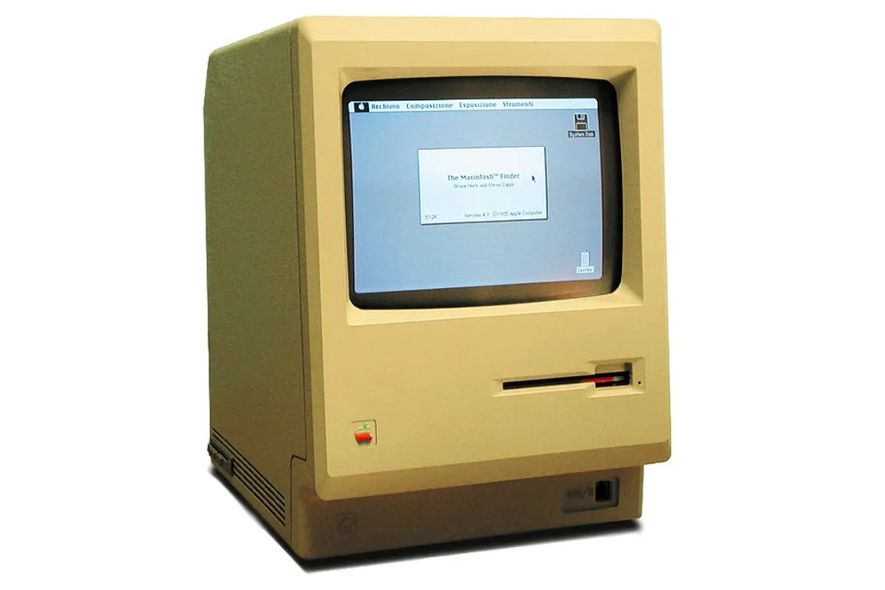

**Figure 17.5 — The original Macintosh 128K (1984), the first mass-market computer with a graphical user interface.** Photo by MATEUS_27:24&25. Retrieved from [Smithsonian Magazine](https://www.smithsonianmag.com/history/what-reviewers-said-about-first-mac-when-it-debuted-180949448/)

It took competition in the personal computing about a decade to catch up.

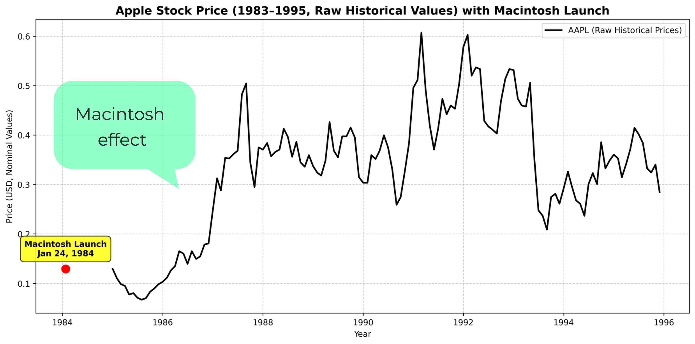

**Figure 17.6 — Apple Inc. stock price (1983-1995) with the launch of the Macintosh (January 24, 1984) highlighted.** Data from Yahoo Finance. Chart generated by the author

The Macintosh launch in 1984 gave Apple a sharp (though brief) lift. Unit sales topped **372,000 in the first year**, well above expectations, and revenues jumped nearly **50 percent to $1.5 billion**, pushing market share into the 10~11 percent range.

[Watch the notorious, or famous, Super Bowl ad](https://archive.org/details/1983-30sec), iconic and almost earth-shattering, directed by Ridley Scott, his dystopian imagery echoing the visual language of Alan Parker’s 1982 Pink Floyd: The Wall. 

The faceless system that could not be named – though the bluish hues hinted strongly enough – was alluded to as the IBM/Microsoft duo, the emerging force in personal computing. 

Yet, as history proves, even the strongest “killer feature” cannot secure lasting advantage on its own; without an ecosystem to sustain it, disruption's effect may prove short lived. Eventually, industry’s giants will trample ahead, regardless of any temporary setback.

---

#### Dyson bagless vacuum (early 1990s)

When James Dyson introduced his first "Cyclone" vacuum (the G-Force, the DC01, and later models), it broke with decades of convention. Until then, vacuum cleaners were designed around **disposable paper bags** – not just as dust containers but also as filters. Performance inevitably declined as the bag filled, and consumers had to buy a constant supply of replacements.

**Figure 17.7 — Dyson DC07 bagless vacuum cleaner.** Photo by Arpingstone. Public domain, via Wikimedia Commons. Retrieved from https://commons.wikimedia.org/w/index.php?curid=66714

By ditching paper bags, Dyson removed a recurring pain point: the cost and hassle of consumables. For households, this meant **lower ongoing costs**, easier emptying, and no more frustration of running out of bags. 

For the industry, however, this was a shock: established players like Hoover, Electrolux, and Panasonic relied on **bag sales as a profitable annuity model**. Dyson’s innovation didn’t just improve the product; it undermined the incumbents’ business model.

The multi-cyclone design wasn’t only about eliminating bags. By spinning dust out of the airflow, it maintained **constant suction performance**, even as the bin filled. This addressed a long-standing flaw in bagged vacuums, where suction would degrade steadily as the bag clogged. Dyson emphasized this in advertising, reframing expectations: why tolerate performance drop-off when technology could avoid it?

The transparent dust bin was more than a design flourish. It gave users immediate feedback that the vacuum was working: dirt and dust swirling in plain sight. This shifted the competitive axis away from abstract “suction power” numbers to a **visceral, demonstrable result**. Customers didn’t need to trust spec sheets – they could *see* effectiveness with their own eyes.

The combination of visible feedback, lower running costs, and consistently high performance created a **compelling killer feature bundle**. By the mid-1990s, Dyson had captured significant share in the UK, displacing Hoover from its century-long leadership. By 2001, Dyson was the best-selling vacuum brand in the UK, and by the 2000s it had expanded globally, commanding premium prices.

Dyson’s cyclone vacuum shows that killer features can not only rely on superior engineering or clever design – it is the way those improvements converge with economics. Consumers got a vacuum that cleaned more effectively, showed its performance in real time, **and** cost less to own over its lifetime. 

By collapsing **better product experience** and **lower total cost of ownership** into a single offering, Dyson rewrote the rules of competition. Rivals still tied to bag sales could not follow without cannibalizing their own profits, leaving Dyson free to capture market share and redefine value in an otherwise stagnant category.

---

#### Nintendo Wii motion controller (2006)

When Nintendo launched the Wii in 2006, the bundled **Wii Remote** looked nothing like the standard controllers of the era. A **Core Differentiator** it reframed gaming around motion. Shaped like a television remote rather than a bulky gamepad, it replaced complex button layouts with a **motion-sensing wand**. Inside were accelerometers and gyroscopes, paired with an infrared sensor bar that let players point and swing with remarkable accuracy.

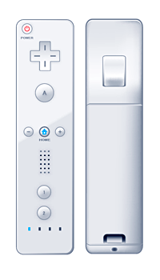

**Figure 17.8 — Nintendo Wii Remote controller.** Image via Wikimedia Commons. Licensed under CC BY-SA 3.0. Retrieved from https://commons.wikimedia.org/wiki/File:WiiRemoteController.png

This was a radical departure from the industry’s trajectory. Sony and Microsoft were locked in an arms race over **processing power, graphics fidelity, and cinematic immersion**. Nintendo reframed the competition: instead of asking how realistic a game could look, they asked how **intuitive and inclusive** it could feel. With the Wii, the act of play became physical – a swing of the arm to serve in tennis, a flick of the wrist to throw a bowling ball, a tilt to steer a kart.

The benefits were immediate. Gaming became accessible to **families, children, and even older adults** who found traditional controllers intimidating. *Wii Sports*, bundled with the console, turned living rooms into playgrounds and sparked global tournaments among players who had never touched a PlayStation or Xbox. Beyond fun, the Wii introduced the idea of **exergaming**, with titles like *Wii Fit* merging entertainment and fitness.

The impact was seismic. The Wii sold over **100 million units**, outselling both the PlayStation 3 and Xbox 360 during its peak years. Unlike its rivals, Nintendo profited on each console thanks to modest hardware costs, while driving additional revenue through games and accessories like the Balance Board and MotionPlus. 

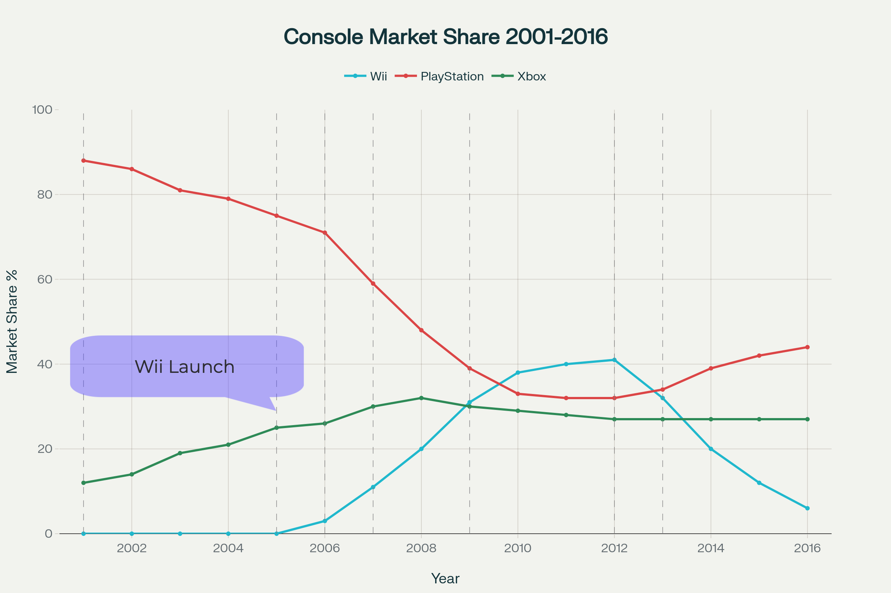

**Figure 17.9 — Estimated global market share of Nintendo Wii, Sony PlayStation, and Microsoft Xbox (2001-2016), with key milestone events highlighted.** Based on synthesized data.

Just as important, the Wii **expanded the total addressable market for gaming**, pulling in demographics the rest of the industry had largely ignored.

The Wii Remote proved to be a killer feature by being a core differentiating factor redefining the rules of engagement, thus increasing total addressable market to new audiences and age groups. Locked in their by shifting gaming from a contest of specs to an experience of shared, physical fun. 

---

#### iPhone (2007)

The 2007 launch of the iPhone shook the mobile world to its core. Within a few years, it dethroned Nokia from its long-held dominance and forced once-formidable rivals like BlackBerry, Sony Ericsson, and others out of the market. More than a product launch, it was a total rewrite of the competitive rulebook. Same as in nature (there are no vacuums in business) the space cleared by the obliteration of the top tier of competition was filled not only by iPhone’s rise, but was soon filled with an entirely new class of competitors.

---

I strongly recommend watching Steve Jobs present the iPhone in 2007 — a launch event for the ages for anyone in product. It’s a masterclass in presentation showmanship and, more importantly, a clear demonstration of the nature of killer features (a term Jobs himself uses) and the transformative impact they can have on a product.

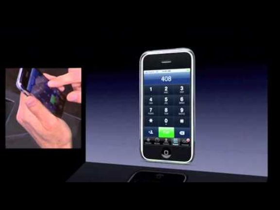

**Figure 17.10 — Steve Jobs introduces iPhone (2007).** Apple. (2007, January 9). *Steve Jobs introduces iPhone (2007)* [Thumbnail image]. YouTube. https://youtu.be/vN4U5FqrOdQ?si=alU0JuIZlHhdqOGZ

---

The splash from this launch – heard across the technological world – was powered by a stack of killer features, each amplifying the others and together disrupting device makers, carriers, and entire ancillary industries.

**Figure 17.11 — iPhone (first generation, 2007).** From Carl Berkeley, Riverside California, 2009, *Wikimedia Commons*, [**https://commons.wikimedia.org/wiki/File:IPhone_First_Generation.jpg**](https://commons.wikimedia.org/wiki/File:IPhone_First_Generation.jpg) (CC BY-SA 2.0).

---

#### New UI paradigm for the mobile world

The most fundamental shift was the creation of a **new UI (User Interface)**, a result of acute identification of the shortcomings of then extant Smartphones: small screens, tiny, crammed keyboards, rigid controls, and inability to adapt UI to specific applications.

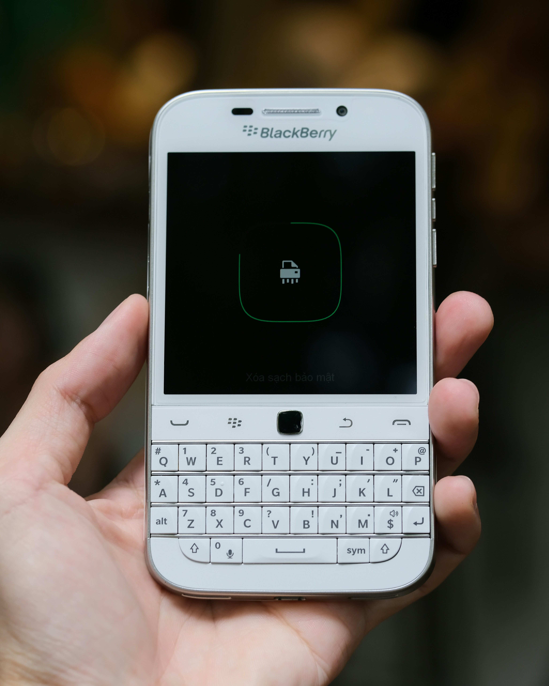

**Figure 17.12 — BlackBerry Classic (Q20) smartphone with physical keyboard.** Photo by Unsplash user [Linh Nguyen](https://unsplash.com/@lnhngyn), 2022. Retrieved from https://unsplash.com/photos/graphical-user-interface-application-RtijMFhL_ns.

In contrast, the iPhone’s capacitive touchscreen was accurate and responsive enough to replace physical buttons entirely, while also serving as a true multi-touch pointing device. Sensors detected when the phone was held to the ear, automatically disabling input to prevent accidental touches, while orientation sensing let the screen switch seamlessly between portrait and landscape to suit the task.

Apple’s virtual keyboard incorporated skeuomorphic feedback cues – visual key pop-ups and audible clicks – to compensate for the absence of physical keys. At the same time, innovative gestures such as pinch-to-zoom, tap, and inertial scrolling expanded the pointing interface, enabling direct manipulation of on-screen elements and eliminating the tedious scroll-and-select navigation of earlier devices.

**Figure 17.13 — Screenshot of iPhone virtual keyboard with visual pop-up feedback shown.** Image captured by the author, 2025.

---

These leapfrogging design choices alone were enough to disrupt the mobile phone industry. They created unmistakable differentiation by delivering greater user value in ways anyone could understand.

| Patent Number                                                | **Covered Feature(s)**                        |
| ------------------------------------------------------------ | --------------------------------------------- |
| [US 7,479,949](https://patents.google.com/patent/US7479949B2/en) | Multi-touch heuristics (swipes, pinches, etc) |
| [US 7,657,849](https://patents.google.com/patent/US7657849B2/en) | Slide-to-unlock gesture                       |
| [US 7,812,826](https://patents.google.com/patent/US7812826B2/en) | Multi-touch on mobile device, sensor input    |
| [US 7,812,828](https://patents.google.com/patent/US7812828B2/en) | Ellipse fitting for multi-touch surfaces      |

This competitive advantage drove instant demand to the hot, new, cool, 'reinvented' phone, forcing incumbents – Motorola, Nokia, Blackberry, Palm – into a defensive chase after attributes they could not easily replicate.

An extensive suite of patents were filed prior to the launch, with both hardware and software elements covered, some of them listed below. IP strategy and patents played an important role in planning the commercial exploitation, and crucially fending against future competition.

| Patent Number                                                | **Covered Feature(s)**                        |
| ------------------------------------------------------------ | --------------------------------------------- |
| [US 7,479,949](https://patents.google.com/patent/US7479949B2/en) | Multi-touch heuristics (swipes, pinches, etc) |
| [US 7,657,849](https://patents.google.com/patent/US7657849B2/en) | Slide-to-unlock gesture                       |
| [US 7,812,826](https://patents.google.com/patent/US7812826B2/en) | Multi-touch on mobile device, sensor input    |
| [US 7,812,828](https://patents.google.com/patent/US7812828B2/en) | Ellipse fitting for multi-touch surfaces      |

A case of interest is **Apple v. Samsung** (2011–2018) – a landmark patent battle of the smartphone era. Apple accused Samsung of copying iPhone features like *slide to unlock* (US 7,657,849), and its icon-grid design, winning an initial $1.05 billion verdict (later reduced to $539 million). 

Though costly and protracted, the case became a proxy fight with Android and highlighted how design and software patents could shape the industry’s competitive landscape. Conversly, it also shows the limitations of such litigations in mitigating fierce competition.

---

#### "The Real Internet"

In that iconic launch, Jobs pointed to the then state-of-the-art smartphones, highlighting not only their cramped physical keyboards but also the inadequate, stripped-down versions of internet browsing they offered.

> *The most advanced phones are called smart phones, so they say. And they typically combine a phone plus some email capability, plus they say it’s the Internet – it’s sort of the baby Internet ...*

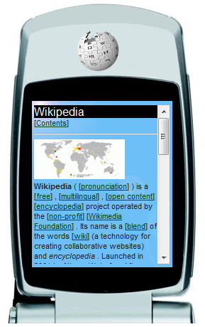

**Figure 17.14 — WAP browser rendering the English Wikipedia main page on a mobile device.** From Wikimedia Commons, by Wikipedia user "Wap", 2008. [**https://upload.wikimedia.org/wikipedia/commons/0/02/Wap-wikipedia-en.png**](https://upload.wikimedia.org/wikipedia/commons/0/02/Wap-wikipedia-en.png). Licensed under CC BY-SA 3.0.

Jobs contrasted this with his vision of a phone equipped with a fully functional, HTML-compliant web browser — made possible by iOS, Apple’s Unix-derived operating system.

> *This is a breakthrough Internet communicator built right into iPhone. The first rich HTML email on a phone. The first real Web browser on a phone. Best version of Google Maps on the planet, widgets and all with EDGE and Wi-Fi networking. We’re very, very happy with this.* 
> *… It’s the Internet in your pocket for the first time ever.*

Quotes from Steve Jobs during the Macworld 2007 keynote introducing the iPhone. Transcript retrieved from *Steve Jobs introduces iPhone in 2007* (Macworld Keynote, January 9, 2007)

This leap immediately exposed the weakness of the existing carrier-driven model. For years, mobile operators had forced users through Wireless Application Protocol (WAP) portals that were slow, costly, and designed to keep customers inside their branded gardens. They dictated which phones were sold, what features were enabled, and how revenue was extracted, from SMS and ringtones to tightly controlled downloads. 

The iPhone broke that structure. Apple insisted on end-to-end control, barring AT&T in exchange for launch exclusivity, from disabling Wi-Fi, pre-loading portals, or even branding the device.

---

#### The Carrier Power Shift

The shift transformed consumer behavior. For the first time, people chose their carrier based on who offered the iPhone, not the other way around. In the U.S. this meant flocking to AT&T; in the UK it meant O2; in France it meant Orange. 

Carriers became secondary to the device itself, while customers began to identify as iPhone users rather than as subscribers to a particular network. Buying direct from Apple or choosing an unlocked handset became viable alternatives, reducing the lock-in power of bundled contracts.

The iPhone’s appetite for full web access and data-rich apps also forced carriers to abandon per-megabyte billing and move toward unlimited plans. The mobile carrier industry faced cannibalization, and AT&T executives - once approached by Apple, understood it was better “to have the cannibal in the family” than to lose millions of subscribers to rivals. 

The precedent Apple set reshaped the industry: carriers, once the gatekeepers of the mobile experience, were reduced to pipes, while the real value and loyalty shifted to ecosystems built by Apple and, later, Google.

---

#### Together, Not Alone

Each of these features mattered, but their power was cumulative.

- Without the keyboard-less glass slab, the “real internet” would have been unusable.
- Without multi-touch, the full screen would have been clumsy.
- Without breaking carrier control, the openness of the web and later apps would have been throttled.
- Without approachable design, mass adoption might have lagged.

The result was not merely a better phone, but the template for the modern smartphone and a reset of the industry’s balance of power.

Apple’s “phone reinvention” moment unleashed a pack of killer features fusing usability breakthroughs, software openness, and value-chain disruption into a single device.

---

#### Tesla OTA - Over The Air System updates (2012)

Tesla had been touting over-the-air (OTA) updates since the launch of the Model S in 2012, promising that “your Tesla gets better over time.” Much like a smartphone, the car could receive new features and fixes remotely: navigation tweaks, interface refinements, performance modes, and even the early rollout of Autopilot.

While the rest of the industry still required a dealer visit for most software adjustments, Tesla positioned OTA as a defining differentiator – proof that a car could continue to evolve after it left the factory.

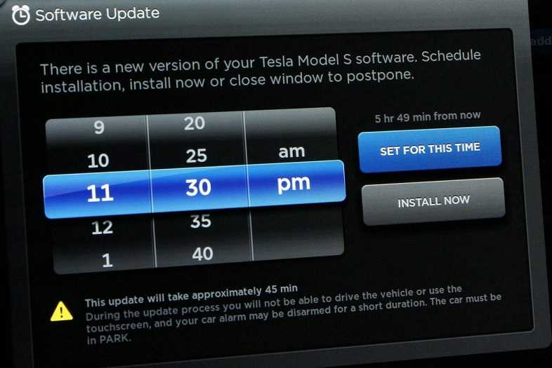

**Figure 17.15 — Tesla Model S over-the-air (OTA) update screen.** Image retrieved from *Stuff* ("The top car technology of 2017," 2017). Fair use for scholarly/educational purposes. Source: https://www.stuff.co.nz/motoring/top-cars/98426802/the-top-car-technology-of-2017

For years, most of these updates felt incremental or playful. In December 2017, for instance, Tesla introduced a Christmas-themed “Romance Mode,” complete with sleigh graphics and festive music that transformed the heating screen into holiday theater.

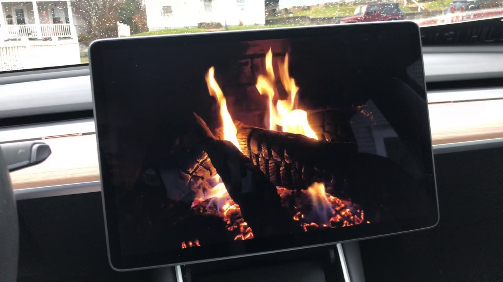

**Figure 17.16 — Tesla Romance Mode Easter Egg.** Tesla. (2018). Romance Mode Easter Egg [Video]. YouTube. [**https://youtu.be/iWI8bfK2wAQ?si=x4xF4wOw1dSO0BIH**](https://youtu.be/iWI8bfK2wAQ?si=x4xF4wOw1dSO0BIH)

Owners came to expect such flourishes as part of the brand’s personality: updates were convenient, surprising, even fun.

But in September 2017, as Hurricane Irma bore down on Florida, the same capability proved lifesaving. Tesla remotely and temporarily unlocked extra battery capacity in Model S and Model X 60 kWh versions — cars that actually contained 75 kWh packs but were software-restricted. Overnight, evacuees gained an additional 30 to 40 miles of range, enough to help them escape the storm.

That intervention caught the attention not only of technology enthusiasts but also of the national press. [*The Washington Post* observed](https://www.washingtonpost.com/news/innovations/wp/2017/09/11/as-hurricane-irma-bore-down-tesla-gave-some-florida-drivers-more-battery-juice-heres-why-thats-a-big-deal/):

*The decision highlights one of the most innovative aspects of owning a Tesla. The company’s ability to use software to instantly add range to a vehicle is something no conventional car can achieve. You can’t simply make a gas tank bigger at the click of a button.”*

By 2021, the same newspaper concluded that Teslas were effectively *“iPhones on wheels,”* [noting in a headline](https://www.washingtonpost.com/technology/2021/05/14/tesla-apple-tech/):

> *Tesla is like an ‘iPhone on wheels.’ And consumers are locked into its ecosystem.*

(Yes, this new killer feature had a dark side to it, too)

Together, these episodes elevated OTA updates into a textbook ***killer feature\***. For users, the benefit was unmistakable: their cars no longer depreciated in utility the moment they left the showroom. Instead, features could be added or improved over time, turning ownership into an evolving experience rather than a static one.

For competitors, this was deeply threatening. Traditional automakers were still bound to dealer networks and hardware-bound feature sets, while Tesla had shown that the most compelling value could be delivered with a keystroke – instantly resetting expectations for what a modern car should offer.

And for Tesla itself, OTA updates opened the door to a different business model. Controlling code meant not only delivering upgrades in real time but also monetizing them – from optional feature unlocks to subscription programs – reshaping the economics of car making as profoundly as the innovation reshaped the product itself.

---

#### The Essence of Killer Features

Killer features differ fundamentally from incremental improvements: they act as disruptive wedges that redefine the terms of competition. By reframing what customers value, they render existing benchmarks obsolete. 

The Walkman redefined leisure; VisiCalc justified computers for business; the iPhone reset usability; the MacBook Air elevated portability; and Tesla proved that adaptability itself could be a feature.

A useful framework is to view killer features as operating along three axes:

- **User benefits** – filling a gap and meeting previously unmet needs.
- **Competitive disruption** – undermining established industry conventions and resetting expectations.
- **Business model change** – altering the underlying economics of value creation and capture.

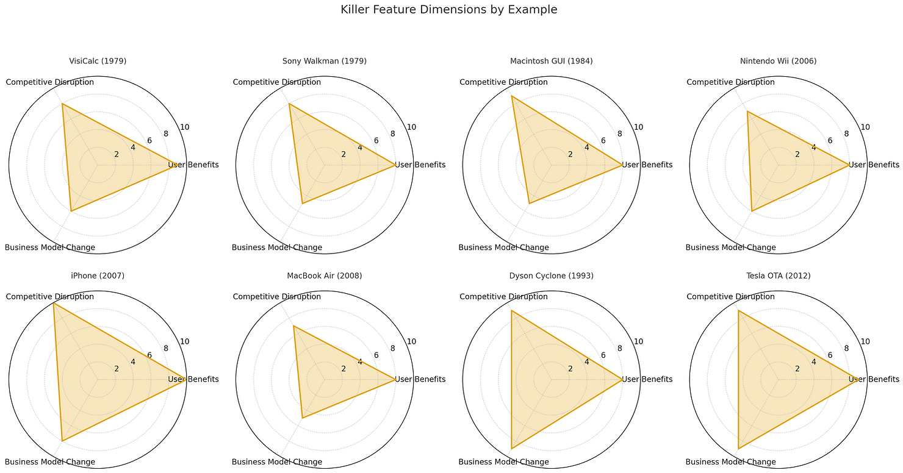

**Figure 17.17 — Illustration of killer feature dynamics (subjective interpretation).** Created by the author.

Competitors caught unawares still compete on yesterday’s dimensions – more keys, faster processors, larger batteries – suddenly looking irrelevant. Killer features matter because they do more than add value; they shift the basis of competition, pulling the entire market toward a new axis of differentiation.

Equally important, they reshape business models. Consumers begin paying for different things, at different times, and often at different price points. What once was a one-time transaction becomes a recurring relationship, or a bundle of services layered on top of hardware.

For firms, this makes careful strategic planning essential. To fully capitalize on the R&D behind such breakthroughs, companies must not only design the killer feature itself but also anticipate how it will alter demand patterns, revenue flows, and competitive dynamics.

---

#### **Killer Features - Key takeaways**

- A killer feature reframes value for users, disrupts competitors’ assumptions, and changes the revenue logic.
- Adoption speed and defensibility determine how long the advantage lasts.
- Ecosystems turn one feature into a flywheel: distribution, complements, and IP convert differentiation into dominance.
- Strategy must pair invention with capture: pricing, subscriptions, upgrades, and timing.

---

**References & Sources**
All references for this chapter — with live links and archived snapshots — are available at the companion site.

[View Chapter 17 References →](https://yoelf22.github.io/manuscript/references/ch17.html)

