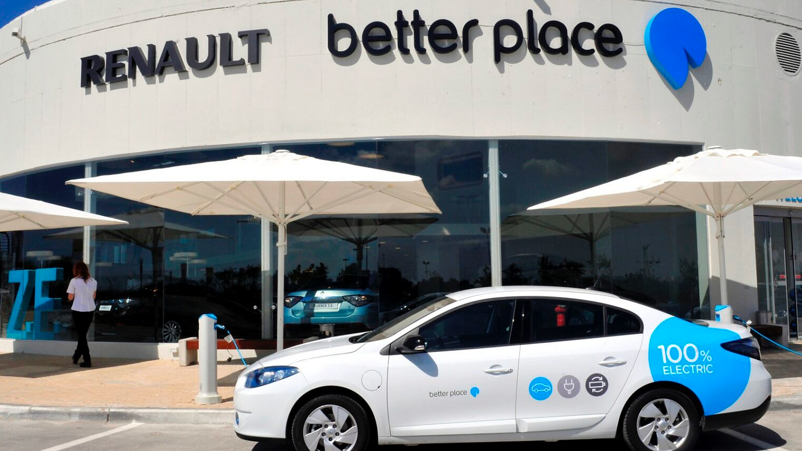
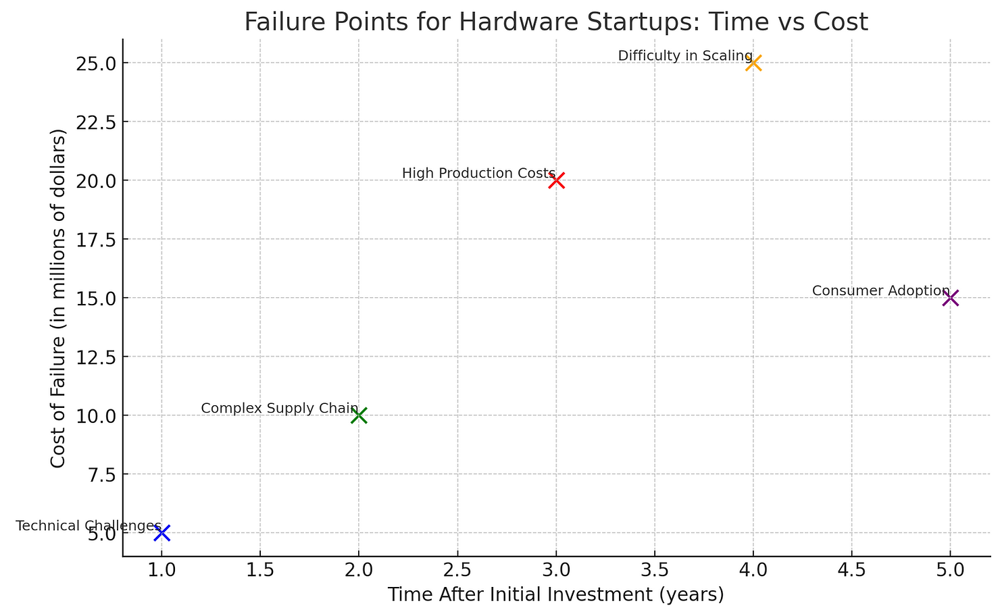
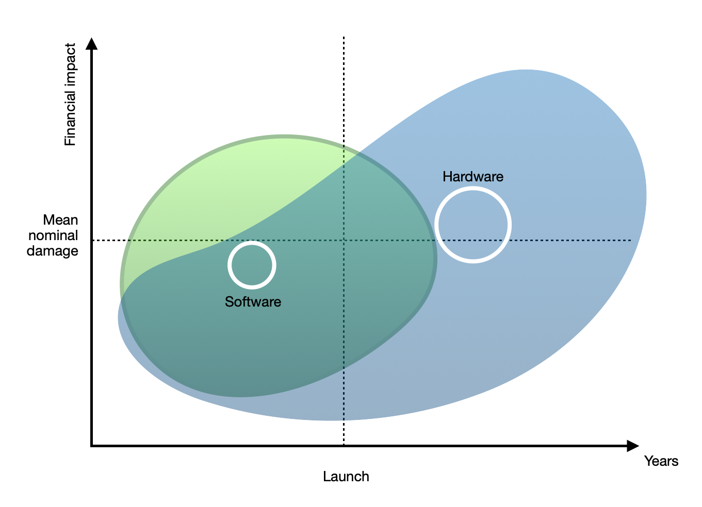
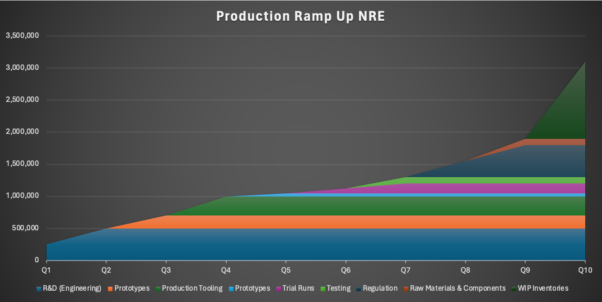
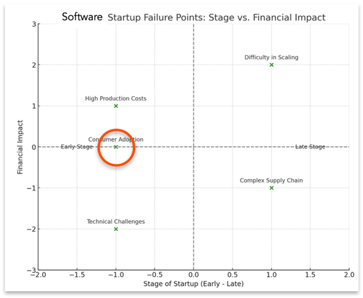
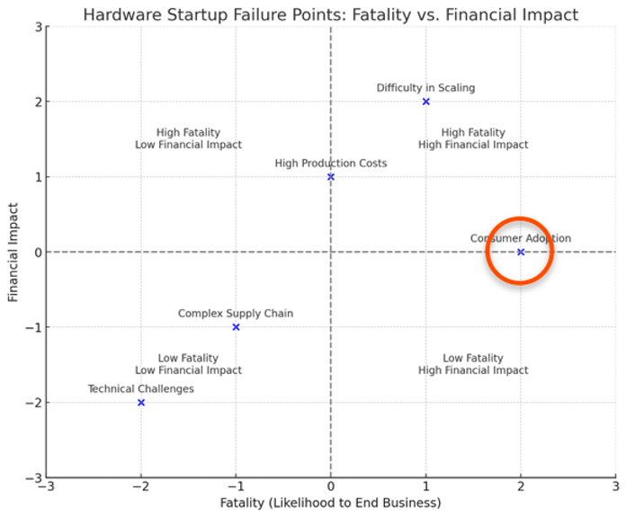

# Chapter 2 - Hardware startup validation traps

*Hardware startups often fall into validation traps that would be merely expensive in software but prove catastrophic when atoms are involved. The lean startup methodology's "build-measure-learn" cycle assumes rapid, low-cost iteration – assumptions that break down when minimum viable products require manufacturing partnerships, regulatory approvals, and supply chain commitments. From Better Place's billion-dollar infrastructure bet to countless crowdfunding failures, hardware ventures repeatedly stumble on validation challenges unique to physical products: the capital intensity of testing, the irreversibility of design choices, and the extended feedback loops that make pivoting prohibitivelyexpensive.*

------

**Figure 2.1 — Better Place: A painful experience**

Let us discuss the challenges for hardware ventures:

-   **Physical & Technical**: Is your product based on sound technical ground? Does the widget perform as advertised?

-   **Supply Chain**: Can you source the components, raw materials, labor and other manufacturing input? Can you then distribute it economically?

-   **Unit economics**: Can you set up the production facility require to manufacture this product at quality and scale desired? Would the units produced generate profit margins?

-   **Scaling**: How to get a wide audience? You need to build and finance a distribution network, account for working capital, suffer wear and tear of inventories.

-   **Adoption**: How much will they want, how fast, and at what price?

**Figure 2.2 — Points of failure: Time, Cost**

The graph above shows how these failure points are distributed along the life cycle of hardware products. Notably, each differs in timing and financial impact.  

You'll notice that as times goes by, the cost of failure increases. Consider the following illustration:

**Figure 2.3 — SW vs. HW financial aspect of failure (illustration)**

In this illustration the curved areas represent a point cloud of failure events for either software or hardware startups. These are laid along the time axis, with the launch event somewhere in the midst of the time line (startups can fail before or after a major launch for hardware companies. For software companies, this point in time denotes the scale-up effort). These points are also laid along the vertical axis, denoting nominal damage.

You'll notice a different distribution of failure points for each industry, following the characteristics we discussed: Hardware entails building production capacity, inventories, and a distribution network, which weigh on the company's finance after launch, while software companies' risk normally increases in the scale up phase, then subsides dramatically.

---

#### Cost of timing

All things being equal, a late failure is more hurtful. Time cannot be reversed, both for investors and entrepreneurs, who'd rather succeed. Must they fall, they'd prefer failing quick, so they can entertain other opportunities, and such is the case for investors.

A simplistic approach to this question is looking at the book value of the startup in question, starting at capital injection with the amount investment, then dwindling, year after year, by the losses accrued - until (if successful) the course is reversed and returns on investment start to accumulate.

In this analysis,

**_Residual Value = Book value - accrued losses_**

Hence the conclusion of preference for <u>early failure</u>, as losses tend to increase over time for failing startups.

---

#### Cost of Production ramp-up

This is almost unique for hardware ventures. While R&D engineers may cost the same, physical infrastructures and inventories tend to be much more significant for those. Consider the costs for:

-   PPE - Plant, Property, and equipment (lease property, buy machinery and production tools)

-   Raw materials and components - which should be purchased in advanced, sometimes with order quantities pledged to insure lower cost

-   WIP and distribution warehouses, ex works and overseas

-   WIP and finished goods inventories

-   Distribution channel set-up and management

In the example below, I've listed only the direct expenses accrued in a single product development and production ramp-up process - a subset of the above list:

-   R&D (Engineering)

-   Prototypes

-   Tooling

-   Trial Runs

-   Testing

-   Regulation

-   Raw Materials & Components

-   WIP Inventories

-   Finished Goods Inventory

**Figure 2.4 — Production ramp-up NRE accumulation**

Most of this (hardware specific) investment will be scrapped in case of liquidation, further increasing the negative impact of a potential collapse of the venture.

---

A good example of the fire sale residual value of Modu - an iPhone predecessor smartphone manufactured in 2007, now selling for $50 (about a third of original list price)

**Figure 2.5 — Obsolete products may linger long**

---

Another, much more ubiquitous example, are off-season fashion items, which could go as low as 20% off list price:

**Figure 2.6 — Seasonal price changes can be brutal**

These stress the fact that once a product is discontinued, or becomes irrelevant, its residual price can plummet, effectively deepening the venture's loss.

---

#### Adoption Risk

Once we clear the development risks, a significant hurdle remains for all ventures, software or hardware related: Market adoption. For nothing can force adoption of your product, can it?

Luckily for software products, **lean methods** enable early testing of acceptance.

MVP (Minimal Viable Product), as it name implies it can be developed to a bare minimum, providing a key functionality, just to assess traction within the target audience.

**Figure 2.7 — Software startup failures: Stage vs. financial impact**

This way, further efforts can be made or avoided, both minimizing risk, or shuttering the business if feasibility is not proven. In fact, successful MVPs have become a standard, if not mandatory, requirement for many pre-seed investments.

As demonstrated above, this is hardly the case for a hardware product. Manufacturers will have to go the whole nine yards from conceptualization through production, accumulating direct and indirect costs, at risk.

**Figure 2.8 — Hardware startup fatality and financial impact**

**Figure 2.9 — Ford Edsel: Notorious F.L.O.P**

A spectacular example of such flop was the Ford Edsel. The first car designed by Ford from scratch in the post WW2 period.

It was such an important project for the company, it was named after the founder's son, as was the division dedicated to its production.

Market analysis, conducted by the corporate America traditions and standards, sounded pretty logical at the time, with the target audience identified as middle-class, up and rising, young families, and young executives.

The company designed several models, built mockups and prototypes, ran through focus groups, and during years 1956-1957 built Capacity, and launched with a marketing splash on what was named as "E-day"...

Two years later in 1959, all 18 models were pulled off the showrooms, at a stated write-off of $250 million, approximately $2.6 Billion in 2024 prices.

**Figure 2.10 — Better Place: Where swappable batteries won't do**

The Ford Edsel example is by no means to say they could - or should - have known better: Apparently, they played by the book, saved no expenses. But here is the thing: Doing everything right cannot and will not obliterate market adoption risks. This risk can be "managed" but not obliterated. And the sunk costs involved in hardware products make it especially painful.

Consider the market adoption failure of Better Place - the visionary swappable battery electric car by Shay Agassi in a major Joint Venture with Renault. As the first product of this startup, its spectacular failure sank the ship altogether, wreaking havoc in investors' finances - for the gamble was big: The $900 million dollars invested in the company, $1.2Billion in 2024 prices, went don the drain when the company bankrupted.

Notably, most of this capital was captured somewhere in the supply chain, effectively evaporating when sales and production stopped, and as the company liquidated.

---

#### Interim conclusion (2)

Dont. Do. Hardware... That is to say, if you have a choice.

However, the physical world is the one we live in, don't we? We live in houses made of tangible materials, drive metal cars, use plastic implements, and eat food made of crops and living stock.

We **must** build physical goods - hardware, if only to have them run software.  

In the upcoming posts, I will describe how digitation and software improve also the fortunes of hardware products in general, and hardware startups in particular.