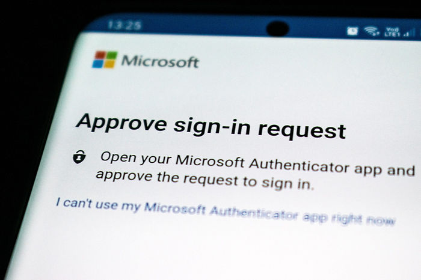
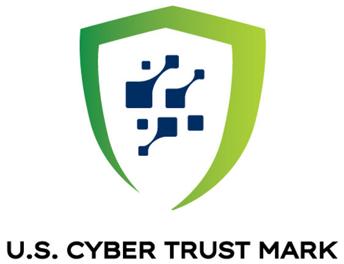
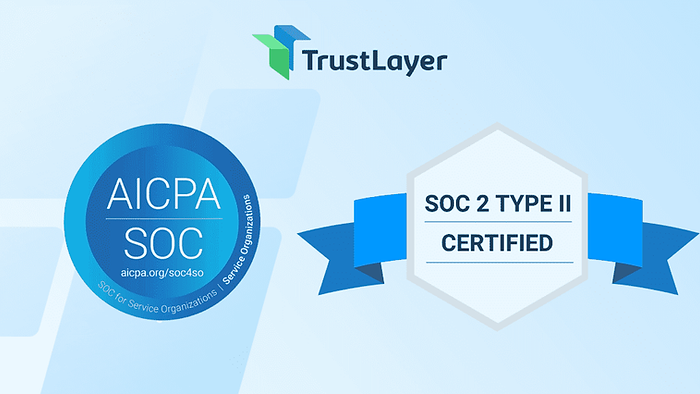

### Chapter 20 - Smart Product Cyber: Threat Mitigation

---

**[Part 2: Mitigation]**

**Figure 20.1 — Have the code? Are you the only one?**

> _Smart tangibles present enhanced utility, but also increased security, privacy and safety challenges._

As the line between software and physical product continues to blur, mitigation becomes more complex as it is essential. Protecting smart tangibles demands an integrated approach - where supply chain security, firmware integrity, and cloud-based safeguards are treated as a unified surface of risk.

<!-- Reference: Siemens' new zero-trust platform for industrial networks demonstrates the industry's move toward comprehensive security solutions: https://press.siemens.com/global/en/pressrelease/new-siemens-platform-brings-zero-trust-security-industrial-networks -->

------

#### What's To Be Done?

As a product manager specializing in [<u>smart tangibles</u>](https://www.theroadtlv.com/smart-tangibles), Security (with a capital S) is yet one more system requirements that should be taken into account, with minimal friction through user experience. While most aspects would be baked into hardware and backend levels, some will be externalized to the users, especially at the authentication layer.

Here are some recommendations, though your milage may vary:

1. ##### Designing for Resilience

- ###### **Principle**:

  Smart tangible products should assume hostile environments and users.

- ###### **Practices**:

  Threat modeling early in the product design; designing with fail-safes, redundant paths, and hardware-level integrity checks.

- ###### **Examples**:

  Physical anti tamper on higher security devices provide visible evidence to enclosure tampering. this may include [<u>adhesive graphic scratch off tapes</u>](https://evergreater.en.made-in-china.com/product/lOrEMLhCXtWD/China-Adhesive-Scratch-off-Red-Rolls-of-Anti-Tamper-Evident-Seal-Security-Stickers-Scratch-Stickers.html), [<u>labels</u>](https://www.pfwlabels.com/product/security-labels-tamper-proof/), [<u>wax seals</u>](https://durablesupply.com/dytaprtoma.html?srsltid=AfmBOoq5Ri_4TdN8sW2RdG-9lkL2xY_hcxiaoDLa4cs5_8V7OqZcX2DY) (just as in the Roman Empire), and single use [<u>snap-off bands</u>](https://worldwide.espacenet.com/patent/search/family/025454592/publication/US4732293A?q=pn%3DUS4732293).

2. ##### Mandating Secure Authentication Defaults

   

   **Figure 20.2 — Mandating secure authentication defaults.** Image / Palmetto Security Group

- ###### **Principle:**

  Smart devices must not rely on insecure, hardcoded, or shared default credentials. Authentication mechanisms should be resistant to common attack patterns, anticipating real-world user behavior and adversarial access attempts.

- ###### **Practices:**

  -   Eliminate universal or default login credentials before shipping.

  -   Require users to create strong, unique passwords during initial setup.

  -   Enforce two-factor authentication (2FA) where remote access is available.

  -   Use account lockout and rate-limiting to prevent brute-force attacks.

  -   Restrict unauthenticated network access by default.

  -   Secure local interfaces (e.g., Bluetooth, USB, debug ports) with user consent prompts or authentication.

These practices are aligned with [<u>FTC guidance</u>](https://www.theroadtlv.com/post/smart-and-secured-think-again-part2#viewer-i8sgm363422), which stresses limiting unauthorized access by requiring authentication, limiting failed attempts, and logging authentication events to monitor for anomalies.

###### **Examples:**

-   **Roku** mandated 2FA in 2024 following a breach impacting over half a million accounts, enhancing login security across its ecosystem.

-   **Ring** added mandatory 2FA and better authentication UX only after significant public backlash in 2019, showing the pitfalls of reactive security design.

-   **Nest (Google)** experienced credential-stuffing attacks in 2019 due to password reuse, highlighting the need for built-in safeguards like breached credential detection.

-   **Ezlo Smart Home** proactively adopted multi-factor authentication as part of its onboarding and account setup flow, helping prevent unauthorized control of home devices.

3. ##### Security by Update

   

   **Figure 20.3 — Apple's Secure Enclave.** Apple

   - ###### **Principle:**

     Devices must be designed to accommodate secure, ongoing updates to fix vulnerabilities discovered post-deployment.

- ###### **Practices:**

  -   Implement secure update mechanisms using digitally signed firmware.

  -   Prevent rollback to older, vulnerable firmware versions.

  -   Notify users when updates are available and explain what changes are being made.

  -   Design fail-safes to recover from interrupted or failed updates.

- ###### **Examples:**

  -   **Apple’s Secure Enclave** ensures firmware updates are signed and authenticated before installation.

  -   **Google Nest** devices use over-the-air (OTA) encrypted updates with user transparency.

4. ##### Standardization and Regulation

**Figure 20.4 — US Cyber Trust Mark**

- ###### **Principle:**

  Regulatory frameworks help unify baseline security expectations and provide consumers with trust signals across products.

  Relying on established standards, manufacturers can accelerate innovation while drawing on best practices that also reduce legal risks.

- ###### **Practices:**

  -   Align development practices with recognized IoT security standards.

  -   Participate in voluntary labeling programs to signal compliance.

  -   Design for transparency and auditability in regulated environments (e.g., healthcare, automotive).

- ###### **Examples:**

  -   [**<u>ETSI EN 303 645</u>**](https://www.google.com/url?sa=t&source=web&rct=j&opi=89978449&url=https://www.etsi.org/deliver/etsi_en/303600_303699/303645/02.01.01_60/en_303645v020101p.pdf&ved=2ahUKEwidsdPJ6aaNAxW4MDQIHaZCOm8QFnoECAoQAQ&usg=AOvVaw1HKW4L2ShvvNyWbGEbuQ28): This is a globally applicable standard for consumer IoT cyber security. It covers all consumer IoT devices while establishing a good security baseline..

  -   [**<u>US Cyber Trust Mark</u>**](https://www.fcc.gov/CyberTrustMark): A voluntary FCC-led labeling initiative launched in 2023 to help consumers identify compliant, secure IoT devices.

  -   [**<u>FDA guidance</u>**](https://www.ftc.gov/business-guidance/resources/careful-connections-keeping-internet-things-secure): Mandates secure design and update strategies for networked medical devices, such as insulin pumps or pacemakers.

5. ##### Privacy as Product Differentiator

**Figure 20.5 — Privacy as product differentiator.** Image / IBM

- ##### **Principle:**

  Respecting user privacy by design can become a competitive advantage, not just a compliance checkbox.

- ##### **Practices:**

  -   Minimize data collection to only what is essential for functionality.

  -   Enable on-device processing where possible to reduce cloud dependency.

  -   Provide clear user consent flows and data visibility controls.

- ##### **Examples:**

  -   **Apple** promotes on-device data handling (e.g., health metrics, FaceID processing) to reduce cloud exposure and position itself as privacy-centric - and is willing for now to pay the price in ai performance.

  -   [**<u>EU GDPR</u>**](https://gdpr-info.eu/) requires data minimization and user access to collected personal data - principles increasingly echoed globally.

6. ##### Third-Party Audits and Certifications

**Figure 20.6 — Third-party audits and certification.** Trust Layer

- ###### **Principle:**

  Independent security assessments validate vendor claims for seecurity, safety, and privacy by identifying vulnerabilities that developers may overlook - before products reach mass production.

- ###### **Practices:**

  -   Engage third-party security labs for penetration testing and protocol validation.

  -   Launch vulnerability disclosure and bug bounty programs.

  -   Use third-party compliance frameworks to demonstrate maturity.

- ###### **Examples:**

  -   [**<u>HackerOne</u>**](https://www.hackerone.com/product/code-security-audit) and [**<u>Bugcrowd</u>**](https://www.bugcrowd.com/resources/guide/ultimate-guide-to-crowdsourced-security-for-saas-companies/) power responsible disclosure and bug-bounty programs for companies like DJI, Fitbit, and General Motors.
  -   [**<u>SOC 2</u>**](https://www.imperva.com/learn/data-security/soc-2-compliance/#:~:text=SOC%202%20is%20an%20auditing,when%20considering%20a%20SaaS%20provider.), [**<u>ISO/IEC 27001</u>**](https://www.iso.org/isoiec-27001-information-security.html), and [**<u>Common Criteria</u>**](https://www.commoncriteriaportal.org/) certifications are increasingly applied to IoT platforms handling sensitive data.
  -   **Google** and **Microsoft** routinely publish security audit results and threat modeling outcomes.

------

- ##### Empowering Users

  

  **Figure 20.7 — Empowering users.** Wix Ai

  - ###### **Principle:**

    Users are the first line of defense. They must be given clear information and tools to protect their own device and data.

- ###### **Practices:**

  -   Provide educational prompts during onboarding about security and privacy settings.

  -   Show clear device states (e.g., “camera is on” lights, permission icons).

  -   Offer simple interfaces for permission management, device logs, and firmware updates.

- ###### **Examples:**

  -   **Ring** added a security control center within its app after high-profile hacks to help users manage linked devices and logins.

  -   **iOS** and **Android** show ongoing indicators (dots, status bars) when sensors like camera or microphone are in use.

  -   **TP-Link** allows users to view and revoke cloud access via its mobile app’s “device status” dashboard.

8. ##### The Limits of Automation

**Figure 20.8 — Charlie Chaplin's Modern Times.** Britannica

- ###### **Principle:**

  Automation can enhance usability but must not obscure control or security-related transparency.

- ###### **Practices:**

  -   Allow users to override or disable automated decisions, especially when data is shared externally.

  -   Avoid black-box machine learning that affects safety-critical functionality without explainability.

  -   Require explicit user input for actions like unlocking doors or authorizing transactions.

- ###### **Examples:**

  -   **Tesla** allows manual override of its Auto-Pilot system and requires driver engagement for safety.

  -   **Smart thermostats** like Ecobee allow manual control even when running AI-based energy optimization routines.

  -   **AI-driven door locks** should include fallback PINs or key overrides to mitigate lockouts from false positives.

9. ##### Toward Ethical Smart Design

- ###### **Principle:**

  Security, privacy, safety, and user autonomy must be baked into the product development and operational lifecycle, not treated as afterthoughts.

- ###### **Practices:**

  -   Cross-functional collaboration between product, security, legal, and ethics teams during ideation and testing.

  -   Prioritize user agency: require consent, offer opt-outs, and make data use legible and granular.

  -   Consider long-term social consequences of data collection, behavioral nudging, and opaque monetization models.

- ###### **Examples:**

  -   **Mozilla Foundation** publishes an annual [**<u>Privacy Not Included</u>**](https://www.mozillafoundation.org/en/privacynotincluded/) report to spotlight ethical gaps in consumer devices.

  -   [**<u>Framework Laptop</u>**](https://www.google.com/url?sa=t&source=web&rct=j&opi=89978449&url=https://frame.work/%3Fsrsltid%3DAfmBOooLUbPTVGYhD9zvzMyop4tjF1MH0wi8xJRjjHJKhs2AvV2A-FvY&ved=2ahUKEwiWhoqE9aaNAxXQKDQIHXM7MNgQFnoECAsQAQ&usg=AOvVaw0rk_5Q36h3fOcdyxynEGN_) and [**<u>Fairphone</u>**](https://www.google.com/url?sa=t&source=web&rct=j&opi=89978449&url=https://www.fairphone.com/&ved=2ahUKEwiHsoCU9aaNAxWYITQIHa7GMOsQFnoECBAQAQ&usg=AOvVaw0QXxgTcYex_b0x7n_MjZ5T) embody repairability, transparency, and ethical sourcing in product design.

  -   [**<u>Apple’s App Tracking Transparency</u>**](https://www.google.com/url?sa=t&source=web&rct=j&opi=89978449&url=https://developer.apple.com/documentation/apptrackingtransparency&ved=2ahUKEwju67Oi9aaNAxWLDTQIHZskNikQFnoECA4QAQ&usg=AOvVaw2N-ozC716J7qPyUmpMwu_X) lets users deny cross-app tracking - reflecting a growing demand for ethical default settings.
