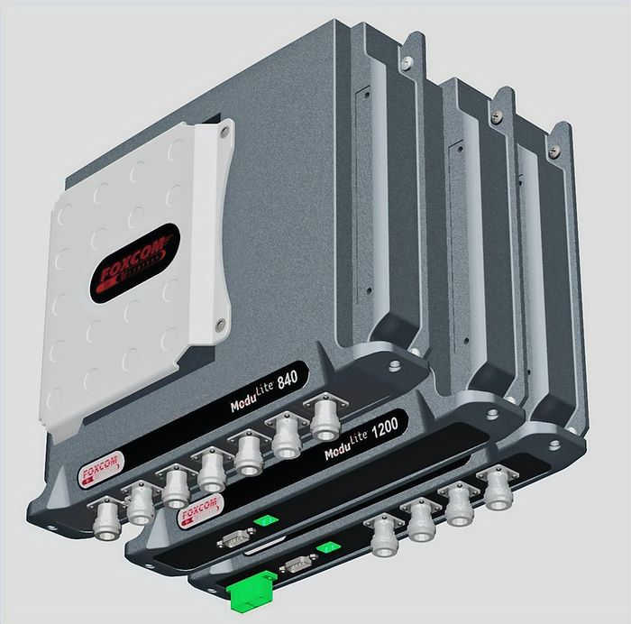

### Chapter 22 - Business Model essentials

Blending Goods and Services Economics

**Figure 22.1 — Getting smart about unit economics**

#### Rationale

This chapter is about the underlying economic forces that drive users and buyers' behavior - as well as vendors' fortunes - in the space of smart tangibles: Things that think, interact, and communicate.

Production Economics, Cost accounting, and Managerial Accounting are well trodden concepts as they pertain to either physical goods or digital wares. However, successfully melding them together to crate smart business models for the sake of better value offering and extraction is a delicate balancing act.  

It is this careful balancing act, though, that opens for extraordinarily lucrative opportunities, so we learned from smart tangible vendors, such as Apple or Tesla. 

---

#### a. Contribution Margin and Break Even Quantities: Economic Viability Assessment

**Figure 22.2 — Business models start simple**

##### What Is Contribution Margin?

At the heart of every productive activity lies the need to generate profit for stakeholders. This profit is derived from the difference between the product’s sale price and its Cost Of Goods Sold (COGS), commonly known as the gross margin, or more precisely, the contribution margin.

This concept disposes of the cost of infrastructures, the complexities of deferred payments, the intricacies of purchasing, inventory management, and ongoing liabilities - as it ignores the expneses involved with R&D and the notorious G&A (General and Administrative). The focus is therefore purely on the economics of a single unit manufactured and sold.

##### Contribution Margin Formula: Unit Economics

As simple as it fundamental to economic life, the principle of "Buy low, sell high" is exemplified in manufactured goods by the imperative to sell products at profit - at the very least at the unit level.

Can't go around it.

> ***CM = Revenue - COGS\***

Where:

-   CM: Contribution Margin

-   COGS: Cost of Goods Sold

https://preview--formula-flow-fc2a90fc.base44.app/FormulaDetail?slug=contribution-margin

##### The Reality of Fixed and Variable Costs

Contribution margin, however, presents an over simplistic version of industrial reality. Operating a business requires infrastructure, which brings about fixed costs.

Such infrastructure must be adapted to the production scale, and in addition to ongoing operational costs, it often includes financing and long-term commitments.

Therefore, when pricing a future product, one must ensure that the projected revenues from anticipated sales volumes cover both fixed and variable costs. This leads to an analysis based on costs, volumes, and profitability.

***P = q × (R − VC) − FC\***

Where:

-   P: Profit

-   q: Number of units sold

-   R: Price per unit

-   VC: Variable cost per unit

-   FC: Fixed costs

https://preview--formula-flow-fc2a90fc.base44.app/FormulaDetail?slug=profit-formula

##### Break-Even Quantity Explained

Let us consider a simplified company, which sells a single product only. The break-even quantity is the number of unit the company must sell to start turning profit.

**Q=FC/(R-VC)**

Where:

-   Q: Minimum quantity required to break even

-   FC: Fixed costs

-   R: Price per unit

-   VC: Variable cost per unit

https://preview--formula-flow-fc2a90fc.base44.app/FormulaDetail?slug=break-even-quantity

This quantity is of important especially when planning: Will sales be able to commit to these numbers within a given budget, and within a timeframe?

It serves as also as a reality check for the convergence of price, cost, quantities - and whether management can envision how these parameters sync .

##### Break-Even Quantity as a ratio between fix costs and margins

Beyond operational costs, infrastructure setup also entails capital investment. This too is expected to be recovered through future sales. A standard tool for evaluating this is Break-Even Analysis, which determines how many units must be sold to cover all fixed and COGS.

To do so we first integrate sales and COGS - through use of the contribution margins. The

> **BEQ=TFC/CM**

Where:

-   BEQ: Break-Even Quantity

-   TFC: Total Fixed Costs (including capital expenditures)

-   CM: Contribution Margin

https://preview--formula-flow-fc2a90fc.base44.app/FormulaDetail?slug=break-even-cm

An important question following this analysis is whether the expected market can absorb the required sales volume – ie, is the project/product/service viable?

##### Strategic Levers: Price and Infrastructure

There is often more than one possible outcome to this analysis, as several parameters are under managerial control:

-   Infrastructure: Lower investment may reduce fixed costs but could increase unit costs.

-   Price: Adjusting unit price affects market acceptance and demand.

---

#### b. The Cost of Capital

##### Time Value and Risk Premium

**Figure 22.3 — Business models start simple**

###### Scope:

In the [<u>previous chapter</u>](https://www.theroadtlv.com/post/business-models-contribution-margin), we explored costs, volumes, and contribution margin. However, two critical dimensions were left unexamined:

Time, and Risk. 

These factors are fundamental in shaping a project’s true profit potential, as they define the **opportunity cost of capital** - the value of the best alternative foregone when choosing one investment path over another of similar risk.

A clear understanding of both internal and external factors enables management to make fair comparisons—_oranges to oranges_. A project must first meet its own internal profitability threshold. Only then can it be meaningfully evaluated against other available opportunities that carry comparable risk.

###### What Is the Time Value of Money?

The **cost of capital** is partly determined by the time during which money is committed.

If you borrow money today, the lender expects compensation not just for the amount itself, but for the fact that it is unavailable to them during the loan period.

One reason or justification is simple: A Dollar today is worth more than a Dollar a year from now. Inflation alone accounts for that, as the cost of living increases over time: the purchase power of that coin erodes over time.

This compensation is expressed through **interest**.

There are two primary ways to calculate interest: **simple** and **compound**.

###### Simple Interest

In this model, interest is calculated linearly based on the original amount (the principal).

*Bₙ = B₀ + n ×* *R × B₀*

Where:

-   Bₙ: Total repayment at the end of period _n_

-   B₀: Initial borrowed capital

-   n: Number of periods

-   R: Interest rate per period

**Example:** Borrowing $100 at 7% interest for 5 years → _Bₙ = 100 + 5 x (1.07)⁵ ≈ $135_

https://preview--formula-flow-fc2a90fc.base44.app/FormulaDetail?slug=simple-interest

------

###### Compound Interest

Here, interest is calculated on both the principal and the accumulated interest from previous periods.

Unlike simple interest, compound interest grows exponentially over time.

*Bₙ = B₀ × (1 + R)ⁿ*

Where:

-   Bₙ: Total repayment at the end of period _n_

-   B₀: Initial borrowed capital

-   n: Number of periods

-   R: Interest rate per period

**Example:** Borrowing $100 at 7% compound interest for 5 years: ➔ _Bₙ = 100 × (1.07)⁵ ≈ 140.3_

This is nearly 4% more than the simple interest scenario.Over longer periods, the gap becomes dramatic - after 20 years, for instance, compound repayment is **over 60%** higher.

As Albert Einstein most probably did not say:  

> _Compound interest is the most powerful force in the universe._
>
> https://preview--formula-flow-fc2a90fc.base44.app/FormulaDetail?slug=compound-interest
>
> ------
>
> 

###### Product Implications - Focus on features that accelerate revenue generation

Features or products that generate revenue (or learning) sooner are more valuable than those that take years to pay off.

**MobileAccess Example**:

This is a pure hardware example. Mobile Access (Then Foxcom, later [<u>acquired by Corning</u>](https://www.corning.com/worldwide/en/about-us/news-events/news-releases/2011/03/news_center_news_releases_2011_2011030201.html)) came with ModuLite, a series of multi carrier multiplexers channeling RF signals over fiber optics from external antennas to in-campus base stations.  

**Figure 22.4 — ModuLite multiplexers**

From the outset, this series was planned to be mass produced. The enclosure material being Aluminum to help dissipate residual heat was supposed to be die cast - a process that would result in low cost, high quality moldings. The problem: Injection dies manufacturing is a lengthy process, with duration of 3 – 6 months for similar products, only then you have to ship the dies to a local facility, or - alternatively - inject overseas and ship the empty enclosures for assembly and testing: Account for additional weeks in transport, customs clearance.

This project, however, was not born in vacuum: A pressing order was due, critically important to the financial prospects of the company.

The solution found for this dilemma was to manufacture the first batch of several hundred units using machining - a much slower, much expensive, and in the long run unsuitable for mass production.

The decision lenses were:

-   How fast can you get to the market?

-   How fast can you start charging for your product?

-   How much would you lower your margins to expediate revenue?

True, in software the answer is usually clearer, with marginal costs approaching 0...

------

##### Risk and Risk Premium

The time value of money, with the relatively constand fact of inflation, does not, however, comprise the whole picture when it comes to the cost of capital.

*Enter Risk.*

While time is an absolute, **_Risk_** is a little more subjective, and it is assessed by the lender (or investor) -based on rating agencies, industry analysts, and the investor's own assessment, based on their domain knowledge and experience. No way to avoid uncertainty: Will the borrower repay on time? Will the return on investment be positive?

To compensate for this , well diversified\* lenders apply a **risk premium** on top of the baseline ("risk-free") rate. \* A well-diversified investor spreads investments across a variety of asset classes, sectors, and geographies to reduce exposure to individual risks and achieve more stable long-term returns.

> *iT = Rf + Rp*

**Where:**

-   iT: Total interest rate

-   Rf: Risk-free rate (e.g., government bonds)

-   Rp: Risk premium (reflecting borrower/investment risk)

**Example:** If government 10-year bonds (until recently considered 'risk-free') yield 0.9% interest, and a venture is considered high-risk, the investor might require a total return of 12%-20% from the venture.

https://preview--formula-flow-fc2a90fc.base44.app/FormulaDetail?slug=risk-premium

Let's discuss this example a bit more.

Suppose you are a lender extending credit to 100 borrowers, of which 5% will default. Let's also assume for simplicity risk premium is the only interest you charge.

If you lent $1 each, and 5% default, you are bound to be $5 in the hole, at the of the cycle.

In order for you just to recoup your initial capital of $100, you must require ~5.3% interest.

This would be the **Risk Premium.**

The problem is, of course, you cannot know in advance the amount of defaults in any single cohort – all you have are assessment and actuary calculations, depending on the nature of the loan (or investment), the time frame, the heterogeneity of borrowers, and the overall economy.

###### Product Implications - Choose MVPs that de-risk future investments

The more uncertain a project’s outcome, the higher the expected return must be to justify pursuing it. PMs must frame early efforts as risk-reduction activities. After all, isn't the whole 'Lean' movement just about that?

###### tvDots MVP:

> Your Newspaper. Now on TV.

Ambitious as it was in pre-LLM 2020, the startup combined text-to-speech and video-creation technologies to convert any news site into an automated, live, TV broadcast grade channel stream.

**Figure 22.5 — tvDots News to Video Pipeline**

The technical challenges were substantial. How can you automatically ingest and parse news stories into a narrator ready text? How do you avoid silly errors and monotonous mechanical narration? Can you do it at scale?

Instead of building the full pipeline, AudioDots opted for integrating 3rd party services both for the TTS and video generation, at a cost of limited control, and substantial uni cost: Each newsclip incurred significant production costs, that would have been minimized with homebrew technology stack.

The decision lenses were:

-   What’s the smallest version of this initiative that reduces uncertainty and still yields usable data?

-   How fast can you get in front of paying customers and design partners?

##### The Opportunity Cost

At the core of every investment decision lies a fundamental question:

> “Do I have better use to this capital?”

Investing a significant amount in a new product doesn’t just commit funds - it closes the door, at least temporarily, on other potential opportunities. Those alternatives might be more profitable, carry less risk, or deliver returns faster.

This trade-off is what defines the opportunity cost of capital. It's not just a financial calculation - it's a reflection of strategic priorities, resource constraints, and competing bets on the future.

In product development, where risk is high and resources are limited, understanding this cost is essential. It helps ensure that capital is not just used wisely, but used where it creates the most value.

###### Product Implications - Ruthless prioritization

Given the competitive nature of all industries, let alone startups racing for supremacy necessary for survival, the cost of capital question boils to prioritization.

What should we build now, what will have to wait?

Prioritization is worth a chapter in its own, especially when addressing smart tangibles (which weigh differently: Hardware gambles are riskier and longer). However, I find RICE the most relevant to the issue of opportunity cost of capital.  

RICE – Reach, Impact, Confidence, Effort  – helps prioritize features by estimating their potential value vs. the effort required.

Considered great for growth and roadmap decisions, it allows comparison between competing strategic alternatives, through the lens of financial planning.

---

'***'

------

### NPV: Profitability Assessment, Done Right:

**Integrating Time, Risk, and Alternative Costs**

**Figure 22.6 — Business models start simple**

#### Is My Project Profitable?

There are several methods used to answer this question, and as any finance professor will tell you, the preferred method is the **Net Present Value (NPV)** calculation.

But first, let address the lexical meaning of this quite complex term:

-   "Net" means after all inflows and expenses

-   "Present" means bringing future (positive and negative) cashflows to current date, accounting for the time value of money and the risk premium assigned to the project.

(Truth to be told, you rarely know all the parameters needed to answer, uncertainties are baked in, and there are many shortcut methods about - each to their benefit and use.)  

NPV addresses the question:

> _What is the present value of a series of future cash flows?_

**Positive** NPV indicates that the project is profitable .

**Negative** NPV suggests the project is expected to lose money.

The calculation takes a series of future cash flows, in their nominal <u>future values</u>, and **discounts** them -meaning it reduces each cash flow based on the cost of capital relative to the present.

An expense of $500,000 today is worth exactly $500,000.

But an expected income of $500,000 a year from now is worth **less** today – depending on the cost of capital, and we need to **_discount_** it by the discount factor based on the time frame and associated risk.  

This is why it is also called DCF - Discounted Cash Flow.

#### NPV Calculation:

The **present value (PV)** of a future sum (FV) is calculated by dividing the future amount by a **discount factor**:

> **_Discount factor =  (1 + R)ⁿ_**

Where:

-   **R** is the interest rate per period

-   **n** is the number of periods

Critically, this discount factor is exactly the "Cost of Capital" mentioned in [<u>section 2</u>](https://www.theroadtlv.com/post/the-cost-of-capital) when we discussed risk premium. While I will not further detail here the making of the cost of capital, you can find further discussion [<u>here</u>](https://www.theroadtlv.com/post/valuation-financing-strategy).

The present value for a cash flow at a future period n is:

Where:

-   **PV** is the present value

-   **FVₙ** is the future value at period _n_

-   **Rₙ** is the interest rate applicable to that period

The value of a series of future cash flows is:

>   **_NPV₀ = FV₀ / (1 + R₀)⁰ + FV₁ / (1 + R₁)¹ + FV₂ / (1 + R₂)² … + FVₙ / (1 + Rₙ)ⁿ_**

(Do note that some of these cashflows can - and will - be negative)

Let’s consider a hypothetical project:

An initial expense of **$500,000 today**, and an expected income of **$500,000 in one year**, accruing interest at period rate of **5%**.

The present value of the future income is:

➔ PV = FV / (1 + R)ⁿ = 500,000 / (1 + 0.05)¹ = 500,000 / 1.05 = 476,190

The Net Present Value (NPV), however, is negative, accounting for the initial expense at period 0:

➔ NPV = -500,000 + 476,190 = -23,810

In other words, there’s no reason to invest in this project. Try it yourself:

https://preview--formula-flow-fc2a90fc.base44.app/FormulaDetail?slug=npv

It’s important to note that the the formula provided took a single interest value R, but in real life, **variable interest rates** (lower one, hopefully) can apply to later stages, when the business stabilizes and the risk decreases.

Indeed, the risk of a project that has already demonstrated, for instance, profitable sales is very different from the risk of a project that is still just a concept.

Additional factors should be incorporated into the NPV model, such as:

-   Inflation

-   Long-term continuity

-   Revenue growth

-   Planned project termination

The core principle, however, remains the same.

Note that there are advanced tools to calculate more complex scenarios - but in the above example I chose clarity over sophistication.

Read about Capital Budgeting in Part 4: Extending Customer Lifetime Value

---

**References & Sources**
All references for this chapter — with live links and archived snapshots — are available at the companion site.

[View Chapter 22 References →](https://yoelf22.github.io/manuscript/references/ch22.html)

