### Chapter 23 - From Recurring Revenue to Customer Loyalty and Beyond

**Winning the Long Game with Smart Products**

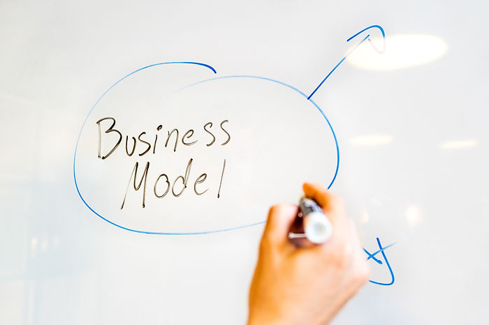

**Figure 23.1 — Business models start simple**

###### Business Models for Smart Products - Section 4

#### The Durable Goods Predicament - One and done

Consider any durable good you can think of: A chair, a TV, a car, a mobile phone. A common trait of durable goods is implied from the very name: They're **durable**. Once procured, they are used through a long period of time, until their (almost) inevitable succumb to wear and tear.

There is no intrinsic relationship between the maker and the users of this product. Next time consumers go shopping for a waste bin, they are more likely to purchase other brands' bin than this particular one. Way of the world.

Consider an archetypal durable good, such as a residential waste bin (Could be any product, really, but I vouch for this particular one, having designed it in 1998):

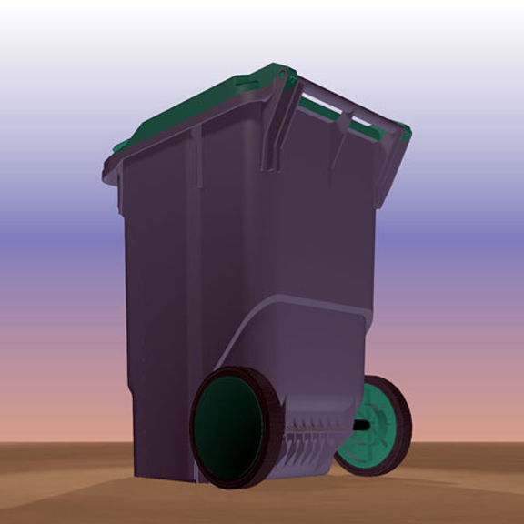

**Figure 23.2 — Dolav 300L Waste Bin**

What is the business model sustaining the manufacturer of such products?...

#### Unit Economics

In this example, we have the BOM (Bill Of Material) cost of all parts

\* All costs are for reference and do not rely on actual data

\*\* Assume capital investment was already amortized

| Part / Process       | Cost       |
| -------------------- | ---------- |
| Main Body            | $12.00     |
| Wheels               | $8.00      |
| Axle                 | $3.00      |
| Cover                | $2.00      |
| Cover hinges         | $3.00      |
| Assembly / Packaging | $2.00      |
| **Total**            | **$30.00** |

Now consider a hypothetical sales price of $40 per unit, and there, you have it: A profit of $10, just above 25% margin - not unheard-of for durable goods. Of course, this is an Ex-Works calculation, ignoring costs and price inflating as we go down the distribution chain.

All this is common knowledge, you might say, and what seems to be the problem, then?...

#### Cost of Acquisition

Well, manufacturing is not enough to put products into the hands of consumers: Marketing and Sales are to be accounted for: Generating awareness, raising interest, and convincing prospective buyers spend their hard won money on our product, (and do it now!), is a costly business.

We attribute marketing and sales costs to the number of units sold, so that we can bake them into the unit economics. Let's say the marketing expenses for said waste bin were $100,000 for 50,000 units sold - this puts the average Cost of Customer Acquisition at $2.00, eating our margins by 20% (but what can you do - this is the way of the world).

#### One and done? Product Life Cycle

I still have one of these 1998 bins. It works... No real reason to replace it, is it? This is my consumer's point of view. Manufacturers' perspective differ dramatically, since they are in the business of churning products - they have to keep the machine going. Consider the sales chart of a single typical durable good: I have plotted an idealized Gompertz derived sales cycle in blue, and the more sinister reality of industrial goods, declining sharply once competition and alternatives kick in.  

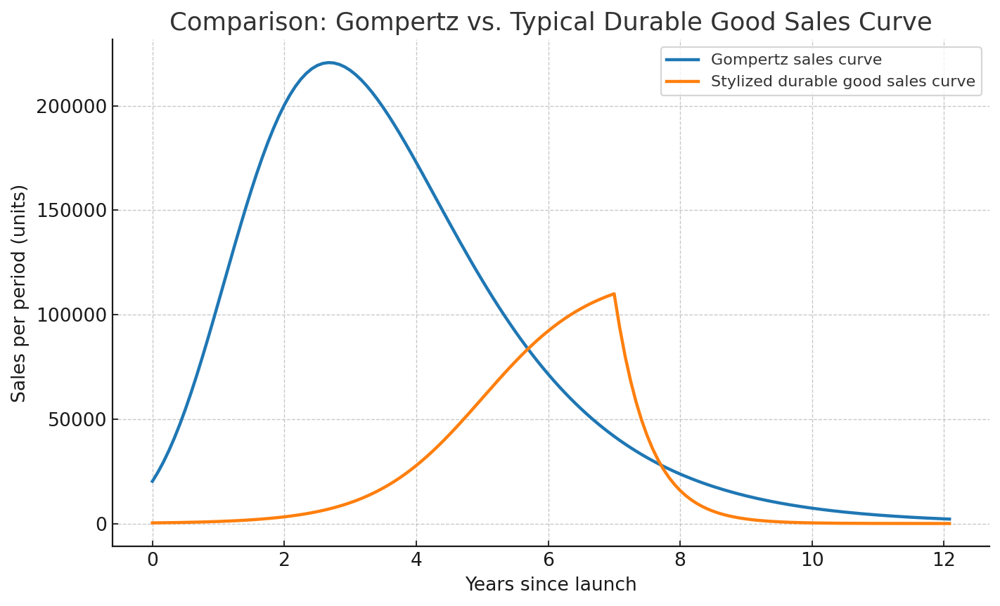

**Figure 23.3 — Typical durable good sales cycle**

Let us now consider the overall financial picture of a successful product:

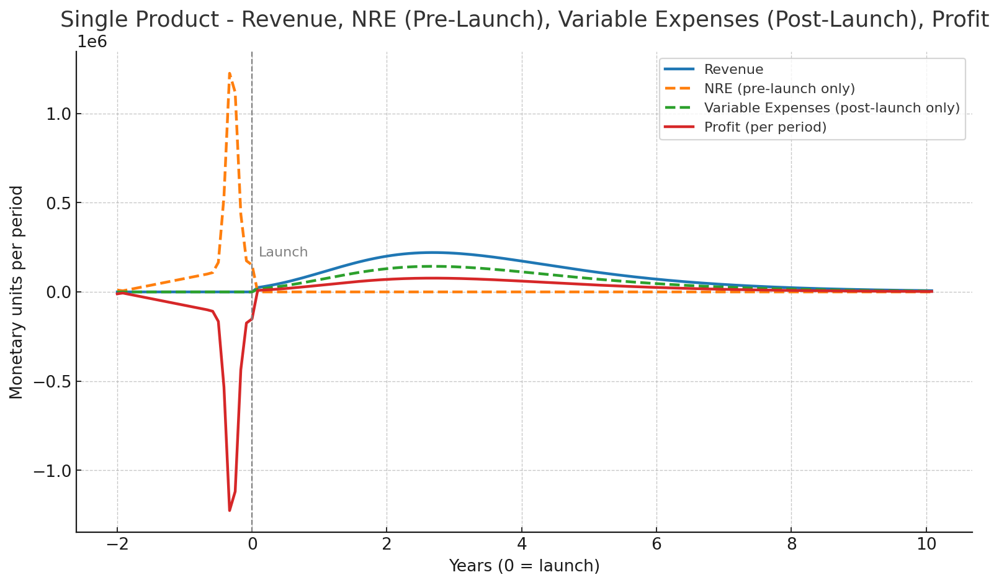

**Figure 23.4 — Financial life cycle of a single product**

As you can observe, there is an accumulation of Non Recurring Expenses (and resulting losses) prior to the launch - this is where R&D, tooling, and provisioning ramp up.

In the waste-bin example above, tooling costs were at 1998's $1.5M range. Post launch, NRE stop, and variable costs kick in, resulting in profit margins (this example is modeled at 35%).

As the products penetrates and saturates the market, revenue dwindles, and manufacturers must, therefore, come with new products, find market for them, build manufacturing capacity, market again - or sales would dwindle to zero. All this, while running the risk of launch failure or mediocre sales performance.

**Figure 23.5 — Expenses peak before and during launch, shown for successive launches**

As you can see in the chart above, launch expenses peak towards and during launch events. Crucially, this is a periodic, repeating phenomenon, requiring capital allocation, deteriorating manufacturers' financial health in the process.  

#### A Side Story: Planned Obsolescence

You know what's in the picture, don't you?  

**Figure 23.6 — The Centennial Light Bulb from Livermore, CA**

–"It's a light bulb"

True, but the full story is that this lightbulb is constantly illuminated since 1901. Yes, you got that right. It is still running 124 years on.

The **Phoebus cartel** - a consortium formed in 1924 between major lightbulb manufacturers including Philips, Osram, and General Electric - took notice of that longevity in horror. While initial market penetration was in full swing, what would manufacturers do when every household and office in the US bought their lifetime-and-beyond enduring lightbulb? This would drive them out of business...

In their infinite wisdom, they set a 1,000 hours lifetime limit on all the lightbulbs produced henceforth, "for the greater good", meaning to increase the purchase frequency, and consequently, their profit, Sherman Anti-Trust Act be damned.

This only goes to show the acuity of the durable good predicament - its durability, and how it impacts the lifecycle, consumer choices, and market behavior.

#### Recurring Revenue Models for Hardware Manufacturers

Although the Phoebus cartel is infamous for its dubious methods, there are plenty of legitimate business models for increasing product revenue.

Companies can, for example, use disposables instead of multi use products: Think of single use surgical masks and gloves. But there are other business models ammenable for recurring revenue.

##### Razor and Blades

Invented and perfected by Gillette, the razor-and-blade approach taken by brands like Gillette and Nespresso saw them rise to global dominance, with varying levels of success.

The first Nespresso machine, Turmix C100, was sold at a whopping $600US, positioning it towards small businesses.

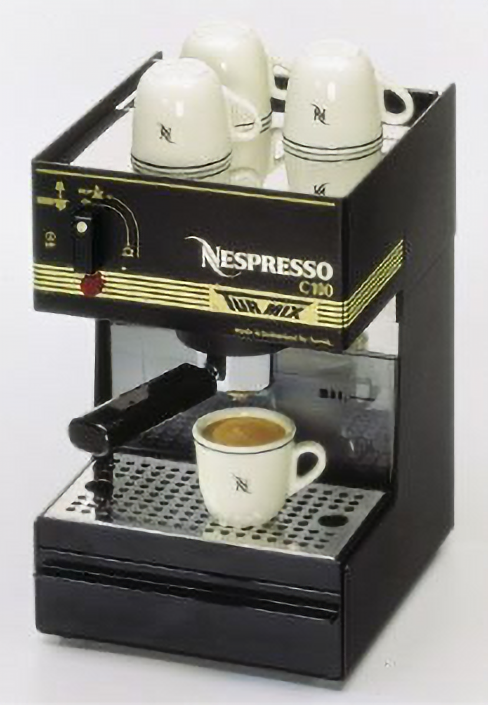

**Figure 23.7 — Nespresso Turmix C-100, 1990**

Similarly to the Gillette blades model, priced at $.60 a capsule - $6.00 a sleeve, the capsules proved to be a huge recurring business - much in line of the FMCG (Fast Moving Consumer Goods) roots of Nestlé.

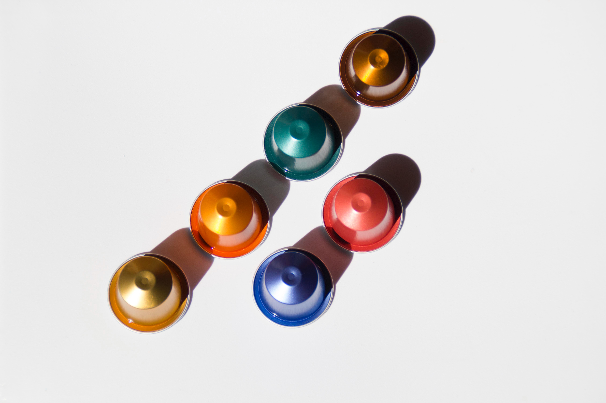

**Figure 23.8 — Nespresso Capsules**

So much so, that a succession of models followed, each at a decreasing price point, culminating at the Nespresso Inissia, retailed at rock-bottom $99.  

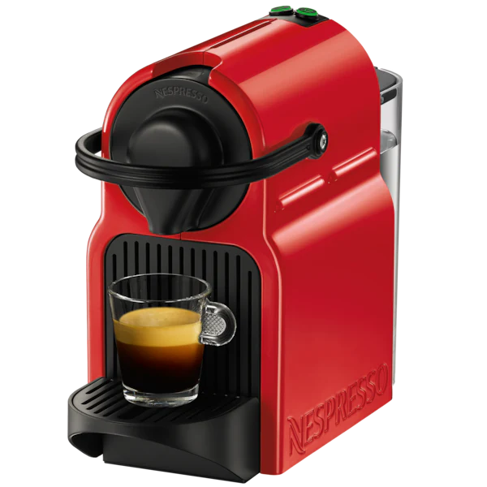

**Figure 23.9 — Nespresso Inissia**

Interestingly, once Nestlé's [<u>patent</u>](https://patents.google.com/patent/US4136202A/en) on the capsule design expired, an army of competitors rushed in - driving capsule price down.

Until then, at least, Nestlé ran a very healthy consumables business, with customer Life Time Value estimated in the thousands:

<table data-hook="table-component"><colgroup><col><col></colgroup><tbody><tr><th data-hook="table-plugin-cell">
<strong>SKU</strong>
</th><th data-hook="table-plugin-cell">
<strong>Cost</strong>
</th></tr><tr><td data-hook="table-plugin-cell">
Nespresso Inissia - machine
</td><td data-hook="table-plugin-cell">
$99.00
</td></tr><tr><td data-hook="table-plugin-cell">
Annual capsule consumption (capsules per machine)
</td><td data-hook="table-plugin-cell">
850~1250
</td></tr><tr><td data-hook="table-plugin-cell">
Customer Lifetime in years
</td><td data-hook="table-plugin-cell">
3~5
</td></tr><tr><td data-hook="table-plugin-cell">
Total expected consumption (capsules)
</td><td data-hook="table-plugin-cell">
2,550~6,250
</td></tr><tr><td data-hook="table-plugin-cell">
Capsule price
</td><td data-hook="table-plugin-cell">
$.60
</td></tr><tr><td data-hook="table-plugin-cell">
Total expected consumption (USD)
</td><td data-hook="table-plugin-cell">
$1,550~3,930
</td></tr><tr><td data-hook="table-plugin-cell">
<strong>Total Customer Lifetime Value</strong>
</td><td data-hook="table-plugin-cell">
<strong>$1,650~4,030</strong>
</td></tr></tbody></table>

Now let us look at the revenue schedule for this machine+consumable hybrid:

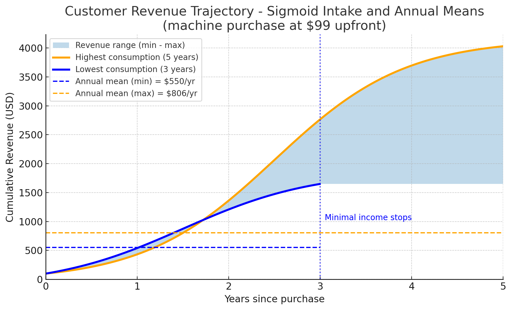

**Figure 23.10 — Customer revenue trajectory for machine / consumable hybrid**

Ask your finance people: Is it easier or harder (= expensive) to finance this kind of revenue stream, compared with the saw toothed pattern of the 'one-and-done' unit sale?

##### Product Service Systems

Another recurring business model - originally pioneered by Xerox with their leasing and pay-per-print services - is John Deere’s Product-Service System (PSS). This model combines advanced machinery with digital technology and bundled services.

Rather than simply selling equipment, John Deere offers “Solutions as a Service,” giving customers access to the latest agricultural technology at lower upfront cost. Farmers only pay for the features and services they actually use, while also benefiting from continuous updates and retrofits.

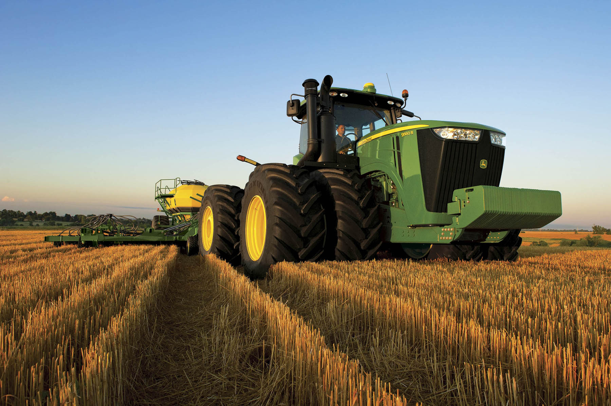

**Figure 23.11 — Recurring revenue roaming the fields**

##### Infrastructure as a Service

The internet age brought a special class of products: Infrastructure as a Service, (AKA PaaS - Platform as a Service).  

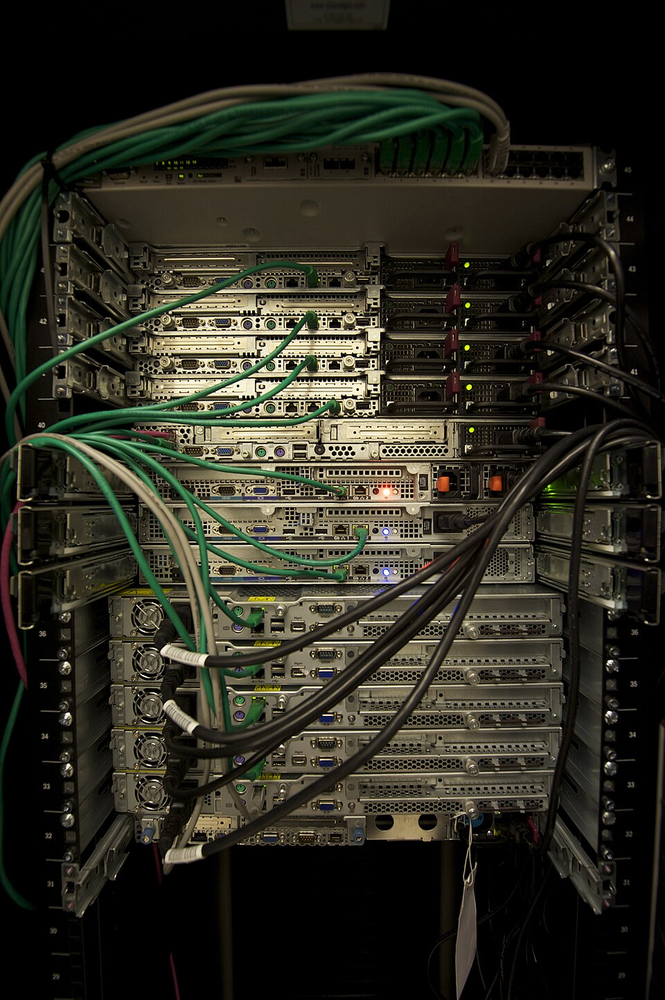

**Figure 23.12 — Servers in a rack: the real hardware behind the cloud**

Offered by providers such as AWS, Azure, Google Cloud, Dropbox, and many many others, it allows users \- consumers and business alike - connect remotely, running CPUs, storage devices, and basically pay-as-you-go, through a variety of models - rent the machine, pay per traffic, pay per storage, per compute, per user... Huge capital investments and large operational resources are split between myriad users, each obtaining fractional functionality from a vast, bottomless, pool.

#### Platforms and Ecosystems - Smart Models for Smart Tangibles

The latest advances in this business model ingenuity aare closely tied to the rise of smart products. These foster long-term relationships between users and vendors, creating multiple touchpoints throughout the product’s extended lifecycle, even as customers upgrade to newer models.

##### Critical Components of Being 'Smart'

I have found that there are several critical components that must (or are, at least, desirable) for products to become really smart, and sustain smart business models:

-   The physical product must have a digital layer of interaction

-   It has to have a connectivity layer, connecting it reliably to the vendor's servers

-   Products can be upgraded and services 'over the air'

-   Content delivered, and data collected must be stored in a personalized, user specific, space in the cloud

-   Users entities must be managed across (physical) model upgrade

-   Having a payment enablement layer is rally good

-   Having a market place for 3rd parties even better

Let's discuss the 3 first points. Here we are dealing with basic functionality. My La Marzocco Linea Micra espresso machine comes with a companion mobile app, allowing me to easily configure it. Compared with arcane buttons and levers industrial control competitors, this is light years ahead.  

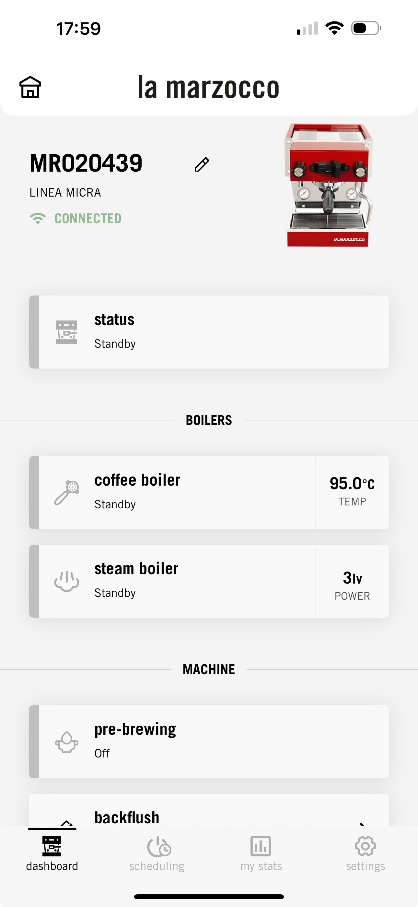

**Figure 23.13 — La Marzocco's mobile dashboard**

With comparable products I'd need a technician servicing the machine, or poring over YouTube for hours on end, just to remember the exact sequence of button presses...

This app reminds me to clean the machine periodically, and keeps the exact recipe of back-flush and brew steps to do it. It also enables an automatic standby mode, so when I leave home at 5:40 I've already had my first cupo' with the machine waking up automatically to warm up.

It has already updated and upgraded the firmware several times since I bought the thing, introducing new features and well received functionality. What can I say? A success.

When we discuss content, a good example would be the photo apps (Google's and Apple's) that keep your photographic history for you, for ever, even when your phone breaks or gets stolen. Now here's a great opportunity for upsell, as the vast amount of online storage offered 'for free' is rarely enough. Smart or not?

Entity management is really key, as it detaches the ownership - and whatever functionality it confers - from the physical object, making it really hard to switch platforms, in an ever so gentle vendor lock-in.

Sinister as it may sound, however, we users get a lot of benefits, mostly for free: All our installed apps and configurations, our photos and videos, our music, our calendar, contacts, and notes, our purchase history - in a nutshell, our digital personality - is kept for us, easily recovered when a device is lost, and relatively protected from thieves and intruders.

Next, the commercial enablement of these smart products is one masterful blow: Apple requires credit card data just to unbrick the thing, resulting in a button-push away future expenses, in a secure environment.  

What's more, as a payment enabler, Apple Pay, and Google Pay can collect numerous, however tiny, fees from vendors. Apple's move to issue its own credit card enlarges the potential for processing fees even more.

Finally, the payment enablement led to the creation of the App Store, Google Play, laying ground for important market places for games, music, videos, and apps - generating revenue in the (multi) billions, at very handsome profit margins, too.

In this move, both platforms harness 3rd party developers and content creators, leveraging these platform as their main distribution channel, for a (sometimes hotly contested) distribution channel - and they are not alone.

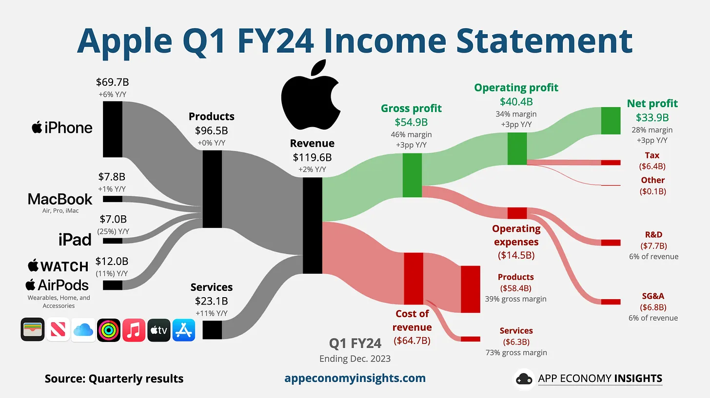

**Figure 23.14 — Apple's services revenue breakdown. Source: App Economy Insights**

Apple's services (19% of overall revenue) grew +11% Y/Y. It includes the App Store, Apple Music, Apple Pay, AppleCare, Apple TV+, Apple Arcade, Apple Fitness+, iCloud+, and more. They also include that juicy annual payment from Google to remain the default search engine on Apple devices (estimated at [<u>$20 billion</u>](https://www.appeconomyinsights.com/p/alphabet-cloud-overshadows-ad-rebound) per year).

Another example is Roku's Channel Store, scheduled to generate just over $4 billion - which trades video advertising slots programmatically and splits revenue between broadcasters and the platform.

**Figure 23.15 — Roku Channel Store**

Roku's hold on users, by the way, is also based on a range of physical devices. Interestingly, the user accounts may be linked to paid for services (such as Apple TV), but the main source of revenue is its programmatic advertising network, available to broadcasters and advertising agencies, in a classic B2B2C model.

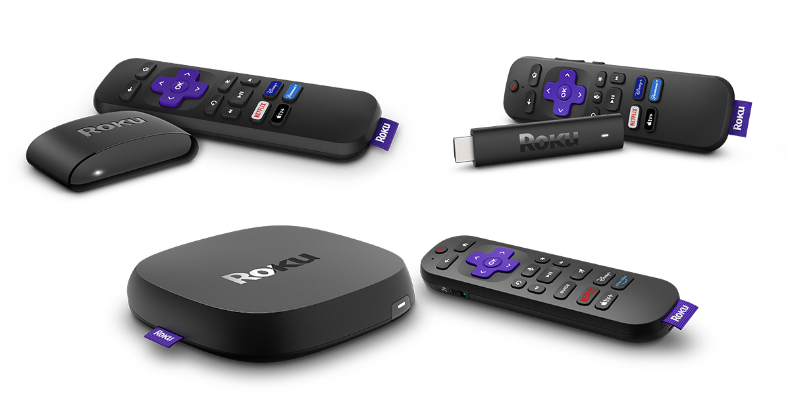

**Figure 23.16 — Roku streaming devices**

------

#### Smarting up the Business Model

In this post, I described how traditional durable goods suffer from a “one-and-done” model: once sold, the manufacturer’s relationship with the customer effectively ends. Margins are limited, sales cycles peak and decline, and companies face constant pressure to launch new products, absorb high pre-launch costs, and risk failure.

Strategies like planned obsolescence (Light bulbs, as well as the notorious inkjet cartridge lifetime deprecation) have extended revenue streams, but often artificially and not without enraging consumers and regulators.

Smart products redefine this dynamic. By embedding connectivity, digital interaction, and cloud services, they transform one-time transactions into ongoing relationships. Features like over-the-air updates, content storage, entity management, and built-in payment layers create the inrastructures needed for business model expansion.

The intrinsic, vendor generated, increased value conferred on customers increase loyalty and stickiness, and elongate customer life time and value - even when contained within the vendor's core offering. But when really smart vendors manage to build marketplaces, attracting 3rd party creators, they create a solid revenue source, based on recurring touch-points that lock in users, generation after generations of the initial product.

------

#### Expected Financial Impact of Smart Business Models

Consider three consecutive upgrade cycle for two comparable  (average model) products:

-   Samsung Galaxy phone

-   iPhone

Let's start with a typical Samsung Galaxy (average model):

-   Average selling price (ASP): ~$950

-   Gross margin: ~42% → ~$400 gross profit per device sold

-   Upgrade cycle: ~3 years

-   Loyalty: ~76% (customers who return to Galaxy at their next upgrade)

The customer lifetime value in this case is about $933

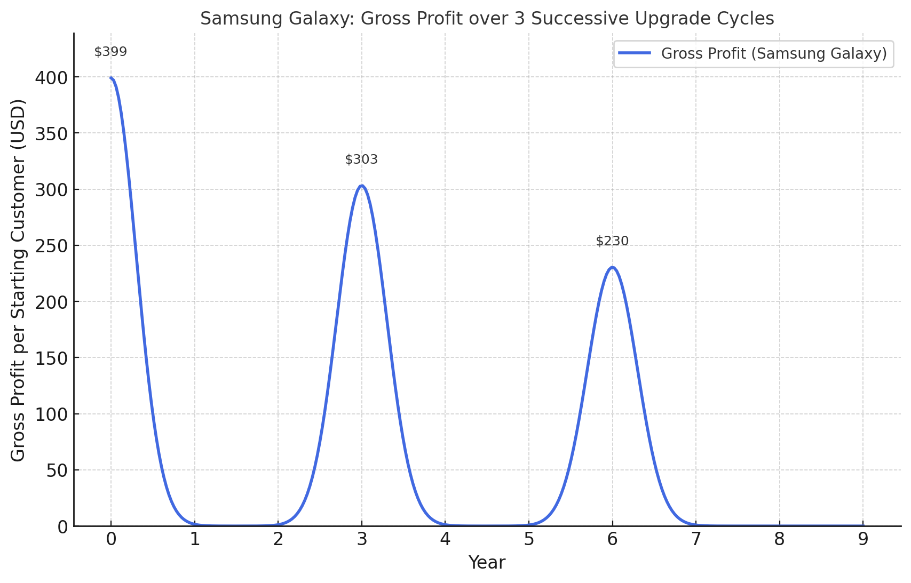

**Figure 23.17 — Samsung Galaxy customer gross profit streams**

Now let's review iPhone as a comparable product:

• Average selling price (ASP): ~$950

• Gross margin: ~58% → ~$550 gross profit per device sold

• Upgrade cycle: ~3 years

• Loyalty: ~89% (higher than Samsung, meaning fewer users drop off each cycle)

If Apple relied on hardware alone, its profit curve would look much like Samsung’s: Three spikes at years 0, 3, and 6, gradually shrinking with attrition. Hardware alone yields about $1,478 gross profit per starting customer over 9 years, already higher than Samsung thanks to stronger margins and loyalty.

But Apple’s model doesn’t stop there. It layers recurring revenue streams that smooth out the troughs between upgrades:

• Apple Services (iCloud, Music, TV+, Arcade, Fitness+, etc.): ~$70 gross profit per year.

• 3rd-party App Store commissions (“Apple Tax” at an average 20% of app sales): ~$11 gross profit per year.

• Apple Pay & financial services fees: ~$7 gross profit per year.

Together, these add ~$88/year of high-margin recurring profit, accumulating steadily even when no new iPhone is purchased.

**Figure 23.18 — iPhone customer gross profit streams**

Over three upgrade cycles, the iPhone generates ~$2,270 gross profit per starting customer, more than double Samsung’s.

------

#### Customer Loyalty - The Gift that Keeps on Giving

An often overlooked aspect of products becoming “smart” is the way they foster **greater customer loyalty**, provided the offering is designed to encourage it.

Take **upgrade loyalty** as evidence : CIRP (Consumer Intelligence Research Partners) reports that **89% of iPhone users** stay with iPhone when upgrading - once every 2.9 years, compared to **76% of Samsung Galaxy users**, once every 2.5 years.

The gap is partly explained by differences in **vendor lock-in**. For Android devices like Galaxy, **device** lock-in is minimal. User data, media, and digital identity are largely tied to the Android ecosystem itself, and by extension, to Google.

Android licensing, enforce manufacturers such as Samsung to pre-install Google apps and provide access to the Play Store. This ensures seamless continuity for users but also cements Google’s dominance in search and data collection.

The flip side is that **switching costs between Android brands are low**. Buy any new Android phone, and your experience is almost instantly replicated. For Samsung, that makes customer retention far more difficult.

A survival analysis shows that for the Samsung Galaxy brand, customer lifetime is about 4 years:

Where:

-   **Churn** is the percentage of users quitting each upgrade cycle

-   **Cycle** is the duration in years of an upgrade cycle

Therefore:

> _Galaxy Customer Life Time = 1 / 24% \* 2.5 = 10.4 years_

With iOS the story is very different. Exiting Apple’s ecosystem is cumbersome: apps often need to be bought again, media libraries manually transferred, and contacts reorganized. Most assets are tied to an Apple ID, which has little value once you move to Android.

This high switching friction is a major reason behind iPhone’s strong loyalty. Equally important is the ecosystem stickiness: the effortless integration across iPhone, Mac, Apple Watch, Apple TV, and iPad –whether a user owns the full suite or just a few devices – makes staying within Apple’s orbit all the more compelling.

The resulting survival analysis support a much longer customer life time - consequently impacting the lifetime value, as shown above.

> _iPhone Customer Life Time = 1 / 11% \* 2.9 = 26.4 years_

------

#### Winning the Long Game

That’s how smart products makers can win the long game, with layered cumulative revenue, building platforms that harness the business of 3rd parties, increasing customer's utility and consequently, customer loyalty, life time, and overall revenue.

**Figure 23.19 — Product Capabilities Linked Revenue**

---

**References & Sources**
All references for this chapter — with live links and archived snapshots — are available at the companion site.

[View Chapter 23 References →](https://yoelf22.github.io/manuscript/references/ch23.html)

