### Chapter 25 - Reviving iRobot: Build a Marketplace

iRobot, the pioneer of robotic mopping, faces financial struggles due to competition and a failed acquisition by Amazon. Building a marketplace around its control app, iRobot-Home, could offer a way out by providing home maintenance services and generating additional revenue streams.

**Figure 25.1 — iRobot Roomba: the quintessential robot mopper**

_Disclaimer: The numbers and calculations in this post, are for illustrative purpose only, and should not be construed as financial guidance or advice._

------

#### The Erosion of a Market Leader

At its peak, **iRobot** stood as the undisputed global leader in consumer robotics – the category pioneer, the technological benchmark, and the brand that defined what a robotic vacuum was supposed to be. 

This dominance, however, proved fragile once a wave of low cost, high-proficiency Chinese competitors flooded the market. The combined engineering prowess, rapid iteration cycles, and tightly integrated manufacturing of vendors such as **[Roborock](https://global.roborock.com)** (https://global.roborock.com), **[Ecovacs](https://www.ecovacs.com/global)** (https://www.ecovacs.com/global), and **[Dreame](https://www.dreametech.com)** (https://www.dreametech.com) proved to deliver comparable – and often superior – performance at far lower price points. 

As these challengers advanced, iRobot’s historical advantages eroded: its once-commanding market share slipped year after year, unit sales contracted sharply, and margins collapsed under intensifying price pressure. What began as incremental competition became a structural shift, leaving iRobot’s financials strained and its strategic footing weakened, setting the stage for the company’s low point in the years preceding its takeover.

*Figure 25.2 — Market share trends of leading robotic vacuum manufacturers (2021–2025).¹*

*Figure 25.3 — Unit sales trends of leading robotic vacuum manufacturers (2021–2025).¹*

*Sources: IDC, Vacuum Wars, The Robot Report, Yahoo Finance, 36Kr, Market.us, Statista*

------

#### A Market Pioneer in Crisis

> _Weren't you surprised last week as iRobot said there was “substantial doubt” about it as a “going concern”?_

At the [<u>announcement</u>](https://arstechnica.com/gadgets/2025/03/irobot-says-there-is-substantial-doubt-about-it-as-a-going-concern/), iRobot ([<u>IRBT</u>](https://finance.yahoo.com/quote/IRBT/)), maker of Roomba vacuum cleaners and Braava mopping robots, said it faced an uncertain future, warning investors of “substantial doubt” about its viability after the failed $1.7 billion Amazon acquisition.

The company has cut 50% of its workforce, seen a 47% revenue drop in Q4, and is exploring strategic alternatives, including refinancing or sale.

Ongoing challenges with demand, competition, and macroeconomic conditions cast doubt on its long-term survival, all too emphasized by the resignation of co-founder Colin Angle as CEO.

The falling share price and rising trading activity spoke volumes about the investors' sentiment about these developments:

**Figure 25.4 — IRBT February - March '25**

This announcement came perhaps less surprising, to those aware of the termination of a $1.7B ($61 per share) acquisition agreement between Amazon and iRobot, signed in August 2022, and the ensuing loss in uphill regulatory battles in the EU and the US alike. The deal was [<u>announced dead January 29th 2025</u>](https://media.irobot.com/2024-01-29-Amazon-and-iRobot-agree-to-terminate-pending-acquisition), and it all went south from there, with the share price almost 94% down from its acquisition quote.

------

#### Doubling Down

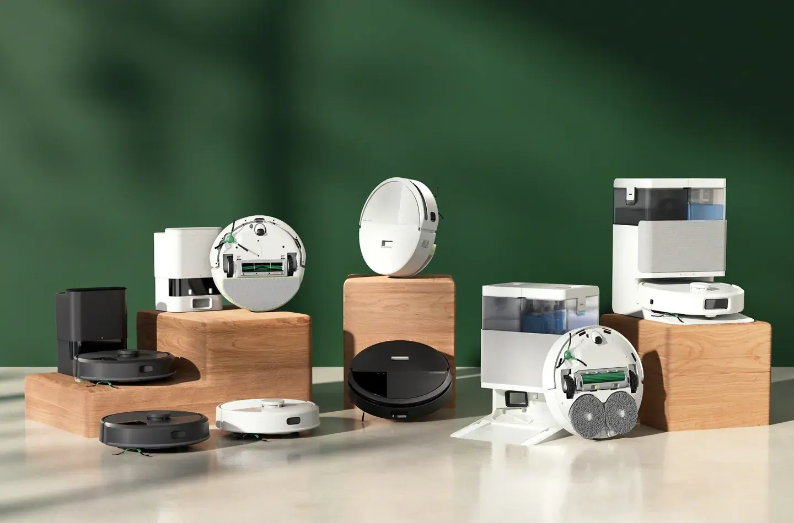

**Figure 25.5 — The new Roomba line-up, launched March 2025**

Despite financial struggles, in what seems to me more of death throes, the company [<u>launched eight new Roomba models</u>](https://www.theverge.com/news/627751/irobot-launches-eight-new-roombas-with-lidar-room-mapping) with lidar navigation and AI features, aligning pricing with competitors like [<u>Roborock</u>](https://global.roborock.com/) and [<u>Ecovacs</u>](https://www.ecovacs.com/global).

Harsh words, indeed, and the reason for me saying so, is that this launch might go into infamy as one deepening the rut, rather than pulling ahead saving this once innovative pioneer of the robotic mopping market.

Previously the copycats, Chinese consumer good companies have long taken the lead - in design, cost efficiency, and the ability to thrive in a commoditizing market. Crying foul won't do much: After all, the benefits of cheap labor and manufacturing were exploited by the very same ailing iRobot.

Back to the recent barrage of new launches: While the question remains, whether these new Roombas succeed, one thing is sure: Victory in a single battle doesn't win the war - especially not a pricing war.

------

#### The Failure of iRobot's Attempt at Hardware as a Service

Every physical product manufacturer faces the stiff reality of the revenue schedule, as they show in the following charts:

First, consider the revenue from a typical consumer: Purchasing their first unit at Y0, then buying consumables before they replace to a newer model, then repeat.

Of course, this schedule is decaying, for churn is inevitable.

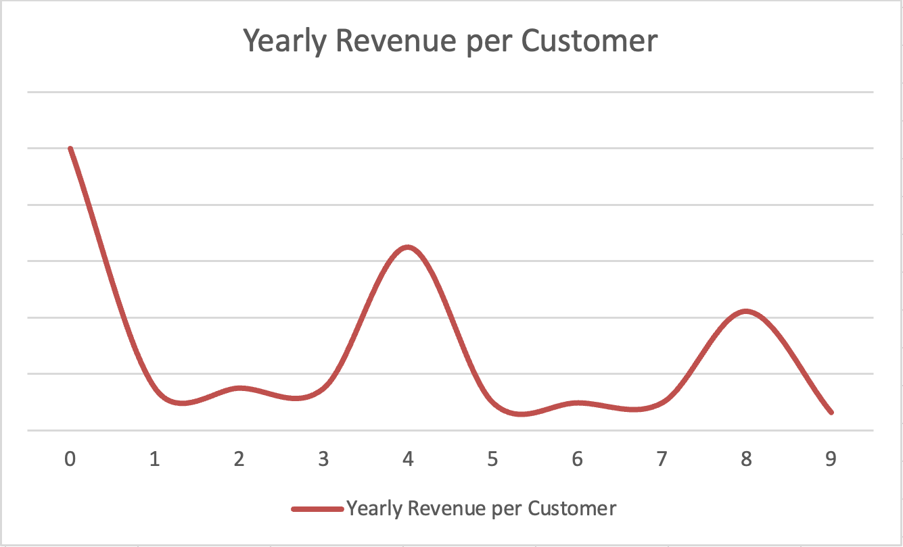

**Figure 25.6 — Revenue over time from a typical consumer**

Next, consider the aggregate revenue from a single product: A big launch brings it to the awareness and demand generation phase, then revenue declines gradually, until it's time to release a new version - generating new hype and demand.

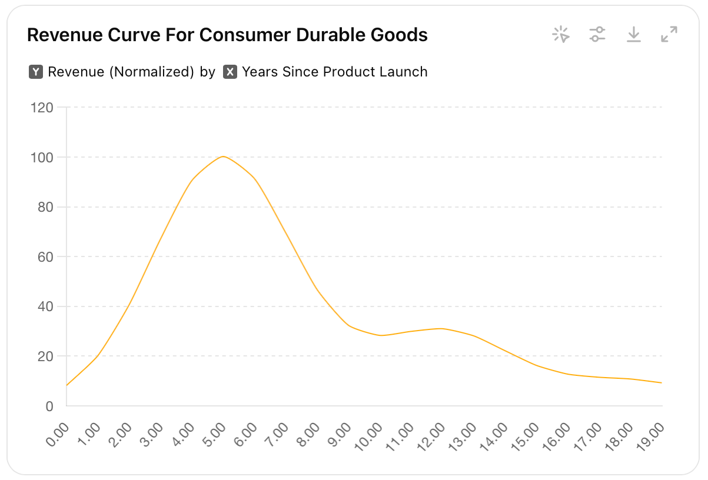

**Figure 25.7 — Revenue from a durable good over the model lifetime**

This reality not only contributes to the cyclicality in durable goods manufacturers' revenue. Combined with the stark possibility that the market shuns your latest and greatest in favor of new entrants: iRobot's business model becomes somewhat brittle.

------

#### iRobot Select (not) to the rescue

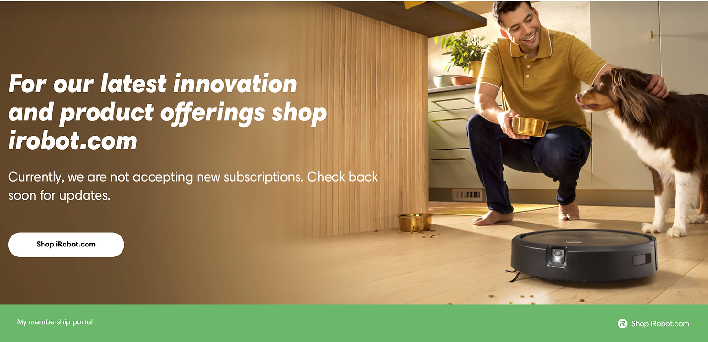

**Figure 25.8 — (Spoiler: Discontinued) iRobot Select program**

iRobot Select **was** a subscription-based program introduced by iRobot that provided members with a premium robot vacuum, accessory replenishments, a protection plan, and personalized support for a monthly fee. The program also offered eligibility for a new robot upgrade every three years.

I have analyzed the potential Life Time Value for subscribers in this program:

#### <u>iRobot Plan NPV</u>

**Active Subscribers Over 48 Months**

\- Months 1-12: Assume no **churn**, meaning all subscribers remain active.

\- Months 13-48: Each month, 5% of the remaining subscribers leave (churn):

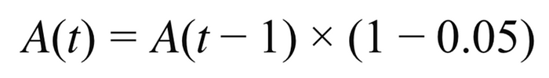

**Figure 25.9 — Active users decay function: A(t) = Active users at month t**

**Compute Present Value of Monthly Cash Flows**

-   Each month's revenue is given by:

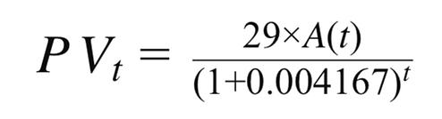

**Figure 25.10 — Month subscription revenue at present value**

-   Summing over 48 months:

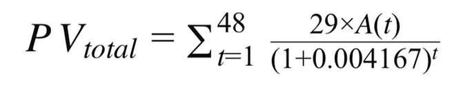

**Figure 25.11 — Total subscription revenue for the period, at present value**

-   Add the program's activation fee ($149), which is paid upfront (no discounting needed).

-   Deduct $179.67, the Cost of Producing a New Roomba Unit

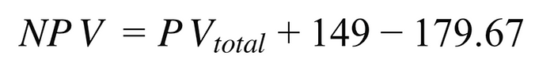

**Figure 25.12 — NPV calculation formula**

**Final Result: NPV of iRobot subscribers**

-   The net present value (NPV) of the iRobot Select plan, considering churn from month 13 onward, is approximately **$729.37** per subscriber.

**Assumptions**

-   Monthly Subscription Fee: $29

-   One-Time Activation Fee: $149

-   Annual Discount Rate: 5%

-   Monthly Discount Rate: 5% / 12 = 0.004167

-   Subscription Duration: 48 months (4 years)

-   Production Cost of a Roomba Unit: $179.67

-   Churn Rate: 0% for the first 12 months, then 5% per month thereafter

#### <u>Alternative Cost and Cannibalism</u>

This plan needs comparison with the alternative, the NPV of a customer that pays $799.99 up front for their unit, then buys consumables (although only 66% rate), then holds the appliance for 4 years.

**NPV of iRobot buyers**

The Net Present Value (NPV) of a customer who buys a Roomba upfront, then purchases consumables at 66% of the subscription rate, and holds the unit for 4 years, is approximately **$1,116.54** after deducting the production cost.

#### <u>Cash Flow Impact</u>

Can we discuss for a minute the impact on iRobot's cash flow? by deferring much of the sales revenue (in excess of 3 years) while incurring production costs upfront, a hole would appear in the ledger, even if the NPV were positive. How large would that be?  

It is often said that US companies excel in execution, and I tend to agree.

Launched in 2021, and - [<u>being consumer cash friendly</u>](https://www.techhive.com/article/2010908/is-irobot-select-worth-it.html) - at least for a larges swath of prospective consumers, I made an educated guess about the number of subscribers per year.

For 50,000 such subscribers, the cash flow impact would then be:

<table data-hook="table-component"><colgroup><col><col><col><col></colgroup><tbody><tr><td data-hook="table-plugin-cell">
<strong>Year</strong>
</td><td data-hook="table-plugin-cell">
<strong>Aggregate Subscriber Cashflow</strong>
</td><td data-hook="table-plugin-cell">
<strong>Aggregate Non-Subscriber Cashflow</strong>
</td><td data-hook="table-plugin-cell">
<strong>Difference</strong>
</td></tr><tr><td data-hook="table-plugin-cell">
Year 1
</td><td data-hook="table-plugin-cell">
&nbsp;&nbsp;&nbsp;&nbsp;&nbsp;&nbsp;&nbsp; 16,200,000
</td><td data-hook="table-plugin-cell">
&nbsp;&nbsp;&nbsp;&nbsp;&nbsp;&nbsp;&nbsp; 45,000,000
</td><td data-hook="table-plugin-cell">
&nbsp; (28,800,000)
</td></tr><tr><td data-hook="table-plugin-cell">
Year 2
</td><td data-hook="table-plugin-cell">
&nbsp;&nbsp;&nbsp;&nbsp;&nbsp;&nbsp;&nbsp; 16,200,000
</td><td data-hook="table-plugin-cell">
&nbsp;&nbsp;&nbsp;&nbsp;&nbsp;&nbsp;&nbsp;&nbsp;&nbsp; 5,000,000
</td><td data-hook="table-plugin-cell">
&nbsp;&nbsp; 11,200,000
</td></tr><tr><td data-hook="table-plugin-cell">
Year 3
</td><td data-hook="table-plugin-cell">
&nbsp;&nbsp;&nbsp;&nbsp;&nbsp;&nbsp;&nbsp; 16,200,000
</td><td data-hook="table-plugin-cell">
&nbsp;&nbsp;&nbsp;&nbsp;&nbsp;&nbsp;&nbsp;&nbsp;&nbsp; 5,000,000
</td><td data-hook="table-plugin-cell">
&nbsp;&nbsp; 11,200,000
</td></tr><tr><td data-hook="table-plugin-cell">
Year 4
</td><td data-hook="table-plugin-cell">
&nbsp;&nbsp;&nbsp;&nbsp;&nbsp;&nbsp;&nbsp; 16,200,000
</td><td data-hook="table-plugin-cell">
&nbsp;&nbsp;&nbsp;&nbsp;&nbsp;&nbsp;&nbsp;&nbsp;&nbsp; 5,000,000
</td><td data-hook="table-plugin-cell">
&nbsp;&nbsp; 11,200,000
</td></tr><tr><td data-hook="table-plugin-cell">
<strong>Total</strong>
</td><td data-hook="table-plugin-cell"></td><td data-hook="table-plugin-cell"></td><td data-hook="table-plugin-cell">
<strong>&nbsp;&nbsp;&nbsp;&nbsp;&nbsp; 4,800,000</strong>
</td></tr></tbody></table>

With iRobot losing money, that pesky $28.8M yearly reduction in revenue is surely painful.

#### The fate of iRobot Select

What have we done?... must any executive in iRobot ask, for last time I checked, **$729.37 < $1,116.54**

Compounded by the growing yearly revenue referral of $28.8M, I believe no tears were shed when they decided to scrap this program.

If there is a lesson to learn, is that <u>financing is not a service</u>, not one that adds value, anyway.

------

#### Digital Services

##### <u>iRobot Home</u>

Founded in 1990, iRobot is no stranger to innovation and digitization, and has launched its control app - [<u>iRobot Home</u>](https://www.irobot.com/en_US/irobot-home-app.html) back in 2015.

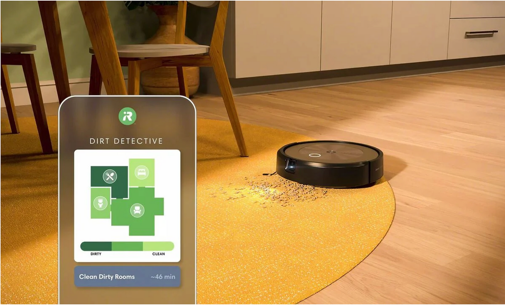

**Figure 25.13 — iRobot Home mapping**

The **iRobot HOME App** (iOS & Android) lets users control and customize **Roomba** and **Braava** robots remotely.

Key features include:

-   **Scheduling** Including personalized schedules

-   **Smart mapping (Imprint™)** Geofencing, allowing Room-specific cleaning, and keep-out zones.

-   **Alexa & Google Assistant** Support for voice commands

-   **Advanced Ai features** Cleaning recommendations

-   **Various norification mechanisms** Real-time notifications, maintenance alerts, and software updates

-   **Multi-robot and multi-user control**

<u>Limited Service Offering</u>

Interestingly, there is not much of a service offering here. Yes, you can order consumables, you may even be able to schedule repairs, but that's it. Not much of a money maker for iRObot, I suspect.

------

##### iRobot Concierge - Build a Marketplace, Create an Ecosystem

###### The Opportunity

As seen, both the defunct iRobot-Select program and the iRobot-Home App are what I would call "introspective", meaning they focus on the existing functionality of the Roomba mopping robot.

They are built for improving the existing user experience, rather than expanding the horizons to cover a more holistic universe of home maintenance, to which the cleaning bots are so central.

There is an opportunity here: Build a marketplace around your product, focusing on a host of routine services such as

-   Lawn mowing

-   Snow shoveling

-   Gutter cleaning

-   Cleaning maid services

-   Pet grooming and walking

The average annual expenditure per household in the US for this host of services approximates at $842.

Additional expenditures include cleaning and gardening materials, pet food, totaling in $2,408.

There are 8.8 million engaged, connected iRobot customers in the US.

Assuming iRobot charges a 5% commission on services booked through its marketplace, the TAM is:

**8.8M x $2,408 x 5% = $1,059M**

Who knows what portion of this opportunity can iRobot grab, but at $681.8 million sales in 2024, this seems as a perfectly adequate one to explore.

###### Comparables: Apple AppStore and Facebook Market

Apple's hand was all but forced to open its appstore to the general developer community, and boy! did that work marvels for them: The birth of the App economy and its explosive growth pays handsomely to the bottom line of Apple:

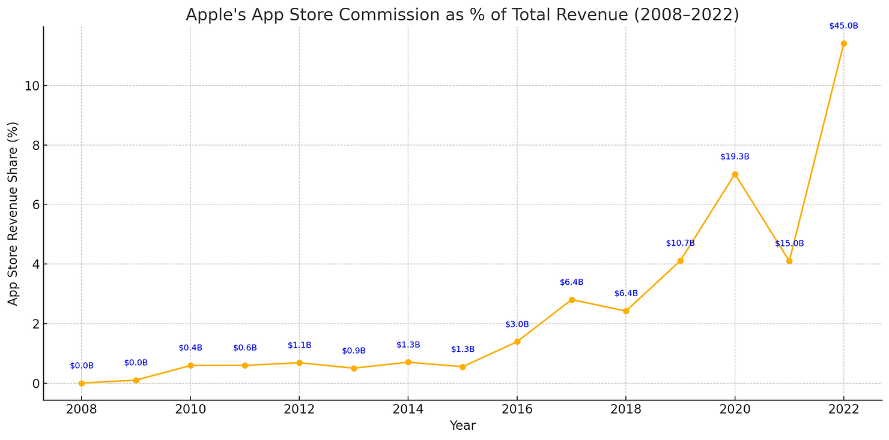

**Figure 25.14 — App Store commission as part of total revenue. Approximations; Apple consolidates services revenue**

Originally meant to strengthen the hardware offering, opening the App Store up to third parties created a strong revenue source, and generated immense customer value. The concept was soon to be copied in Android and by other vendors. Why not for iRobot?...

Another use-case, although detached from a hardware offering is facebook market. This case is interesting because of its local orientation. Most pre-owned products on the market are shown based on geo-location vicinity.

-   With Global Gross Merchandise Volume (GMV) of $26 billion in transactions In 2022, and an estimated Return on Ad Spend (ROAS - a common benchmark for Facebook Ads) of 3:1, Facebook Marketplace sellers [<u>might have spent around $8.67 billion on ads</u>](https://savemyleads.com/blog/other/what-is-the-average-roas-for-facebook-ads).

-   If we attribute 50% of this activity to the U.S. market (given its significant user base), the estimated ad spend by U.S. sellers would be approximately $4.34 billion for facebook market in the US

These numbers hint to a possibility to generate demand that would create a locally oriented eCommerce ecosystem of products and services revolving about iRobot as the center of the modern household.

------

#### iRobot Concierge - Product

The hardest part is in: The iRobot-Home can be easily harnessed to this end, by implementing the following additions.

A short list of potential enhancements to the user experience of the existing app ensues, with what I believe exposes value that consumers might respond to

-   Add timely featured offerings to the main dashboard

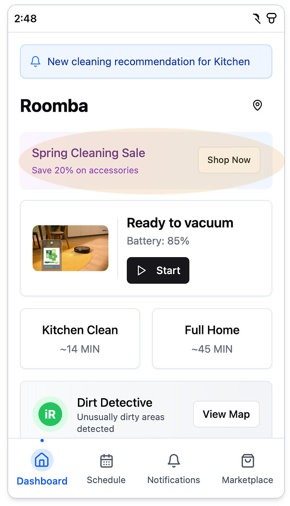

**Figure 25.15 — Add timely offerings**

- Add a marketplace pane. Offerings are local and timely

  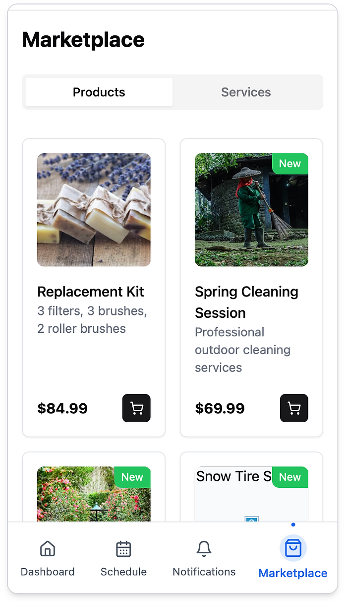

  **Figure 25.16 — Proposed iRobot marketplace**

- Enrich notification pane with up-sell and 3rd party offerings

  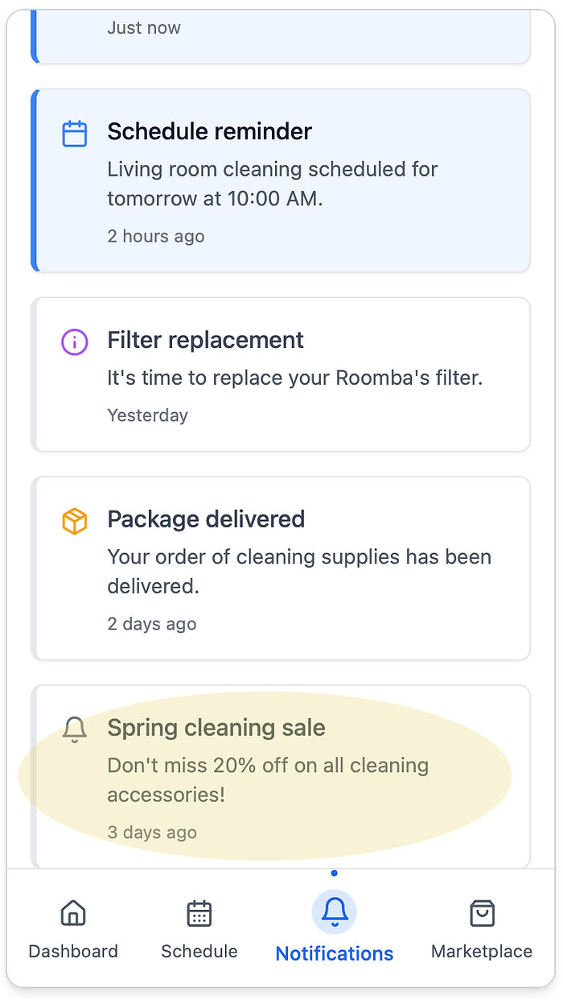

  **Figure 25.17 — Enriched notifications**

- Schedule area beefed with timely offerings

  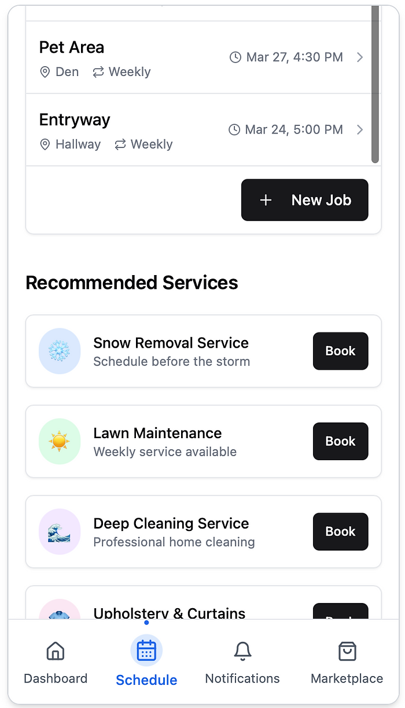

  **Figure 25.18 — Schedule area beefed with timely offerings**

These offerings are bound to convert some iRobot owners, offering a fresh stream of revenue at marginally low cost: There will be an effort to build, maintain and market this new experience to consumers, as there will be an effort to market this virtual e-Commerce venue to local vendors and service providers.

------

#### iRobot - Concierge: The Vendor platform

I have depicted an initial flow for registering businesses and offering services:

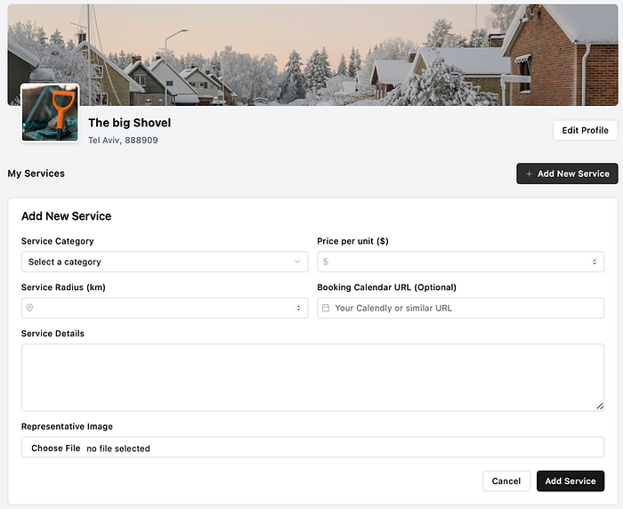

**Figure 25.19 — Business registration page**

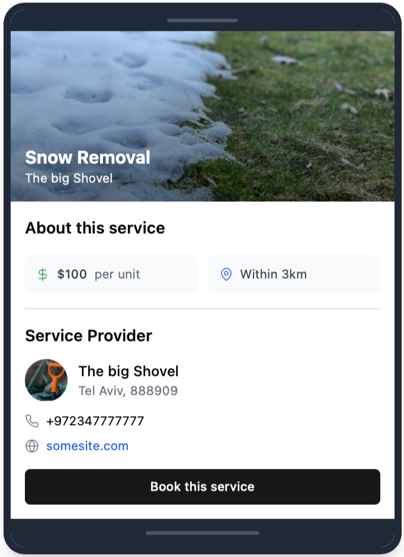

**Figure 25.20 — Service page**

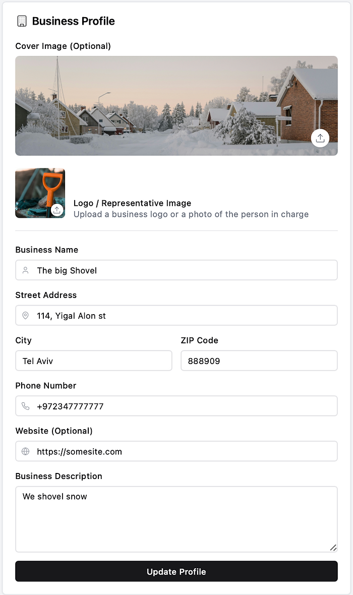

**Figure 25.21 — Business profile**

**Figure 25.22 — Customer service preview**

### The demo

[Homebot portal](https://app--home-bot-hub-5947a1cf.base44.app) 	Customer side

[Business portal](https://app--home-bot-e98bade2.base44.app)	Business side

---

## Endnotes

**¹ Robotic Vacuum Market Data (Figures 25.2, 25.3)**

Estimates were synthesized using recent industry reports, company financials, and market research aggregators. US market split extrapolations were cross-validated by comparing reported global shipments and market share breakdowns from analyst and public company disclosures.

- IDC. (2025, June 23). "Chinese brands suck up more market share in the smart vacuum segment." https://my.idc.com/getdoc.jsp?containerId=prUS53637025
- Vacuum Wars. (2025, February 16). "Robot vacuum market trends: Are traditional vacuums falling behind?" https://vacuumwars.com/robot-vacuum-market-trends-are-traditional-vacuums-falling-behind/
- The Robot Report. (2025, August 7). "Can iRobot bounce back? Deep concerns overshadow $127M Q2." https://www.therobotreport.com/can-irobot-bounce-back-deep-concerns-overshadow-127m-q2/
- Yahoo Finance. (2025, March 18). "Roborock remains the #1 top selling robot vacuum cleaner brand." https://finance.yahoo.com/news/roborock-remains-1-top-selling-054000709.html
- 36Kr. (2025, April 29). "Roborock's profit twice that of Ecovacs: Floor-cleaning robot market competition." https://eu.36kr.com/en/p/3271134528987524
- Market.us News. (2025, January 12). "Vacuum cleaner statistics and facts." https://www.news.market.us/vacuum-cleaner-statistics/
- Statista. (2024, August). "Revenue of iRobot worldwide 2012–2023." https://www.statista.com/statistics/731469/irobot-revenue-worldwide/
- Company annual reports and financial disclosures (2021–2025).