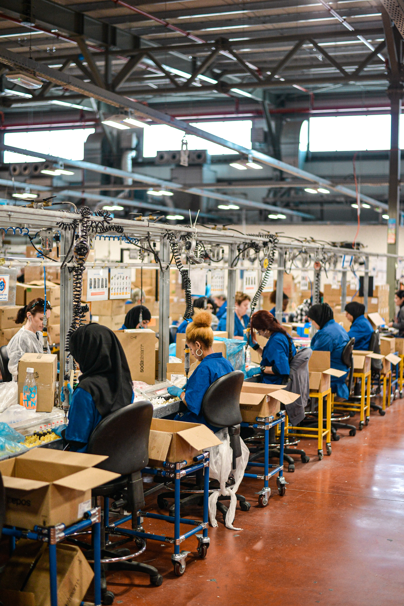
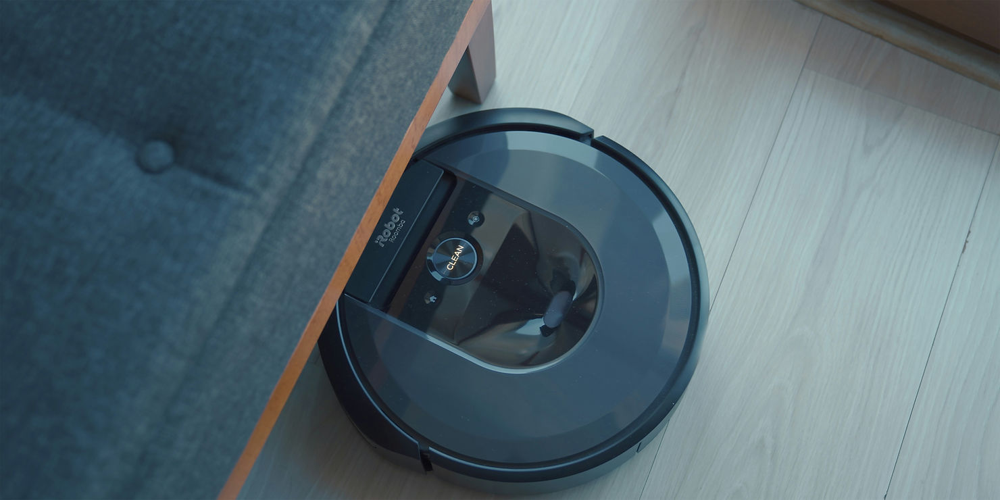
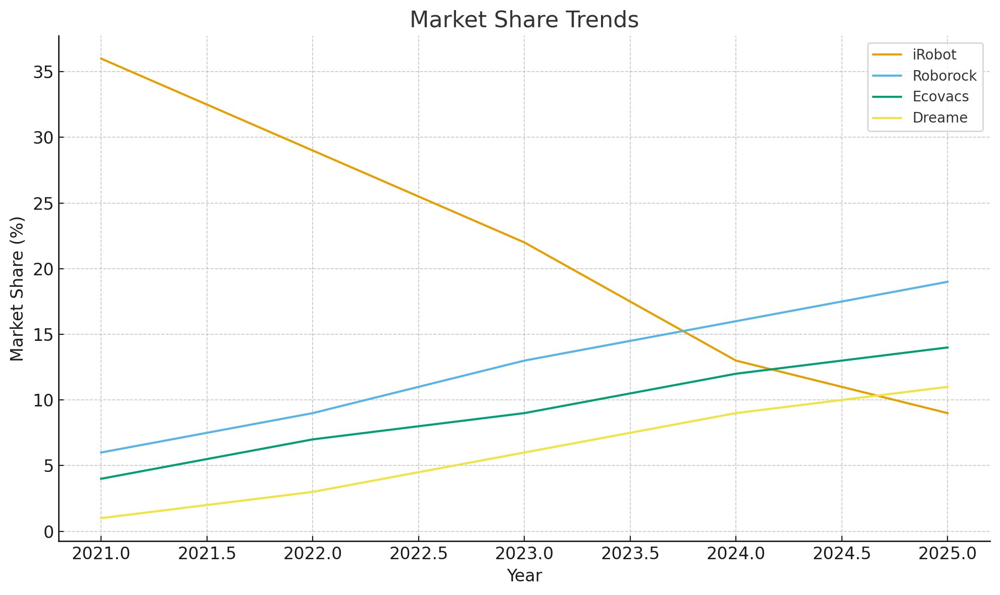
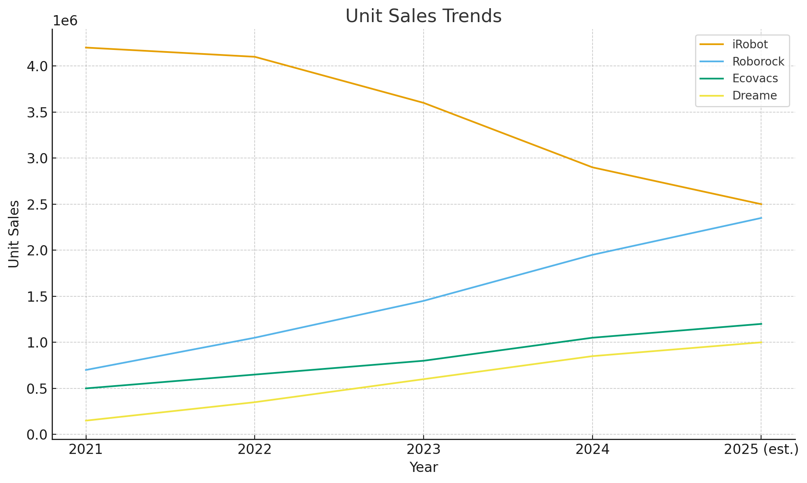
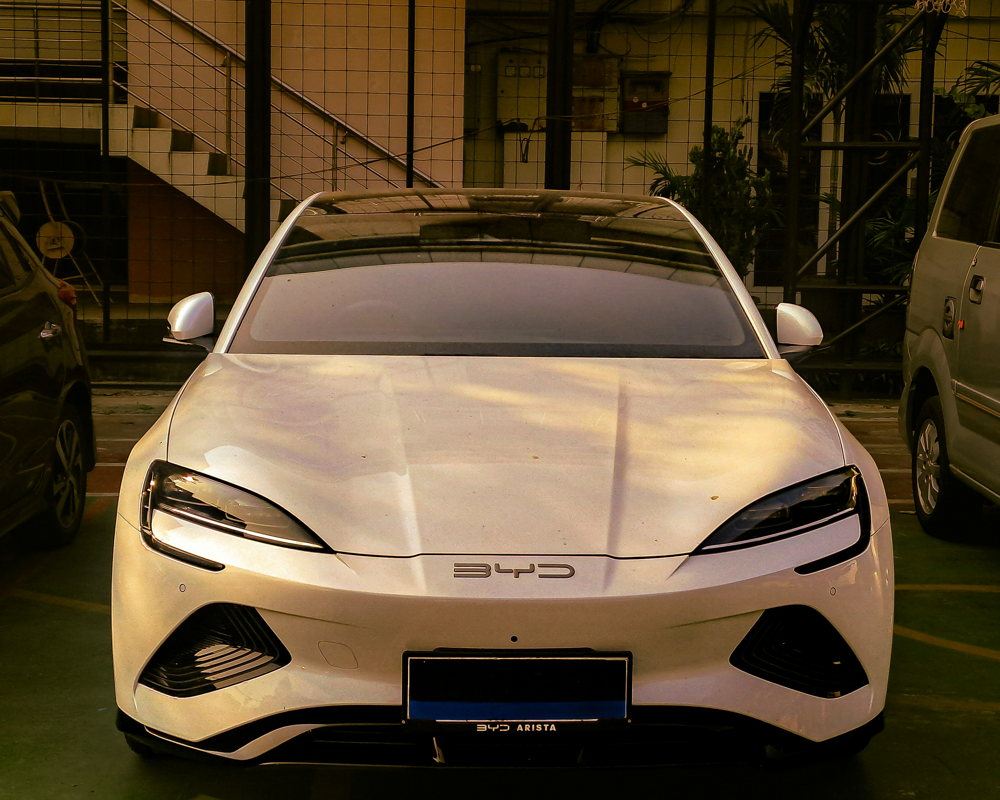
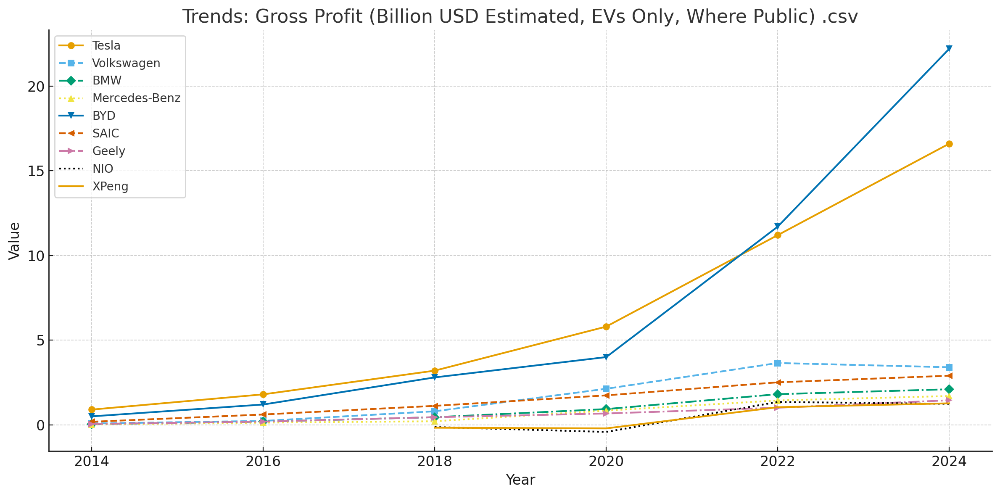

# Chapter 4 - Evolving Competition

In 2019, iRobot commanded over 60% of the robotic vacuum market. By 2024, that share had collapsed to under 25%, overtaken by Chinese manufacturers most Americans had never heard of five years earlier. This wasn't a failure of engineering or vision. It was something more fundamental: the rules of hardware competition had changed, and iRobot was still playing the old game.

*Figure 4.1 — Competitive pressure is real. Photo: Unsplash*

> This chapter examines why the traditional sources of advantage in hardware - patents, manufacturing scale, brand trust, and supplier relationships - no longer provide durable protection. More importantly, it focuses on what *does* endure: the fusion of manufacturing excellence with software-driven adaptability that now separates category leaders from fast-following also-rans.

> The pattern repeats across industries. From consumer robotic vacuums to electric vehicles to industrial equipment, companies that once defined their categories are overtaken by rivals that manufacture cheaper, iterate faster, and learn continuously from deployed products. The question is no longer whether this dynamic will reach your market - but whether you will be the displacer or the displaced.

---

 

## The Old Playbook

Traditional hardware competition was built around tight product-market fit, reinforced by positioning, marketing, and distribution reach – in markets that moved slowly enough for these advantages to compound. Companies built competitive moats through technological innovation defended by intellectual property, economies of scale, and established relationships with suppliers and retailers.

Patents provided meaningful protection for core innovations, while high capital requirements for tooling and manufacturing served as natural barriers to entry. Competition, while intense, followed predictable patterns: incumbents defended their position through incremental improvements, cost optimization, and brand strength.

This playbook worked for decades. It assumed that manufacturing expertise was hard to replicate, that supply chains took years to develop, and that engineering talent concentrated in established industrial centers. Each assumption has since collapsed.

---

## The New Reality: Globalization, Acceleration, and Shifting Leadership

Today's hardware landscape presents fundamentally different competitive dynamics, driven by three structural shifts:

**Manufacturing democratization.** The rise of offshore manufacturing has created unprecedented cost arbitrage opportunities. Companies can now access world-class production capabilities at significantly lower labor and infrastructure costs. This shift has democratized manufacturing access while fundamentally altering competitive economics.

*Figure 4.2 — Chinese manufacture. Photo: Unsplash*

**Accelerated learning curves.** The concept of "learning by doing" has accelerated in global manufacturing hubs, where concentrated expertise and rapid iteration cycles enable continuous improvement in both quality and efficiency. Countries like China have invested heavily in subsidized manufacturing infrastructure—industrial parks, logistics networks, energy systems—creating cost advantages that established manufacturers in high-cost regions struggle to match. This infrastructure advantage extends beyond labor arbitrage to encompass sophisticated supply chains, specialized tooling capabilities, and integrated ecosystem effects.

**Talent arbitrage.** The global spread of engineering talent has shifted competition from capital-intensive to knowledge-intensive. Companies can now tap deep pools of skilled engineers, designers, and production specialists at costs unthinkable decades ago. Combined with government incentives and subsidized R&D programs, this has compressed development cycles and enabled rapid technological progress.

The shift cuts both ways. As manufacturing expertise concentrates in new hubs, post-industrial economies lose practical know-how—not just on factory floors, but across engineering and operational leadership. Innovation doesn't thrive in abstraction; it requires sustained exposure to real production problems. The companies closest to manufacturing learn fastest.

The result is a reversal few anticipated. What Western executives once dismissed as low-cost contract manufacturing has evolved into full-stack design-engineering-manufacturing capability. These aren't copycats competing on price alone – they're increasingly the technology leaders, setting the pace that former incumbents now struggle to match.

---

## New Competitive Requirements

If the old moats have crumbled, what creates defensible advantage today? The most successful hardware companies share a distinct pattern: they compete on dimensions that pure manufacturing efficiency cannot replicate.

**Software as differentiator.** While hardware specifications converge toward commodity, software capabilities diverge. Navigation algorithms, user interfaces, cloud services, and data intelligence create value that competitors cannot always match: not all boundaries have ceased to exist.

**Service layers.** As hardware margins compress, service margins expand. Companies that wrap products in subscriptions, consumables, maintenance agreements, and premium features extract value throughout the product lifecycle rather than solely at the point of sale.

**Iteration velocity.** Traditional hardware makers grew accustomed to development cycles of 2-3 years. This cannot hold as fast moving competitors release new models every 6-12 months. In order to win yet again, manufacturers must restructure their development processes to match this pace on the hardware front. Crucially, rather than far-between discrete generations, they must learn to ship continuously improving add-on software features, constantly adding value.

**Ecosystem integration.** Winners build products that connect – to other devices, to assorted services, to user data – and open for third party developers that can generate ecosystem effects and increase value. A robot vacuum that integrates with local service vendors, creates value and utility that a standalone device cannot. The product becomes a node in a network rather than an isolated appliance.

This combination – software sophistication, ecosystem thinking, service economics, and development speed – defines the new competitive playbook. The following cases illustrate what happens when incumbents fail to meet these demands.

---

​	

## The iRobot Case

For years, iRobot was the uncontested pioneer of the home robotics market. Roomba defined the category, set the user expectations, and held a level of brand trust competitors couldn't touch. But over time, the same elements that made iRobot dominant – early-mover advantage, strong engineering, and a clear product vision – were no longer enough.

As Chinese brands like Roborock, Ecovacs, and Dreame ramped up, they combined sharp hardware design, rapid iteration cycles, and aggressively lower prices to deliver products that met or exceeded iRobot's performance at a fraction of the cost. The dynamic flipped: the copycats became the innovators.

*Figure 4.3 — iRobot Roomba. Photo by [Onur Binay](https://unsplash.com/@onurbinay?utm_source=unsplash&utm_medium=referral&utm_content=creditCopyText) on [Unsplash](https://unsplash.com/photos/a-robotic-vacuum-is-on-the-floor-next-to-a-couch-GVHu2oJimH4?utm_source=unsplash&utm_medium=referral&utm_content=creditCopyText)*

iRobot's numbers tell the story. Once-dominant market share eroded year after year, unit sales declined in parallel, and profitability weakened as the company struggled to compete on both price and capability. Attempts at reinvention - such as consumables-financing models - failed to gain traction.

*Figure 4.4 — Market share trends of leading robotic vacuum manufacturers (2021–2025).¹*

*Figure 4.5 — Unit sales trends of leading robotic vacuum manufacturers (2021–2025).¹*

*Sources: IDC, 36Kr, Yahoo Finance, The Robot Report, Market.us*

Meanwhile, new entrants continued to improve, delivering more advanced navigation, better mapping, and tightly integrated accessories and docks, often months or years ahead of iRobot’s refresh cycles. Competitive advantages that once appeared structural began to look fragile.

The deeper threat was positional. iRobot shifted from defining the category to reacting to it – not because of strategic missteps, but because competitors with lower cost structures and faster iteration cycles simply outran them. By the time iRobot could respond to a competitive move, rivals had already moved again. The pace gap compounded quarter after quarter until leadership had decisively shifted. 

The market iRobot once helped create began moving faster than the company could follow. The challenge was no longer technical catch-up, but regaining relevance in a segment where leadership had decisively shifted to a new wave of manufacturers - including, ironically, one of iRobot’s own former suppliers.

Chapter 24 examines iRobot's strategic options.

---

## The Tesla Case

For most of the past decade, Tesla was the company everyone else chased. It set the pace on technology, margins, brand, and software, while legacy automakers scrambled to imitate its playbook.

But the landscape has changed. Chinese EV makers, led by BYD, have flipped the script by mastering scale, lowering costs, and compressing margins across the entire industry. What Tesla once offered as a unique advantage – vertical integration, battery expertise, rapid iteration – is now being matched, at aggressive price points Tesla's cost structure cannot sustain.

*Figure 4.6 — BYD EV. Photo: Unsplash*

Tesla's gross margins tell the story of competitive pressure in real time.³ At their 2022 peak, Tesla's automotive-only margins were in the mid-20s. By late 2024, these slipped to the mid-teens (14–17%) as price cuts became the primary tool for defending volume. 

Meanwhile, BYD crossed a symbolic threshold: in 2024, it reported roughly 4.3 million NEV sales (BEVs plus PHEVs) and revenue of approximately $107 billion — surpassing Tesla's $97.7 billion. With Tesla's annual deliveries declining 8–9% while BYD's rose 28%, multiple 2025 analyses now name BYD as the world's largest EV maker by volume.

*Figure 4.7 — Gross profit margins (%) in the global EV segment (2014–2024).²*

*Figure 4.8 — Gross profit (in billions USD) for major EV manufacturers (2014–2024).²*

Beyond margins and market share, there is a structural difference in how these companies evolve their products.³ Tesla operates four core passenger models (S, 3, X, Y), with roughly three major refresh cycles across the lineup over the past decade — Model 3's first significant redesign ("Highland") arrived six to seven years after launch; Model Y's came in early 2025, five years in. Chinese competitors operate on a fundamentally different clock. BYD, Nio, and XPeng collectively field dozens of nameplates, with visible facelifts and feature updates arriving every two to three years – and sometimes faster, driven by price-war dynamics. 

Between 2020 and 2025, a typical major Chinese EV manufacturer launched or refreshed five to seven models per year - a cadence roughly double that of Tesla, which managed just three refreshes across its entire four-model lineup. Industry observers routinely describe Chinese EVs as three to five years ahead in styling and in-cabin technology, an advantage driven largely by this faster iteration cadence.

The real threat is that the gap that once protected Tesla has narrowed, not primarily from European manufacturers - who face their own innovation constraints - but from faster-moving competitors elsewhere. Tesla remains a strong player, yet the disruptor is no longer the one setting the rules. The risk is becoming a company that reacts to the future rather than defining it.

While Tesla's trajectory as a brand lies beyond the scope of this book, its achievements as an automobile innovator – particularly its pioneering use of over-the-air updates – are covered in chapters 5 and 16, and its successful fostering of a continuous relationship with its customers is covered in chapter 23.

---

## Conclusion

The pattern is stark. iRobot pioneered a category and still lost its lead. Tesla built the most software-advanced car company in history and yet, these category-defining companies watched margins compress and market share shrink. Both were overtaken not by strategic blunders, but by competitors who combined offshore manufacturing economics with relentless iteration – launching and refreshing products at a pace incumbents couldn't match. The copycats became the innovators.

Manufacturing excellence alone no longer creates durable advantage. Neither does early-mover status, brand trust, or even software sophistication – if competitors can match your capabilities while iterating twice as fast. The question is no longer whether to build smarter products, but what foundation makes that possible.

That foundation has five layers: digital interfaces, connectivity, sensors, firmware systems, and edge intelligence. Together, they transform static hardware into living systems that evolve after sale. Arc II examines each in turn.                                                                         

---

## Endnotes

**¹ Robotic Vacuum Market Data (Figures 4.4, 4.5)**

Sales figures and market share trends consolidated from:

- Market.us News, "Vacuum Cleaner Statistics and Facts (2025)"
- 36Kr, "Roborock's profit twice that of Ecovacs: Floor-cleaning robot market competition"
- Yahoo Finance, "Roborock remains the #1 top selling robot vacuum cleaner brand"
- IDC, "Chinese brands suck up more market share in the smart vacuum segment"
- Vacuum Wars, "Robot vacuum market trends: Are traditional vacuums falling behind?"
- The Robot Report, "Can iRobot bounce back? Deep concerns overshadow $127M Q2"

All figures are consolidated from open, non-paywalled market analysis and aggregator sites covering the US market.

**² Electric Vehicle Market Data (Figures 4.7, 4.8)**

Gross profit and margin data compiled from:

- Tesla: SEC filings, open analyst reviews, trade press
- BYD: Financial reports, CleanTechnica, SNE Research, CNN
- Global industry gross margin benchmarking: CleanTechnica (July 2025), SNE Research, CNEVPost
- German and Chinese auto industry publications for local profit trends (2021–2024)
- Volkswagen, BMW, Mercedes-Benz: Annual reports and gross margin insights (not always EV-only reported; best available segmentation applied)
- NIO, XPeng, Geely: Q2–Q3 2024 company filings; CleanTechnica (July 2025), CNEVPost

All figures use public, trusted sources and reflect best-available industry calculations or disclosures as of November 2025.

**³ Tesla Competitive Position Data**

Margin analysis:
- Tesla overall gross margin peaked at approximately 27.1% in H1 2022; automotive-only margins reached mid-20s (24–25%) in late 2022 before price cuts
- By Q3 2024, overall gross margin had fallen to approximately 19.8%; automotive-only margins declined to mid-teens (14–17%) by Q3 2025
- Sources: Tesla SEC filings, quarterly earnings reports, financial analyst reviews

BYD market leadership:
- BYD reported approximately 4.3 million NEV sales (BEV + PHEV) in 2024, with revenue of roughly 777 billion yuan (~$107 billion USD), surpassing Tesla's ~$97.7 billion
- Tesla's annual deliveries declined approximately 8–9% while BYD's rose roughly 28% to over 2 million pure EVs
- Sources: Company financial reports, CleanTechnica, SNE Research, CNEVPost, industry analyst summaries (2025–2026)

Model refresh cadence:
- Tesla: 4 core passenger models (S, 3, X, Y); Model S/X refreshed ~2021, Model 3 "Highland" refresh 2023–2024 (6–7 years after launch), Model Y refresh early 2025 (5 years after launch) — approximately 3 major refresh cycles across lineup in a decade
- Chinese brands (BYD, Nio, XPeng, Zeekr, Leapmotor): Dozens of BEV/NEV nameplates by mid-2020s; typical visible refresh cadence of 2–3 years; well over 20 substantial model updates across major players between 2020–2025
- Sources: Company announcements, automotive press, industry analyses characterizing Chinese EVs as 3–5 years ahead in styling and in-car technology

[View all Chapter 4 references with live links and archived snapshots →](https://yoelf22.github.io/manuscript/references/ch04.html)

---

**References & Sources**
All references for this chapter — with live links and archived snapshots — are available at the companion site.

[View Chapter 4 References →](https://yoelf22.github.io/manuscript/references/ch04.html)

