# Chapter 5 - Digital interfaces

**Mounting the Flexibility Ladder**

*Arc II layer model: This chapter focuses on the **Digital and Connectivity** layer — how digital interfaces transform fixed physical products into flexible, programmable platforms, enabling every capability layer above.*

A fork cannot change what it does after it leaves the factory. Neither can a sofa, a wrench, or a hammer. They are all made immutable. Fixed behavior, fixed configuration. While every product is an answer to the question *what can it do* — wouldn't it be better if that answer could evolve as needed?

Add an indicator gauge, and suddenly the operator can *adapt the function of that product* – adjusting pressure, fuel flow, speed in response to what the gauge reveals. Add a digital display, and the product can present different information to different users, in different contexts. Add a touch screen, and both the controls and the layout become fluid software – reconfigurable without touching a single mold. Add a wireless link, and the manufacturer can reach into every unit ever shipped and change what it does overnight.

These layered interface capabilities add complexity, but they follow a pattern – a flexibility ladder. Each step up grants the product a new degree of freedom: more options for the manufacturer, better fit for different usage scenarios.

This chapter traces that ladder – from products with no interface at all to products whose entire face is programmable – and shows why interface sophistication is the single biggest lever for product flexibility once the hardware ships.

---

### Fixed Function: Interface Level 0

A 19th-century bicycle offered no human machine interface at all. The rider's legs were the engine, the handlebars steered, the brakes stopped. Whatever feedback existed came directly from the body – the strain in the calves, the pounding heart, the burning lungs signaling effort. Speed was felt as wind on the face. The product itself was pure function: mechanical components serving a single purpose. There was nothing to monitor, nothing to configure, nothing to communicate. As for system monitoring, it was binary. Either the bicycle worked, or it didn't.

The same goes for many mundane objects. Think of a sofa, or a USB plug. No interface. Function is self-explanatory.

  
  

**Figure 5.1 — Look ma! No interface!**
*(a) 19th century bicycle — pure function, no Human Machine Interface (Photo: [Eye Speak](https://unsplash.com/@eyespeak)/Unsplash) — (b) A USB type C connector. No HMI required (Photo by [Marcus Urbenz](https://unsplash.com/@marcusurbenz?utm_source=unsplash&utm_medium=referral&utm_content=creditCopyText) on Unsplash)*

---

### Analogue Indicators: Interface Level 1

Other products, however, cannot operate safely without status signals. Left unattended, kettles would boil dry, steam pipes could burst, and an empty fuel tank would stall a car at the worst possible moment.

This necessity gave rise to analogue indicators: gauges, dials, and warning lights that provided vital visual – and sometimes audible – signals about the state of critical system components. For the first time, the operator could observe what was happening inside the machine and respond accordingly.

These indicators introduced a new control loop. Information flowed from the product to the user, enabling the operator to adjust settings or, when needed, shut down entirely to prevent damage or danger. What was added was not just visibility, but a new dimension of product capability: **information**.

For drivers this meant being able to monitor fuel levels, temperature, pressure, and speed – signals that, if ignored, could turn routine operation into abrupt or even catastrophic failure. The machine was no longer silent. It had learned to speak, and safety depended on listening.

  
  

**Figure 5.2 — Analogue indicators: dials and gauges.**
*(a) Analogue gauge providing visual system feedback (Photo: [Crystal Kwok](https://unsplash.com/@spacexuan)/Unsplash) — (b) Automotive dashboard gauges — temperature, fuel, and engine status at a glance (Photo: [Mustafa ILHAN](https://unsplash.com/@mmpower)/Unsplash)*

---

### Digital Displays: Interface Level 2

For most of history, "digital" meant physical: rotating numeral panels, split-flap boards, carved digits on wheels. These mechanical displays could only show what had been printed or machined onto their elements – limited, slow, and fixed at manufacture.

  
  
  

**Figure 5.3 — Early Digital displays.**
*(a) San Mark's Clock tower, Venice (1752) — early digital time display ([Wikimedia Commons](https://commons.wikimedia.org/wiki/File:0_Venise), CC BY-SA) — (b) Josef Pallweber's slit-flap display patent ([DE 54093](https://depatisnet.dpma.de/DepatisNet/depatisnet?window=1&space=menu&content=treffer&action=pdf&docid=DE000000054093A), 1885) — (c) Mechanical split-flap display detail ( [Wikipedia](https://commons.wikimedia.org/wiki/File:Fallblattanzeigetafel_ausschnitt_ffm_hbf.jpg) )*

Electronics changed the equation. Once displays were driven by circuits rather than gears, content could change at will.

The earliest electronic displays were LED arrays – bright, robust, and simple. The seven-segment variant became ubiquitous: just seven illuminated bars, driven by a small chip, could render any digit, most letters, and some symbols. For the first time, what a product displayed was defined by software, not by physical type. When content exceeded the available space, it could scroll – something no mechanical display could do.

  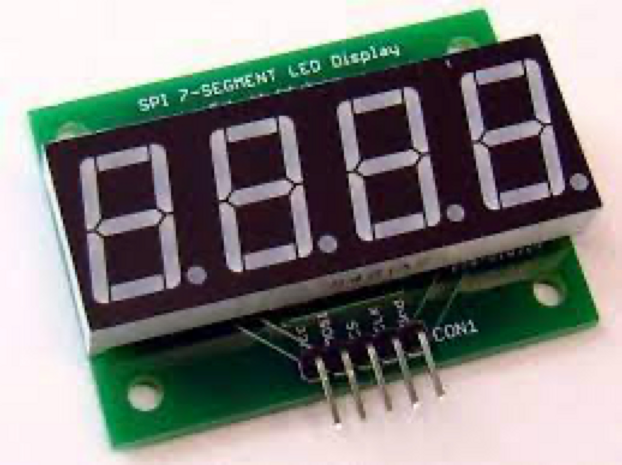
  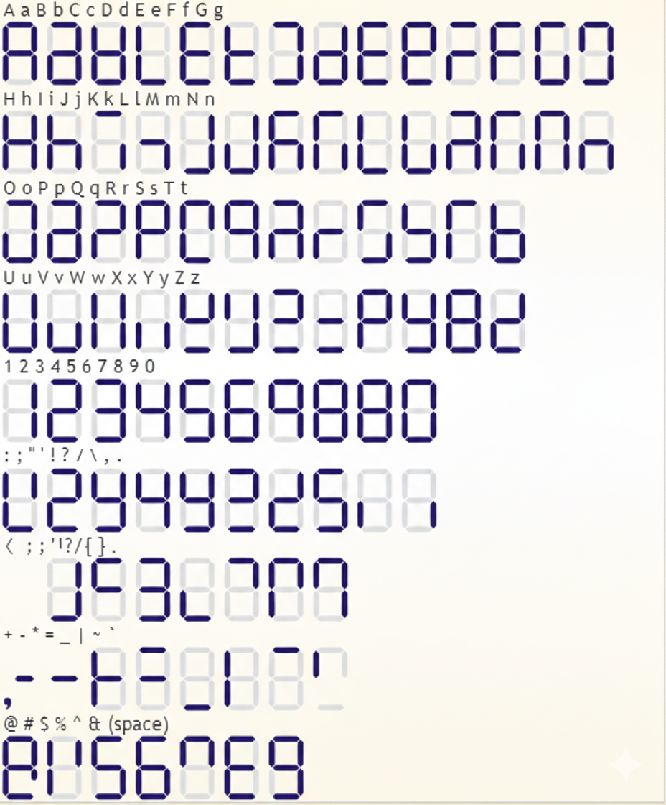
  

**Figure 5.4 — LED displays**

*(a) cable attached LED display module — (b) Example set of roman lettering on seven segment display* 

---

##### Liquid. Crystal. Display

The Liquid Crystal Display replaced discrete light-emitting diodes with etched regions on a glass substrate, dramatically reducing power consumption and enabling use across a wide range of lighting conditions. More importantly, it loosened the rigid typographic constraints of seven-segment layouts. By etching custom shapes directly into the glass, designers could introduce symbols, icons, and graphic elements alongside digits – enabling richer, application-specific visual languages.

I participated in the production of several such displays. Despite their free-form appearance, the process is anything but flexible. The workflow borrows directly from semiconductor lithography: vector graphics are finalized, converted into a physical mask, and sent to fabrication. Weeks later, a prototype returns, while driver logic is developed in parallel. Any mistake or late change sends the entire process back to the beginning, mask and all.

Custom LCDs were visually rich but made production rigid – a tension that would only be resolved by the next leap.

  
  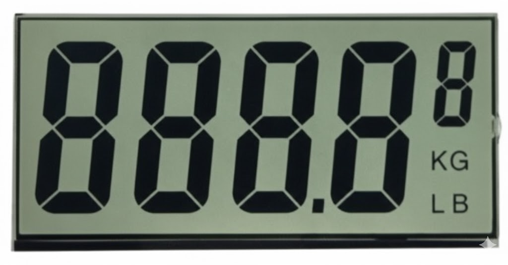

**Figure 5.5 — From custom segments to dot matrix.**
*(a) The ultimate segmented display on Game&Watch Flagman hand held player. Image: [Wikimedia](https://commons.wikimedia.org/w/index.php?curid=70342126) — (b) Graphic LCD with some custom segments*

---

##### Dot Matrix

Dot matrix screens broke that constraint decisively. By treating the display as a grid of addressable pixels rather than predefined shapes, they moved all complexity from the hardware into the controller. The same screen could render letters, multiple languages, symbols, simple graphics, or animations – all defined in software. A single hardware design could now serve multiple markets and evolve through firmware rather than custom glass or tooling, and displays stopped being static components and became interactive, programmable surfaces.

  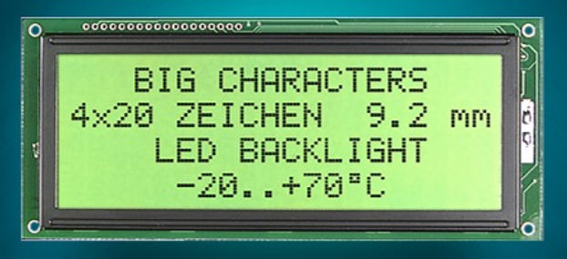
  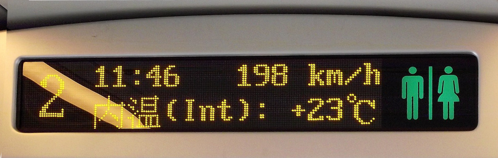

**Figure 5.6 — Dot Matrix accommodates flexibility**
*(a) LCD Module Assembly with Dot Matrix — (b) Interior dot matrix passenger information display inside a China Railways CRH1 high-speed train*

---

##### Color. Sound!

The introduction of color – and later, sound – expanded the expressive range further still. Color was not merely decorative. It enabled visual hierarchy, grouping, and emphasis, allowing users to parse information faster and with less cognitive effort. Sound added a complementary channel: feedback without requiring visual attention, and temporal cues such as urgency or confirmation.

Together, color and sound allowed interfaces to convey nuance – priority, emotion, intent – through lightweight sensory cues rather than additional text or controls. The result was not just richer interfaces, but more efficient ones.

  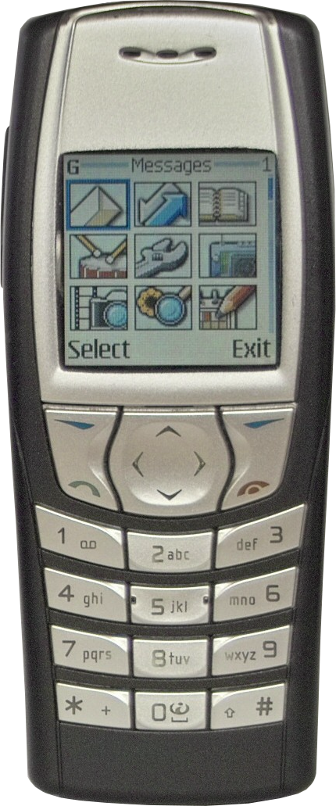
  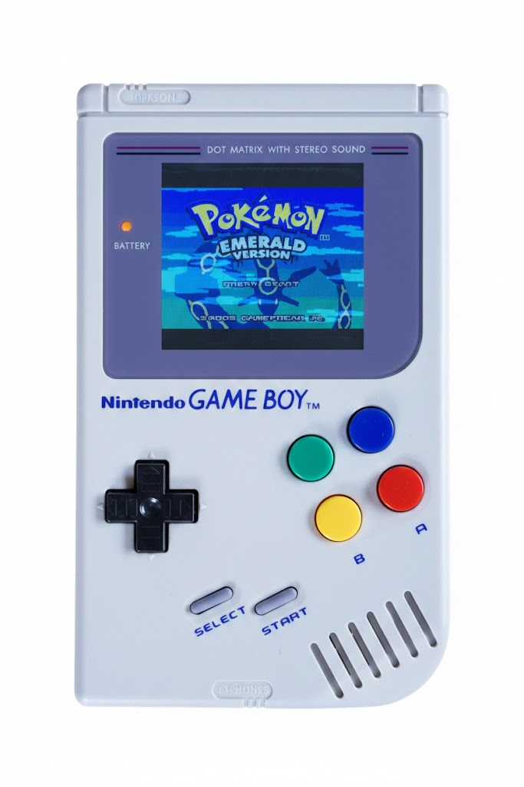

**Figure 5.7 — Color displays in consumer products.**
*(a) Nintendo Gameboy — color dot matrix and rich sound — (b) Nokia 6610i mobile phone showing the device's color LCD display. [Wikimedia Commons](https://commons.wikimedia.org/wiki/File:Nokia6610i.png)*

---

### Touch: Interface Level 3

Anyone trying to draw using a computer mouse knows how unnatural and frustrating the disconnect between pointer and outcome can be. Yes, some do become proficient in digital illustration, overcoming this hand-eye coordination gap, but most of us still miss the immediacy and precision of a pencil tip meeting the paper.

Touch interfaces emerged to bridge this gap, and once they matured, adoption was universal – from toddlers to nonagenarians. Physical buttons, with their fixed placement and behavior, gave way to screens whose layout and function could change dynamically. By allowing visual cues, information, and input areas to shift in real time as users progress, touch displays became the dominant interface medium across product categories.

Designers can place virtual buttons to model complex interactions with few physical constraints, focusing on ergonomics and human factors – and, crucially, iterating furiously. A physical button, once molded, is forever fixed. A software button can be moved, resized, or replaced entirely with a firmware update.

When Apple shipped the iPhone in 2007, it proved that a product without physical keys could outsell every keyboard phone on the market. Overnight, digital interfaces shifted to a software-defined paradigm, gaining flexibility and expressive range.

What was lost in the transition — tactile feedback — was offset by two developments: the rise of multi-touch gestures, which enabled entirely new modes of interaction, and the introduction of haptics, which restored a measure of physical sensation. Direct manipulation, fluid navigation, and gesture-based control reshaped how humans engage with screen-based applications, now pervasive across software-augmented products.

  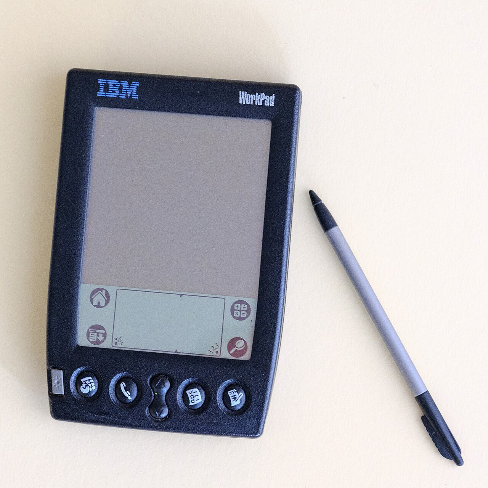
  

**Figure 5.8 — Mixed and Pure Touch Interfaces.**
*(a) IBM WorkPad 8602-30X Palm-OS handheld combining physical buttons and direct pen input. [Wikimedia Commons](https://commons.wikimedia.org/wiki/File:IBM_WorkPad_8602_30X_front_pen.jpg) — (b) Mobile device capacitive touch screen. [Wikimedia Commons](https://commons.wikimedia.org/wiki/File:Bangalore_Wikipedian_on_phone_5_closeup.jpg)*

---

### On Air! Interface Level 4

Those of you in the manufacturing domain know how dearly recalls cost: The loss of face, the cost of shipping back and forth, the possibility of sending a technician to climb a ten-meter pole two hundred km from the nearest airport, at 40ºC below, just to update some firmware... What if all this could be avoided?

Enter FOTA (Firmware Over The Air), providing the ability to download a new firmware version and reboot safely without losing data. A digital interface that can be updated over the air is no longer a static feature. It becomes a living surface, one that the manufacturer can improve, expand, or reinvent long after the product ships.

The old way: drive to the dealer, leave the car for hours, wait for a technician to plug in a service cart. The new way: a file pushed from headquarters at 2 a.m., and every unit in the field wakes up changed. Today this is ubiquitous — every smartphone on the planet works this way. At the time, it was revolutionary. It still is, wherever legacy products haven't caught up.

If you were a Tesla owner in December 2018, you might have woken one morning before Christmas to find a new 'Romance mode': when you switched the heater on, the display lit up with dancing flames and the crackling sounds of a fireplace. A textbook 'customer delighter' in product-speak. Traditional car manufacturers have no answer to this kind of product agility.

  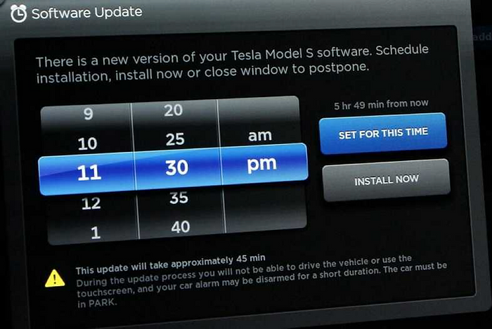
  

**Figure 5.9 — Over-the-air interface updates.**
*(a) Tesla overnight firmware update — (b) Tesla Model 3 Romance mode ([demo video](https://youtu.be/iWI8bfK2wAQ?si=5ASYlXL6aXdj_fPr))*

---

### Fusion: Interface Level 5

Interfaces are no longer limited to what the user deliberately manipulates. A growing set of input methods – accelerometers, gyroscopes, biometric sensors, temperature probes, cameras, microphones – continuously feed contextual signals into the products we carry and use, often without our awareness.

Consider smart watches. They monitor ground speed, cadence, heart rhythm; they detect falls, track sleep – not necessarily through any button press, but by passively sensing the wearer's body and motion. When a smart watch identifies atrial fibrillation or a hard impact followed by immobility, it acts: alerting the user, calling emergency services, sharing location. The interface has shifted from reactive to proactive. The user never asked a question; the product answered anyway.

This pattern is spreading. Thermostats learn occupancy schedules and adjust without being told. Earbuds switch audio sources based on which device the user picks up. Cars dim mirrors when headlights approach from behind. In each case, the product perceives context through its sensors and adapts its behavior accordingly – the interface becomes ambient rather than explicit.

I've seen this shift firsthand. In one project, we turned a phone camera into a fault-free document scanner – optical capture, character recognition, segmentation, and extraction, all running locally on the device. The user pointed the camera at a page and the system did the rest, with no cloud connection required.

What changes at this level is the locus of initiative. At every previous level, the user acted and the product responded. Here, the product observes and the user may never need to act at all. Sensing and interaction merge into a single continuous loop, and the interface evolves from a surface to be operated into a system that anticipates.

  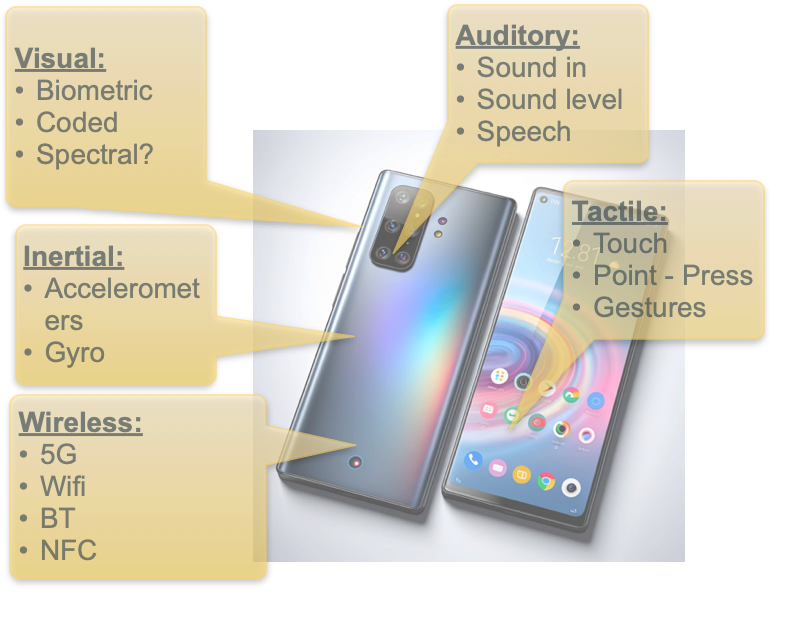
  

**Figure 5.10 — Multi-modal inputs**
*(a) Multi-modal input methods for mobile and wearable devices — (b) NFC (Near Field Communication) used for activation*

---

### Outlasting Controls: Interface Level 6

But what happens when the very purpose of an interface – control and supervision – is itself called into question?

The automotive industry offers a clear example. For most of its history, using a car meant driving it. While dashboards evolved from mechanical gauges to digital displays, and controls migrated from levers and knobs to touchscreens, the underlying assumption remained unchanged: the human was always in command. Interfaces served the driver.

As autonomous driving matures, it breaks this assumption. When humans no longer steer, accelerate, or brake, the interface ceases to be a control surface and becomes something else entirely: a negotiation layer between an intelligent system and its occupants. Continuous manual input gives way to communication – the system conveys intent, status, and limits, while occupants set goals, grant permission, or intervene only when necessary.

In this sense, autonomy completes a historical loop. Where being driven was once a privilege of the wealthy, autonomous vehicles promise to democratize that condition. Responsibility for movement shifts from human to machine, freeing attention for other activities. What changes is not the destination, but the role of the human – and with it, the meaning and function of the interface itself.

  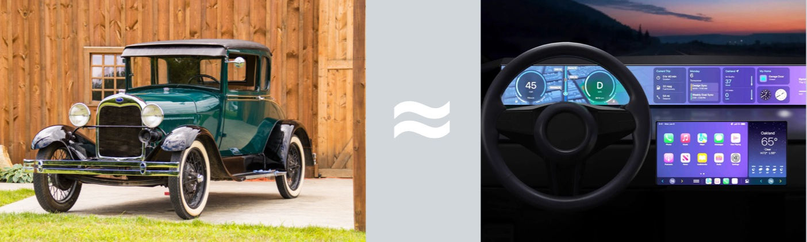
  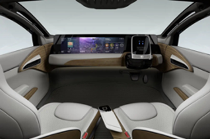

**Figure 5.11 — From Model T to smartphone on wheels.**
*(a) Ford Model T and digitally enabled car — same task, different eras — (b) The driverless car: when driving is gone, what remains is a smartphone on wheels*

---

### The Programmable Face

From analog gauges through digital displays, touch surfaces, and over-the-air updates to sensor-driven interfaces that act before being asked – each generation of digital interface has given hardware products a more expressive, more flexible, more programmable face. And with programmability comes something physical products never had before: the ability to change after they're built.

The flexibility ladder is not a replacement sequence. Lower levels rarely disappear. Analogue gauges still ship in industrial equipment; seven-segment displays still glow on microwave ovens and fuel pumps; physical buttons persist wherever tactile certainty matters – operating rooms, factory floors, cockpits. What changes is where each level sits in the value chain. As higher levels become available, products that stay behind drift toward commodity. The ladder describes not just what a product can do, but where it competes.

This progression, however, raises an uncomfortable question. We've traced how interfaces grew more capable – yet many products shipping today still fail at something far more basic. They can't tell the user whether they're even working. The most sophisticated interface is worthless if the product feels like a black box. That gap – between capability and legibility – is where we turn next.
