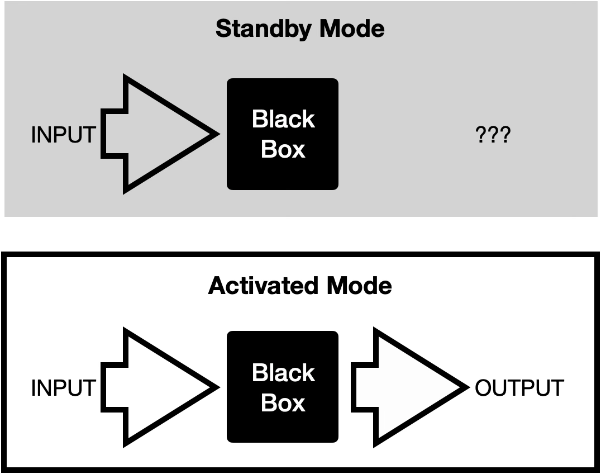
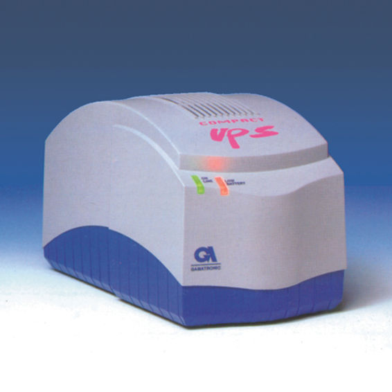
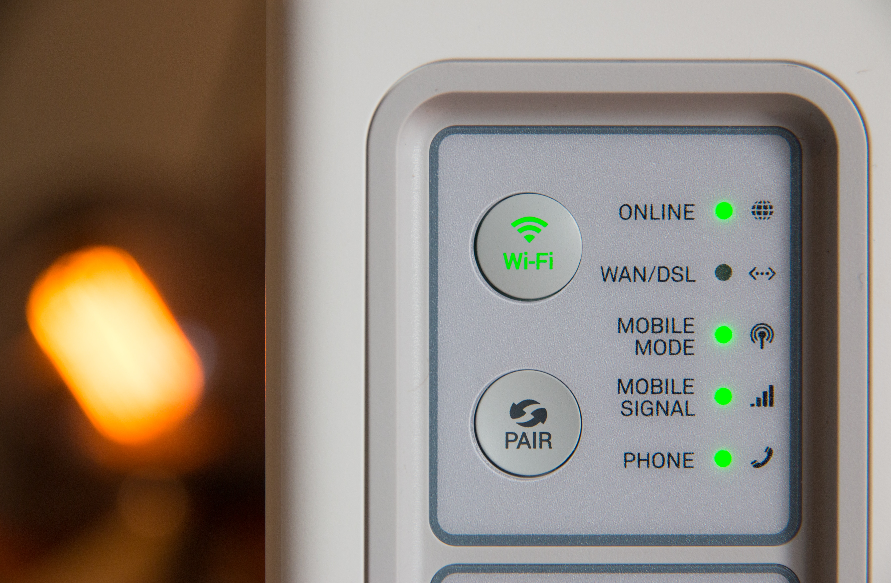

# Chapter 6 — The Machine That Goes Ping

**Standby Products: From Black Boxes To Value Communication**

*Arc II layer model: This chapter focuses on the **Physical Product** layer — how standby products must communicate their value and readiness, establishing the need for the digital and connectivity capabilities above.*

---

## **The Standby Paradox**

The previous chapter traced how interfaces give users increasing control over active products. But what about products whose normal state is silence — whose job is to do nothing until the moment they are needed?

Let us consider a specific category of products: **standby products**. These are the quiet components that sit inside larger systems, under tables, or deep in remote racks. Their defining trait is simple: they do nothing for years at a time. Yet when they are finally called upon, they must not fail. What kind of user interface should they be provided with?

We encounter such products constantly - seatbelts and airbags, UPS (Uninterruptible Power Supplies), fire sprinklers. They vary in how visible or intrusive they are, but they share a defining trait: there is no simple way to know, ahead of time, whether they will function when the moment comes.

Some are even single-use by design. Airbags, for example, destroy themselves in the very act of doing their job. A full reliability test would mean triggering them – like striking a match just to check whether it works.

A powerful illustration is the Flight Data Recorder, commonly known as the "**black box**" — although, ironically, the device housing is always painted bright orange and prominently labeled to ensure it can be found in the wreckage. Most of us will never see, nor ever rely on one. It sits silently through millions of uneventful air miles, consuming minimal power and attracting no attention.

But in the rare event of a crash, everything depends on whether it did capture the right data, and whether investigators can retrieve it intact. Modern aircraft even carry two recorders for redundancy, acknowledging just how critical that moment can be.

And yet the underlying question remains: ***Is this device actually ready?***

Not every standby product protects lives or belongs to a multi-million-dollar system that can justify full redundancy. Many exist in far more modest contexts, where failure is less dramatic but still costly. 

The challenge, then, is the same: how do we trust something that proves its worth only at the moment of crisis?

**Figure 6.1 — Flight Data Recorder (Black Box), displayed at the HAL Aerospace Museum.** Image via [Wikimedia Commons](https://commons.wikimedia.org/wiki/File:Flight_data_recorder_displayed_at_HAL_Museum_7893.JPG)

---

## 'Keep Alive' and Meaningless Output

A cautionary (fictitious) example is shown in the canonical (and hilarious) Monty Python ***Meaning of Life*** delivery-room scene, which portrays the Mother, the Husband, and – eventually – the Newborn, all sidelined by the marvels of a mysterious machine that goes *PING!* at random.

***Figure 6.2 — The machine that goes PING scene from The Meaning of Life (1983) by Monty Python***

What follows is even more absurd: an administrator drones on about "reclassification of the machine's cost to current accounts, rather than to capital expenditure," prompting obedient applause from the glazed-eyed medical staff.

The sketch exaggerates to the point of absurdity the many - and sometimes irritating - ways systems signal their well-being, hence the “keep-alive” label, or conversely, their distress.

Human perception is particularly sensitive to repetitive high-pitched sounds. When poorly designed, these signals do more than inform – they agitate. What is meant as reassurance can quickly become a source of stress, and in extreme cases, genuinely drive users to distraction.

Why bring this up? Because beyond the laughs, the scene captures the alienation that arises when cryptic technology intrudes on our lives without explanation. Product leaders and technology marketers cannot – and should not – risk their products being met with indifference or dismissal. When products are shrugged off as baffling – or worse, alienating – the business suffers.

I once watched, with a mix of fascination and disbelief, a monitoring system installed in a care home ward. It was intended to monitor dementia patients wandering in and out of the protected environment of the ward, as well as make sure the monitoring devices were still in place on their wrists. This kind of command-and-control system typically works forever, updating predominantly with adverse events, but also when patients check in or out.

In this case, false alarms were so frequent that staff had disconnected the speaker entirely. The CRT display was permanently burned in with the ward layout – no one ever scrolled through it, let alone relied on it to read live outputs, and the static illumination traced its mark on the phosphor coating of the display.

This chapter explores a challenge that appears simple on the surface but runs surprisingly deep: when a product cannot demonstrate that it is producing meaningful output, users struggle to perceive its value. For products that operate quietly in the background, status communication is not a secondary feature. It is the primary interface through which value becomes visible.

And this is not merely a design concern – it is a business risk.

Would the care home in the previous example renew its contract for a system that appears underused or ignored? Or would management redirect funds toward more tangible, urgent needs? It would be hard to fault them. **When value is invisible, it is easy to question whether it exists at all.**

---

## The Black Box Problem

**Figure 6.3 — *The Black box model. What's missing? Illustration by the author***

---

This topic came into sharp focus during a conversation with a fellow product manager who works on monitoring devices for intensive care units. The device is used with patients who are only partially conscious and have very limited motor abilities. It monitors their level of awareness, provides auditory stimulation aimed at reducing delirium (ICU syndrome), and serves as a one-way communication channel that allows family members and medical staff to reach out.

The difficulty is that the device’s clinical effect is neither obvious nor immediate, and rarely self-explanatory. Patients seldom show visible reactions to the streamed content, which makes it harder to justify the device’s presence in the fast-paced environment of an ICU.

The concern deepens because the system offers no meaningful feedback - what usability theory calls *system status visibility* - to bystanders, including ICU staff. In practice, it becomes a “black box” in the most unflattering sense: there is no clear indication that it is powered on, properly installed, or even that its sensors remain attached to the patient.

In a busy ICU, where lines are moved and equipment is frequently adjusted, accidental detachment is entirely plausible. Yet if the device were disconnected from a comatose patient, there would be no visible sign that anything had changed.

To me, this is not merely an implementation gap, but a critical design flaw. Further, it is one easy to fix – and therefore, a good product opportunity. Should stakeholders – ICU staff and family members – see that the device is working, attached properly, and calibrated, they would begin to perceive real value. Even minimal feedback would transform their interaction with the device from a seemingly meaningless ritual into a justified practice, one that feels worth the cost, installation effort, and ongoing service.

---

### From Silence to Signal

A variation of the standby readiness problem haunts a very different product category. I mentioned UPS earlier. Indeed, I have a personal stake in this category, as the first electronic device I ever co-designed was one. For 99.99% of the time after installation, there was little one needed – or could – do with them. They simply stood there, quietly gathering dust. 

But every so often, when the mains current failed or surged, the UPS would kick in and keep your system alive for a few precious extra minutes.

***Figure 6.4 – Consumer grade UPS by Gamtronic, circa 1994. Credit: Studio r2d2***

When they didn't, the consequences were costly: lost information, corrupted files, and an entire workday gone, if not worse.

The trouble is, you can never really be sure a UPS is functional. Are all its sensors active? Is its battery charging? Will it actually kick in when the power fails? With barely any indication of its inner workings, you are left guessing.

The ICU monitor and the UPS belong to the same family: *standby products* – devices that deliver their value precisely when nothing visible is happening. Their silence is a feature, but it is also their communication failure. Jakob Nielsen's first usability heuristic states that *"the system should always keep users informed about what is going on"* ([Nielsen Norman Group](https://www.nngroup.com/articles/ten-usability-heuristics/)). For standby products, this obligation is especially acute: if the product's normal state is indistinguishable from being off, how does anyone know it is earning its keep?

***Figure 6.5 — Wireless router with active indicator lights. Photo by [Compare Fibre](https://unsplash.com/photos/white-modem-outer-is-turned-on-LR_wX_klOPM) on Unsplash***

The simplest answer to the black box problem is the status LED. A row of small lights, each mapped to a critical subsystem, provides a visual proxy for system health. With a quick glance, users can tell whether several key functions are working as intended:

-   **Power:** Is the machine on? This indicates whether power is being supplied past the AC–DC converter, a critical and failure-prone component.
-   **Battery:** Is the battery charging? A multi-state indicator confirms proper charging, reflecting the status of both the battery and the charging circuit.
-   **Internet:** Is there an active connection? This LED conveys the success or failure of the modem's periodic ping test.
-   **RX/TX:** Is the system receiving and transmitting data?
-   **Wi-Fi:** Is the wireless network enabled?

Support teams rely on these indicators because they require little skill to interpret. During an initial call, the field user can quickly run basic checks – disconnecting and reconnecting the equipment, pressing the reset button, and so on – to determine whether the issue can be resolved on the spot or needs to be escalated to a qualified technician.

But status LEDs have a fundamental limitation: they report, but they cannot verify. An LED tells you the system *claims* to be working. Whether it will actually perform when called upon remains an act of faith. For that, the product needs to do more than speak – it needs to prove itself.

---

### Proving It: Diagnostics, Self-Test, and Recovery

We have already touched on seatbelts and airbags. While there is no way to fully test them without triggering the very event they are designed to withstand, partial verification is possible. In the case of airbags, the vehicle runs diagnostics on the electronic system responsible for deployment. For seatbelts, sensors detect whether belts associated with occupied seats are properly latched.

These checks occur at startup and, at least for seatbelts, periodically during the drive. It is a compromise - not a full proof of readiness - but it goes a long way toward reducing uncertainty around these life-saving standby systems.

**Figure 6.6 — Photorealistic car dashboard featuring an illuminated seatbelt and airbag warning lights.** Image generated by the [Gemini 3 Pro AI model](https://gemini.google.com), by Google, 2026

But automated startup checks only go so far. Sometimes something's gotta give. A software glitch or a hardware failure requires the system to shut down and restart with its initial parameters pulled from firmware. The humble Reset button – usually a mere pinhole you push a paperclip into – lets the user restore function without calling a technician. Humble as it looks, it serves a noble cause: avoid costly maintenance, shipping back and forth, or – in extremis – travel. A button well spent.

***Figure 6.7 — Sony PlayStation's glorious Reset button. Photo by [Nikita Kachanovsky](https://unsplash.com/photos/black-sony-game-console-D3ZdfBqA4nQ) on Unsplash***

But recovery is reactive. A more proactive approach is self-test: the ability for a product to verify its own integrity on demand.

***Figure 6.8 — Ground Fault Circuit Interrupter (GFCI) outlet with self-test and reset buttons***

Consider the GFCI (Ground Fault Circuit Interrupter) – a critical safety device in home and industrial electrical systems, designed to cut current the instant a leak is detected. The device is meant to do its work unobtrusively. Electromechanical in nature, however, it is in itself prone to malfunction. Should a compound failure occur – of the safety device and a connected appliance – users would be exposed to a serious, even fatal, risk.

The solution comprises a hardware button that initiates a series of self-tests, coupled with an alert LED set to blink on fault and a reset button to quell false alerts. Users are required to periodically test it, checking system integrity. Am I satisfied with this embodiment, relying on users' diligence just to keep them safe from electrical malfunction? Not one bit. But here we are.

The pattern is clear: both reset buttons and self-test buttons still depend on the user remembering to act. For a device tucked behind a dresser or mounted in a utility closet, that is a fragile assumption.

---

### The Aspiration: Autonomous Monitoring

What if the product tested itself without being asked?

A reasonable approach, perhaps more accessible in the era of smart hardware, would be a fully automated unit – performing self-tests on a schedule, reporting results, responding to sanity-check pings from a central management system. The GFCI would not wait for a homeowner who may never press the test button. The ICU monitor would ping the nursing station the moment its sensor lost contact with the patient. The UPS would report declining battery health to a dashboard before the next power failure, not after.

None of this is hypothetical. Connected products already do it. Modern UPS systems report to network management consoles. Industrial sensors stream health data to maintenance platforms. Smart home hubs monitor the status of every connected device.

But achieving this requires something the products in this chapter lacked: a connection to the outside world. The moment a product can communicate its status not just to the person standing beside it but to a network, the black box begins to open. Status becomes data. Data becomes intelligence. And the product shifts from passively waiting to be checked to actively proving its worth.

---

### Peace of Mind

This is what users seek when they look for status indicators and successful tests from their black boxes. Although these devices may be visually inert, opaque about their inner workings, users want to be sure their money was not spent in vain – and they want to know these inert objects will indeed come to life when needed.

To what extent designers choose to externalize indicators and test buttons remains a design choice, shaped by day-to-day operations, brand image, aesthetic constraints, and installation context. But the underlying need is universal.

Return to the ICU. The blinking LED on that bedside monitor does more than confirm the device is working. It tells the nurse she has performed her job well – the equipment is properly installed, and at the time of the check, it is still running, doing what it's supposed to do. Peace of mind is not a feature. It is the foundation of perceived value.

The products in this chapter all struggled with the same gap: they worked, but they could not prove it. Status LEDs made them visible. Self-test buttons made them verifiable. Autonomous monitoring promises to make them accountable. Each step reduces the distance between function and trust – and that distance narrows further still when the product joins a network. The infrastructure layers that follow in this arc exist, in part, to solve the problem this chapter describes.

---

**References & Sources**
All references for this chapter — with live links and archived snapshots — are available at the companion site.

[View Chapter 6 References →](https://yoelf22.github.io/manuscript/references/ch06.html)

