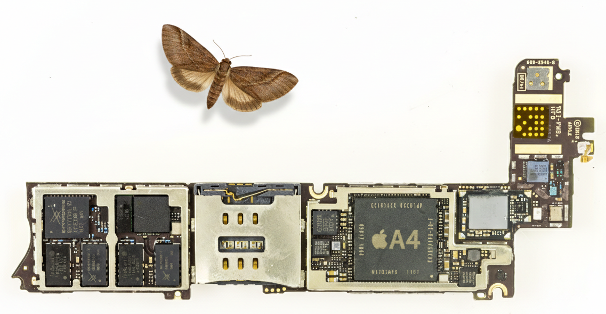
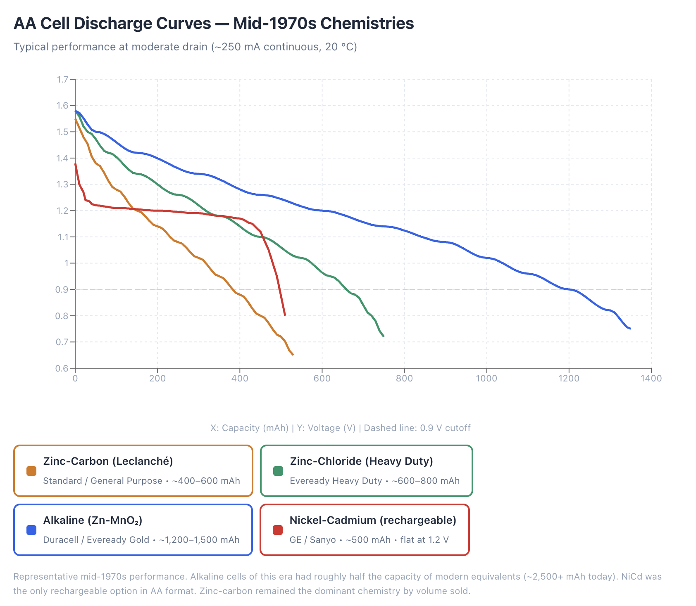

# Chapter 7 — The Driving Force of Miniaturization

**The Smaller The Package, The Better The Product**

*Arc II layer model: This chapter addresses the **Physical Product** layer — miniaturization is the cross-cutting enabler that determines which digital, connectivity, and intelligence capabilities can physically fit inside a product.*

---

## The Miniaturization Curve

Envious of Marie-Antoinette's fabulous watch — 40 years in the making, and a marvel of micro-mechanics — Napoleon Bonaparte commissioned an "electric wristwatch" to seal his legacy as a patron of the sciences.

His consultant, grasping the immensity of the challenge, assembled an MVP. A shiny mockup was presented: an elegant watch case, and beside it a neatly labeled block — *Technologies Yet To Be Invented*.

For power, he chose the then-latest voltaic pile.
Height: 60 cm, weight: 2 kg, bonus feature: dripping sulphuric acid.

The project was discontinued.

***Figure 7.1 — Alessandro Volta's electric pile (ca. 1800). Image via [Wikimedia Commons](https://commons.wikimedia.org/wiki/File:Pila_di_Volta.jpg).***

The paradox of hardware progress: as technology grows more powerful, it must also shrink. Every smart product is an exercise in cramming compute, communication, power, and sensing into a space where none of them comfortably fit.

This chapter maps the five fronts on which that battle is fought — and goes deep on the two that have no other home in this book: power and manufacturing.

---

***Figure 7.2 — Glen Beck (background) and Betty Snyder (foreground) program the ENIAC in Building 328 at the Ballistic Research Laboratory, Philadelphia, ca. 1947–1955. U.S. Army Photo, public domain. Via [Wikimedia Commons](https://commons.wikimedia.org/wiki/File:Glen_Beck_and_Betty_Snyder_program_the_ENIAC_in_building_328_at_the_Ballistic_Research_Laboratory.jpg).***

In 1945, ENIAC's 17,468 vacuum tubes filled a 170m2 room, weighed 27 tons, consumed 150 kilowatts, and delivered roughly 500 floating-point operations per second.

Sixty-five years later, Apple's A4 chip powering iPhone 4 delivered over 1.5 billion FLOPS – 3 million times as much – while drawing under two watts – a reduction of 150,000 times – from a pocket-sized battery. Size shrank by a factor of ten thousand.

***Figure 7.3 — iPhone 4 (model A1332) mainboard with Apple A4 system-on-chip visible at center right, compared to a moth of the original Grace Hopper's bug. Adapted from a photo by Raimond Spekking, CC BY-SA 4.0, via [Wikimedia Commons](https://commons.wikimedia.org/wiki/File:IPhone_4,_model_A1332_-_mainboard-7795.jpg).***

---

## Shrinking Form-factors, Expanding Markets

For electronics, miniaturization made entirely new product categories possible. **Transistors** enabled their eponymous portable radios, **Integrated circuits** enabled pocket calculators, and nano-scale UV etching enabled Ai-capable **microprocessors** driving mobile (and much smaller) devices. Each successive reduction in size produced a smaller form factor – some were shrinking by an order of magnitude. Thus, size reduction and energy efficiency enabled portable, battery operated devices. This, in turn, unlocked a multitude of use cases.

Consider the vacuum tube radio: Basically a furniture, built initially with a wooden cabinet the size of a side table, or injection molded plastics versions. When transistors and batteries combined to enable a pocket sized device, the radio transformed from a fireplace-like home appliance into a pocketable personal device (or an automobile accessory) – suddenly multiplying the unit sales.

Every time miniaturization crossed a form factor threshold, more usage scenarios could be exploited. From 'furniture' that each household bought once or twice in a lifetime, portable radios were personal. Everyone wanted one — teenagers, commuters, beachgoers — and the price made it possible.

The Regency TR-1 (1954), the first commercial transistor radio, sold for $49.95 — roughly $560 in today's money. At that price it was a novelty for early adopters; about 150,000 units sold. Sony's TR-63 (1957) was the inflection point. At $39.95, it was the first truly pocket-sized transistor radio and the first Sony-branded product exported to North America. That single model sold roughly seven million units worldwide by the mid-1960s. What changed was not just size — it was the price-to-portability ratio. A device small enough for a shirt pocket, cheap enough for a teenager's savings, opened a market that floor-standing radios never could.

By the early 1960s, Japanese manufacturers had driven transistor radio prices below $15. At that point, the product stopped being one-per-household and became one-per-person. Hundreds of millions of units moved worldwide through the decade. The pattern is consistent across product categories: **miniaturization enables portability, portability expands the addressable market, expanded volume drives down unit cost (the experience curve at work), and lower prices expand the market again.** It is a flywheel — and the TR-63 was the moment it started spinning for consumer electronics.

---

## The Five Fronts of Miniaturization

Miniaturization is not monolithic. It is comprised of several strands, each following its own pace of development as its own stubborn plateaus. Breakthroughs occur only when *enough fronts converge* at the right moment, to meet a newfound need or want in the market.

The fronts we have observed are: **Power & Energy**, **Compute**, **Sensing & Actuation**, **Connectivity**, and **Manufacturing & Economics**. Each front is illustrated below through the lens of product histories that show how specific technology breakthroughs unlocked new form factors – and new markets.

---

### Power & Energy

From Volta's pile to coin cells powering devices for years, and beyond. The first constraint and the last to yield.

Every device that leaves the wall socket needs to carry, generate, or harvest its own energy. The history of portable products tracks the history of battery chemistry almost perfectly.

**Audio playback tells this story well.** In the 1950s, home reel-to-reel tape recorders weighed 10–20 kg and ran on mains power. The Philips Compact Cassette (1963) cut the media down to pocket size, but the machines remained heavy — the boombox era of the 1970s produced portable players that weighed around 5 kg and ran through D-cell batteries in hours. What made the Sony Walkman TPS-L2 (1979, 390g) possible was not just the cassette — it was the combination of a compact flat DC motor, a miniaturized playback head, and two AA batteries that could sustain playback for hours.

By the late 1970s, battery chemistry had quietly reached a point of maturity that made truly portable stereo possible. The widespread adoption of alkaline AA cells roughly doubled the usable energy available compared to earlier zinc-carbon batteries, and more importantly, reduced internal resistance enough to support continuous motor drive and stereo amplification. A pair of AA batteries could now sustain three to five hours of playback – not as a laboratory claim, but in real-world use.

Just as critical was the flatter discharge curve of alkaline chemistry. Instead of gradually sagging and distorting performance as voltage declined, alkaline cells maintained a relatively stable output for most of their life, then dropped off more abruptly near depletion. For a device like the Walkman, this meant stable tape speed, consistent audio quality, and predictable operation right up until the moment there was simply no juice left. Battery chemistry did not make headlines, but it made portability credible.

***Figure 7.4 — Discharge Voltage as a Function of Delivered Capacity for AA-Size Cells of Four Electrochemical Systems Available in the Mid-1970s.** Curves were generated by Claude (Anthropic) using interpolated voltage–capacity profiles derived from published manufacturer data-sheets and battery handbooks of the 1970s*

---

This reduction in size and heft was then followed by the next one: rechargeable batteries. Sony commercialized the first lithium-ion cell in 1991 — initially for its own camcorders — and within a decade, Li-ion had displaced NiCd and NiMH across nearly every portable product category. The advantage was not just higher energy density (roughly 2–3× that of NiCd per unit weight), but also the absence of memory effect, lower self-discharge, and a flat voltage profile that simplified power management circuitry.

For industrial designers, however, the deeper shift was structural. Disposable batteries impose a form-factor tax: the product must include a battery compartment with a user-accessible door, contacts, springs, and enough clearance for insertion and removal. That compartment is a design constraint, a potential point of mechanical failure, and a gap in the enclosure impairing water tightness. Rechargeable cells changed the equation. A sealed lithium-ion pouch or prismatic cell, permanently bonded inside the chassis and charged through a port or inductive pad, eliminated the need for any opening at all.

The consequences were immediate and tangible. Sealed enclosures enabled waterproof and dustproof ratings (IP67, IP68) that battery-compartment designs could never achieve. Fitness trackers could survive the shower. Electric toothbrushes could sit in a cup of water. Outdoor sensors could be potted shut and deployed for years. The Apple Watch, AirPods, and virtually every modern earbud are sealed units — no serviceable battery, no door, no gasket to fail. The trade-off is repairability, but the gain in durability and environmental resistance reshaped entire product categories, from medical wearables to industrial IoT nodes to underwater drones.

### 7.2.4 — Compute

**From boards full of chips to systems-on-chip smaller than a fingernail.** *(Deep dive: Chapter 11)*

The compute front is the most celebrated miniaturization story, but its product implications go beyond raw transistor counts.

**Gaming shows how compute miniaturization reshaped an entire industry's business model.** A Pong arcade cabinet (1972) weighed ~90 kg, cost $1,200 wholesale, and earned revenue one quarter at a time — nobody owned one. The Atari 2600 (1977, $199, ~1 kg) moved gaming into homes by putting a programmable processor and cartridge ROM behind the family television. Custom video chips (PPUs) made it viable; the TV provided the display for free.

Nintendo's Game Boy (1989) is the more interesting inflection. At 220g and $89.99, it ran on 4 AA batteries for ~15 hours — a design that deliberately chose a low-power STN reflective LCD (no backlight) and a modest Sharp LR35902 processor to maximize battery life at the expense of visual fidelity. The engineering trade-off was clear: portability and endurance beat graphics. It sold over 118 million units.

By 2008, the App Store turned every smartphone into a gaming device. Smartphone GPUs (Apple's A-series, Qualcomm's Adreno) now exceed PlayStation 3-era performance. The dedicated gaming handheld collapsed as a mass-market category. The compute that once required a 90 kg cabinet became a background process on a phone — and the business model shifted from hardware sales and coin slots to free-to-play with in-app purchases.

**Portable computing followed the same compression arc.** IBM's System/360 (1964) filled a room and cost millions. The Osborne 1 (1981) was the first attempt at portability: 10.7 kg, a 5" screen, no battery. The Toshiba T1100 (1985, 4.1 kg) was the first credible laptop. The MacBook Air (2008, 1.36 kg, 1.94 cm thick) proved that thin-and-light was viable for daily use — enabled by SSDs replacing spinning disks, low-power Intel Core processors, and lithium polymer batteries molded to the chassis shape. Apple's M-series ARM SoCs (2020+) integrated CPU, GPU, neural engine, and unified memory into a single chip, making fanless laptop designs possible. Each step required not just smaller transistors but smaller *everything else*: displays, storage, power delivery, thermal management.

---

### 7.2.2 — Sensing & Actuation

**MEMS and CMOS brought sensing from laboratory instruments to millimeter-scale chips.** *(Deep dive: Chapter 10)*

Sensors are the reason smart products know anything about the world. The shift from bench-top instruments to chip-scale MEMS devices — accelerometers, gyroscopes, pressure sensors, microphones — made it possible to embed awareness into objects that previously had none.

**The thermostat illustrates a different kind of miniaturization story.** Honeywell's T87 "Round" (1953, designed by Henry Dreyfuss) used a bimetallic coil and a mercury tilt switch — no electronics at all. It cost $25–50, lasted decades, and could do exactly one thing: switch a furnace on or off at a set temperature. The programmable digital thermostats of the 1980s added a microcontroller and an LCD, but the real shift came with the Nest Learning Thermostat (2011). Tony Fadell's team packed a 480x480 color LCD, proximity sensor, temperature/humidity/ambient light MEMS sensors, WiFi and Zigbee radios, an ARM Cortex-M3 processor, and a rechargeable lithium-ion cell into a device roughly the *same physical size* as the 1953 Honeywell.

The product didn't shrink. The *components* shrank — enough to pack intelligence into a form factor that wall-mounted aesthetics had already defined. By the 2020s, Ecobee extended the concept further: a central thermostat orchestrating a network of wireless sensor pucks (32mm diameter, 28g each, coin-cell powered) distributed through the house. Miniaturized MEMS sensing and low-power wireless turned a single switch into a distributed sensing system.

Not all miniaturization is about making the product smaller. Sometimes it is about making the internals small enough to fit intelligence into a form factor the world has already accepted.

---

### 7.2.3 — Connectivity

**Shrinking radios and antennas cut the last physical tether.** *(Deep dive: Chapter 8)*

A device that cannot communicate is a device that cannot be smart. The progression from wired connections to wireless, and from large radio modules to single-chip transceivers, redefined what products could do — and where they could do it.

**Television is a case where connectivity miniaturization played out across decades.** The RCA TRK-12 (1939) was a floor-standing piece of furniture: 12" screen, ~100 kg, $600 (over $13,000 today). It received broadcast signals through a rooftop antenna. By 1962, Sony had produced a battery-powered portable CRT with a 5" screen (the TV-500U, 3.6 kg) — but the content still arrived over the air, one-way, to a dedicated receiver. The flat-panel transition (Pioneer plasma 1997, Samsung LCD 2001) changed the form factor but not the communication model.

The real connectivity shift came when video moved onto the internet. H.264/MP4 compression achieved roughly 1000:1 compression ratios. YouTube (2005) and Netflix streaming (2007) provided the content infrastructure. Mobile broadband (3G, then 4G, then 5G) provided the pipe. The result: the same 6" OLED display already in your pocket could show any video ever recorded, streamed from anywhere. Television stopped being a receiving appliance and became a software feature running on a connected platform.

The enablers were not just smaller antennas and radio chips. They included compression algorithms, cloud infrastructure, and the business model innovations (ad-supported streaming, subscription services) that made content available on demand. Connectivity miniaturization is as much about the protocol stack and the service layer as it is about the RF hardware.

---

### 7.2.5 — Manufacturing & Economics

**None of the above matters without the ability to fabricate and assemble at micro-scale, reliably, at volume — and at the right price point.** *(Deep dive: §7.4)*

Miniaturization in the lab is a scientific achievement. Miniaturization in production is an *economic* one. Every front described above was gated not only by what engineers could design but by what factories could build at costs the market would bear. This front gets its full treatment in §7.4, including the relationship between cumulative volume, unit cost, and the mounting capital required to stay on the curve.

---

**Why this map matters for product managers:** Each front has its own pace of progress, cost curve, and trade-off profile. A smart tangible's feasibility depends on where *all five* stand simultaneously — not just the most advanced one.

---

## 7.3 — Power: The First Constraint

Power is the one infrastructure domain without a dedicated chapter in Arc II. It gets its full treatment here.

### 7.3.1 — The Battery Arc

- **Volta's pile (1800):** 5,000 cm³, liquid, orientation-dependent
- **The dry cell breakthrough (1886):** Portable, leak-proof — enabled flashlights, portable radios
- **Button cells (1950s–70s):** Mercury, then silver oxide — enabled quartz watches, hearing aids
- **Lithium-ion (1991):** 2–3× energy density of NiMH, flexible form factors — enabled laptops, then phones
- **Lithium polymer (2000s):** Moldable to arbitrary shapes — enabled slim smartphones, earbuds, wearables

**Energy density timeline table:** Lead-acid (30 Wh/kg) → Zinc-carbon (65) → Alkaline (100) → Li-ion early (120) → Li-ion modern (250–300) → Solid-state projected (400–500)

### 7.3.2 — Size, Weight, and Standby: The Three Metrics That Matter

Concrete device-by-device comparisons:

- **Size:** DynaTAC battery (300 cm³) → iPhone battery (22 cm³) → AirPod battery (0.6 cm³) — 500× reduction
- **Weight:** DynaTAC pack (340 g, 4 Wh) → iPhone cell (49 g, 13.6 Wh) — 3× more energy at 1/7th the weight
- **Standby:** DynaTAC 8 hrs → Nokia 3310 11 days → AirTag 1 year → IoT sensor tag 5 years

### 7.3.3 — The Other Side of the Equation: Power Draw

Battery chemistry is only half the story. The other half is how little power the device needs.

- **Sleep-mode revolution:** From milliamps to microamps — a 1,000× reduction in idle draw
- **Duty cycling:** Devices awake for milliseconds per hour, sleeping 99.99% of the time
- **The math that makes smart tangibles viable:** 225 mAh coin cell ÷ 5 µA sleep draw = 5+ years

**Case study: Apple Watch** — 18-hour battery life from a 1.1 Wh cell powering an always-on display, cellular radio, and health sensors. Where the power budget actually goes.

### 7.3.4 — Energy Harvesting: When the Environment Is the Battery

If devices need only microwatts, can the environment supply them directly? Sometimes yes — and three harvesting sources have proven viable at device scale.

**Photovoltaic — light as power:**
- **Citizen Eco-Drive (1995):** Solar cells hidden *under* a translucent watch dial — harvesting enough to run indefinitely. 30+ years of production; the concept works.
- **Casio Tough Solar / Garmin Instinct Solar:** Solar cells in bezels and dials — extending battery life 50–100% outdoors, or running indefinitely with modest functionality
- **Indoor photovoltaics:** ~10 µW/cm² indoors vs. ~10 mW/cm² outdoors — a 1,000× gap. Works for ultra-low-power sensors, not for anything with a frequently transmitting radio
- **The design trade-off:** Dial area for solar cells competes with display area. Garmin uses the bezel ring; Citizen made the entire dial a solar cell. Both are design compromises.

**Kinetic / vibration — motion as power:**
- **The automatic watch precedent:** Self-winding watches have harvested wrist motion since the 1770s (Perrelet). The concept is centuries old — only the application to electronics is new.
- **Seiko Kinetic (1988):** Oscillating weight spinning a micro-generator to charge a capacitor — bridging mechanical and electronic watchmaking
- **Industrial IoT vibration harvesters:** Sensors mounted on motors, pumps, compressors — harvesting the very vibrations they're measuring. Maintenance-free sensor nodes for factory equipment (Perpetua, EnOcean)
- **The math:** Wrist motion yields ~5–10 µW. Machine vibration can yield 100+ µW. Enough for periodic BLE broadcasts, not enough for continuous sensing or WiFi.

**Thermoelectric (Seebeck effect) — heat differential as power:**
- **The principle:** A temperature difference across two dissimilar conductors generates voltage. Body at 37°C vs. ambient at 22°C = a 15°C differential.
- **Matrix PowerWatch (2017):** A smartwatch powered entirely by body heat — thermoelectric generators on the caseback. It worked, but the power budget was severely constrained (no color display, limited features).
- **Industrial application:** Sensors on hot pipes, steam lines, engine housings — harvesting the waste heat they're monitoring. The thing being measured *is* the power source.
- **The brutal constraint:** You need a *differential*, not just heat. A device at thermal equilibrium with its environment harvests nothing. Conversion efficiency is low — typically 1–5% of the Carnot limit at small scale.

**The product manager's reality check:**

| Source | Typical Power (miniature device) | Enough For |
|---|---|---|
| Indoor light (few cm²) | ~10 µW | Periodic sensor reading, e-ink display |
| Outdoor light (few cm²) | ~1–10 mW | Watch, simple tracker, trickle-charge buffer |
| Wrist motion | ~5–10 µW | Supplement a coin cell, not replace it |
| Machine vibration | ~100–500 µW | Periodic BLE sensor broadcasts |
| Body heat (wrist) | ~20–50 µW | Ultra-low-power watch with constraints |

**The key insight:** Energy harvesting doesn't eliminate batteries — it extends them, or replaces them *only* when the power budget is in the microwatt range. It works when paired with the duty-cycling and sleep-mode advances above. A device that sleeps at 2 µA and wakes for 5 ms every hour can run on harvested vibration alone. A device that streams data over WiFi cannot.

### 7.3.5 — Chemistry, Reusability, and the Product Lifecycle

Chemistry choice is a *strategic* decision that cascades into user experience, business model, regulatory compliance, and sustainability.

**Primary vs. secondary cells — a product architecture choice:**
- AirTag: CR2032, user-replaceable, no charging infrastructure, 1-year life, simple UX
- AirPods: sealed Li-ion, requires charging case, shorter effective lifespan, more complex
- The choice cascades into: packaging, onboarding, accessory system, replacement revenue, support burden
- Beyond size and cost: operating temperature range, safety certification, shelf life, shipping regulations (lithium air freight restrictions are a real logistics headache)

**Rechargeability and product lifespan:**
- Cycle life: early Li-ion ~500 cycles → modern 1,000–2,000+
- Degradation defines *effective* product lifespan — phones hitting 80% capacity after 2 years is why people upgrade
- Battery Management Systems (BMS): invisible software that directly affects how long the product feels "good"
- Connection to business models (Arc VI): degradation can drive upgrade cycles (Apple) or become a liability (customer resentment)

**Replaceability — miniaturization vs. regulation:**
- The right-to-repair movement, now backed by EU regulation mandating user-replaceable batteries (2027 deadline)
- The core tension: glued-in cells are smaller and cheaper to assemble, but a sealed device is a disposable device
- Product managers will increasingly face this trade-off as regulation tightens globally

**Recyclability and supply chain exposure:**
- Lithium, cobalt, nickel — concentrated supply chains with geopolitical and ethical dimensions
- EU Battery Regulation (2023): recycling targets, carbon footprint declarations, digital battery passports
- Second-life batteries (EV packs → grid storage) — an emerging circular economy
- The smart tangibles e-waste problem: billions of IoT devices with tiny batteries that nobody recycles

### 7.3.6 — What's Next: Solid-State and Beyond

- Solid-state batteries: higher density, safer chemistry, longer cycle life, potentially easier recycling — Toyota, Samsung SDI, QuantumScape
- Micro-batteries for medical implants and smart labels
- The structural battery concept: the enclosure *is* the battery

---

## 7.4 — Manufacturing & Economics: Making Small Things at Scale, at the Right Price

Miniaturization in the lab is a scientific achievement. Miniaturization in production is an *economic* one. The question is never just "can we build it this small?" but "can we build it this small, this reliably, at a cost that works?"

### 7.4.1 — The Experience Curve: Why Volume Drives Everything

In 1966, Bruce Henderson at the Boston Consulting Group documented a pattern that has since become one of the most durable models in manufacturing economics: **every time cumulative production volume doubles, unit cost falls by a predictable percentage** — typically 20–30%. This is the experience curve (sometimes called the learning curve), and it applies across industries from semiconductors to solar panels to consumer electronics assembly.

The mechanism is a blend of effects: workers and processes get more efficient, yields improve, tooling amortizes across more units, suppliers compete to offer better pricing at scale, and engineers find ways to simplify designs for production. The result is that the first thousand units of a miniaturized product are brutally expensive, and the millionth unit is cheap.

**The transistor radio illustrates this directly.** The Regency TR-1 (1954) used four Texas Instruments germanium transistors and sold for $49.95 — roughly the same price as a quality table radio. At that price, the transistor bought you portability, not savings. But within a decade, Japanese manufacturers riding the experience curve had driven transistor radio prices to $10–25, unlocking a mass market of teenagers and outdoor listeners that the floor-standing vacuum tube radio never reached. The price drop was not a generous act; it was the predictable result of cumulative production volume.

**The same pattern repeated with flat-panel displays.** Early plasma screens (late 1990s) sold for $10,000+. LCD TVs followed. By 2015, a 50" LCD panel cost under $500. The experience curve, combined with massive capital investment in Gen 8 and Gen 10 glass substrate fabrication plants, brought prices down by roughly 90% in fifteen years. For television, miniaturization did not mean making the product smaller — it meant making the *panel* thinner (from 50 cm depth for a CRT to 3.5 cm for early flat panels to under 1 cm for modern OLEDs), while the economics of scale made each generation cheaper per square inch.

**The counterintuitive insight:** Miniaturization does not always reduce the consumer price. The Nest thermostat (2011) cost $249 — five times more than the programmable thermostat it replaced. The first transistor radios cost the same as tube radios. The first laptops cost more than desktops. **Miniaturization initially increases unit cost** because smaller, denser products require more precise manufacturing. The price drops come *later*, as cumulative volume kicks in and the experience curve takes effect. Product managers who plan launches assuming day-one pricing will match mature-market pricing are building financial models on sand.

### 7.4.2 — The Rising Cost of the Factory Floor

There is a paradox at the heart of the experience curve: unit costs fall, but the *capital required to build the factory* rises with each generation.

A semiconductor fabrication plant (fab) in the 1990s cost roughly $1 billion. A leading-edge fab today — producing chips at 3 nm or below — costs $20 billion or more. TSMC's Arizona fab complex is budgeted at over $40 billion. The same pattern, at smaller scale, applies to MEMS fabrication, advanced PCB manufacturing, and precision assembly lines.

This creates a structural divide in the hardware industry. Companies with sufficient volume to fill a fab or a production line ride the experience curve and enjoy falling unit costs. Companies without that volume face a choice: pay premium prices for contract manufacturing, accept less-advanced processes, or find creative alternatives (modular designs using off-the-shelf components, less aggressive miniaturization).

For smart tangible product managers, this means a hard question early in the product lifecycle: **what production volume do you need to hit the cost point that makes your business model work?** And can you reach that volume before your capital runs out?

### 7.4.3 — The Fabrication Cascade

Four manufacturing revolutions track the eras of miniaturization:

1. **Photolithography & semiconductor fabrication** — 3 nm processes, over 100 billion transistors on a die. Each process node requires new lithography equipment (EUV at ~$150M per machine)
2. **MEMS fabrication** — Etching mechanical structures at chip scale (accelerometers, microphones, pressure sensors). Shares fab infrastructure with semiconductors, lowering the barrier
3. **SMT & pick-and-place automation** — Placing 0201 components (0.6 × 0.3 mm) at thousands per hour. The workhorse of consumer electronics assembly
4. **Laser processing** — Micron-level cutting, drilling, and Laser Direct Structuring for 3D antennas. Enables complex geometries without molds

### 7.4.4 — Case Study: Inside the Apple Watch

The Apple Watch as a masterclass in miniaturization-at-scale:

- **Taptic Engine:** Linear actuator in 9 mm³
- **S-series SiP:** Complete computer in a 30 mm² package
- **Digital Crown:** Encoder, button, and force sensor integrated into one control
- **340+ components** in a 40 mm case
- **The economics:** Apple's volume — tens of millions of units per year — amortizes the extreme tooling and process development costs. This level of miniaturized integration is not viable at startup volumes. The product exists *because* the manufacturing economics work at Apple's scale.

### 7.4.5 — Three Price Trajectories of Miniaturization

The case studies in this chapter reveal three distinct patterns in how miniaturization affects product pricing:

**1. Shrink and get cheaper.** The classic experience curve story. Transistor radios: $50 (1954) → $10 (1965). LCD TVs: $10,000 (2000) → $500 (2015). The product gets smaller, volume grows, unit cost falls. This is the path most product managers expect.

**2. Shrink and stay the same price, but deliver more.** Computing follows this pattern. A $1,500 laptop in 2008 and a $1,500 laptop in 2024 occupy the same price point, but the 2024 machine is thinner, lighter, fanless, and orders of magnitude more powerful. The consumer pays the same; the value per dollar rises. The price stability masks enormous underlying cost reduction in components.

**3. Shrink the components, raise the product price.** The Nest thermostat ($249 vs. $30 for its predecessor), the Apple Watch ($399+), smart home sensors. Here, miniaturized components — MEMS sensors, WiFi SoCs, ARM processors — enable *new capabilities* that justify a higher price. The product is not a cheaper version of the old thing; it is a new category that commands a premium. The risk: the premium must be justified by actual user value, not just technology novelty.

**For product managers:** Know which trajectory your product is on. Plan manufacturing volumes accordingly. And remember: the experience curve is real, but it requires *surviving long enough* to accumulate the volume that triggers it.

### 7.4.6 — Design for Miniaturized Manufacturing

Practical implications for product managers:

- Component selection trade-offs: off-the-shelf vs. custom at small scale
- Testability at micro-scale: how do you QA what you can barely see?
- The cost curve: when does miniaturization *save* money vs. add cost?
- Minimum viable manufacturing: what's achievable without Apple's budget?

---

## 7.5 — The Compounding Effect

The strategic payoff of the chapter: miniaturization on one front enables miniaturization on every other front.

- **Smaller batteries** → smaller devices → **smaller antennas feasible** → wireless connectivity → **no connectors needed** → even smaller devices
- **Smaller sensors** → less power needed → **smaller batteries sufficient** → thinner form factors → **new product categories** (patches, tags, implants)
- **Denser compute (SoC)** → fewer board components → **smaller PCB** → more room for battery → **longer runtime**

**The product manager's insight:** You don't wait for one technology to mature. You watch for the moment when *enough fronts converge* to make a new product category viable. The smartphone became possible around 2007 not because any single technology was ready, but because Li-ion + capacitive touch + ARM SoCs + 3G radios + CMOS cameras all crossed their thresholds simultaneously.

**Framework: The Miniaturization Readiness Matrix** — A simple tool for evaluating whether the five fronts have converged enough for your product concept.

---

## 7.6 — Bridge to Chapter 8

Miniaturization solved the *physical* problem: technology small enough to embed anywhere. But a smart tangible that can't communicate is just a small computer in a box.

The next challenge: how do these tiny, power-constrained devices talk to each other and to the cloud? Chapter 8 picks up where miniaturization leaves off — with the connectivity revolution that turned isolated gadgets into networked products.

---

## Chapter Summary

1. **Miniaturization is a convergence**, not a single trend — power, sensing, compute, connectivity, and manufacturing all had to shrink together
2. **Power remains the binding constraint** — energy density improvements and ultra-low-power electronics together extended device lifetimes from hours to years
3. **Chemistry is a product decision** — primary vs. rechargeable, replaceability vs. miniaturization, and recyclability are strategic choices with business model consequences
4. **Manufacturing & economics are the bridge from lab to product** — the experience curve rewards volume, but the mounting capital cost of advanced fabrication creates barriers that shape the competitive field
5. **The compounding effect is the strategic insight** — progress on each front accelerates the others, creating windows of opportunity for new product categories
6. **Product managers should think in convergence thresholds**, not individual technology curves — and understand which price trajectory their product is on

---

## Writing Notes & Style Guidance

### Tone:
- Technical but accessible — business book, not engineering textbook
- Historical context provides narrative arc
- Use specific numbers and concrete comparisons
- Balance engineering explanation with strategic implications for product managers

### Visual Elements to Include:
- Timeline: Battery energy density evolution (Wh/kg by decade)
- Comparison table: Size, weight, and standby across device eras
- Diagram: Primary vs. secondary cell decision tree for product managers
- Photo series: Manufacturing scale (wafer → chip → device)
- Apple Watch teardown with component callouts
- The Miniaturization Readiness Matrix (five-front framework)
- Experience curve chart: unit cost vs. cumulative volume for a representative product category
- The three price trajectories diagram

### Sidebar Opportunities:
- "The Transistor Count Story: From 2,300 to 100 Billion"
- "Why Your Phone Gets Hot: Power Density Challenges"
- "Lithium by Air: The Shipping Regulations That Surprise Hardware Startups"
- "Right to Repair vs. Right to Shrink: The EU Battery Regulation"
- "The $20 Billion Factory: Why Fab Costs Keep Rising"

---

---

**References & Sources**
All references for this chapter — with live links and archived snapshots — are available at the companion site.

[View Chapter 7 References →](https://yoelf22.github.io/manuscript/references/ch07.html)

