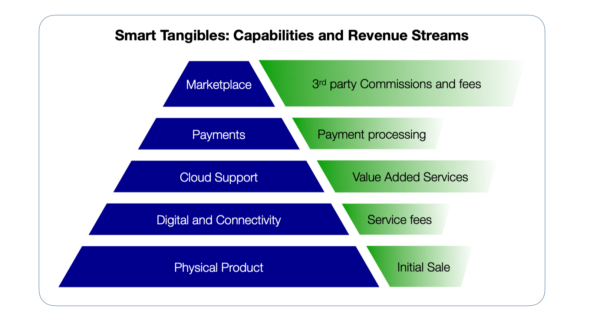
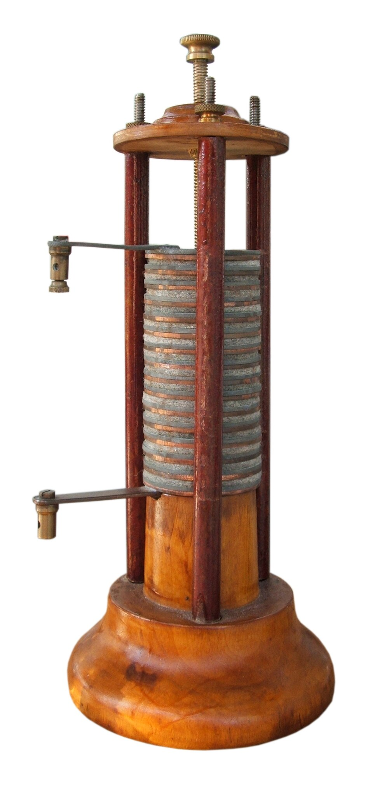

# Chapter 7 — The Driving Force of Miniaturization

**The Smaller The Package, The Better The Product**

*Arc II layer model: This chapter addresses the **Physical Product** layer — power is the most fundamental hardware constraint, determining which digital, connectivity, and intelligence capabilities are reachable.*

Envious of Marie-Antoinette's fabulous watch — 40 years in the making, and a marvel of micro-mechanics — Napoleon Bonaparte commissioned an "electric wristwatch" to seal his legacy as a patron of the sciences.

His consultant, grasping the immensity of the challenge, assembled an MVP. A shiny mockup was presented: an elegant watch case, and beside it a neatly labeled block — *Technologies Yet To Be Invented*.

For power, he chose the then cutting-edge voltaic pile.
Height: 60 cm, weight: 2 kg, bonus feature: dripping sulphuric acid.

The project was discontinued.

***Figure 7.2  — Alessandro Volta’s electric pile (ca. 1800). Image via [Wikimedia Commons](https://commons.wikimedia.org/wiki/File:Pila_di_Volta.jpg).**

> Beneath the engineering humor lies a real hardware truth: ambition is cheap, but physics rarely bends.
>
> The joke also points to a practical reality: **Miniaturization** is the art of making the impossible possible – shrinking ridiculously large components to fit into ever-smaller form factors. It is the great enabler of ubiquitous computing and the smart objects that embody it, because the core challenge of any smart product is cramming compute, communication, power management, and sensing into a confined space.
>
> And here's the paradox: as technology grows more powerful, it must also shrink — to satisfy our insatiable demand for ever more capability in ever less space.
>
> ---
>
> \- From room-sized computers to computers in every room

## 7.1 — The Arc of Shrinking

The historical sweep: how technology went from room-sized to invisible in seven decades.

- **ENIAC (1945):** 27 tons, 1,800 sq ft, 150 kW — to perform what a microcontroller does on microwatts
- **The transistor (1947) → integrated circuit (1958) → microprocessor (1971):** Each step collapsed an entire system into the next smaller unit
- **The pocket inflection:** Walkman (1979), Game Boy (1989), mobile phone (1990s) — the moment technology became truly personal
- **The disappearing act:** AirTag, sensor patches, smart labels — technology vanishing into everyday objects

**The key insight:** Miniaturization is not one trend. It is a *convergence* of breakthroughs across power, materials, fabrication, and design — each enabling the others. The rest of Arc II explores each domain in depth. This chapter maps the territory and goes deep on the two foundations that underpin everything else: power and manufacturing.

---

## 7.2 — The Five Fronts of Miniaturization

A framework orienting the reader to Arc II's structure. One concise paragraph per front:

1. **Power & Energy** — From Volta's pile to coin cells powering devices for years. The first constraint and the last to yield. *(Deep dive: this chapter, §7.3)*
2. **Sensing & Actuation** — MEMS and CMOS brought sensing from laboratory instruments to millimeter-scale chips. *(Deep dive: Chapter 10)*
3. **Connectivity** — Shrinking radios and antennas cut the last physical tether. *(Deep dive: Chapter 8)*
4. **Compute** — From boards full of chips to systems-on-chip smaller than a fingernail. *(Deep dive: Chapter 11)*
5. **Manufacturing** — None of the above matters without the ability to fabricate and assemble at micro-scale, reliably, at volume. *(Deep dive: this chapter, §7.4)*

**Why this map matters for product managers:** Each front has its own pace of progress, cost curve, and trade-off profile. A smart tangible's feasibility depends on where *all five* stand simultaneously — not just the most advanced one.

---

## 7.3 — Power: The First Constraint

Power is the one infrastructure domain without a dedicated chapter in Arc II. It gets its full treatment here.

### 7.3.1 — The Battery Arc

- **Volta's pile (1800):** 5,000 cm³, liquid, orientation-dependent
- **The dry cell breakthrough (1886):** Portable, leak-proof — enabled flashlights, portable radios
- **Button cells (1950s–70s):** Mercury, then silver oxide — enabled quartz watches, hearing aids
- **Lithium-ion (1991):** 2–3× energy density of NiMH, flexible form factors — enabled laptops, then phones
- **Lithium polymer (2000s):** Moldable to arbitrary shapes — enabled slim smartphones, earbuds, wearables

**Energy density timeline table:** Lead-acid (30 Wh/kg) → Zinc-carbon (65) → Alkaline (100) → Li-ion early (120) → Li-ion modern (250–300) → Solid-state projected (400–500)

### 7.3.2 — Size, Weight, and Standby: The Three Metrics That Matter

Concrete device-by-device comparisons:

- **Size:** DynaTAC battery (300 cm³) → iPhone battery (22 cm³) → AirPod battery (0.6 cm³) — 500× reduction
- **Weight:** DynaTAC pack (340 g, 4 Wh) → iPhone cell (49 g, 13.6 Wh) — 3× more energy at 1/7th the weight
- **Standby:** DynaTAC 8 hrs → Nokia 3310 11 days → AirTag 1 year → IoT sensor tag 5 years

### 7.3.3 — The Other Side of the Equation: Power Draw

Battery chemistry is only half the story. The other half is how little power the device needs.

- **Sleep-mode revolution:** From milliamps to microamps — a 1,000× reduction in idle draw
- **Duty cycling:** Devices awake for milliseconds per hour, sleeping 99.99% of the time
- **The math that makes smart tangibles viable:** 225 mAh coin cell ÷ 5 µA sleep draw = 5+ years
- **Energy harvesting:** Solar, kinetic, thermal, RF — when the environment provides enough to top up a frugal device

**Case study: Apple Watch** — 18-hour battery life from a 1.1 Wh cell powering an always-on display, cellular radio, and health sensors. Where the power budget actually goes.

### 7.3.4 — Chemistry, Reusability, and the Product Lifecycle

Chemistry choice is a *strategic* decision that cascades into user experience, business model, regulatory compliance, and sustainability.

**Primary vs. secondary cells — a product architecture choice:**
- AirTag: CR2032, user-replaceable, no charging infrastructure, 1-year life, simple UX
- AirPods: sealed Li-ion, requires charging case, shorter effective lifespan, more complex
- The choice cascades into: packaging, onboarding, accessory ecosystem, replacement revenue, support burden
- Beyond size and cost: operating temperature range, safety certification, shelf life, shipping regulations (lithium air freight restrictions are a real logistics headache)

**Rechargeability and product lifespan:**
- Cycle life: early Li-ion ~500 cycles → modern 1,000–2,000+
- Degradation defines *effective* product lifespan — phones hitting 80% capacity after 2 years is why people upgrade
- Battery Management Systems (BMS): invisible software that directly affects how long the product feels "good"
- Connection to business models (Arc VI): degradation can drive upgrade cycles (Apple) or become a liability (customer resentment)

**Replaceability — miniaturization vs. regulation:**
- The right-to-repair movement, now backed by EU regulation mandating user-replaceable batteries (2027 deadline)
- The core tension: glued-in cells are smaller and cheaper to assemble, but a sealed device is a disposable device
- Product managers will increasingly navigate this trade-off as regulation tightens globally

**Recyclability and supply chain exposure:**
- Lithium, cobalt, nickel — concentrated supply chains with geopolitical and ethical dimensions
- EU Battery Regulation (2023): recycling targets, carbon footprint declarations, digital battery passports
- Second-life batteries (EV packs → grid storage) — an emerging circular economy
- The smart tangibles e-waste problem: billions of IoT devices with tiny batteries that nobody recycles

### 7.3.5 — What's Next: Solid-State and Beyond

- Solid-state batteries: higher density, safer chemistry, longer cycle life, potentially easier recycling — Toyota, Samsung SDI, QuantumScape
- Micro-batteries for medical implants and smart labels
- The structural battery concept: the enclosure *is* the battery

---

## 7.4 — Manufacturing: Making Small Things at Scale

The second domain without its own chapter. Miniaturization in the lab is a scientific achievement; miniaturization in production is an *economic* one.

### 7.4.1 — The Fabrication Cascade

Four manufacturing revolutions that track the four eras of miniaturization:

1. **Photolithography & semiconductor fabrication** — 5 nm processes, billions of transistors on a die
2. **MEMS fabrication** — Etching mechanical structures at chip scale (accelerometers, microphones, pressure sensors)
3. **SMT & pick-and-place automation** — Placing 0201 components (0.6 × 0.3 mm) at thousands per hour
4. **Laser processing** — Micron-level cutting, drilling, and Laser Direct Structuring for 3D antennas

### 7.4.2 — Case Study: Inside the Apple Watch

The Apple Watch as a masterclass in miniaturization-at-scale:

- **Taptic Engine:** Linear actuator in 9 mm³
- **S-series SiP:** Complete computer in a 30 mm² package
- **Digital Crown:** Encoder, button, and force sensor integrated into one control
- **340+ components** in a 40 mm case
- **The economics:** How advanced manufacturing made this viable at millions of units

### 7.4.3 — Design for Miniaturized Manufacturing

Practical implications for product managers:

- Component selection trade-offs: off-the-shelf vs. custom at small scale
- Testability at micro-scale: how do you QA what you can barely see?
- The cost curve: when does miniaturization *save* money vs. add cost?
- Minimum viable manufacturing: what's achievable without Apple's budget?

---

## 7.5 — The Compounding Effect

The strategic payoff of the chapter: miniaturization on one front enables miniaturization on every other front.

- **Smaller batteries** → smaller devices → **smaller antennas feasible** → wireless connectivity → **no connectors needed** → even smaller devices
- **Smaller sensors** → less power needed → **smaller batteries sufficient** → thinner form factors → **new product categories** (patches, tags, implants)
- **Denser compute (SoC)** → fewer board components → **smaller PCB** → more room for battery → **longer runtime**

**The product manager's insight:** You don't wait for one technology to mature. You watch for the moment when *enough fronts converge* to make a new product category viable. The smartphone became possible around 2007 not because any single technology was ready, but because Li-ion + capacitive touch + ARM SoCs + 3G radios + CMOS cameras all crossed their thresholds simultaneously.

**Framework: The Miniaturization Readiness Matrix** — A simple tool for evaluating whether the five fronts have converged enough for your product concept.

---

## 7.6 — Bridge to Chapter 8

Miniaturization solved the *physical* problem: technology small enough to embed anywhere. But a smart tangible that can't communicate is just a small computer in a box.

The next challenge: how do these tiny, power-constrained devices talk to each other and to the cloud? Chapter 8 picks up where miniaturization leaves off — with the connectivity revolution that turned isolated gadgets into networked products.

---

## Chapter Summary

1. **Miniaturization is a convergence**, not a single trend — power, sensing, compute, connectivity, and manufacturing all had to shrink together
2. **Power remains the binding constraint** — energy density improvements and ultra-low-power electronics together extended device lifetimes from hours to years
3. **Chemistry is a product decision** — primary vs. rechargeable, replaceability vs. miniaturization, and recyclability are strategic choices with business model consequences
4. **Manufacturing is the bridge from lab to product** — precision fabrication at scale is what makes miniaturization economically viable
5. **The compounding effect is the strategic insight** — progress on each front accelerates the others, creating windows of opportunity for new product categories
6. **Product managers should think in convergence thresholds**, not individual technology curves

---

## Writing Notes & Style Guidance

### Tone:
- Technical but accessible — business book, not engineering textbook
- Historical context provides narrative arc
- Use specific numbers and concrete comparisons
- Balance engineering explanation with strategic implications for product managers

### Visual Elements to Include:
- Timeline: Battery energy density evolution (Wh/kg by decade)
- Comparison table: Size, weight, and standby across device eras
- Diagram: Primary vs. secondary cell decision tree for product managers
- Photo series: Manufacturing scale (wafer → chip → device)
- Apple Watch teardown with component callouts
- The Miniaturization Readiness Matrix (five-front framework)

### Sidebar Opportunities:
- "The Transistor Count Story: From 2,300 to 100 Billion"
- "Why Your Phone Gets Hot: Power Density Challenges"
- "Lithium by Air: The Shipping Regulations That Surprise Hardware Startups"
- "Right to Repair vs. Right to Shrink: The EU Battery Regulation"

---
