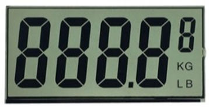
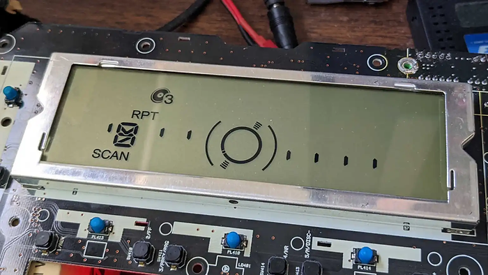
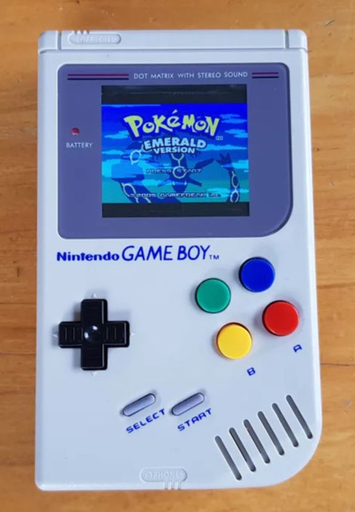

# Chapter 5 - Digital interfaces

**Changing the rules of the game, for hardware**

## Human machine interface - a historic journey

### Naught to Gauges

  
  

**Figure 5.1 — From no interface to critical indicators.**
*(a) 19th century bicycle — pure function, no interface (Photo: Eye Speak/Unsplash) — (b) Temperature and pressure gauges providing critical system feedback (Photo: Mustafa ILHAN/Unsplash)*

A 19th-century bicycle offered no interface at all. The rider's legs were the engine, the handlebars steered, the brakes stopped. Whatever feedback existed came directly from the body - the strain in the calves, the pounding heart, the burning lungs that gauged effort. Speed was felt as wind on the face.

The product itself was pure function: mechanical components serving a single purpose. There was conspicuously nothing to monitor, nothing to configure, nothing to communicate. As for system monitoring, it was binary. Either the bicycle worked, or it didn't.

This pure functional form - let's call it ***Interface Level 0*** - still exists in many products today. Think of a sofa. No interface. Either you sit or you don't.

Some products, however, **must** have some kind of indications. Left unattended, kettles would burn, Steam pipes could burst, and emptied fuel tank could stall your car – or worse. Enter ***Interface Level 1***, providing critical information to the operator, so they can adjust inputs to control critical processes from running wild.

The analogue devices developed to that purpose were dials and gauges, providing visual – and sometimes – audible indication of the status of critical system components.

---

## Digital Displays: Changing usage patterns

  
  
  

**Figure 5.2 — Evolution of digital displays.**
*(a) San Mark's Clock tower, Venice (1752) — early digital time display (Wikimedia Commons, CC BY-SA) — (b) Josef Pallweber's slit-flap display patent (DE 54093, 1885) — (c) The humble 7-segment alphanumeric display*

Digital displays are hardly new. As early as 1752, a digital display of hours and quarter hours were integrated into San Mark's Clock tower in Venice, Italy.

The slit flap display, a space saving version, was patented in 1885 by Josef Pallweber, with variants used in railway stations, table clocks.

Two centuries passed since Venice San Mark's clocktower was refurbished, and about seventy years since the slit-flap dial was introduced: The information age stormed into existence. Digital displays, now ***Interface Level 2***, now were required to show varying alphanumeric content, driven by integrated circuits.

While early generations of these displays were built using LED arrays, the next generation used Liquid Crystal Displays. Each contiguous area is a single segment, wired to one of the IC IO ports.

  
  
  

**Figure 5.3 — LCD technology evolution.**
*(a) Liquid Crystal Display — much more flexible — (b) Graphic LCD with free-form segments — (c) Dot matrix LCD*

You'll notice the graphic flexibility enabled in this 7 segment like display, although the size variations, and some lettering suggest that there is more at play than rigid diodes.

In the next example, a lot more artistic freedom is allowed, showing the limitation is in the IO count of the driving board.

I have made several of those: as free-form as they look, the initial setup took notes from chip lithography, and is quite rigid: Once you have the vector graphics, it is converted into a mask, and several weeks later, the prototype is ready (while you feverishly prepare the low code driver). Any error or change sends you back to the initial point.

The need to flexibility in design resulted in the dot matrix display, where a sophisticated IC driver control a lattice of columns and rows to lighten dots: A 100 by 10 matrix provides 1,000 pixels, but requires only 110.

And as the industry progressed, higher refresh rates, higher pixel counts, and the introduction of color (let alone the introduction of sound) culminated in the displays we have come to accept as the standard.

---

### Touch! and more

  
  

**Figure 5.4 — From gaming to touch interfaces.**
*(a) Nintendo Gameboy — color dot matrix and rich sound — (b) The touch feature is just another layer*

A whole world of gaming, but also interface conventions, grew out of this platform.

As touch interface came in, physical buttons, with their rigid placement and behavior, gave way to software defined interface.

Designers can place buttons and model complex interactions almost regardless of physical limitations, focusing instead on ergonomics and cognitive human factors, and - even more importantly, with the ability to iterate furiously.

The initial paradigm stems from PC graphical interface (using single touch mouse click and drag). Soon enough, however, multi touch gestures, such as pinch, spread, and rotate, evolved, as single touch gestures evolved, to create a rich interactive environment.

---

### On Air!

  
  
  
  

**Figure 5.5 — The connected car revolution.**
*(a) Tesla overnight firmware update — (b) Tesla Model 3 Romance mode ([demo video](https://youtu.be/iWI8bfK2wAQ?si=5ASYlXL6aXdj_fPr)) — (c) Ford Model T vs. digitally enabled car — (d) The driverless car: a smartphone on wheels*

This section should be named: "How I Learned to Stop Worrying and Love recalls". Those of you in the manufacturing domain know how dearly recalls cost: The loss of face, the cost of shipping back and forth, the possibility of sending a technician to mount a pole 5 hours drive from the nearest airport, just to update some firmware... Could all this be gone?

Enters FOTA (Firmware Over The Air), with pioneers such as Red Bend (acquired by Harman International) and provided the magic capability of downloading a new version of an operating software, and rebooting safely to the new version without losing data.

Ubiquitous today, for any smart phone, it was revolutionary at the time. It is still a game changer today, with players such as Tesla, totally disrupting the mobility world with its electric drive train, but also with its magic-like overnight upgrades.

If you are a Tesla owner, you could have found one morning, that the range has increased by a 100Km, or that 0 to 100Kph was cut by more than 50%, in steps called "Insane" and "Ludicrous" modes.

While 0 to 100Kph is a car-nut thing (can't use "petrol head" for an electric car, sorry about that), the effective range of eCars is a huge pain point.

Another user delighting feature was when, one Christmas eve Tesla owners found their heating system turned into a virtual fireplace.

I mean, these are very effective differentiating features, and traditional car manufacturers just cannot cope with such ferocious tactics.

As a matter of fact, digital interfaces are perceived today as the most differentiating factor for cars. Consider this, though: Ford Model T and today's most flashy cars perform a very similar task: Allow a driver transport themselves and their passengers as fast, and as agreeably as possible.

But in the nearing future where driving will be a thing of the past - what is a car, if not a smartphone on wheels?

---

### Fusion

  
  

**Figure 5.6 — Multi-modal input and communication.**
*(a) Multi-modal input methods for mobile and wearable devices — (b) NFC (Near Field Communication) used for activation*

The last frontier is the fusion of multi-modal input methods, some explicit and others which do not require user action, into the interface of hardware products: Accelerometers, heartbeat, temperature, visible and hyper-spectral imaging sensors (I mean, cameras), as well as sound sensors are all now integrated, allowing advanced functionality.

Inputs are by no means the end of it, as communication protocols supported by our devices proliferate for data transfer, monitoring, and activation. Digital interface for hardware takes center stage offering new user interaction, creating new value.

---

### Endnotes

[^1]: Deloitte analysis cited in "Electronics Account for 40 Percent of the Cost of a New Car," *Car and Driver*, April 2020. Historical data from Statista, "Automotive electronics cost as a share of total car cost worldwide from 1950 to 2030." https://www.statista.com/statistics/277931/automotive-electronics-cost-as-a-share-of-total-car-cost-worldwide/

[^2]: Luca De Ambroggi, "Projections for Rising Auto Software Cost for Carmakers," *EE Times*, February 2021. Based on analysis of software royalties and development costs allocated per vehicle. https://www.eetimes.com/projections-for-rising-auto-software-cost-for-carmakers/

[^3]: Tesla's "Acceleration Boost" upgrade for the Model 3 Long Range was introduced in December 2019, reducing 0-60 mph time by half a second for a $2,000 over-the-air purchase—requiring no physical modifications to the vehicle. 
