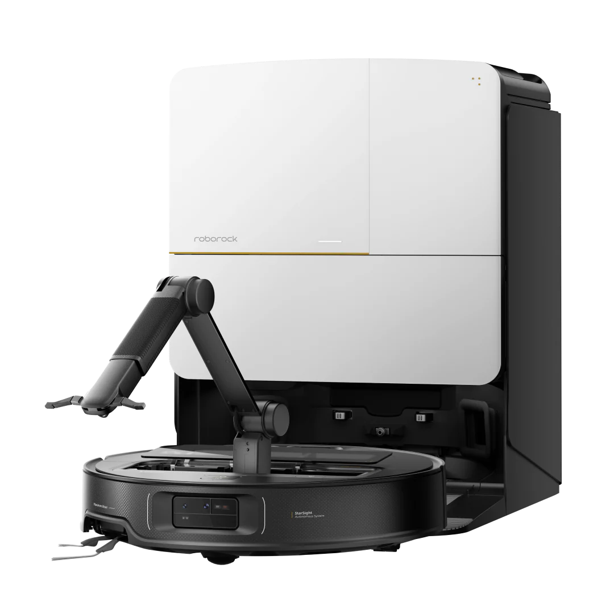

# Chapter 4 - Evolving Competition

Competitive pressure is real. Photo: Unsplash

This chapter explores the unique competitive dynamics facing hardware products.

For innovators – once they prove successful in what is called in the marketing parlance ‘blue ocean’, obtaining product-market fit – competitors encircle to grab an ever larger piece of the pie.

Sometimes the market does grow fast enough to accommodate incoming competition,and soetimes innovators do manage to change tack, winning on efficiency and pricing.

Increasingly, this proves harder and harder.

For companies entering established, competitive markets, traditional approaches no longer suffice. Success now requires discovering new competitive levers and unconventional positioning strategies.

Both pioneers and followers face a common challenge: traditional competitive defenses erode faster than ever before. As product differentiation increasingly shifts to software capabilities – a trend explored throughout this book – conventional intellectual property protections lose their effectiveness.

Unlike pharmaceuticals or chemical products, where patents create strong, lasting, barriers, software-driven hardware faces weaker and more easily circumvented protection.

------

## Traditional hardware competition vs. modern challenges

Not unlike today, traditional hardware competition hinged on tight product-market fit - deeply intertwined with positioning and marketig, as well as distribution reach. Companies built competitive moats through technological innovation defended by intellectual property, economies of scale, and established relationships with suppliers and retailers.

Patents provided meaningful protection for core innovations, while high capital requirements for tooling and manufacturing served as natural barriers to entry. Competition, while intense, followed predictable patterns: incumbents defended their position through incremental improvements, cost optimization, and brand strength.

Today's hardware landscape presents fundamentally different competitive dynamics, driven by globalization and structural cost differences. The rise of offshore manufacturing has created unprecedented cost arbitrage opportunities, where companies can access world-class production capabilities at significantly lower labor and infrastructure costs.

This shift, however,has democratized manufacturing access while fundamentally altering competitive economics.

The concept of "learning by doing" has accelerated in global manufacturing hubs, where concentrated expertise and rapid iteration cycles enable continuous improvement in both quality and efficiency.

Countries like China have invested heavily in subsidized manufacturing infrastructures – from industrial parks and logistics networks to energy systems – creating cost advantages that established manufacturers in high-cost regions struggle to match.

This infrastructure advantage extends beyond simple labor arbitrage to encompass sophisticated supply chains, specialized tooling capabilities, and integrated ecosystem effects.

Chinese manufacture. Photo: Unsplash

------

Moreover, the abundance of engineering and manufacturing talent in emerging markets has shifted competitive dynamics from capital-intensive advantages to knowledge-intensive ones.

Companies can now access pools of skilled engineers, designers, and production specialists at costs that were unimaginable just decades ago. This talent arbitrage, combined with government incentives and subsidized research initiatives, has enabled rapid technological leapfrogging and compressed development cycles.

------

### New Winners

The result of the aforementioned trends is a competitive landscape where traditional advantages – established factories, supplier relationships, and geographic proximity to markets – have diminished in importance.

Instead, success increasingly depends on the ability to orchestrate global supply chains, leverage cost arbitrage effectively, and integrate software capabilities that are harder to commoditize through pure manufacturing efficiency.

This shift has created a new class of winners: companies that combine manufacturing excellence with software sophistication, global supply chain mastery with local market understanding, and cost efficiency with innovation speed.

The most successful hardware companies today are those that can navigate both worlds – leveraging traditional manufacturing strengths while building digital capabilities that create sustainable competitive advantages.

The following examples (of brands later discussed in length throuout this book), demonstrate the gravity and velocity of the fenomenon:

------

#### The iRobot case:

For years, iRobot was the uncontested pioneer of the home robotics market. Roomba defined the category, set the user expectations, and held a level of brand trust competitors couldn’t touch. But over time, the same elements that made iRobot dominant – early-mover advantage, strong engineering, and a clear product vision – were no longer enough.

As Chinese brands like Roborock, Ecovacs, and Dreame ramped up, they combined sharp hardware design, rapid iteration cycles, and aggressively lower prices to deliver products that met or exceeded iRobot’s performance at a fraction of the cost. The dynamic flipped: the copycats became the innovators.

Saros Z70 by Roborock. Source: Roborock

iRobot’s numbers tell the story of that shift. Market share that was once overwhelming eroded year after year, and unit sales followed the same downward slope. Profitability suffered as the company struggled to compete on both price and capability, and attempts at reinvention – like consumables financing models – failed to create meaningful long-term value.

Meanwhile, the newcomers kept improving, pushing out more advanced robot navigation, better mapping, and tightly integrated accessories and docks, often months or years ahead of iRobot’s refresh cycles. The competitive advantage that once felt structural suddenly looked fragile.

The deeper threat is that iRobot moved from defining the category to reacting to it. While rivals expanded into multi-product smart-home ecosystems, iRobot stayed narrowly focused on vacuums and mops.

While competitors built richer multi-device strategies, iRobot’s software offering remained introspective and thin. The brand all but collapse – and eventually overtaken.

The market it once shaped now moves faster than it does. The danger is no longer about catching up technically, but regaining relevance in a segment where leadership has shifted decisively to the new wave of manufacturers.

------

*Market share trends of leading robotic vacuum manufacturers (2021–2025)*

------

*Unit sales trends of leading robotic vacuum manufacturers (2021–2025)*

------

##### **Sources utilized:**

###### Sales Figures 

- Market.us News: “Vacuum Cleaner Statistics and Facts (2025)”
  https://www.news.market.us/vacuum-cleaner-statistics/
- 36Kr: “Roborock’s profit twice that of Ecovacs: Floor-cleaning robot market competition”
  https://eu.36kr.com/en/p/3271134528987524
- Yahoo Finance: “Roborock remains the #1 top selling robot vacuum cleaner brand”
  https://finance.yahoo.com/news/roborock-remains-1-top-selling-054000709.html

###### Market Share trends

- IDC: “Chinese brands suck up more market share in the smart vacuum segment”
- Vacuum Wars: “Robot vacuum market trends: Are traditional vacuums falling behind?”
- 36Kr: “Roborock’s profit twice that of Ecovacs: Floor-cleaning robot market competition”
- The Robot Report: “Can iRobot bounce back? Deep concerns overshadow $127M Q2”
- Additional confirmations from open analyst reviews where available

All figures are consolidated from open, non-paywalled market analysis and aggregator sites covering the US market.

------

#### The Tesla Case

For most of the past decade, Tesla was the company everyone else chased. It set the pace on technology, margins, brand, and software, while legacy automakers scrambled to imitate its playbook.

But the landscape has changed. Chinese EV makers, led by BYD, have flipped the script by mastering scale, lowering costs, and compressing margins across the entire industry. What Tesla once offered as a unique advantage – vertical integration, battery expertise, rapid iteration – is now being matched, at aggressive price points, unattainable to the brand.

And the winner (for now) is: BYD! Photo: Unsplash

Tesla still performs well, but the signs of pressure are unmistakable. Its gross margins, once miles ahead of the pack, have been steadily squeezed as it cuts prices to defend volume. Meanwhile, companies like BYD and SAIC have found ways to be both cheaper and increasingly profitable, and rising brands like XPeng and NIO have moved from early losses to real momentum. What used to be Tesla’s uncontested territory is now crowded with fast learners who operate at lower cost and move even faster.

The real threat isn’t that Tesla is failing – it’s that the gap that once protected it has closed. Profit leadership is slipping, innovation cycles feel slower than the newcomers’, and Tesla’s lineup now evolves at a pace that looks modest compared with the relentless product refreshes coming out of China. Tesla is still strong, but the disruptor is no longer the one setting the rules. The danger is becoming the company reacting to the future rather than defining it.

------

*Gross profit margins (%) in the global EV segment (2014–2024)*

------

*Gross profit (in billions USD) for major EV manufacturers (2014–2024)*

------

##### **Sources utilized:**

- Tesla SEC filings, open analyst reviews, LinkedIn and Trade Press
- BYD financial reports, CleanTechnica, SNE Research, CNN
- Global industry gross margin benchmarking: CleanTechnica July 2025, SNE Research, CNEVPost
- German and Chinese auto industry publications for local profit trends (2021–2024)
- Volkswagen , BMW , Mercedes-Benz : annual reports/gross margin insights and industry syntheses (not always EV-only reported; best available segmentation applied)
- NIO, XPeng, Geely: Q2–Q3 2024 company filings; CleanTechnica July 2025, CNEVPost

All figures use public, trusted sources and reflect best-available industry calculations or disclosures as of November 2025.

------

#### Conclusion

The competitive dynamics explored throughout this post underscore a critical reality: the traditional hardware playbook is not just outdated – it's becoming counterproductive.

As iRobot's decline and Tesla's margin compression demonstrate, even category pioneers face existential threats when global competitors master manufacturing efficiency at unprecedented scale.

The erosion of traditional advantages happens faster than ever, leaving hardware companies with a stark choice: evolve or become irrelevant.

This competitive pressure creates an urgent imperative for hardware manufacturers to embrace new technological opportunities that transcend pure manufacturing competition.

The companies thriving in this environment – Roborock, BYD, and their peers – succeed not just through cost advantages, but by embedding software capabilities, data intelligence, and service layers that create defensible value beyond what can be replicated in a factory.

The question is no longer whether to integrate digital capabilities, but how quickly companies can transform their products into smart platforms that compete on dimensions their rivals cannot easily copy.

In this new landscape, the cost of standing still has never been higher, and the window for transformation continues to narrow. Hardware companies that fail to recognize this shift risk joining the ranks of once-dominant players who discovered too late that their competitive moats had evaporated overnight. The imperative is clear: hardware must become smart, or risk becoming obsolete.	
